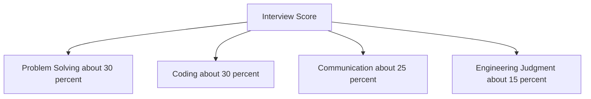

# Lecture 1 — What Interviewers Actually Score

> **Duration:** ~2 hours.
> **Outcome:** You can name the four dimensions of an interview score, prioritize them correctly, and explain why "passed the test cases" is *one quarter* of the rubric, not all of it.

If you remember nothing else this week, remember this: **the interviewer is grading four things, not one.**

Most candidates think there's one thing being graded: "did I solve the problem?" That's wrong, and treating it as right is the single biggest reason promising candidates fail. We'll explain what's actually happening, then build the FRAME Method around it in Lecture 2.

---

## 1. The four dimensions

Pull up any large-company interview rubric (Google's, Meta's, Stripe's — leaked versions circulate openly). They all look approximately like this:

| Dimension | What it measures | Weight (typical) |
|-----------|------------------|:-:|
| **Problem-solving** | Did you arrive at a correct approach? Did you reach it through structured reasoning or guessing? | ~30% |
| **Coding** | Is the code clean, readable, idiomatic? Does it compile and run? Does it handle edge cases? | ~30% |
| **Communication** | Did you think out loud? Did you state assumptions? Did you respond to hints gracefully? | ~25% |
| **Engineering judgment** | Did you choose appropriate data structures? Reason about complexity? Test your code before submitting? | ~15% |

(Exact weights vary by company and level. Senior interviews shift more toward communication and judgment. Junior interviews lean harder on coding and problem-solving. The four dimensions stay.)


*The interviewer grades four separate dimensions, not just whether the code runs.*

**The implication:** even if you arrive at the correct working solution, **you can fail** by:

- Silently typing while the interviewer has no idea what you're doing (kills *communication*).
- Picking a hash map without justifying why over a list (hurts *judgment*).
- Producing code with three nested ternaries that "works" but no one can read (kills *coding*).
- Solving the problem but never tracing it on a test input (hurts *judgment*).

And the inverse: you can **partially pass** an interview where you didn't quite finish the code, if you:

- Verbally walked through the right approach.
- Wrote clean, well-named code as far as you got.
- Identified the correct complexity bounds.
- Caught your own bug before the interviewer pointed it out.

I have personally hired candidates whose final code did not compile. They got the offer because they were *demonstrably reasoning* in real time, made the right structural choices, and behaved like a colleague.

---

## 2. The "silent grinder" failure mode

The most common interview disaster looks like this:

> **Candidate:** [reads problem silently for 90 seconds]
>
> **Candidate:** [starts typing]
>
> **Candidate:** [3 minutes of silent typing, occasional `Ctrl-Z`]
>
> **Interviewer:** What are you doing there?
>
> **Candidate:** Just a moment, I'm thinking.
>
> **Candidate:** [2 more minutes of silent typing]
>
> **Candidate:** OK done. The function returns `[1, 2, 3]`.
>
> **Interviewer:** Why does it return `[1, 2, 3]`?

Even if the answer is correct, the interview has **already failed** on communication and judgment. The interviewer cannot help the candidate (because they don't know what direction to nudge), cannot evaluate the reasoning (because none was shown), and has watched a black box for 5 minutes. They will write "failed to communicate" on the feedback form.

FRAME prevents this. Every one of the five steps *requires* you to speak.

---

## 3. The "I have solved two hundred problems" failure mode

The opposite failure: candidates who have *memorized* solutions to the popular problems. The interview goes:

> **Interviewer:** Here is a run of turbine vibration readings. For every window of `k` consecutive readings, report the largest reading in that window.
>
> **Candidate:** Oh, I've done this. [types fast for 90 seconds, produces a deque-based solution]
>
> **Candidate:** Done. O(n).
>
> **Interviewer:** Can you walk me through *why* the deque never needs to keep a reading that has a larger one behind it?
>
> **Candidate:** Uh… because that's the standard approach. It's how you do it.
>
> **Interviewer:** What if the window width changed at every position?
>
> **Candidate:** [silence]

This candidate produced the optimal solution and **failed the interview** because they could not reason about their own code. They demonstrated memorization, not problem-solving.

The fix is not to study less. The fix is to study for *comprehension*, using FRAME. Every problem you write up forces you to say the *why* out loud, not just the *what*.

---

## 4. What the interviewer is doing

It helps to know what's happening on the other side of the table.

The interviewer is:

1. **Listening for structured thinking.** They're checking that your steps follow from each other. They're looking for "I noticed X, which means Y, so I'll try Z" structures.
2. **Probing your assumptions.** When they ask "what about negative numbers?" they're testing whether you'd considered edge cases yourself or only after prompting.
3. **Measuring your code-review readiness.** Would they want to read your PR? Would they trust your naming?
4. **Calibrating against past candidates.** Often they have a mental ranking: this candidate is between candidate X (who got a hire) and candidate Y (who got a no-hire).
5. **Looking for collaboration signals.** When given a hint, do you incorporate it gracefully or get flustered?

Notice that **most of these are observable only if you talk.** Silent solving denies the interviewer the data they need to grade you favorably.

---

## 5. Translating to four habits

The four dimensions translate to four concrete habits we'll drill all week:

| Dimension | Drill |
|-----------|-------|
| Problem-solving | **The F, R and A steps of FRAME.** Frame it, find the constraints, compare the options — all before code. |
| Coding | **The M step: write code one English sentence at a time.** "First I'll initialize two pointers, one at each end…" then write that line. |
| Communication | **Every action narrated.** No silent typing for more than 10 seconds. |
| Engineering judgment | **The R and E steps of FRAME.** Constraints up front, trace and complexity at the end, every time. |

FRAME is not arbitrary. It is built around what the rubric actually measures.

---

## 6. The "interviewer is your collaborator" reframe

Many candidates come in adversarial — "the interviewer is trying to fail me." This is wrong both factually and tactically.

**Factually wrong:** in most companies, the interviewer is the engineer the candidate would *work with*. They are looking for a colleague. Most interviewers feel disappointed when a strong candidate fails an interview — it means they have to interview more people.

**Tactically wrong:** the adversarial frame makes you defensive. You don't ask clarifying questions because you're afraid of looking dumb. You don't ask for hints because you don't want to lose points. You don't push back on the interviewer's hint when you think it's wrong because you don't want to seem combative.

The correct frame: **the interviewer is the most senior colleague you've ever had, and they're helping you scope a small project in 45 minutes.** In that frame:

- Clarifying questions are *expected*. Real engineers ask them constantly.
- Asking "would it be okay if I assumed input is non-empty?" is *what real engineers do*.
- Pushing back on a hint with "I want to try X first because Y" *demonstrates judgment* — the senior colleague will let you try if your reasoning is sound, and respect you for it.

You don't have to like your interviewer. But model them as your collaborator. Your output will be measurably better.

---

## 7. A worked vignette

Same problem, two candidates. Both arrive at the same answer. One gets the offer.

**Problem:** A barge stows containers in a row, sorted by weight. Given the row of weights and a correction figure, report whether any two containers sum to it exactly.

### Candidate A (silent solver)

> [reads silently, 60 seconds]
> [types]
>
> ```python
> def check(w, c):
>     l, r = 0, len(w) - 1
>     while l < r:
>         s = w[l] + w[r]
>         if s == c: return True
>         if s < c: l += 1
>         else: r -= 1
>     return False
> ```
>
> Done. Returns whether it can be corrected.
>
> Interviewer: "Can you walk me through how you arrived at this?"
> Candidate A: "Two pointers."

Score:

- Problem-solving: ✓ (arrived correctly)
- Coding: ✓ (clean enough)
- Communication: ✗ (silent for 60s, terse answer)
- Engineering judgment: ✗ (no complexity discussed, no edge cases mentioned)

Net: **borderline hire / leaning no-hire** depending on company.

### Candidate B (FRAME)

> **[Frame]** "OK, so I have a row of container weights, already sorted, and a correction figure. I need to say whether two containers together hit that figure exactly. Input is a list of integers plus one integer target; output is a boolean.
>
> A couple of clarifying questions: can the same container count twice, or do I need two distinct positions? And do you want the positions back, or just the yes-or-no?"
>
> [Interviewer: "Two distinct positions. Just the yes-or-no."]
>
> "Let me work one by hand. `weights = [-120, 80, 240, 300, 640]`, correction `380`. That's `80 + 300`, so True."
>
> **[Research constraints]** "How big can the row get? And can a weight be negative?"
>
> [Interviewer: "Up to a million. And yes — an empty cradle reads negative against the load cell's tare."]
>
> "A million rules out anything quadratic, so I need one pass. And the negatives are the hard part here: I can't skip a container just because it's heavier than the correction figure on its own, since a heavy one can still pair with a negative one.
>
> Awkward inputs: empty row and one-container row both have no pair, so False. Repeated weights are legal, so a container must never pair with itself."
>
> **[Assess options]** "The simple approach is every pair with two nested loops — `O(n²)` time, `O(1)` space. Correct, and far too slow at a million.
>
> Better: the row is sorted and I'm hunting for a pair that meets a sum condition, which is the **converging two-pointer** signal. Left at the start, right at the end; the current sum tells me which one to move. `O(n)` time, `O(1)` space.
>
> A hash set of complements is also `O(n)` time, but `O(n)` space — that's what I'd use if the row weren't sorted. It is, so I'll take the pointers.
>
> My plan: guard a row shorter than two, return False. Then `left = 0`, `right = len(weights) - 1`. Loop while `left < right` — strictly less, because the positions have to be distinct. Compute the sum. If it equals the figure, return True. If less, move left forward, since the row ascends and I need a bigger sum. If more, move right backward. If the loop exits, no pair exists, so return False."
>
> **[Make the solution]** "Let me code that up." [types the same core loop as Candidate A, plus the length guard, narrating every line as it goes down]
>
> **[Examine]** "Trace on `[-120, 80, 240, 300, 640]`, correction 380. left=0, right=4, sum = -120 + 640 = 520, too big, right=3. left=0, right=3, sum = -120 + 300 = 180, too small, left=1. left=1, right=3, sum = 80 + 300 = 380, match, return True. ✓
>
> Edge cases from my constraints step: a row of exactly two containers works, because left=0 and right=1 and the loop body runs once. ✓ The empty and one-container rows hit the length guard and return False without entering the loop. ✓
>
> Complexity: each iteration moves one pointer one step toward the other, and they start n-1 apart. So at most n-1 iterations. **Time O(n), space O(1).** And `O(n)` is the floor, because the answer can hinge on the last container.
>
> Anything else you'd like me to consider?"

Score:

- Problem-solving: ✓✓ (explicit, structured)
- Coding: ✓ (same code, but each line was reasoned)
- Communication: ✓✓ (continuous narration, asked clarifying questions, asked for feedback)
- Engineering judgment: ✓✓ (complexity discussed, edge cases caught, traced before declaring done)

Net: **strong hire.** Same code; different outcome.

---

## 8. Self-check

You should be able to answer all of these without looking back:

**1.** What are the four dimensions an interviewer is grading?

<details>
<summary>Answer</summary>

Problem-solving (~30%), coding (~30%), communication (~25%) and engineering judgment (~15%). Exact weights move with the company and the level — senior loops shift toward communication and judgment, junior loops toward coding and problem-solving — but the four dimensions stay.

</details>

**2.** Why is "silently solving the problem correctly" often not enough?

<details>
<summary>Answer</summary>

Because three of the four dimensions are graded on what the interviewer can *observe*. Silent work forfeits communication outright, and it leaves judgment unevidenced: nobody saw you weigh the hash map against the list, or reason about the bound, so nothing gets scored for it. The corollary is the encouraging half — a candidate whose code does not finish can still pass on the strength of the approach they narrated, the names they chose and the bug they caught themselves.

</details>

**3.** Why is it bad to have a memorized solution to a problem the interviewer asks?

<details>
<summary>Answer</summary>

Because it removes the very thing being measured. The rubric grades *how you arrive*, and a recalled answer has no arrival to grade — the structured reasoning, the constraints, the comparison of options never happen out loud. It also fails badly under pressure: an interviewer who varies one condition leaves you with a memorized shape that no longer fits and no method for adapting it. Recognizing a problem you have seen is fine; say so and then reason it through anyway.

</details>

**4.** Name three concrete habits that map to the *Communication* dimension.

<details>
<summary>Answer</summary>

Narrating every action, with no silent stretch longer than about ten seconds. Stating assumptions out loud rather than adopting them quietly — "I am assuming the input is non-empty; is that fair?". And taking a hint gracefully: acknowledge it, say what it changes, and fold it in rather than defending the previous plan.

</details>

**5.** Reframe the interviewer in non-adversarial terms — what role are they playing?

<details>
<summary>Answer</summary>

They are the most senior colleague you have ever had, helping you scope a small project in forty-five minutes — not an examiner hunting for a reason to fail you. Factually, they are usually the engineer you would actually work with, and a strong candidate failing means more interviews for them. Tactically it matters more: the adversarial frame is what stops candidates asking clarifying questions, asking for hints, or pushing back on a hint they think is wrong — all three of which score.

</details>

If those are clear, move on to Lecture 2.

---

## Further reading

- **"What does Google look for in a candidate?"** — leaked rubric discussions on r/cscareerquestions and on engineer-authored blogs. Search "Google interview rubric."
- **"How to interview at Stripe"** — Patrick McKenzie's free blog post: <https://www.kalzumeus.com/>
- **"On being a senior engineer"** — John Allspaw (free): <https://www.kitchensoap.com/2012/10/25/on-being-a-senior-engineer/>

Next: [Lecture 2 — The FRAME Method](./02-the-frame-method.md).
