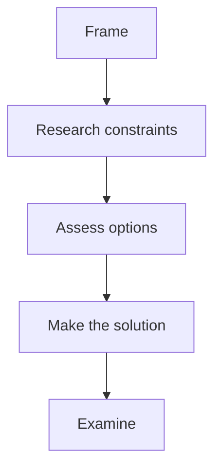

# Lecture 2 — The FRAME Method

> **Duration:** ~2 hours.
> **Outcome:** You can recite the five steps from memory, explain what each is for, and walk through a worked example end to end. By Wednesday this is automatic. By Week 4 you can do it under pressure.

Think about hanging a picture on a wall.

You do not grab a hammer first. You look at the picture. You look at the wall. You check whether the wall is plaster or brick, because that decides which hook you can use. You think about whether to use one nail or two. *Then* you hammer. Then you step back and check that it is straight.

That is the whole idea. **FRAME** is that habit, written down, for problems made of code.

FRAME is five steps you run on **every** problem in this course, in this order, out loud:

```
F   FRAME                 — restate the problem, define inputs and outputs, ask clarifying questions
R   RESEARCH CONSTRAINTS  — find the limits, the edge cases, and what makes this hard
A   ASSESS OPTIONS        — describe a simple approach, then compare better ones and their tradeoffs
M   MAKE THE SOLUTION     — write clean code, a piece at a time, explaining each decision
E   EXAMINE               — walk through tests, edge cases, complexity, and possible improvements
```


*The five FRAME steps run in this fixed order on every problem.*

Five steps. Always in this order. You will run this thousands of times by the end of the course.

It will feel fake for the first ten problems. By problem thirty it will feel like the only sane way to work. By problem sixty you will not remember a time before it.

**FRAME is a loop, not a list you tick off once.** New facts can send you backwards, and that is the method working, not failing. If Examine turns up a case your code gets wrong, you go back to Assess options — or all the way back to Research constraints, if the case was one you never listed. Saying "that sends me back a step, and here is why" out loud is a strong signal, not a weak one.

### The 60-second version

When you have no time and no whiteboard, say these five sentences and fill in the blanks:

1. **Frame:** "The goal is to ___ , the input is ___ , and the output is ___ ."
2. **Research constraints:** "The limits are ___ , the awkward inputs are ___ , and the hard part is ___ ."
3. **Assess options:** "The simple way is ___ , which costs ___ . I considered ___ . I am choosing ___ because ___ ."
4. **Make the solution:** "I will build ___ first, then ___ ."
5. **Examine:** "I will prove it with ___ , and the cost is ___ time and ___ space."

Memorise those five sentence shapes. Under pressure they are what you fall back on.

Below: each step in detail, with the specific things you must say out loud at each one.

---

## F — FRAME (2–4 minutes)

**Goal:** by the end of this step, the interviewer agrees that you know what they are asking — and you have at least one worked example.

Framing is saying the problem back in your own words, then agreeing on what goes in and what comes out.

**Out-loud script:**

1. **Say the problem back in your own words.** Not by re-reading the prompt aloud. By *paraphrasing*. "So you want me to take a row of container weights and tell you whether any two of them together hit the correction figure. I return a yes-or-no, not the positions."
2. **Name the input.** What type is it? A list of what? A string? Two things or one? What does each part mean in the story?
3. **Name the output.** What type comes back? What exact shape? What comes back when there is no answer at all — `None`, `-1`, an empty list?
4. **Ask your clarifying questions.** Anything the prompt left open. Ask now, not later.
5. **Walk one small example by hand.** "If the row is `[-120, 80, 240, 300, 640]` and the correction figure is `520`, then `-120 + 640 = 520`, so the answer is True. Let me also try `500` on the same row — no pair reaches it, so False." Out loud. On the whiteboard if there is one.

**Sample clarifying questions for a pair-search problem:**

- "Should I return positions, or just whether a pair exists?"
- "Is there always exactly one answer, sometimes none, or possibly several? If several, do I return one or all?"
- "When there is no answer, what would you like back?"
- "Is the row sorted?" (this one changes everything, and we chase it hard in the next step)

**Red flags that you skipped this step:**

- You started typing within 60 seconds of getting the problem.
- You have not asked a single clarifying question.
- You have not walked one example by hand.

**Time check:** more than 5 minutes framing and you may be stalling. Move on.

<details>
<summary>Under the hood — why paraphrasing beats repeating</summary>

Repeating the prompt proves you can read. Paraphrasing proves you built a *model* of the problem in your head, because you had to choose different words to describe the same thing, and choosing words forces you to decide what the thing actually is.

It is also the cheapest bug-finder in the whole method. If your paraphrase is wrong, the interviewer corrects you in ten seconds, at minute two, for free. If you skip it, the same wrong idea gets discovered at minute thirty, in code, with no time left to fix it.

</details>

---

## R — RESEARCH CONSTRAINTS (2–4 minutes)

**Goal:** find the limits and the awkward inputs *before* they find you. By the end of this step you can say, in one sentence, what makes this problem hard.

Framing told you what the problem *is*. Researching constraints tells you what the problem *forbids*.

**Out-loud script:**

1. **Read the size bounds and say what they rule out.** This is the single most useful sentence in the step. "Up to a million entries. A nested loop would be a million million operations. So `O(n²)` is off the table before I have written anything."
2. **Look for properties you are allowed to exploit.** Is it sorted? Are values unique? Are they bounded to a small range? Every one of these is a gift the problem is handing you, and each one unlocks a faster approach.
3. **Name the awkward inputs out loud.** Empty. One element. All the same value. Negative numbers, if they are numbers. Ties. The biggest allowed size. Say each one and say what the answer should be.
4. **Say what makes this hard.** One sentence. There is almost always exactly one thing.

**Worked, on the pair-search problem:**

> "The row can hold up to a million containers, so anything quadratic is out. The row arrives sorted non-decreasing — that is handed to me for free, and sorted input is the strongest hint in this whole category.
>
> Awkward inputs: an empty row and a one-container row both have no pair at all, so False. Weights can repeat, so I have to be careful that a container is not allowed to pair with itself. And weights can be **negative** — an empty cradle weighs less than the load cell's tare, so the scale reports below zero.
>
> That last one is what makes this hard. Because weights can be negative, I cannot throw away a container just because it is heavier than the correction figure on its own. A very heavy container can still pair with a negative one and land exactly on target."

**Why this earns points:** the interviewer watched you find the trap yourself. Every candidate who skips this step gets ambushed by it in code twenty minutes later, and the interviewer has to point it out. Finding it is worth far more than being told.

**Time check:** 2–4 minutes. If you are still listing edge cases at minute six, you are collecting instead of deciding. Pick the ones that change the code and move on.

<details>
<summary>Under the hood — reading a bound as an instruction</summary>

Constraint numbers are not decoration. An interviewer choosing `n ≤ 1,000,000` versus `n ≤ 4,000` is telling you which complexity class they expect, and it is polite to say so out loud.

A rough desk rule, assuming about a hundred million simple operations per second:

| Bound on `n` | What fits comfortably | What that usually means |
| --- | --- | --- |
| up to ~20 | `O(2ⁿ)` | try every subset; brute force is intended |
| up to ~500 | `O(n³)` | triple loop is fine |
| up to ~5,000 | `O(n²)` | a nested loop is intended |
| up to ~1,000,000 | `O(n log n)` or `O(n)` | sort, or one clever pass |
| above ~10,000,000 | `O(n)` with small constants | one pass, no allocation |

So when a problem says four thousand and you are agonising over whether your `O(n²)` is good enough — it is. The bound already told you.

</details>

---

## A — ASSESS OPTIONS (4–7 minutes)

**Goal:** put at least two approaches on the table, compare them honestly, pick one for a stated reason, and leave the step with a complete English plan.

This is the biggest step and it has three parts, in order: **name the shape, list the options, then write the plan.**

### A1 — Name the shape

Most problems are not new. They are old problems wearing a costume. Name the costume out loud.

> "This looks like a [pattern name] problem because [signal]. I will try that first."

Examples:

> "This looks like a **converging two-pointer** problem, because the row is sorted and I am hunting for a pair that meets a condition."

> "This looks like a **sliding window** problem, because I am asked about runs of neighbouring items."

> "This looks like a **breadth-first search**, because I want the shortest path in a graph with no weights."

> "This *might* be **dynamic programming** — I can see subproblems repeating — but let me think for thirty seconds before I commit, because greedy sometimes works on these too."

The 14 patterns this course teaches, one per week:

1. **Arrays + two pointers** (this week)
2. Hash maps (Week 2)
3. Sliding window (Week 3)
4. Fast/slow pointers (Week 4)
5. Binary search (Week 5)
6. BFS (Week 6)
7. DFS (Week 7)
8. Backtracking (Week 8)
9. Top-K / heaps (Week 9)
10. Intervals + greedy (Week 10)
11. Dynamic programming 1D (Week 11)
12. Dynamic programming 2D (Week 12)
13. Bit manipulation, tries (Week 14)
14. System design (Week 12 intro, Week 15 deeper)

Right now you know one pattern. That is fine. You are asking "is this an instance of something I already know?" When the answer is yes, name it. When it is no, you will learn the pattern in a later week and add it to your shelf.

### A2 — List the options and compare them

**Always describe the simple approach first, even when you already know the clever one.** Say it, price it, and only then improve on it. Two reasons: the simple approach is a working answer if you run out of time, and pricing it is what makes the clever one *look* clever.

> "The simple approach: check every pair. Two nested loops, `O(n²)` time, `O(1)` space. Correct, and far too slow for a million containers.
>
> Better: a converging two-pointer. The row is sorted, so I put one pointer at each end. The current sum tells me which pointer to move. `O(n)` time, `O(1)` space.
>
> Also possible: a hash set of complements. Walk the row once and ask whether `correction - weight` has been seen. `O(n)` time but `O(n)` space, and it does not need sorted input.
>
> I will take the two-pointer. It matches the hash set on time, beats it on space, and the sortedness it needs is already handed to me for free."

That is the whole shape of a good comparison: **name it, price it (time and space), say when it would win, then pick and justify.**

### A3 — Write the plan in English

Before any code. Say it out loud, and write it on the whiteboard or as code comments. Your plan must cover five things:

1. **Starting state.** Which variables, set to what?
2. **The loop or recursion.** "Loop while left is less than right."
3. **The decision inside it.** What is compared, and what happens in each case?
4. **The stopping condition.** What ends it, and what comes back then?
5. **The awkward inputs from step R.** Where are they handled?

**Out-loud script:**

> "My plan: if the row holds fewer than two containers, return False right away — you cannot make a pair. Otherwise `left = 0` and `right = len(weights) - 1`. Loop while `left < right`. Each time round, `total = weights[left] + weights[right]`. If `total` equals the correction, return True. If it is too small, the only way to grow it is a heavier left container, so `left += 1`. If it is too large, `right -= 1`. If the loop ends without a match, return False.
>
> The loop condition is `left < right`, strictly, because the two containers have to sit at different positions. If I let the pointers land on the same container, it could pair with itself."

That is enough. Starting state, loop, decision, stop, edge case. Now you may code.

**Red flag:** you started typing real code in this step. Stop. Finish the plan in English first.

---

## M — MAKE THE SOLUTION (10–15 minutes)

**Goal:** turn your plan into code, **one English sentence at a time, with names that read like prose.**

Making the solution is not a separate act of invention. If step A went well, this step is transcription — and it should feel almost boring. Boring is the goal.

**Out-loud script:**

> "First, the edge case." [types `if len(weights) < 2: return False`]
> "Now the two pointers." [types `left, right = 0, len(weights) - 1`]
> "Loop while they have not crossed." [types `while left < right:`]
> "Add the two ends." [types `total = weights[left] + weights[right]`]
> "If it matches, we are done." [types `if total == correction: return True`]
> "Too small, so move left forward." [types `elif total < correction: left += 1`]
> "Otherwise move right backward." [types `else: right -= 1`]
> "If we fall out of the loop, no pair exists." [types `return False`]

Two rules while you make it:

1. **One line of code per English sentence.** Do not type two lines before narrating both. The interviewer's brain has to keep up with yours.
2. **Naming is graded.** `total` costs you nothing over `s` and tells the reader what the number *is*. Short names are fine when the role is obvious — `left` and `right` are fine. When unsure, use the longer name. Nobody has ever lost points for a readable name.

**Keep these two habits running in the background:**

- **Imagine the first pass.** As you write the loop body, picture what happens on iteration one with your worked example. If the imagined result is wrong, fix it now.
- **Indent consistently.** On a whiteboard, by hand. In a shared editor, let the editor do it. Do not fight your tool.

**Time check:** aim for 10–15 minutes on a medium problem. If you are at 20 minutes with 20 lines of code, you are overcomplicating it. Go back and re-read your plan.

---

## E — EXAMINE (4–8 minutes)

**Goal:** trace your own code, find your own bugs, state the complexity, and say what you would improve.

This is the most skipped step in interviews, and the one that pays best. Examining is the difference between "I think it works" and "here is the evidence that it works."

It has three parts.

### E1 — Trace it on real values

Pick a small input and walk the variables, out loud, one iteration at a time.

**Choose a hostile example, not a friendly one.** A case you expect to pass teaches you nothing.

> "Let me trace on `[-120, 80, 240, 300, 640]`, correction 380.
> Start: left=0, right=4, total = -120 + 640 = 520. Too big, so right becomes 3.
> Next: total = -120 + 300 = 180. Too small, so left becomes 1.
> Next: total = 80 + 300 = 380. Match. Return True. ✓"

**Why this earns points:** the interviewer sees real numbers, from real iterations, that prove the code does what you claim. They also see that you would have caught a bug.

**Bugs that show up here:**

- Off-by-one. (`while left < right` versus `while left <= right`.)
- Wrong starting value. (`right = len(arr)` versus `right = len(arr) - 1`.)
- The wrong "nothing found" return. (Some problems want `[]`, some `None`, some `False`.)
- Forgetting to move a pointer, which hangs forever.

### E2 — Run the edge cases from step R

You already listed them. Now walk each one.

> "Empty row: the length guard catches it, return False. ✓
> One container: same guard. ✓
> Two equal containers that sum to the target: left=0, right=1, one iteration, match. ✓"

### E3 — State the cost and the improvements

> "Time: each iteration moves exactly one pointer one step inward, and they start `n - 1` apart. So at most `n - 1` iterations. **O(n).**
>
> Space: three integers — `left`, `right`, `total`. **O(1) auxiliary.**
>
> Tradeoff: I leaned on the row being sorted. If it were not, I would sort first at `O(n log n)`, or use a hash set at `O(n)` time and `O(n)` space.
>
> Improvement: `O(n)` is the floor here, because the answer can depend on the very last container, so any correct solution has to read the whole row. There is nothing left to win."

**Things that earn points:**

- Stating *both* time and space.
- Saying which property of the input you exploited.
- Offering an alternative for when that property does not hold.
- Real-world tradeoffs. "If the row is huge and memory is tight, the pointers win."

**Things that lose points:**

- "It's O(n)." Just that. Which `n`? What about space?
- "I think it's O(n log n) but I'm not sure." Either know it or work it out on the spot. Reasoning aloud is fine; shrugging is not.
- Calling a clearly linear algorithm `O(1)`, or the reverse. Sloppy.

**Time check:** 4–8 minutes. If you find a bug, fix it in the open: "Ah — I need `<` there. Let me re-trace." Do not be embarrassed to catch your own bug. *That is the entire point of this step.*

---

## 3. A complete FRAME walkthrough — the ballast check

**Problem (interviewer's prompt):** A river barge stows containers in a single row along the deck. The loading crane works from a manifest sorted by weight, so the row is always in non-decreasing weight order. The barge is listing, and the mate wants to know whether it can be corrected by shifting exactly **two** containers to the other side of the deck. Given the row of weights and the mate's correction figure, report whether any two containers sum to it exactly.

Here is what you would say, in order, with timing.

**[F — 3 minutes]**

> "Got it. So I get a row of container weights, sorted non-decreasing, and a correction figure. I need to say whether two containers, at two *different* positions in the row, add up to exactly that figure. The answer is a yes-or-no — you do not want the positions.
>
> Input: a list of integers in kilograms, plus one integer target. Output: a boolean.
>
> A few clarifying questions. Can the row be empty, or hold just one container? Can two containers have the same weight? And is 'exactly' really exact — no tolerance?"
>
> [Interviewer: "The row can be any length including zero. Weights can repeat. And yes, exact."]
>
> "Let me work an example. Row `[-120, 80, 240, 300, 640]`, correction `520`. That is `-120 + 640`, so True. Same row, correction `500`: nothing reaches it, so False."

**[R — 2 minutes]**

> "Constraints. What is the biggest row I should expect?"
>
> [Interviewer: "Up to a million containers."]
>
> "Then a nested loop is out — a million squared is a trillion operations. I need `O(n log n)` at worst, and the row already arrives sorted, so I would rather aim straight at `O(n)`.
>
> Can a weight be negative?"
>
> [Interviewer: "Yes — an empty cradle weighs less than the load cell's tare, so it reports negative."]
>
> "That is the thing that makes this hard, and I want to say it back so I do not forget it. Because weights can be negative, I cannot throw away a container just for being heavier than the correction figure on its own. A heavy container can still pair with a negative one.
>
> Other awkward inputs: an empty row and a one-container row both have no pair, so False. Repeated weights are legal, so I have to make sure a container never pairs with itself. And the row being sorted is a property I intend to use, so if it were ever handed to me unsorted, my answer would be wrong rather than slow — worth flagging."

**[A — 3 minutes]**

> "Shape first: sorted row, hunting for a pair against a target sum. That is the **converging two-pointer** signal.
>
> Options.
>
> The simple one: check every pair with two nested loops. `O(n²)` time, `O(1)` space. Correct, and hopeless at a million.
>
> Better: converging two-pointer. One pointer at each end; the current sum tells me which one to move. `O(n)` time, `O(1)` space.
>
> Also on the table: a hash set of complements. `O(n)` time, `O(n)` space, and it does not need the row sorted — so it is what I would reach for if the sortedness ever went away.
>
> I will take the two-pointer. Same time as the hash set, less space, and it uses the sortedness I have been handed for free.
>
> My plan: if the row has fewer than two containers, return False immediately. Otherwise `left = 0`, `right = len(weights) - 1`. Loop while `left < right`. Compute `total = weights[left] + weights[right]`. If it equals the correction, return True. If it is too small, the only way to grow it is a heavier left container, so `left += 1`. If it is too large, `right -= 1`. If the loop ends, no pair exists — return False.
>
> The loop condition is `left < right`, strictly, because the two containers must sit at different positions. If the pointers land on the same container, it could pair with itself."

**[M — 5 minutes]**

> [Types, narrating each line]
>
> ```python
> def can_correct_list(weights: list[int], correction: int) -> bool:
>     """Report whether two containers at distinct positions in a
>     non-decreasing row sum to exactly `correction`."""
>     if len(weights) < 2:
>         return False
>     left, right = 0, len(weights) - 1
>     while left <= right:
>         total = weights[left] + weights[right]
>         if total == correction:
>             return True
>         if total < correction:
>             left += 1
>         else:
>             right -= 1
>     return False
> ```

**[E — 5 minutes]**

Watch what happens here. This is the step most candidates skip, and it is about to earn its keep.

> "Let me trace the happy path first. Row `[-120, 80, 240, 300, 640]`, correction `520`.
> left=0, right=4, total = -120 + 640 = 520. Match. Return True. ✓
>
> Now a no-match case, and I will pick a nasty one — correction `480`. By hand, no two containers make 480, so I want False.
> left=0, right=4: total = 520. Too big, right=3.
> left=0, right=3: total = -120 + 300 = 180. Too small, left=1.
> left=1, right=3: total = 80 + 300 = 380. Too small, left=2.
> left=2, right=3: total = 240 + 300 = 540. Too big, right=2.
> Now left and right are both 2 — and my loop says `while left <= right`, so it runs again. total = 240 + 240 = 480. That matches, and I return **True**.
>
> That is wrong. There is only one 240-kilogram container on that deck, and I just paired it with itself. I said in my plan that the positions had to be distinct, and then I typed `<=` anyway.
>
> Fixing it: the condition is `while left < right`." [edits the line]
>
> "Re-tracing 480 with the fix: the same four iterations run, then left=2, right=2, the condition `2 < 2` is false, the loop exits, and I return False. ✓
>
> Re-checking that the fix did not break the happy path: 520 still matches on the very first iteration, before the pointers go anywhere near each other. ✓
>
> Edge cases from my constraints step: empty row and one-container row are both caught by the length guard, so they return False without entering the loop. ✓ And a two-container row that does match: left=0, right=1, the loop runs exactly once and finds it. ✓
>
> Time: each iteration moves exactly one pointer one step inward, and they start `n - 1` apart, so at most `n - 1` iterations. **O(n).**
>
> Space: three integers — `left`, `right`, `total`. **O(1) auxiliary.**
>
> Tradeoffs:
> - If the row were not sorted, the pointers would not work directly. I would sort at `O(n log n)`, or use a hash set at `O(n)` time and `O(n)` space. The hash set wins on a large unsorted row, because it skips the sort entirely.
> - If the mate wanted the *positions* rather than a yes-or-no, the pointer version keeps working and still returns them in `O(1)` space. The hash-set version would have to store positions next to weights, and sorting would scramble the positions I need. That asymmetry is worth naming.
> - If the row were so large it streamed off disk, neither version works as written. That needs a two-pass or external algorithm.
>
> Improvement: `O(n)` is the floor, because the answer can depend on the very last container, so any correct solution has to read the whole row. Two-pointer is optimal."

That mid-trace catch is worth more than a clean solve. The interviewer just watched you state a rule, break it in code, notice from *data* rather than from re-reading, and repair it. That is the Examine step working exactly as designed — and it is why we trace with a case chosen to be hostile rather than a case chosen to pass.

That is FRAME on a single problem, end to end. Total time: about 18 minutes for an eight-line solution. The eight lines are 5% of the interview value. The other 95% is the structured reasoning around them — including, especially, the bug you found yourself.

**You will meet this problem again this week.** [Exercise 3](../exercises/exercise-03-widest-ballast-pair.md) asks for the *positions* of the pair rather than a yes-or-no, and makes you choose between valid pairs. Do not re-read this section when you get there. Re-derive it.

---

## 4. The FRAME write-up format (your portfolio currency)

Every problem you solve this course produces a write-up. The format is exactly the five steps, in order, as Markdown headings.

````markdown
# Lecture 2 worked example: The Ballast Check

> Given a row of container weights sorted non-decreasing and a correction
> figure, report whether two containers at distinct positions sum to it.

## F — Frame

- Input: list of ints (kilograms), non-decreasing; correction figure, int.
- Output: bool. No positions wanted.
- Asked and answered: row may be empty; weights may repeat; "exactly" is exact.
- Worked example: `[-120, 80, 240, 300, 640]`, correction 520 → True
  (`-120 + 640`). Same row, correction 500 → False.

## R — Research constraints

- `n` up to 1,000,000 → `O(n²)` is ruled out before I write anything.
- Row arrives **sorted non-decreasing**. That is the property I intend to use.
- Weights may be **negative** (empty cradle vs. load-cell tare). **This is what
  makes it hard:** I cannot prune a container for being heavier than the target.
- Awkward inputs: empty row → False; one container → False; repeated weights are
  legal, so a container must never pair with itself.

## A — Assess options

- Shape: converging two-pointer (sorted row + pair-sum condition).
- Simple: every pair, two nested loops. `O(n²)` / `O(1)`. Correct, too slow.
- Chosen: converging two-pointer. `O(n)` / `O(1)`.
- Rejected: hash set of complements. `O(n)` / `O(n)` — same time, more space,
  and the sortedness I would be paying to avoid is already free. Would win if
  the row were ever handed to me unsorted.
- Plan: guard length < 2 → False. left=0, right=n-1. While left < right: total
  of the two ends. Match → True. Too small → left++. Too big → right--.
  Loop ends → False.

## M — Make the solution

```python
def can_correct_list(weights: list[int], correction: int) -> bool:
    if len(weights) < 2:
        return False
    left, right = 0, len(weights) - 1
    while left < right:
        total = weights[left] + weights[right]
        if total == correction:
            return True
        if total < correction:
            left += 1
        else:
            right -= 1
    return False
```

## E — Examine

Traced correction 520 → True on the first iteration ✓. Traced correction 480,
which has no valid pair: the pointers converge to left=right=2.
**Bug found here:** I first wrote `while left <= right`, which ran one extra
iteration and returned `240 + 240 = 480` — pairing the single 240 kg container
with itself. Changed to `left < right`; now returns False ✓.
Edge cases: empty row and one-container row return False via the length guard ✓;
a matching two-container row runs the loop exactly once ✓.

Time **O(n)** — one pointer moves per iteration, starting `n-1` apart.
Space **O(1)** — three ints. `O(n)` is the floor: the answer can hinge on the
last container. Tradeoff: unsorted input would cost a sort (`O(n log n)`) or a
hash set (`O(n)` space). If positions were wanted instead of a bool, the pointer
version still returns them in `O(1)` space, whereas sorting would scramble them.
````

That is a complete portfolio entry. Future-you, skimming this two months from now before an interview, can re-derive the solution in 60 seconds. **That is the entire point of the write-up.**

The exercise folder contains [`frame_template.md`](../exercises/frame_template.md) — copy it for each problem. The mini-project this week is to commit five completed FRAME write-ups to your portfolio repo.

---

## 5. Practising the method when you already know the answer

Some of your first problems will feel trivial. You will know the answer immediately.

**Run FRAME anyway.**

The point is not to discover the answer. The point is to drill the habit of *speaking while coding*. The first time a real interviewer asks you a problem, your nerves will eat about a third of your thinking. FRAME is what survives that.

A useful test: solve a problem in your head, then sit down with a recorder running and narrate FRAME out loud as if you were in an interview. Listen back. The first time is brutal — you will sound stilted, you will lose words, you will mumble. By recording 5 you will sound competent. By 10 you will sound like the candidate you want to be.

---

## 6. Self-check

- Recite the five FRAME steps in order.
- For each, name one specific thing you must say out loud.
- Why does researching constraints come before assessing options?
- Why does assessing options come before making the solution?
- Why is silently solving the problem perfectly often worse than running FRAME through it imperfectly?

If you can answer those without hesitating, go on to [Lecture 3 — Arrays and Two Pointers](./03-arrays-and-two-pointers.md).

---

## Further reading

- **"Tech Interview Handbook"** (fully free, open source): <https://www.techinterviewhandbook.org/>
- **"Cracking the Coding Interview" — Gayle Laakmann McDowell** — the canonical paid book. A library copy is fine; we do not require it.
- **Big-O Cheat Sheet** (community-maintained, free): <https://www.bigocheatsheet.com/> — useful while you are pricing options in step A.

Other structured approaches to interview problems exist, and you may run into them elsewhere. FRAME is the one this course teaches, and the five steps mean the same thing in every Code Crunch Worldwide course, so the habit carries with you.
