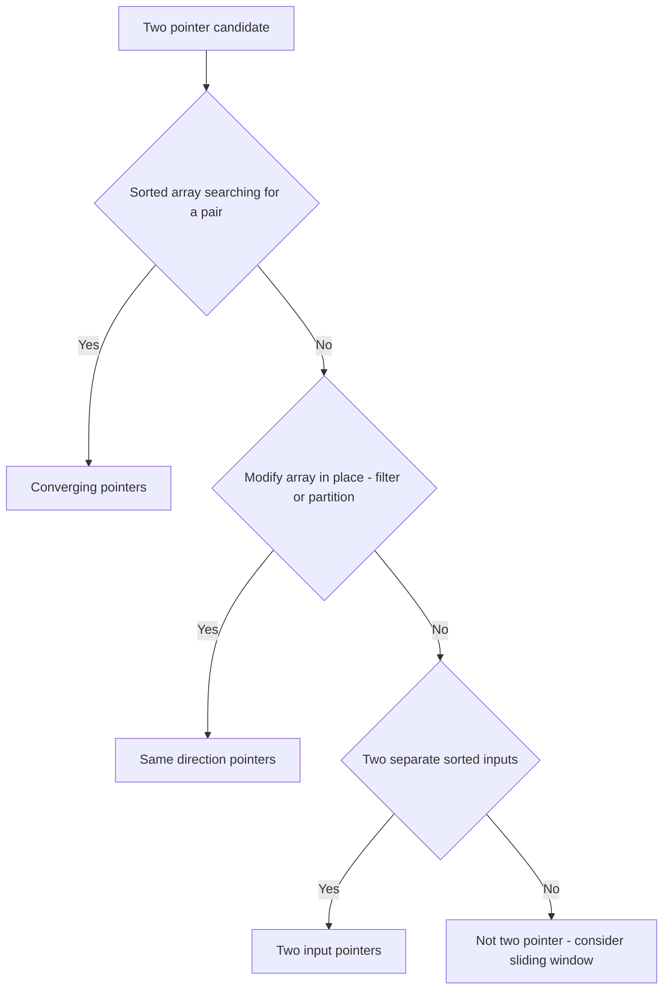

# Lecture 3 — Arrays and Two Pointers

> **Duration:** ~2 hours.
> **Outcome:** You can recognize a two-pointer problem within 30 seconds, name the three sub-shapes of the pattern, and apply each to a worked problem.

The two-pointer pattern is the cleanest, geometrically obvious pattern to learn first — and it's the one many interviewers reach for to warm up a candidate. By Sunday you should be able to spot it instantly.

---

## 1. What "two pointers" means

Two pointers is exactly what it sounds like: you have **two indices** moving through a sequence (usually an array or string), and the algorithm is defined by **how the pointers move relative to each other.**

There are three common sub-shapes:

| Sub-shape | Pointer setup | Use case |
|-----------|---------------|----------|
| **Converging** | Left at `0`, right at `n-1`; move toward each other | Sorted array, find a pair |
| **Same-direction** | Both start at `0`; one races ahead, one lags | In-place mutation, partitioning |
| **Two-input** | One pointer per array | Merge-like operations |

Most interview problems use one of these three. We'll see all three this week.

The key insight: the **two-pointer pattern replaces a nested loop with a linear scan.** That's where the time saving comes from. A naïve O(n²) double-loop becomes O(n).

---

## 2. Sub-shape 1: Converging pointers

This is the most common. Setup:

```
left → ────────────────────────── ← right
   ↓                                  ↓
arr[0]  arr[1]  arr[2]  ...  arr[n-2]  arr[n-1]
```

You move `left` forward or `right` backward based on some condition. The loop ends when they meet or cross.

### Canonical shape: the ballast check

(We worked this end to end in Lecture 2. Recap:)

```python
def can_correct_list(weights: list[int], correction: int) -> bool:
    """Two containers at distinct positions in a non-decreasing row,
    summing to exactly `correction`?"""
    if len(weights) < 2:
        return False
    left, right = 0, len(weights) - 1
    while left < right:
        total = weights[left] + weights[right]
        if total == correction:
            return True
        if total < correction:
            left += 1
        else:
            right -= 1
    return False
```

**Recognition signals for converging pointers:**

- Input is **sorted** (or can cheaply be sorted).
- You're looking for a **pair** (or sometimes a triple).
- The problem involves a **target sum / target product / target difference** between two elements.
- Naïve solution is `O(n²)` with two nested loops.

When you see all four signals, jump straight to converging two-pointer.

### Variants of the converging shape

The two pointers always start at the ends and move inward. What changes is what you *do* when they are standing somewhere:

- **Swap them.** Reversing a run in place: swap, step both inward, stop when they meet. O(n) time, O(1) space. This week's [Exercise 1](../exercises/exercise-01-reverse-the-siding.md).
- **Compare them, skipping over characters that don't count.** The two pointers no longer move in lockstep — one side can skip several positions while the other waits. This week's [Exercise 2](../exercises/exercise-02-mirror-serial.md), and it is where most people write their first off-by-one.
- **Sum them and steer.** The sum tells you which pointer to move, as in the recap above. This week's [Exercise 3](../exercises/exercise-03-widest-ballast-pair.md), which additionally makes you return *which* pair.
- **Measure something and keep the best.** Track a running maximum as the pointers converge, and move whichever pointer is standing on the weaker value. The pointer move becomes a *greedy* choice that needs a correctness argument. This week's [Exercise 5](../exercises/exercise-05-market-awning.md).
- **Pin an element, then converge over the rest.** Turns a "find two" algorithm into a "find three" algorithm at one extra factor of `n`. This week's [Challenge 1](../challenges/challenge-01-settlement-trio.md).
- **Carry a running maximum in from each side.** The hardest variant: two pointers plus two scalars replace two whole precomputed arrays. This week's [Challenge 2](../challenges/challenge-02-levee-ponding.md).

Six problems, one shape. That is the whole argument for learning patterns by name.

---

## 3. Sub-shape 2: Same-direction (fast & slow, or read/write)

Setup:

```
write ↓                          read ↓
[arr[0]  arr[1]  arr[2]  ...  arr[k]  arr[k+1]  arr[k+2] ...]
```

Both start at the beginning. One races ahead (the "read pointer"); the other lags (the "write pointer"). You use this to **partition** or **filter** an array in place.

### Canonical shape: compacting a sample tray in place

A soil lab weighs samples on a balance that cannot be trusted below its detection limit. Anything under the limit is noise and gets discarded. The tray is a fixed piece of hardware — there is no second tray — so the survivors have to be slid forward into the front slots, in order, and the technician is told how many made it.

```python
def compact_valid_samples(masses: list[int], detection_limit: int) -> int:
    """Slide every sample at or above `detection_limit` to the front of the
    tray, preserving order. Return how many survived. Slots at or after the
    returned count hold leftover values and mean nothing."""
    write = 0
    for read in range(len(masses)):
        if masses[read] >= detection_limit:
            masses[write] = masses[read]
            write += 1
    return write
```

The `read` pointer visits every slot. The `write` pointer marks where the next survivor goes, and only advances when we keep something. Result: O(n) time, O(1) auxiliary space, in place.

Trace it on `masses = [40, 3, 55, 1, 28]` with a detection limit of `10`:

| `read` | value | keep? | tray after the step | `write` |
|---:|---:|:--|:--|---:|
| — | — | — | `[40, 3, 55, 1, 28]` | 0 |
| 0 | 40 | yes | `[40, 3, 55, 1, 28]` | 1 |
| 1 | 3 | no | `[40, 3, 55, 1, 28]` | 1 |
| 2 | 55 | yes | `[40, 55, 55, 1, 28]` | 2 |
| 3 | 1 | no | `[40, 55, 55, 1, 28]` | 2 |
| 4 | 28 | yes | `[40, 55, 28, 1, 28]` | 3 |

Returns `3`, and `masses[:3]` is `[40, 55, 28]`. Note the two things beginners find alarming and that are both fine: the tray still contains a stale `28` at the end, and at step 2 we overwrote a slot that still held its original value. Neither is a bug, and the reason is the invariant below.

**Why overwriting is safe.** `write <= read` always holds, because `write` starts equal to `read` at zero and advances at most once per iteration while `read` advances exactly once. So the slot you write to has already been read. That single inequality is the whole licence to mutate while scanning, and it is what you say out loud when an interviewer asks whether you are clobbering your own input.

**Recognition signals for same-direction pointers:**

- You're asked to **modify the sequence in place** ("do not allocate a second one").
- You need to **filter, partition, or compact**.
- O(n) time with O(1) extra space is the implied target.

### Variants of the same-direction shape

- **Collapse adjacent repeats** rather than filter by a threshold. The comparison is against the last value you *kept*, not the last value you *read* — and those differ. This week's [Exercise 4](../exercises/exercise-04-stuck-gauge.md).
- **Partition into three classes** instead of two, with a low, a middle, and a high pointer. The middle pointer walks while the outer two close in.
- **Fast and slow pointers on a linked list**, where one advances two nodes per step and the other one — the same idea with the array replaced by pointer chasing. Week 4.

---

## 4. Sub-shape 3: Two-input pointers

Setup: two arrays, two pointers, one per array.

```
arr_a:  [a₀  a₁  a₂  ...  a_m]
          ↑i

arr_b:  [b₀  b₁  b₂  ...  b_n]
          ↑j
```

You advance `i` or `j` based on which array contributes the next element.

### Canonical shape: merging two maintenance logs

A pumping station keeps two logs of maintenance events, each stamped with a tick count and each already in chronological order: a `primary` log written by the station controller, and a `secondary` log written by a contractor's handheld. The supervisor wants one combined chronology.

There is a contract detail worth noticing, because it is the kind of thing a real caller cares about and a toy problem never mentions: **when both logs record the same tick, the primary log's entry is listed first.** The station controller is the authoritative clock.

```python
def merge_maintenance_logs(primary: list[int], secondary: list[int]) -> list[int]:
    """Merge two chronologically sorted logs into one. On a tie, the
    primary log's entry is emitted first."""
    merged: list[int] = []
    i, j = 0, 0
    while i < len(primary) and j < len(secondary):
        if primary[i] <= secondary[j]:
            merged.append(primary[i])
            i += 1
        else:
            merged.append(secondary[j])
            j += 1
    merged.extend(primary[i:])
    merged.extend(secondary[j:])
    return merged
```

O(m + n) time; O(m + n) space, all of it the output.

**The tie-break lives entirely in one character.** `<=` emits the primary entry first on a tie; `<` would emit the secondary entry first. Nothing else in the function changes. Being able to point at a comparison operator and say "that is where the stated requirement is implemented" is a small thing that reads as senior.

Trace `primary = [10, 40, 40, 90]`, `secondary = [25, 40, 70]`:

`10` (primary, 10 ≤ 25) → `25` (secondary, 40 > 25) → `40` (primary, tie) → `40` (primary, tie) → `40` (secondary, primary now at 90) → `70` (secondary) → secondary exhausted, so the leftover `[90]` is appended.

Result: `[10, 25, 40, 40, 40, 70, 90]` — and the two primary `40`s precede the secondary `40`, as the contract demands.

**Recognition signals for two-input pointers:**

- **Two inputs**, both sequences.
- Both are usually **sorted** (or the algorithm produces a sorted output).
- The naïve "concatenate and sort" is `O((m+n) log(m+n))`; the two-pointer merge is `O(m+n)`.

A common interview follow-up: do the merge with **no extra space**, given that the primary log has exactly enough unused slots at its end to hold the secondary. The trick is to fill from the *back*, so you never overwrite an entry you have not yet copied. Worth ten minutes of your own time after the exercises.

---

## 5. Recognizing the pattern in <30 seconds

A useful exercise: read each of these prompts and decide which sub-shape applies. Say your answer out loud before reading ours. Note that none of them names a pattern — extracting the shape from a story is the actual skill, because that is the form the question arrives in.

1. "A price list is sorted ascending. Tell me the two items a customer can buy to spend their gift card down to exactly zero."
2. "A warehouse aisle has empty pallet slots scattered through it. Slide every occupied slot to the front of the aisle without renting a second aisle."
3. "A part number is stamped with dashes for readability. Tell me whether it reads the same from either end once you ignore the dashes."
4. "A delivery van's route log lists every stop it made. Find the shortest stretch of consecutive stops that covers all six depots."
5. "Two seismographs each wrote a time-ordered log of tremors. Produce one combined time-ordered log."
6. "An expense report has to be explained by exactly three line items adding to the disputed figure. Find them."

Answers:

1. **Converging.** Sorted + pair + target sum — textbook. One pointer at each end, steer on the sum.
2. **Same-direction.** In place + compact — read/write pointers. The "without renting a second aisle" is the O(1)-space requirement wearing a hat.
3. **Converging.** Compare from both ends, move inward, skip the dashes. Watch the skip loops' bounds.
4. **NOT two-pointer.** This is a sliding window — Week 3. Both indices move in the same direction and the answer is the *span between them*, not a pair or a partition. Don't force the pattern; a wrong fit is a worse trap than no fit.
5. **Two-input.** Two sequences, both sorted, one pointer each. Ask what happens on a tie before you write the comparison.
6. **Converging with a pin.** Sort, pin each item in turn, run converging pointers over the remainder. O(n²), which is the price of the third element.

Note #4 — sometimes a problem *looks* like two-pointer but is sliding window. Sliding window also uses two indices, but they move *only* in one direction and define a *window* between them. Two-pointer can move either pointer in either direction (converging) or use the pointers to *partition* (same-direction).

Don't panic about the distinction yet — by Week 4 it'll be obvious.


*A quick decision path for picking the right two-pointer sub-shape, or ruling the pattern out.*

---

## 6. Common bugs in two-pointer code

- **Off-by-one in the loop condition.** `while left <= right` vs `while left < right`. Which is right depends on whether you want to *include* the case when they overlap. Most converging pointer problems want `<`.
- **Forgetting to advance a pointer.** You handled the equal case and returned, but on the not-equal case you didn't advance — infinite loop.
- **Advancing the wrong pointer.** When the sum is too small, you advance `right` instead of `left`. Compiles fine; wrong answer. Trace on paper to catch this.
- **Mutating the sequence while reading it** in the same-direction variant. This is safe, but only because of the `write <= read` invariant — `write` starts level with `read` and advances at most once per iteration, so it never runs ahead. Note the `<=`: at the very first step both are `0`, so `write < read` is *false* and stating the invariant that way is a subtle error an interviewer may well pick up on.
- **Edge case: empty array.** Most two-pointer code blows up on `len(arr) == 0` because `right = -1`, then `left < right` is False immediately and you skip the loop — that's *correct behavior* but only by luck. Add an explicit early return when the answer depends on having ≥2 elements.

---

## 7. The "I'll just use a hash map" temptation

For many two-pointer problems, a hash map gives the same time complexity (`O(n)`) but uses `O(n)` extra space. **You will be tempted to reach for the hash map by default** because it's familiar from C1.

When to prefer two-pointer:

- The input is already sorted (no extra cost to "do it the proper way").
- The problem says "do it in O(1) extra space."
- The interviewer asks "can you improve the space complexity?" after your hash-map answer.

When to prefer hash map:

- The input is unsorted *and* sorting first would change the complexity to `O(n log n)`.
- Indices matter and sorting would scramble them.
- You need to recover not just whether a pair exists but multiple pairs / unique pairs.

In Week 2 we'll go deep on hash maps. For Week 1, prefer two-pointer when the sorted property is available — that's the pattern recognition we're training.

---

## 8. Worked example: the first shared tick

None of this week's five drills uses the **two-input** sub-shape, so we work one here in full. It is also the sub-shape people are least fluent in, because the converging one gets all the attention.

**Problem.** The pumping station from section 4 has its two chronologically sorted logs — `primary` from the station controller and `secondary` from the contractor's handheld. The supervisor is looking for the earliest tick at which *both* logs recorded an event, because a simultaneous entry in both is the signature of a power blip rather than routine maintenance. Return that tick, or `None` if the logs never coincide.

**FRAME compressed:**

- **F — Frame:** Input is two sorted lists of ints. Output is a single int — the earliest tick present in both — or `None` when there is no shared tick. Confirm out loud: "earliest" means smallest, and we want the value, not its position in either log.
- **R — Research constraints:** Both logs arrive **sorted non-decreasing**, and that is the property the whole approach rests on. Awkward inputs: either log may be empty; either log may repeat a tick; the logs may never coincide at all. The return for "no shared tick" is `None` rather than `-1`, because a tick of `-1`... is not a thing, but a tick of `0` very much is, and a caller writing `if result:` must not be quietly wrong on it. What makes this hard: the answer can be the first entry of *neither* log, so you cannot just compare heads or ends.
- **A — Assess options:** Simple approach first — a nested scan comparing every pair, `O(m·n)`. Correct and wasteful. Also considered: drop one log into a set, `O(m + n)` time but `O(m)` space, and it would need a second pass to find the *earliest* match rather than any match. Reject both, because the sortedness is already paid for. Chosen: **two-input pointers** — two sorted sequences scanned in parallel is the signal. **Plan:** `i = j = 0`. While both pointers are in range: if the two ticks are equal, return that tick — it is the earliest, because neither pointer has ever skipped a value that could have matched. If the primary tick is smaller, it cannot appear later in the secondary log (which only ascends), so advance `i`. Otherwise advance `j`. If either log runs out, return `None`.
- **M — Make the solution:**

```python
def first_shared_tick(primary: list[int], secondary: list[int]) -> int | None:
    """Return the earliest tick present in both logs, or None if they
    never coincide. Both logs are sorted non-decreasing."""
    i, j = 0, 0
    while i < len(primary) and j < len(secondary):
        if primary[i] == secondary[j]:
            return primary[i]
        if primary[i] < secondary[j]:
            i += 1
        else:
            j += 1
    return None
```

- **E — Examine:** Trace `primary = [10, 40, 40, 90]`, `secondary = [25, 40, 70]`:

  | `i` | `j` | `primary[i]` | `secondary[j]` | action |
  |---:|---:|---:|---:|:--|
  | 0 | 0 | 10 | 25 | 10 < 25, advance `i` |
  | 1 | 0 | 40 | 25 | 40 > 25, advance `j` |
  | 1 | 1 | 40 | 40 | equal → return `40` |

  Note `40` is the first entry of *neither* log. A solution that only compares heads, or that assumes the answer is at an end, fails here.

  No-overlap case, `primary = [12, 30, 55]`, `secondary = [20, 44, 61]`: 12 < 20 advance `i`; 30 > 20 advance `j`; 30 < 44 advance `i`; 55 > 44 advance `j`; 55 < 61 advance `i` → `i` hits 3, the loop exits, return `None`. ✓

  Repeats, `primary = [10, 10, 20]`, `secondary = [20, 20]`: 10 < 20 advance `i` twice, then 20 == 20 → return `20`. ✓ Duplicates need no special handling, which is worth saying rather than discovering.

  Empty log, `primary = []`: the loop condition is false immediately, return `None`. ✓

  Then the cost. **O(m + n)** time — every iteration advances exactly one pointer, and neither ever moves backward, so the total number of steps is bounded by the combined length. **O(1)** auxiliary space: two integers. The floor is `O(m + n)` in the worst case, since a shared tick could sit at the end of both logs. Tradeoff: dropping one log into a set gives `O(m + n)` time too, but `O(m)` space, and it would need a second pass to find the *earliest* match rather than any match — strictly worse on both counts when the inputs are already sorted.

**The sentence to take away:** advancing the pointer at the *smaller* value is safe precisely because that value cannot reappear later in the other log. Every two-input scan you write rests on that argument. Say it, don't assume it.

---

## 9. Self-check

- Name the three sub-shapes of two-pointer.
- For each, name a worked example from this lecture and its time / space complexity.
- What's the difference between same-direction two-pointer and sliding window?
- Why is two-pointer often preferred over hash maps when the input is sorted?
- State the invariant that makes it safe to overwrite a slot you are still scanning.
- Trace the row `[80, 150, 220, 300, 460]` with a correction figure of `520` through the converging pair search. Which two positions come back, and how many iterations did it take? (Answer: positions `(2, 3)` — `220 + 300` — after four iterations. The pointers step in from `(0, 4)`, and the first three sums are `540`, `380`, and `450`.)

---

## 10. Up next

The [exercises](../exercises/README.md) for this week are five FRAME drills, each a two-pointer problem of increasing difficulty. Work them in order. Don't skim solutions online — the point isn't to know the answer, it's to drill the method.

After exercises: the [quiz](../quiz.md), the [homework](../homework/README.md), and the [mini-project](../mini-project/README.md) (set up your portfolio repo).
