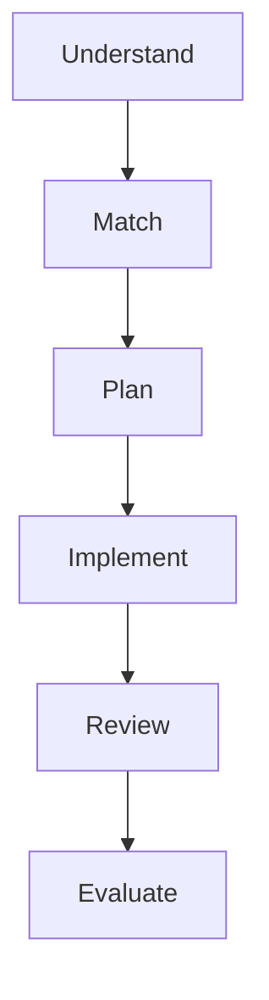

# Lecture 2 — The UMPIRE Method

> **Duration:** ~2 hours.
> **Outcome:** You can recite the six steps from memory, explain what each is for, and walk through a worked example end-to-end. By Wednesday this is automatic; by Week 4 you can do it under pressure.

UMPIRE is six steps you run on **every** problem in this course, in this order, out loud:

```
U   UNDERSTAND   — restate the problem, surface assumptions, agree on examples
M   MATCH        — recognize the pattern (two pointers, sliding window, BFS, DP, …)
P   PLAN         — write the steps in English before any code
I   IMPLEMENT    — translate plan to clean code, one step at a time
R   REVIEW       — trace the code with a small input, find bugs before the interviewer does
E   EVALUATE     — analyze time/space complexity, discuss tradeoffs, propose improvements
```


*The six UMPIRE steps run in this fixed order on every problem.*

Six steps. Always in this order. You will run this thousands of times by the end of the course. It will feel artificial for the first 10 problems. By problem 30 it will feel like the only sane way to solve a problem. By problem 60 you will not remember a time before it.

Below: each step in detail, with the specific things you must say out loud at each one.

---

## U — UNDERSTAND (3–5 minutes)

**Goal:** by the end of this step, the interviewer agrees that you understand what they're asking — and you have at least one worked example.

**Out-loud script:**

1. **Restate the problem in your own words.** Not by re-reading the prompt aloud. By *paraphrasing* what they want. "So you want me to take a list of integers and return whether any two of them sum to a given target. I should return a boolean, not the indices."
2. **Confirm the input shape.** Type? Bounds? Sortedness? Can it be empty? Can it have duplicates? Are values bounded?
3. **Confirm the output shape.** What format? Empty case? Multiple correct answers?
4. **Surface 2–3 specific edge cases.** Empty input. Single element. All duplicates. Very large input. Negative numbers (if integers). Unicode (if strings). Already-sorted (if a sort would help). State each and ask whether to handle it.
5. **Walk through one small example by hand.** "If I get `[1, 4, 7, 10]` with target `11`, then `1+10=11` and `4+7=11`, so the answer is True. Let me also try `[1, 2, 3]` with target `100` — no pair, so False." Out loud. On the whiteboard if there is one.

**Sample clarifying questions for the canonical Two-Sum problem:**

- "Is the array sorted?" (changes pattern entirely)
- "Are the integers unique, or can I have duplicates?"
- "Is there always exactly one solution, no solution, or possibly multiple? If multiple, do I return one or all?"
- "What's the size range? If it's small enough I might prefer a different approach for clarity."
- "Should I return indices or values?"

**Red flags that you skipped this step:**

- You started typing within 60 seconds of receiving the problem.
- You haven't asked a single clarifying question.
- You haven't walked through one example by hand.

**Time check:** if you've spent more than 6 minutes on Understand, you may be procrastinating. Move on.

---

## M — MATCH (1–3 minutes)

**Goal:** Name the pattern. Out loud. Confidently if you're right; tentatively if you're guessing.

**Out-loud script:**

> "This looks like a [pattern name] problem because [signal]. I'll try that approach first."

Examples:

> "This looks like a **two-pointer** problem because the array is sorted and I'm searching for a pair that meets a condition. Two pointers from each end gives me O(n)."

> "This looks like a **sliding window** problem because I'm asked for something about contiguous subarrays of a specific length."

> "This looks like a **BFS** problem because I want the shortest path in an unweighted graph."

> "This *might* be **dynamic programming** because I see overlapping subproblems and an optimal substructure, but let me think for 30 seconds before committing — sometimes greedy works on these too."

The 14 patterns we'll learn this course (each gets its own week):

1. **Arrays + two pointers** (this week)
2. Hash maps (Week 2)
3. Sliding window (Week 3)
4. Fast/slow pointers (Week 4)
5. Binary search (Week 5)
6. BFS (Week 6)
7. DFS (Week 7)
8. Backtracking (Week 8)
9. Top-K / heaps (Week 9)
10. Intervals + greedy (Week 10)
11. Dynamic programming 1D (Week 11)
12. Dynamic programming 2D (Week 12)
13. Bit manipulation, tries (Week 14)
14. System design (Week 12 intro, Week 15 deeper)

Right now you only know one pattern (two pointers). That's fine. Match is asking "is this an instance of what I know?" When the answer is yes, name it. When the answer is no, you'll learn the new pattern this course and add it to your library.

**Time check:** Match should take 1–3 minutes. If you're stuck for 5 minutes, *say so* and ask for a hint. Asking for a hint at the right time is not a failure mode — silent stuck for 10 minutes is.

---

## P — PLAN (5–7 minutes)

**Goal:** A complete English-language plan that, when translated to code, produces a working solution. **Write this on the whiteboard or in code comments.** Do not skip this step. It is the difference between a candidate who codes their plan and one who fishes for an algorithm in real time.

**The plan must include:**

1. **Initial state.** What variables, what initial values?
2. **The main loop or recursion structure.** "Loop while left < right." "Recurse on the left half." "BFS from the start node."
3. **The decision logic.** "Compare arr[left] + arr[right] with target. If equal, return. If smaller, move left. If larger, move right."
4. **The termination condition.** What stops the loop / recursion? What do we return then?
5. **Edge cases handled.** "If the array is shorter than 2, return False immediately."

**Out-loud script (Two-Sum on sorted array):**

> "My plan: initialize `left = 0`, `right = len(arr) - 1`. Loop while `left < right`. At each step compute `s = arr[left] + arr[right]`. If `s == target`, return `True`. If `s < target`, the sum is too small so increment `left`. If `s > target`, decrement `right`. If the loop exits without finding a match, return `False`. Edge case: arrays of length < 2 can't have a pair, so I'll return False immediately at the start."

That's enough. You've stated initial state, loop, decision, termination, and an edge case. Now you can code.

**Red flag:** You started typing actual code in this step. You're conflating Plan and Implement. Stop, finish the plan in English, then proceed.

---

## I — IMPLEMENT (10–15 minutes)

**Goal:** Translate your plan to code, **one English sentence at a time, with naming that reads like prose.**

**Out-loud script:**

> "First, the edge case." [types `if len(arr) < 2: return False`]
> "Now initialize the two pointers." [types `left, right = 0, len(arr) - 1`]
> "Loop while they haven't crossed." [types `while left < right:`]
> "Compute the current sum." [types `s = arr[left] + arr[right]`]
> "If it matches, we're done." [types `if s == target: return True`]
> "If smaller, move left forward." [types `elif s < target: left += 1`]
> "Otherwise move right backward." [types `else: right -= 1`]
> "If we exit the loop, no pair was found." [types `return False`]

Two rules during Implement:

1. **One line of code per English sentence.** Do not type two lines before narrating both. The interviewer's brain must keep up with yours.
2. **Naming is graded.** `s` is fine in this 5-line function but in real code you'd write `current_sum`. In interviews, short names are OK *if* the variable's role is clear from context. When unsure, prefer longer.

**Tools you should be using mentally:**

- **Test-driven thinking.** As you write the loop body, imagine what happens on the first iteration with your worked example. Adjust if the imagined output is wrong.
- **Indentation discipline.** On a whiteboard, indent consistently. On a shared editor, let the editor format. Don't fight your tool.

**Time check:** Aim for 10–15 minutes of Implement on a medium problem. If you're at 20 minutes and have 20 lines of code, you're probably overcomplicating. Re-check Plan.

---

## R — REVIEW (2–4 minutes)

**Goal:** Trace your code on a worked example **and find bugs before the interviewer does.** This is the most under-practiced step. Most candidates skip it.

**Out-loud script:**

> "Let me trace this on `[2, 7, 11, 15]`, target=9.
> Start: left=0, right=3, s = 2+15 = 17. 17 > 9, decrement right. left=0, right=2.
> Next: s = 2+11 = 13. 13 > 9, decrement right. left=0, right=1.
> Next: s = 2+7 = 9. 9 == 9, return True. ✓
>
> Let me also trace on a no-match case. `[1, 2, 3]`, target=10.
> Start: left=0, right=2, s = 1+3 = 4. 4 < 10, increment left. left=1, right=2.
> Next: s = 2+3 = 5. 5 < 10, increment left. left=2, right=2.
> Loop exits because left is not less than right. Return False. ✓
>
> Edge case: `[]`. len(arr) < 2 → return False. ✓
> Edge case: `[5]`. Same. ✓"

**Why this earns points:** the interviewer sees you produce data — actual variable values across iterations — that proves the code does what you claim. They also see that you would have caught any bug.

**Common bugs to catch in Review:**

- Off-by-one errors. (`while left < right` vs `while left <= right` — the wrong one causes infinite loops or missed pairs.)
- Wrong initial values. (`right = len(arr)` vs `right = len(arr) - 1`.)
- Wrong return for the "no match" case. (Some problems want `[]`, others want `[-1, -1]`, some want `False`. Match the prompt.)
- Pointer collision conditions. (Especially on linked lists.)
- Integer overflow in languages that aren't Python. (Not your problem here, but mention it if you're interviewing in Java/C++.)

**Time check:** 2–4 minutes. If you find a bug, fix it visibly: "Ah, I see — I needed `<=` here. Let me re-trace." Don't be embarrassed by catching your own bug; *that's the point of this step.*

---

## E — EVALUATE (2–4 minutes)

**Goal:** State the time and space complexity, identify any tradeoff, and propose improvements (even if you don't have time to code them).

**Out-loud script:**

> "Time complexity: each iteration moves one pointer toward the other, so we make at most `n-1` iterations. **O(n) time.**
>
> Space: I use two integer pointers and one sum variable. **O(1) space.**
>
> Tradeoffs: I assumed the array is sorted. If it weren't, I'd need to either sort it first (`O(n log n)` time, `O(1)` or `O(n)` space depending on the sort) or use a hash map (`O(n)` time, `O(n)` space).
>
> Hash map alternative for the unsorted case: walk through once, for each element check if `target - element` is in a set; if yes return True, else add the current element to the set. O(n)/O(n).
>
> Since I have a sorted input, the two-pointer approach is strictly better — O(n) time, O(1) space. No improvement obvious."

**Things that earn points in Evaluate:**

- Stating *both* time and space.
- Identifying that you exploited a property of the input (sorted).
- Proposing an *alternative* approach for the case where that property doesn't hold.
- Discussing real-world tradeoffs ("if the array is huge and memory-constrained, two-pointer wins").

**Things that lose points:**

- "It's O(n)." Just that. (Which n? What about space?)
- "I think it's O(n log n) but I'm not sure." (Either know or work it out. "Let me reason about this — the outer loop runs n times, each inner call is log n, so n log n" is fine. "I'm not sure" is not.)
- Calling a clearly-O(n) algorithm "O(1)" or vice versa. Sloppy.

---

## 3. A complete UMPIRE walkthrough — the canonical worked example

**Problem (interviewer's prompt):** Given a sorted array of integers `nums` and an integer `target`, return the indices of the two numbers such that they add up to `target`. You may not use the same element twice. You may assume each input has exactly one solution.

Here is what you'd say, in order, with timing:

**[U — 3 minutes]**

> "Got it. So you want me to take a sorted array of integers and a target value. I should find two distinct indices `i` and `j` such that `nums[i] + nums[j] == target`, and return them — let's say as a list `[i, j]`.
>
> A few clarifying questions: can I assume the input is non-empty? Can I have duplicates in the array? Should I return `[i, j]` with `i < j`, or in any order?"
>
> [Interviewer: "Non-empty, can have duplicates, return in order with i < j."]
>
> "Great. Let me work an example. `nums = [2, 7, 11, 15]`, `target = 9`. I should return `[0, 1]` because `nums[0] + nums[1] == 9`. Another: `nums = [1, 3, 4, 5, 7]`, `target = 8`. `nums[1] + nums[3] == 8`, so return `[1, 3]`. Good."

**[M — 30 seconds]**

> "Since the array is sorted and I'm searching for a pair summing to a target, this is a **two-pointer** problem. Left and right pointers, move based on whether the current sum is too small or too large. O(n) time."

**[P — 2 minutes]**

> "My plan: initialize `left = 0`, `right = len(nums) - 1`. Loop while `left < right`. Compute `s = nums[left] + nums[right]`. If `s == target`, return `[left, right]`. If `s < target`, move left forward. Otherwise, move right backward. Edge: the prompt guarantees a solution exists, so we should always return inside the loop. I'll add a `return [-1, -1]` after the loop just in case — a defensive habit."

**[I — 5 minutes]**

> [Types]
>
> ```python
> def two_sum_sorted(nums: list[int], target: int) -> list[int]:
>     left, right = 0, len(nums) - 1
>     while left < right:
>         s = nums[left] + nums[right]
>         if s == target:
>             return [left, right]
>         if s < target:
>             left += 1
>         else:
>             right -= 1
>     return [-1, -1]  # defensive; spec says we always find a pair
> ```

**[R — 2 minutes]**

> "Trace on `[2, 7, 11, 15]`, target=9.
> left=0, right=3, s=17. 17 > 9, decrement right. right=2.
> left=0, right=2, s=13. 13 > 9, decrement right. right=1.
> left=0, right=1, s=9. Match. Return `[0, 1]`. ✓
>
> Trace on `[1, 3, 4, 5, 7]`, target=8.
> left=0, right=4, s=8. Match. Return `[0, 4]`. Wait — that's `[0, 4]` but my earlier example said the expected answer was `[1, 3]`.
>
> Let me re-read the prompt. It says "the two numbers" implying *one* solution exists. So if my algorithm finds `[0, 4]` first, that's a valid answer. The example I made up earlier assumed `[1, 3]` was the canonical answer, but `[0, 4]` is *also* valid — both sum to 8. So my function is correct; my expected example was just one of multiple valid pairings. The spec said "exactly one solution," but for arrays with duplicates this can mean "exactly one pair-by-index" — let me confirm.
>
> [Interviewer: "Yes, the input is designed so there's exactly one valid pair."]
>
> Good. Then my function is correct."

**[E — 2 minutes]**

> "Time: each iteration moves a pointer one step toward the other; at most n-1 iterations. **O(n).**
>
> Space: three integers (`left`, `right`, `s`). **O(1) auxiliary.**
>
> Tradeoffs:
> - If the array weren't sorted, two-pointer wouldn't work directly. Alternatives: sort first (O(n log n)) or use a hash map (O(n)/O(n)). Hash map wins when the array is large and unsorted.
> - If indices weren't needed, we could `return True/False` and save the array indexing.
> - If the array is *very* large and read from a stream, neither approach as-is works — we'd need a streaming algorithm.
>
> Improvement: I don't see one for this exact problem statement. Two-pointer is optimal here."

That's UMPIRE on a single problem, end to end. Total time: ~15 minutes for a 5-line solution. The 5 lines of code are 5% of the interview value; the 95% is the structured reasoning around them.

---

## 4. The UMPIRE write-up format (your portfolio currency)

Every problem you solve this course produces a write-up. The format is exactly the six steps, in order, as Markdown headings.

```markdown
# Problem N: Two Sum II (Sorted Array)

> Given a sorted array `nums` and target `t`, return indices `[i, j]` such that `nums[i] + nums[j] == t`.

## U — Understand

- Input: sorted array of integers, target integer.
- Output: list of two integer indices, `i < j`.
- Clarified: array is non-empty, may have duplicates, exactly one solution.
- Worked example: `[2, 7, 11, 15], target=9` → `[0, 1]`.

## M — Match

Two-pointer pattern. Sorted array + search for pair = O(n) with left/right pointers.

## P — Plan

Initialize l=0, r=n-1. Loop while l<r. Compute sum. Match? Return. Too small? l++. Too big? r--.

## I — Implement

```python
def two_sum_sorted(nums, target):
    l, r = 0, len(nums) - 1
    while l < r:
        s = nums[l] + nums[r]
        if s == target: return [l, r]
        if s < target: l += 1
        else: r -= 1
    return [-1, -1]
```

## R — Review

Traced on `[2,7,11,15]` target=9 → `[0,1]` ✓. Also `[1,3]` target=4 → `[0,1]` ✓. Edge: length-2 array works.

## E — Evaluate

Time **O(n)**. Space **O(1)**. Tradeoffs: if not sorted, use hash map for O(n)/O(n). Two-pointer wins on space when sorted.
```

That's a complete portfolio entry. Future-you skimming this two months from now in pre-interview review can re-derive the solution in 60 seconds. **That's the entire point of the write-up.**

The exercise folder contains [`umpire_template.md`](../exercises/umpire_template.md) — copy it for each problem. The mini-project this week is to commit five completed UMPIRE write-ups to your portfolio repo.

---

## 5. Practicing the method when you already know the answer

Some of your first problems will feel trivial. You'll know the answer immediately. **Run UMPIRE anyway.** The point isn't to discover the answer; it's to drill the *speaking-while-coding* habit. The first time a real interviewer asks you a problem, your nerves will eat 30% of your IQ. UMPIRE is what survives the IQ drop.

A useful test: solve a problem in your head, then sit down with a recorder running and narrate UMPIRE out loud as if you were in an interview. Listen back. The first time is brutal — you'll sound stilted, you'll forget words, you'll mumble. By recording 5, you'll sound competent. By 10 you'll sound like the candidate you want to be.

---

## 6. Self-check

- Recite the six UMPIRE steps in order.
- For each, name one specific thing you must say out loud.
- Why does Match come before Plan?
- Why does Review come before Evaluate?
- Why is silently solving the problem perfectly often worse than UMPIRE-ing through it imperfectly?

If you can answer those without hesitation, proceed to [Lecture 3 — Arrays and Two Pointers](./03-arrays-and-two-pointers.md).

---

## Further reading

- **"Cracking the Coding Interview" — Gayle Laakmann McDowell** — the canonical paid book. Library copy is fine; we don't require it.
- **"Tech Interview Handbook"** (fully free, open source): <https://www.techinterviewhandbook.org/>
- **Original UMPIRE write-up by Aaron Maxwell** — credits and original framework (free): search "UMPIRE method interviewing" for context.
