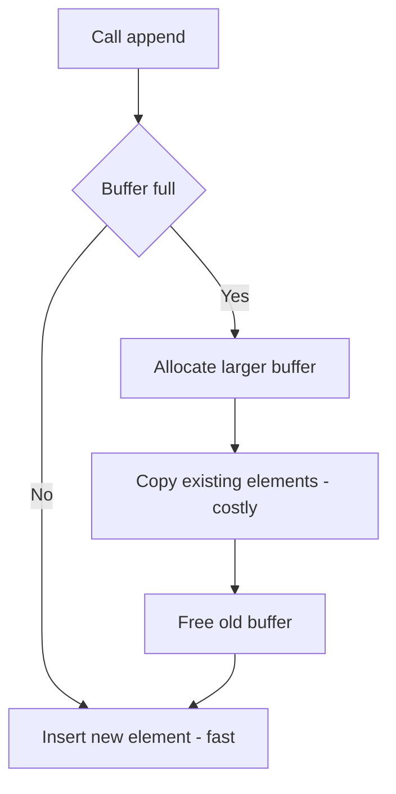

# Lecture 1 — Mental Models for Big-O

> **Duration:** ~2 hours.
> **Outcome:** You can name the six common complexity classes from memory, describe what each *feels like* on n = 10 / 100 / 1000 / 10⁶, calibrate how a single nested loop changes a function's class, and articulate amortized cost at the level of `list.append` and `dict[key]`.

Last week we drilled UMPIRE. The *Evaluate* step kept saying "state the time and space complexity" as if you already knew how. This lecture is where we put real teeth on that step. From here forward, *Evaluate* is not a one-liner — it is a structured tradeoff conversation you can hold for two minutes without notes.

---

## 1. What Big-O is actually for

Big-O is the **language interviewers use to compare algorithms.** It is not a science-fair badge; it is a communication tool. When you say "O(n)" you are committing to a claim: "as the input grows large, the runtime of my algorithm grows in proportion to that input." That claim is checkable. If you make it wrong, the interviewer will catch it.

The formal definition — a function `f(n)` is `O(g(n))` if there exist constants `c, n₀` such that `f(n) ≤ c · g(n)` for all `n ≥ n₀` — is rarely useful in an interview. What's useful is **the small handful of complexity classes you will actually see**, and the *feel* of each.

Six classes cover ≥95% of interview problems. Memorize them.

---

## 2. The six classes you will meet daily

| Class | Name | Canonical example |
|-------|------|-------------------|
| **O(1)** | Constant | Hash-map lookup, dictionary access, arithmetic on fixed-size numbers |
| **O(log n)** | Logarithmic | Binary search, balanced-tree operations |
| **O(n)** | Linear | One pass through an array, summing a list |
| **O(n log n)** | Linearithmic | Comparison-based sorting (`Timsort`, `heapsort`, `mergesort`) |
| **O(n²)** | Quadratic | Nested loop over the same input — bubble sort, naive two-sum |
| **O(2ⁿ)** | Exponential | Recursive subset enumeration, naive Fibonacci |

There are others — O(n³), O(n!), O(log log n), O(n²log n). They exist; they show up rarely. If you can place a problem in one of the six classes above, you'll be right almost every time.

### The growth-rate table (carry this in your head)

How many *operations* does each class produce at typical input sizes? This is the table you need to be able to draw on a whiteboard from memory.

| n →    | n = 10    | n = 100      | n = 1,000          | n = 10⁶           |
|--------|-----------|--------------|--------------------|-------------------|
| O(1)        | 1     | 1     | 1            | 1                 |
| O(log n)    | ~3    | ~7    | ~10          | ~20               |
| O(n)        | 10    | 100   | 1,000        | 1,000,000         |
| O(n log n)  | ~33   | ~664  | ~10,000      | ~20,000,000       |
| O(n²)       | 100   | 10,000 | 1,000,000  | 10¹²              |
| O(2ⁿ)       | 1,024 | huge  | astronomical | beyond cosmology  |

Read the table once. Read it again. Then internalize three rules from it:

- **At n = 1,000, O(n²) is a million operations.** That's about 10ms on modern hardware. Acceptable for an interview problem but you'd never ship it.
- **At n = 10⁶, O(n²) is a trillion operations.** Hours. Unacceptable.
- **At n = 10⁶, O(n log n) is twenty million.** Sub-second. Always acceptable.

Interview problems typically have constraints around `n ≤ 10⁴`, `n ≤ 10⁵`, or `n ≤ 10⁶`. The constraint **tells you the required complexity class.** If `n ≤ 10⁶`, an O(n²) solution will time out. The interviewer is signaling that you need O(n log n) or better.

> **Out-loud script when you see constraints:**
>
> *"n is up to 10⁶, so an O(n²) loop wouldn't run in time. I need O(n log n) or O(n). Let me see if there's a sort-based or hash-based approach…"*
>
> That single sentence demonstrates engineering judgment. The interviewer marks the rubric.

---

## 3. The "feel" of each class

Memorizing the table is necessary; it's not sufficient. You also need an *intuition* — when you see code, can you name its class without reasoning step-by-step? Here is the feel.

### O(1) — "doesn't depend on n"

```python
def get_first(arr):
    return arr[0]

def add(a, b):
    return a + b
```

The work is fixed; growing the input doesn't change anything. Hash-map lookups, dictionary access, arithmetic on Python `int`s (modulo arbitrary-precision quirks), `len(arr)`. Anything that is "one operation regardless of how big things are."

### O(log n) — "halve the problem each step"

```python
def bsearch(arr, target):
    lo, hi = 0, len(arr) - 1
    while lo <= hi:
        mid = (lo + hi) // 2
        if arr[mid] == target: return mid
        if arr[mid] < target: lo = mid + 1
        else: hi = mid - 1
    return -1
```

The signature move: **each iteration eliminates half the remaining work.** That's how a tree of `n` elements has height `log₂ n`. If you can characterize an algorithm as "each step throws away half," it's O(log n).

### O(n) — "look at each element once"

```python
def total(arr):
    s = 0
    for x in arr:
        s += x
    return s
```

A single pass through the input. This is what *most* well-engineered algorithms aspire to. When you find an O(n) solution to a problem that has a naive O(n²) version, you've usually done a good interview.

### O(n log n) — "sort once, then a linear pass"

```python
def sort_and_first(arr):
    arr.sort()              # O(n log n)
    return arr[0]           # O(1)
# total: O(n log n)
```

The `n log n` almost always comes from a *sort*. If you see `arr.sort()` or `sorted(arr)`, you've committed to O(n log n). The big question is whether you needed to. (Sometimes yes — see Week 1's three-sum. Sometimes no — see Week 2's longest-consecutive.)

### O(n²) — "compare every pair"

```python
def has_pair_summing_to(arr, target):
    n = len(arr)
    for i in range(n):
        for j in range(i + 1, n):
            if arr[i] + arr[j] == target:
                return True
    return False
```

A nested loop where the inner loop's bound depends on `n`. The classic interview red flag: **"can you do better than the nested loop?"** is the most common interviewer question in the world. The answer is almost always *yes, with a hash map or a sort + two pointers*.

### O(2ⁿ) — "every subset / every choice"

```python
def all_subsets(arr):
    if not arr:
        return [[]]
    rest = all_subsets(arr[1:])
    return rest + [[arr[0]] + s for s in rest]
```

Recursion that branches. Each element doubles the work. **You cannot run this for n ≥ ~25.** When you see "find all subsets," "enumerate every combination," or naive recursion that re-solves the same subproblems, you're in 2ⁿ territory. That's where dynamic programming (Weeks 11–12) lives — turning 2ⁿ into something polynomial.

---

## 4. Best, average, worst — and which to state

Big-O is usually stated as a **worst-case bound**, but interviews often want you to discuss all three.

| Case | What it means | When it matters |
|------|---------------|-----------------|
| **Best case** | Fastest possible run, on a "lucky" input | Almost never the interesting answer. Mention it only for hash-map lookups (O(1) best) or early-termination algorithms |
| **Average case** | Expected runtime over the distribution of inputs you'd actually see | The number you cite for hash maps. **A dict lookup is O(1) average, O(n) worst.** That phrasing wins points. |
| **Worst case** | Slowest possible run, on an adversarial input | The default in big-O. Always state worst-case unless you're explicit about average. |

The single best phrasing in an interview:

> "Worst case **O(n²)**, but on the *expected* distribution of inputs — random or near-random — it's closer to **O(n log n)** average. For an adversarial input it degrades."

That signals you understand the *spread* of behavior, not just the headline.

### Hash maps are the canonical "average vs worst" case

```python
seen = {}
for x in arr:
    seen[x] = True   # O(1) average, O(n) worst (collision-heavy bucket)
```

In CPython, `seen[x] = True` is **O(1) average.** It is **O(n) worst case** if every key hashes to the same bucket (adversarial input — possible if a malicious user can predict the hash seed, otherwise extremely unlikely). In an interview, you should say:

> *"Insert is O(1) average; O(n) worst case in pathological collision scenarios — but Python randomizes the hash seed, so for normal inputs we treat it as O(1)."*

That one sentence shows you know Python, not just "hash maps are fast."

---

## 5. Time complexity vs space complexity — both matter

Most candidates state time and forget space. **State both, every time.** They are coupled by tradeoff: most ways to make an algorithm faster cost memory; most ways to save memory cost time. The interesting engineering conversation lives in that tradeoff.

| Algorithm | Time | Space |
|-----------|------|-------|
| Two-sum, sorted input, two-pointer | O(n) | O(1) |
| Two-sum, unsorted input, hash map | O(n) | O(n) |
| Two-sum, unsorted input, sort then two-pointer | O(n log n) | O(1) or O(n) depending on sort |
| Bubble sort | O(n²) | O(1) |
| Merge sort | O(n log n) | O(n) |

Look at line 2 vs line 3. **Same problem, different tradeoff.** The hash map buys you better time at the cost of memory. That's a *judgment call* an interviewer wants to hear you make explicit. We'll drill this in Lecture 3.

### What counts as "auxiliary space"

The input itself doesn't count — you didn't allocate it. Only the *extra* memory your algorithm allocates counts as space complexity.

- Two-pointer reverse-in-place: O(1). The two pointers are integers.
- Returning a new reversed list: O(n). You allocated it.
- Recursive functions: each stack frame counts. A linear recursion is O(n) space for the call stack, even if the algorithm "feels" O(1).
- Slicing in Python (`arr[i:j]`) creates a *new list*. Costs O(j - i) time and space. Don't be the candidate who claims O(1) and then slices.

---

## 6. Amortized analysis — the case you must know

Amortized complexity is the **average cost per operation over a long sequence**, even if a few individual operations are expensive. You need this for exactly two interview scenarios.

### Scenario 1: `list.append` in Python

```python
arr = []
for i in range(n):
    arr.append(i)        # what's the cost?
```

A Python list is a dynamic array. When it runs out of capacity, it allocates a new underlying buffer (typically ~1.125× larger), copies everything over, and frees the old one. That copy step is O(k) where k is the current size — expensive!


*Most appends hit the fast path; the rare resize-and-copy is the cost that gets spread out, or amortized, across all the others.*

But it happens *rarely*. Over `n` appends, the total work to grow + copy is bounded by ~2n. So:

> **`list.append` is O(1) amortized.** Worst case for a single call is O(n), but if you do `n` appends in a loop, total work is O(n), which averages to O(1) per call.

In an interview, when you append in a loop and someone asks "what's the cost of `arr.append(x)`?", the right answer is:

> *"O(1) amortized — individual appends may be O(n) when the underlying buffer resizes, but over a sequence of n appends, total cost is O(n), so amortized O(1) per call."*

### Scenario 2: `dict[key]` lookup / insert

```python
d = {}
d[k] = v        # what's the cost?
d[k]            # what's the cost?
```

Same shape, different mechanism. A Python `dict` is an open-addressing hash table that resizes when load factor exceeds a threshold. **Lookups are O(1) average; inserts are O(1) amortized** (resize happens periodically; amortizing it gives O(1) per insert).

The worst case for a single lookup is O(n) — every key collides into the same probe chain. In practice, with Python's randomized hash seed and well-distributed inputs, this never happens.

> **`dict[k] = v` is O(1) amortized average.** That phrase — "amortized average" — is the precise answer to "what's the cost?" Most candidates just say "O(1)" and lose the depth point.

### When NOT to bring up amortization

If you say "amortized" *every* time you say "O(1)", you sound pedantic. The right rule: mention amortization when (a) the operation is in a tight loop where worst-case spikes matter (real-time systems), or (b) the interviewer asks you to defend the O(1) claim. Otherwise, "O(1) average" is the right default for hash maps and lists in normal code.

---

## 7. The "nested loop" calibration drill

This is the most useful drill in Week 2. Look at code; predict the class; then explain *which nest contributes which factor.*

### Example A

```python
def f(arr):
    for x in arr:
        print(x)
```

One loop over n elements → **O(n).** Body is O(1).

### Example B

```python
def f(arr):
    for x in arr:
        for y in arr:
            print(x, y)
```

Nested over the same n → **O(n²).** Inner loop runs n times; outer runs n times; n · n = n².

### Example C

```python
def f(arr):
    for x in arr:           # n iterations
        for y in range(10): # 10 iterations — constant!
            print(x, y)
```

Inner loop bound is *constant*, not dependent on n → **O(n).** The factor of 10 is hidden inside the O() — that's the whole point of asymptotic analysis.

### Example D

```python
def f(arr):
    n = len(arr)
    for i in range(n):           # n iterations
        for j in range(i, n):    # n-i iterations on average n/2
            print(arr[i], arr[j])
```

This is the triangular pattern. Total iterations: n + (n-1) + (n-2) + … + 1 = n(n+1)/2 ≈ n²/2. **O(n²).** Constant factors drop; the n² survives.

### Example E

```python
def f(arr):
    arr.sort()                       # O(n log n)
    for x in arr:                    # O(n)
        if binary_search(arr, x):    # O(log n)
            yield x
```

Take the *maximum* of the terms. `O(n log n) + O(n · log n) = O(n log n).` The first term dominates the second — they're the same, really. **O(n log n).**

### Example F (the tricky one)

```python
def f(arr):
    while arr:
        arr.pop()        # O(1)
        for x in arr:
            print(x)
```

Outer loop runs n times. Inner loop shrinks: n, n-1, n-2, …, 1. Total iterations: n + (n-1) + … + 1 = O(n²). **O(n²)** — even though the inner loop "shrinks," the total work is still quadratic.

### Example G

```python
def f(arr):
    n = len(arr)
    i = 1
    while i < n:
        i *= 2
```

`i` doubles each iteration → exits when `i ≥ n` → runs `log₂ n` times. **O(log n).** The "halving / doubling" signature.

### Example H

```python
def fib(n):
    if n < 2: return n
    return fib(n - 1) + fib(n - 2)
```

Branching recursion, two recursive calls each step, depth n → roughly **O(2ⁿ).** (Strictly O(φⁿ) where φ is the golden ratio, but 2ⁿ is the right *class* answer.) This is the canonical "DP fixes this to O(n)" example, drilled in Week 11.

### How to calibrate yourself

For each of the seven examples, on a blank piece of paper:

1. Write your guess.
2. Write **why** — which loop or branch contributes which factor.
3. Compare to the answer above.

If you got fewer than 6 of 7 right, **redo this section.** Pattern-class identification at sight is a skill, not a guessing game.

---

## 8. The "what does adding a nested loop do" calibration

Most upgrades and downgrades from one class to another happen by *adding* or *removing* a nested loop, or by *substituting a hash map for a loop*. Train the reflex:

| Move | Effect |
|------|--------|
| Add a loop over `n` inside an O(1) body | Linear → O(n) |
| Add a loop over `n` inside an O(n) body | Linear → O(n²) |
| Add a loop over `log n` inside an O(n) body | Linear → O(n log n) |
| Replace an inner loop with a hash-map lookup | O(n²) → O(n), but adds O(n) space |
| Replace a hash-map with a sort + linear scan | O(n) time/O(n) space → O(n log n) time/O(1) space |
| Replace iterative scan with binary search on sorted input | O(n) → O(log n) |
| Memoize a branching recursion | O(2ⁿ) → O(n) or O(n²) (DP-dependent) |

That table is the engineering judgment table. When the interviewer says "can you do better?", you reach for one of these moves.

---

## 9. Self-check

You should be able to do all of these without notes.

1. **Recite the six common complexity classes**, smallest to largest.
2. **State the n-vs-runtime table** for n = 10, 100, 1,000, 10⁶ for each class.
3. **Given a constraint `n ≤ 10⁵`, what classes are acceptable?** (O(n log n) yes; O(n²) borderline / depends on constant factor; O(2ⁿ) absolutely not.)
4. **What is the time/space complexity of `dict[k] = v`?** ("O(1) amortized average; O(n) worst-case if every key collides into one chain.")
5. **Why is `list.append` O(1) amortized?** (Resize is rare and the cost is spread over n appends.)
6. **You're shown code with two nested loops over `arr` of length `n` and an `arr.sort()` at the top — what's the class?** (O(n log n) + O(n²) = O(n²).)
7. **Why is space complexity worth stating separately?** (Time / space tradeoff is half the interview; saying only time is half the answer.)

If you can answer all seven without hesitation, proceed to [Lecture 2 — The Hash Map Pattern](./02-the-hash-map-pattern.md).

---

## Further reading

- **MIT 6.006 Lecture 1** — the canonical free lecture on algorithmic thinking. ~50 minutes.
- **CPython `dictobject.c` header comment** — read this once; the design is elegant.
- **"How to Calculate Complexity" — any decent reference site** — pick one and bookmark it for re-reading.

Next: [Lecture 2 — The Hash Map Pattern](./02-the-hash-map-pattern.md).
