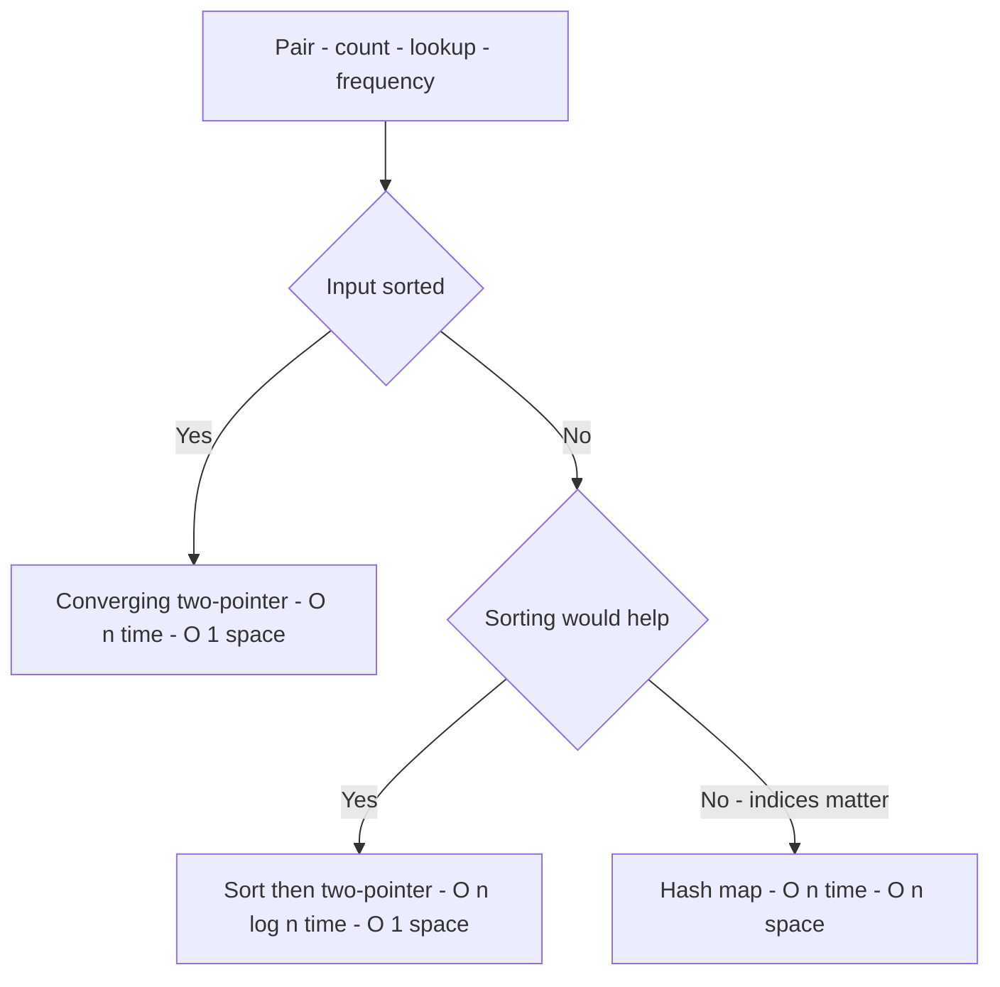
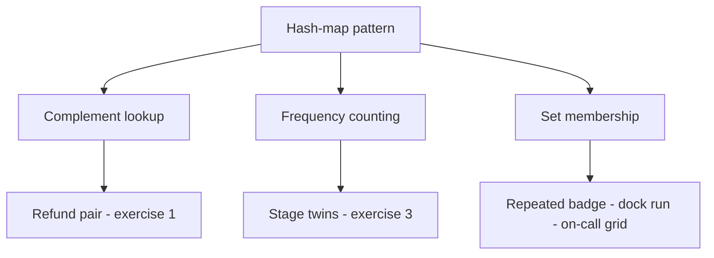

# Lecture 2 — The Hash Map Pattern

> **Duration:** ~2 hours.
> **Outcome:** You can recognize a hash-map problem within 30 seconds, name the three sub-shapes of the pattern, articulate the O(1)-average-versus-O(n)-space tradeoff out loud, and defend the hash-map choice over two-pointer (or vice versa) on the right axis.

Last week we learned to *talk while we code*. This week we learn to *reach for the right data structure*. The hash map is the most-used pattern in interview problems — more than two pointers, more than sliding window — because it shows up the moment a problem says "unsorted," "count," "frequency," "have I seen this before," or "complement."

By the end of this lecture you should be reaching for `dict` and `set` with the same instinct that, last week, made you reach for `left` and `right`.

---

## 1. What "hash map" means in an interview

In Python, a **hash map** is a `dict`. A **hash set** is a `set`. They are the same underlying mechanism: a hash function maps keys to buckets, with collision-handling to keep lookups close to O(1).

In an interview you can use either word — *hash map*, *hash table*, *dict*, *dictionary*. They mean the same thing. Pick one and stick with it. Most American interviewers say "hash map." Most Python-focused interviewers say "dict." Both are correct.

The two operations you care about, with their costs:

| Operation | Cost |
|-----------|------|
| `d[k] = v` (insert) | O(1) amortized average |
| `d[k]` (lookup) | O(1) average |
| `k in d` (membership) | O(1) average |
| `del d[k]` (delete) | O(1) amortized average |
| `for k in d` (iterate) | O(n) — touches every key |
| `len(d)` | O(1) |

For `set`, replace "key" with "element"; the costs are identical.

**The O(1) average is the entire reason hash maps are useful.** If you can re-express "for each pair `(i, j)`, check something" as "for each `i`, *look up* something derived from `i`," you've gone from O(n²) to O(n) at the cost of O(n) space.

That trade — **O(n²) time → O(n) time + O(n) space** — is the pattern.

---

## 2. When the sorted-array two-pointer doesn't apply, hash map usually does

Week 1's two-pointer pattern is brilliant when the input is sorted. **But many real problems are unsorted, or sorting would scramble information you need to preserve** (e.g., original indices). In those cases the hash map is the go-to.

The decision tree, drilled until it's reflex:

```
Problem: "find pair / count / lookup / frequency"

├── Input sorted?
│   └── Yes ──→ converging two-pointer (Week 1)         O(n) time, O(1) space
│
├── Input unsorted, sorting would help?
│   └── Yes ──→ sort first, then two-pointer            O(n log n) time, O(1) space
│
└── Input unsorted, indices matter or sorting too slow?
    └── Yes ──→ hash map                                O(n) time, O(n) space
```


*Which structure to reach for, based on whether the input is sorted and whether original indices must survive.*

In an interview, after Research constraints, your Assess options step should *name which branch of this tree* you took and why.

---

## 3. The three sub-shapes of the hash-map pattern

Just like two-pointer had three sub-shapes (converging, same-direction, two-input), the hash-map pattern has three.

| Sub-shape | What it looks like | Use case |
|-----------|--------------------|----------|
| **Complement lookup** | For each element, look up the value that would complete it; cache as you go | Pair-sum on unsorted input, "have I seen `target − x`?" |
| **Frequency / counting** | Build a `dict` of `value → count` (or `Counter`); act on the counts | Multiset equality, most-frequent, grouping by an equivalence |
| **Set membership** | Build a `set` of seen / forbidden / required elements; query in O(1) | Repeat detection, run-finding, constraint grids |

Most hash-map problems are one of these three. Knowing which one buys you a fast Assess options step.


*The three sub-shapes of the hash-map pattern, each anchored to the drill that teaches it.*

---

## 4. Sub-shape 1: Complement lookup

The shape Exercise 1 drills. You have an unsorted sequence of values and a target, and you need to find two entries that combine to reach it — returning their **positions**, which is what stops you from just sorting.

Take the drill's framing: a list of charge amounts in the order they were made, and a refund total. Find two charges that sum to it.

### The naive O(n²) version

```python
def find_refund_pair_naive(charges: list[int], refund_total: int) -> tuple[int, int] | None:
    for i in range(len(charges)):
        for j in range(i + 1, len(charges)):
            if charges[i] + charges[j] == refund_total:
                return (i, j)
    return None
```

For every pair of positions, check the sum. **O(n²) time, O(1) space.** Correct, and at n above about 10⁴ it will time out.

### The hash-map O(n) version

```python
def find_refund_pair(charges: list[int], refund_total: int) -> tuple[int, int] | None:
    seen: dict[int, int] = {}                    # amount → earliest position
    for i, amount in enumerate(charges):
        complement = refund_total - amount
        if complement in seen:
            return (seen[complement], i)         # earlier position first
        if amount not in seen:                   # keep the earliest position
            seen[amount] = i
    return None
```

The move: instead of asking "for every pair of positions, do they sum to the total?", ask "for this one charge, have I already walked past the amount that would complete it?"

- Walk the list once.
- For each amount, compute `complement = refund_total - amount`.
- Look the complement up in the hash map — `O(1)` average.
- Found: return both positions.
- Not found: cache this amount against its position and move on.

**O(n) time, O(n) space.** One pass. The hash map has *replaced the inner loop*, which is the whole trade this lecture is about.

Two details in that code are graded in Exercise 1 and are worth naming now. The lookup happens **before** the insert, or an amount matches itself. And the insert is **conditional**, so a repeated amount keeps its earliest position rather than being overwritten by a later one — which is what makes the drill's tie-break come out right.

### Recognition signals for complement lookup

- "Find a pair (or triple) reaching a target" on unsorted input
- "Find a pair whose difference is exactly `k`"
- "Find `x` such that some value derived from `x` is also present"
- "Have I already seen something that completes this one?"

### Variants to recognise

- **Pair reaching a target** — the shape above. (Exercise 1 this week.)
- **Pair separated by exactly `k`** — the map holds values; for each `x` check both `x + k` and `x - k`. The doubled check is the only difference.
- **Windows summing to a target** — prefix sums, then the same complement lookup over the prefixes rather than over the values. (Challenge 1 this week; see §8.)
- **Windows whose sum is a multiple of `k`** — identical, but key the map on `running % k` instead of `running`.
- **First element with some property** — "the first value that occurs exactly once" is two passes over one `Counter`: build it, then rescan the original order.

---

## 5. Sub-shape 2: Frequency / counting (the anagram family)

The second canonical use: build a *count* of each value, then act on the counts.

### Are two collections the same multiset?

Exercise 3 asks whether two stage load-outs are interchangeable, which is exactly this question. The hand-rolled version:

```python
def same_multiset(left: list[str], right: list[str]) -> bool:
    if len(left) != len(right):
        return False
    counts: dict[str, int] = {}
    for item in left:
        counts[item] = counts.get(item, 0) + 1
    for item in right:
        if counts.get(item, 0) == 0:
            return False
        counts[item] -= 1
    return True
```

**O(m) time**, where m is the combined length, and **O(d) space** for `d` distinct items. The length check on the first line is not decoration: without it, `left` could be a strict superset and the second loop would still finish cleanly.

### The `collections.Counter` shortcut

Python's `Counter` collapses that to one line:

```python
from collections import Counter

def same_multiset(left: list[str], right: list[str]) -> bool:
    return Counter(left) == Counter(right)
```

In an interview, **either is fine.** The hand-rolled version shows you understand the mechanism; the `Counter` version shows you know the standard library. Most interviewers want the latter in production code and the former when they are probing. When unsure, say both: *"I'd reach for `Counter` for brevity — under the hood it is a dict of value to count, so the complexity is identical."*

### Grouping by an equivalence relation

The bigger move is using the count itself as a **key**. Two things belong in the same bucket if their canonical forms are equal, so pick a canonical form and let the map do the grouping:

```python
from collections import defaultdict

def group_by_signature(loadouts: list[list[str]]) -> list[list[int]]:
    groups: defaultdict[tuple[str, ...], list[int]] = defaultdict(list)
    for i, items in enumerate(loadouts):
        groups[tuple(sorted(items))].append(i)     # canonical form as the key
    return list(groups.values())
```

The insight: **two collections are multiset-equal iff their sorted tuples are equal.** Sorting each one costs `O(k log k)` for `k` items, so the whole grouping is **O(n · k log k)** time and **O(n · k)** space. Note that the buckets hold *indices*, not the collections themselves — that is a contract choice, and Exercise 3 makes it a requirement.

The canonical form must be **hashable** and must **preserve multiplicity**. `tuple(sorted(items))` satisfies both. `set(items)` satisfies only the first, and silently merges two guitars with one guitar.

### Recognition signals for counting / frequency

- "Are these two collections the same multiset?"
- "Which value occurs most often?"
- "Which is the first value that occurs exactly once?"
- "Is there a value occurring more than half the time?"
- "Group these by some equivalence" — pick a canonical form and use it as the key

### Variants

- **The k most frequent values** — count, then select. Selection wants a heap, which is Week 9.
- **The first value occurring exactly once** — one pass to count, a second pass over the original order to find it. Two passes, still `O(n)`.
- **Matching a frequency profile inside a moving window** — counting composed with a sliding window, which is Week 3.

---

## 6. Sub-shape 3: Set membership (the "have I seen this?" family)

When you don't need a value associated with a key, just *presence*, use a `set`. Smaller memory footprint than a dict; same O(1) average lookup.

### Finding the first repeat

Exercise 2's shape. You are scanning a log in order and want the position where something recurs:

```python
def first_repeated_scan(badge_ids: list[int]) -> int | None:
    seen: set[int] = set()
    for i, badge in enumerate(badge_ids):
        if badge in seen:
            return i
        seen.add(badge)
    return None
```

**O(n) time, O(n) space**, and `O(1)` in the best case, because it returns the instant it finds a repeat. A sorted two-pointer version would need `O(n log n)` to sort first — and worse, sorting destroys the positions this contract asks for. When the input is unsorted and you need to know *where*, the set is not merely faster; the alternative cannot answer the question.

Note the ordering, which is the bug the drill is built to catch: **check membership first, add second.** Reverse them and every element finds itself.

### Finding the longest run of consecutive values

Exercise 5's shape, and the one that looks like it needs a sort and does not:

```python
def longest_dock_run(reported: list[int]) -> tuple[int, int] | None:
    docks = set(reported)
    if not docks:
        return None
    best: tuple[int, int] | None = None
    for start in docks:
        if start - 1 in docks:            # not a root; some earlier value owns this run
            continue
        length = 1
        while start + length in docks:
            length += 1
        if best is None or length > best[1] or (length == best[1] and start < best[0]):
            best = (start, length)
    return best
```

The trick: **only walk forward from a run's smallest member.** Runs are disjoint, so each value is stepped through by exactly one walk, and the inner loops total at most `n` steps across the whole function. **O(n) time, O(n) space.**

Sort-then-scan is `O(n log n)`. This is `O(n)`. That gap — and the ability to *defend* it when an interviewer points at the nested loop and raises an eyebrow — is the entire point of Exercise 5.

### Recognition signals for set membership

- "Has this value appeared before, and where?"
- "How long is the longest run of consecutive values, in any order?"
- "Does this grid violate a uniqueness rule along any axis?" (Exercise 4)
- "Is this in the forbidden list?" inside a tight loop
- "Have I visited this node already?" — graph traversal, Weeks 6 and 7, where the visited set is the thing that makes the traversal terminate

---

## 7. Caching past values during one pass — the "single-pass" idiom

A pattern that ties the three sub-shapes together: **as you walk through the input, build up a hash map of what you've seen so far, and query it on the current element.** This idiom — *cache as you go* — is the most common shape of hash-map solutions.

The complement-lookup solution in §4 is the canonical example. Pseudocode:

```
seen = {}            # or set()
for each element x in input:
    answer-question-using(seen, x)
    seen[x] = something
```

This shape:

- Single pass through the input → O(n) time
- Hash-map operations are O(1) average → no inner loop
- Space O(n) worst case (the hash map can grow to hold all inputs)

When you see a problem that *feels* like it needs two nested loops over the same input, **try the single-pass cache shape first.** It will work surprisingly often.

---

## 8. Worked example — counting windows that reach a target

This is one of the most discriminating mid-level shapes there is. We will not solve it in full here — that is Challenge 1 — but we will narrate the *pattern match*, because the match is the hard part.

**The question.** Given a list of hourly net movements, some of them negative, how many contiguous non-empty windows sum to exactly `target`?

**The naive O(n²) approach.** For each starting hour, extend a running sum through every later hour and count the hits. Correct, and hopeless past about 10⁴ hours.

**The reformulation.** Let `S[b] = net_moves[0] + ... + net_moves[b-1]`, with `S[0] = 0` for the empty prefix. Then the window `net_moves[i..j]` sums to `S[j+1] − S[i]`. So a window reaches `target` exactly when

```
S[j+1] − S[i] = target      ⟺      S[i] = S[j+1] − target
```

which is a **complement lookup over the prefix sums**. Sweep `b` from 1 to n and ask how many earlier prefixes carried the value `S[b] − target`. That count comes from a frequency map.

```python
def count_balanced_windows(net_moves: list[int], target: int) -> int:
    counts = {0: 1}                              # the empty prefix, seen once
    running = 0
    answer = 0
    for x in net_moves:
        running += x
        answer += counts.get(running - target, 0)
        counts[running] = counts.get(running, 0) + 1
    return answer
```

**O(n) time, O(n) space.** One pass. The map replaces the inner loop *and* carries a frequency — the complement sub-shape and the counting sub-shape doing one job.

Three things in six lines are worth naming out loud, because each is a bug you will otherwise write:

- The `{0: 1}` seed is the empty prefix. Without it, no window that starts at hour 0 is ever found.
- The query happens **before** the insert. Reverse them and, with `target = 0`, every prefix matches itself.
- `answer += counts.get(...)` adds a **frequency**, not `1`. Three earlier prefixes with the right value close three windows in one step, which is why this stays linear.

Why this matters: the prefix-sum-plus-hash-map combination shows up in window-property questions constantly, and recognising it inside thirty seconds is the tell. Challenge 1 takes it further — its contract also asks *which* window, which means the map has to carry a second payload alongside the count.

---

## 9. The "I'll just use a set" temptation (and when it is wrong)

Sometimes a `set` does not carry enough information. Three cases from this week:

- **Complement lookup needs positions**, not just values. Use a `dict` mapping value → index. (Exercise 1.)
- **Grouping needs to collect the members** under each key. Use a `defaultdict(list)`. (Exercise 3.)
- **"Occurs exactly once" needs counts**, not membership. Use a `Counter`.

The rule of thumb: **`set` for presence; `dict` for presence + payload.** When the problem says "return the *first* X" or "return *all* Xs," you usually need payload. When it says "are there any duplicates / collisions / overlaps?", a set suffices.

---

## 10. Common bugs in hash-map code

- **Forgetting `defaultdict` and crashing on missing keys.** `d[k] += 1` errors if `k` isn't there. Use `d[k] = d.get(k, 0) + 1` or `defaultdict(int)` or `Counter`.
- **Mutating a dict while iterating it.** `for k in d: del d[k]` raises `RuntimeError: dictionary changed size during iteration`. Make a list of keys to remove first, or build a new dict.
- **Using a mutable object as a key.** `{[1,2]: 'value'}` raises `TypeError: unhashable type: 'list'`. Use `tuple([1,2])` instead. Lists are unhashable; tuples and frozensets are hashable.
- **Comparing two dicts forgetting that key order doesn't matter.** `{'a': 1, 'b': 2} == {'b': 2, 'a': 1}` is True — equality in Python dicts ignores insertion order. Don't write defensive sort-the-keys code.
- **Claiming O(1) when the operation is actually O(k)** for a key of length k. Hashing a string is O(length-of-string), not O(1). For typical interview inputs this is rolled into the constant; but if the question is "hash a 10MB string," say so.
- **Allocating the hash map in the wrong scope.** If you `seen = set()` inside a loop, you create a fresh empty set each iteration. Hoist it out.

---

## 11. Self-check

Without notes, answer:

**1.** Name the three sub-shapes of the hash-map pattern.

<details>
<summary>Answer</summary>

Complement lookup; frequency / counting; set membership.

</details>

**2.** For each, name a canonical problem and its time / space complexity.

<details>
<summary>Answer</summary>

Complement lookup — the refund pair of §4 and Exercise 1: `O(n)` time, `O(n)`
space. Frequency / counting — the multiset-equality family of §5: `O(n)` time,
`O(k)` space for `k` distinct values. Set membership — the first repeat of §6
and Exercise 2: `O(n)` time, `O(n)` space in the worst case, where nothing
repeats and every value is stored.

All three are one pass, so all three are linear in time. The space is what you
are buying that pass with, and it is the half candidates leave out.

</details>

**3.** What's the difference between when you reach for two-pointer and when you reach for a hash map?

<details>
<summary>Answer</summary>

Sorted → two-pointer; unsorted and you need `O(n)` time → hash map; willing to
trade `O(1)` space for two-pointer's lower memory.

</details>

**4.** Why is `dict.get(k, 0)` preferable to `d[k]` when `k` may not exist?

<details>
<summary>Answer</summary>

`d[k]` raises `KeyError` on a key that is not there; `.get(k, 0)` returns the
default instead, so the counting idiom
`counts[item] = counts.get(item, 0) + 1` handles the first sighting of a value
and every later one with the same line — no branch on whether the key exists.

The default is returned, not stored. That is the half that trips people:
`d.get(k, []).append(x)` appends to a throwaway list and leaves `d` untouched.
When you want the default written back, use `d.setdefault(k, []).append(x)` or
a `defaultdict(list)`, as §5 does.

</details>

**5.** What's the time complexity of `for k, v in d.items()`?

<details>
<summary>Answer</summary>

`O(n)`.

</details>

**6.** Trace `find_refund_pair([180, 220, 380], 600)` step by step.

<details>
<summary>Answer</summary>

Position 0: complement 420, not seen, cache `180 → 0`. Position 1: complement
380, not seen, cache `220 → 1`. Position 2: complement 220, found at position 1,
return `(1, 2)`.

</details>

**7.** When does set membership lose to two-pointer?

<details>
<summary>Answer</summary>

When the problem requires `O(1)` space *and* offers sorted input.

</details>

**8.** Why does the frequency map in §8 add a count rather than incrementing by one?

<details>
<summary>Answer</summary>

Several earlier prefixes can carry the same value; each closes a distinct
window, so all of them land in one step. That is what keeps it linear.

</details>

If you can answer all eight, proceed to [Lecture 3 — Stating Complexity Out Loud](./03-stating-complexity-out-loud.md).

---

## Further reading

- **"Fluent Python" by Luciano Ramalho — Chapter 3 (Dictionaries and Sets)** — library copy is fine.
- **CPython `dictobject.c` header comment** — read it once; it's elegant.
- **Raymond Hettinger's "Modern Dictionaries" PyCon talk** — free on YouTube.

Next: [Lecture 3 — Stating Complexity Out Loud](./03-stating-complexity-out-loud.md).
