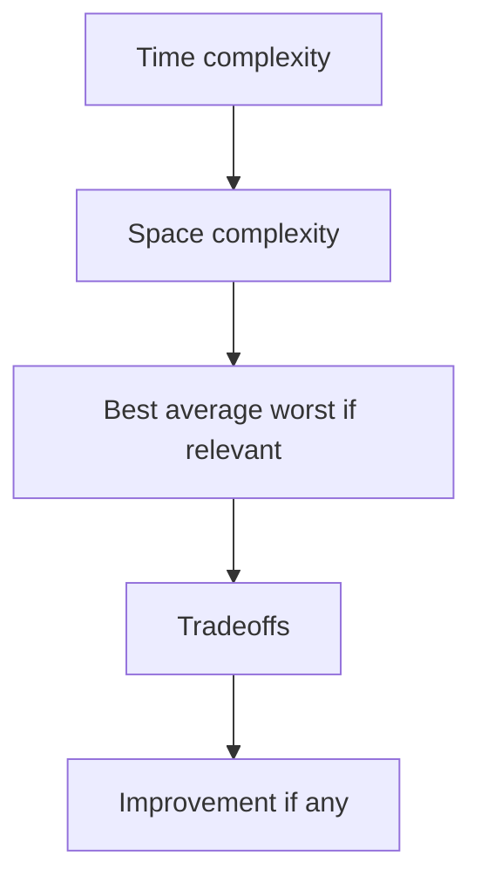

# Lecture 3 — Stating Complexity Out Loud

> **Duration:** ~1 hour.
> **Outcome:** You can produce a structured *Evaluate* section — time, space, tradeoff, defense — for any problem you've solved this course. Out loud. In under two minutes. Without notes.

Lecture 1 gave you the *vocabulary* of complexity. Lecture 2 gave you the *pattern* that most often produces O(n) from a naive O(n²). This lecture is where we drill the *speaking discipline* that makes both visible to an interviewer.

The UMPIRE *Evaluate* step is the most under-practiced step in the method. Last week we drew its outline. This week we make it muscle memory.

---

## 1. Why "out loud" still matters in Week 2

Last week we said: *most candidates fail interviews because they couldn't explain themselves.* That's still true. By Week 2 you may have started to slip — the drills feel familiar, you know the patterns, you start typing before you fully narrate.

**Don't.** The Evaluate step is where many borderline candidates win or lose. It's also the step that *demonstrates engineering judgment* — the rubric dimension that separates "junior who passes" from "junior worth hiring."

This lecture is short on purpose. The work is in the practice; the lecture just gives you the script.

---

## 2. The standard Evaluate sentence

Every Evaluate section you produce this course follows the same five-part structure. Memorize it:

```
1. Time complexity      — "O(_) time because _."
2. Space complexity     — "O(_) auxiliary space because _."
3. Best / average / worst, if relevant — "average O(_); worst O(_) in case ___."
4. Tradeoffs            — "Alternative is _, which is O(_)/O(_); wins when _."
5. Improvement, if any  — "I could improve to O(_) if _; not worth it because _."
```


*The five-piece Evaluate sentence, spoken in order, every time.*

That's it. Five sentences. Two to four minutes when spoken. Every interview, every problem, every time.

Here is the canonical example for two-sum unsorted with a hash map:

> "**Time complexity.** Each iteration does one O(1) average hash-map lookup and one O(1) average insert. We iterate n times. **O(n) time.**
>
> **Space complexity.** The hash map holds at most n entries — one per element of the input. **O(n) auxiliary space.**
>
> **Worst case.** Worst-case hash-map operations are O(n) if every key collides, but Python uses a randomized hash seed; for normal inputs we treat hash ops as O(1) average. So total is O(n) expected; O(n²) adversarial but practically unreachable.
>
> **Tradeoffs.** If the array were sorted, two-pointer would solve this in O(n) time and O(1) space — strictly better on memory. Since this input is *unsorted* and we need to preserve the original indices for the return, sorting first would scramble them. The hash map is the right choice here.
>
> **Improvement.** No improvement obvious — we're already at O(n), the lower bound for any algorithm that must read the entire input."

That sentence — fluent, structured, specific — is what wins the *engineering judgment* dimension on the rubric.

---

## 3. The pieces, broken down

### Piece 1: Time complexity

The standard phrasing:

> *"Each iteration is O(_) on the [data structure]; n iterations total → O(_) total time."*

Concrete examples:

> "Each iteration is **O(1) average** on the hash map; n iterations total → **O(n) time**."

> "Each iteration is **O(log n)** for the binary-search step; n iterations of the outer loop → **O(n log n) time**."

> "Each iteration is **O(1)** for the pointer-advance and comparison; at most n iterations total → **O(n) time**."

The structure is always: *cost of one iteration · number of iterations*. State both, then multiply.

### Piece 2: Space complexity

The standard phrasing:

> *"I allocate [data structure] of size at most [bound] → O(_) auxiliary space."*

Concrete examples:

> "I allocate a hash map that grows to at most n entries → **O(n) auxiliary space**."

> "I allocate two integer pointers and a running sum → **O(1) auxiliary space**."

> "The recursion stack reaches depth n in the worst case → **O(n) auxiliary space** for the call stack."

**"Auxiliary"** is the magic word. It signals you're excluding the input itself — which you should always do, but it's nice to make explicit.

### Piece 3: Best / average / worst

Only mention these when they differ meaningfully from the headline. The three places they come up in interviews:

- **Hash maps** — "O(1) average; O(n) worst in pathological collisions."
- **QuickSort-like algorithms** — "O(n log n) average; O(n²) worst on already-sorted input."
- **Early-termination algorithms** — "O(n) worst, but O(1) best case if the answer is found at index 0."

If you mention all three on a simple O(n) loop, you sound pedantic. The rule: mention them when there's a *spread*; otherwise the headline is enough.

### Piece 4: Tradeoffs

This is the differentiating piece. State the alternative *you considered and rejected*, with its complexity, and *why you chose this one*.

The standard phrasing:

> *"Alternative: [approach name] — O(_)/O(_). I chose [my approach] because [_]."*

Concrete:

> "Alternative: sort first, then two-pointer — O(n log n) time, O(1) space. I chose the hash map because the prompt's `n ≤ 10⁵` makes O(n) noticeably faster than O(n log n) here, and the O(n) memory is well within bounds."

> "Alternative: brute-force nested loop — O(n²)/O(1). I chose the hash map because n could be up to 10⁵, where the brute force would time out."

This piece is where you demonstrate *judgment*, not just *knowledge*. Always include it, even if the alternative is "the naive version."

### Piece 5: Improvement

If there's a known better approach you didn't take — mention it. If you're already at the theoretical lower bound — say so.

> "No improvement obvious. The lower bound for any algorithm that must read every element is O(n); we're at O(n), so this is optimal up to constants."

> "Could improve to O(n) time if we relax the O(1) space requirement, using a hash map. The prompt asks for O(1) space explicitly, so I'm staying with two-pointer."

The "no improvement, we're at the lower bound" sentence is gold — it tells the interviewer *you know what optimal is*.

---

## 4. The two-pointer-versus-hash-map debate (when to defend which)

The most common Evaluate-step debate this week — and a frequent interview probe — is: *"Why hash map instead of two pointers? Or vice versa?"*

The answer depends on **two questions:**

1. **Is the input sorted (or cheaply sortable)?**
2. **Do we need to preserve original indices?**

| Input sorted? | Indices matter? | Choose |
|---------------|-----------------|--------|
| **Yes** | No | **Two-pointer** — O(n) time, O(1) space, no extra memory |
| **Yes** | Yes (but sorting OK) | **Two-pointer** — works on the sorted array; map back if needed |
| **No** | No | **Two-pointer after sort** — O(n log n) time, O(1) extra space |
| **No** | Yes | **Hash map** — O(n) time, O(n) space, preserves indices |

The defense out loud:

> "I chose hash map because the input is unsorted *and* the problem asks for indices into the original array. Sorting first would scramble the indices, so I'd need to remember the originals — at which point I'm using O(n) extra memory anyway. The hash map gets me there in one pass with O(n) time."

Or:

> "I chose two-pointer because the input is already sorted, so I get O(1) space, which the hash-map alternative can't match. If the input weren't sorted, I'd have to sort first (O(n log n)) or use a hash map (O(n) time, O(n) space) — both worse here."

### When the interviewer pushes back

A common follow-up: *"Can you do it with O(1) space?"* On an unsorted array, the honest answer is:

> "Yes, by sorting in place first — that takes O(n log n) time and O(1) extra space (for in-place sort). It's slower than the hash map but uses less memory. The tradeoff is time-for-space."

Don't pretend O(1) space is free. If the prompt allows O(n) space (most do), say so:

> "The prompt doesn't constrain space, and n is small enough that O(n) memory is trivial. The hash map's clarity wins."

That's a real engineering answer. Memorize the shape; it works on most variants of this debate.

---

## 5. Practicing the Evaluate sentence

The drill: take one of your Week 1 solutions. Open a recorder. Look at the code. **Speak the Evaluate section** — all five pieces — in two minutes, without re-reading the problem.

Do this for **all five Week 1 drills**, as part of this week's mini-project. By the fifth one you will have the rhythm.

Specifically, this week your mini-project is to **re-do the Evaluate section** of every Week 1 write-up to follow the five-piece structure. The result: a portfolio that demonstrates Week-2-level discipline retroactively across Week 1's work.

---

## 6. Three common Evaluate-section anti-patterns

### Anti-pattern 1: "It's O(n)."

Just that. The most common mistake.

What's missing: which n? Time or space? Average or worst? What's the alternative? Why this one?

**Fix:** the full five-part structure, even if some pieces are short.

### Anti-pattern 2: "It's O(n) for time and O(n) for space" — full stop.

State without explanation. Hollow.

**Fix:** *because* clauses. "O(n) time **because each element is visited once.** O(n) space **because the hash map holds at most n entries.**" Explanation is half the value.

### Anti-pattern 3: "I think it's O(n²) but I'm not sure."

Hedging. Unconvincing.

**Fix:** if you're uncertain, *reason out loud and reach a confident answer*. "Let me reason about this — the outer loop runs n times, the inner loop is bounded by the current index so it averages n/2 — that's O(n²). I'm confident in O(n²)." Reasoning to a confident answer is fine. Trailing off into uncertainty is not.

---

## 7. The "what would change?" question

Senior interviewers love this follow-up: *"What would change if [some constraint relaxed / tightened]?"*

Sample variants:

- "What if the input could be 10⁹ elements instead of 10⁵?"
- "What if memory were limited to O(√n)?"
- "What if the input were streamed and you couldn't store it all?"
- "What if you needed to support concurrent updates from multiple threads?"

The right response shape:

1. **Acknowledge the change.** "If n grew to 10⁹, we have a memory problem — even O(n) space is 10⁹ entries, which is gigabytes."
2. **Identify what breaks.** "The hash map approach won't fit in RAM."
3. **Propose a direction.** "I'd consider external sorting + two-pointer, which is O(n log n) but only O(1) memory at a time. Or a probabilistic structure like a Bloom filter if false positives are acceptable."

You don't need to *solve* the harder problem in the interview — you need to *gesture at the approach.* That's engineering judgment again.

---

## 8. Self-check

You should be able to do all of these without notes.

1. **Recite the five-piece Evaluate structure.** (Time; space; best/average/worst if relevant; tradeoffs; improvement.)
2. **State the time complexity of two-sum unsorted** in the *standard sentence form.* ("Each iteration is O(1) average on the hash map; n iterations → O(n) time.")
3. **Defend hash map over sort-then-two-pointer** on unsorted input where indices matter. (Sorting scrambles indices; we need them; hash map preserves them in O(n).)
4. **What's the standard phrasing for "O(n) is optimal for this problem"?** ("No improvement obvious; we're at the lower bound for any algorithm that must read the entire input.")
5. **Reframe the hedge-y answer "I think it's O(n log n)?"** into a confident reasoning chain. (e.g., "Let me reason: outer loop n times, inner sort log n — that's n log n; confident.")
6. **What two questions do you ask to decide hash-map versus two-pointer?** (Is the input sorted? Do indices matter?)

If you can answer all six without hesitation, your Evaluate discipline is Week-2-ready.

---

## 9. Up next

The five [exercises](../exercises/README.md) for this week — five hash-map drills, in order, each with a full Evaluate-section requirement.

After exercises: the [quiz](../quiz.md) (10 complexity questions), the [homework](../homework.md), the two [challenges](../challenges/README.md), and the [mini-project](../mini-project/README.md) — re-doing Week 1's Evaluate sections.

Then Week 3.
