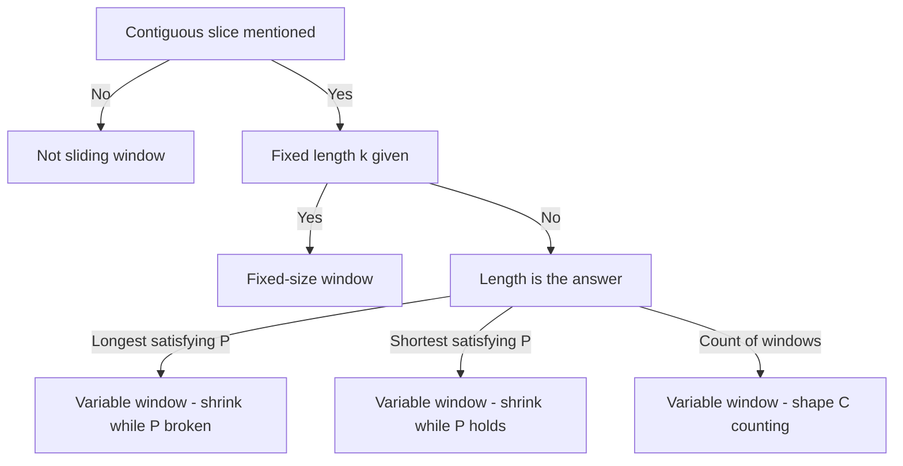

# Lecture 1 — The Sliding Window Pattern

> **Duration:** ~2 hours.
> **Outcome:** You can recognize a sliding-window problem within 30 seconds, name the two sub-shapes (fixed vs variable), state the window invariant out loud, and pick the right loop shape on first read.

Last week we learned to reach for a `dict` or `set` when the input is unsorted. This week we learn to recognize when a problem that *looks* like "compute something over every contiguous subarray" is actually a single linear scan with two indices that never go backwards. That recognition saves you a complexity class — usually `O(n·k)` or `O(n²)` collapses to `O(n)` — and it shows up in roughly one in five interview problems at the medium tier.

By the end of this lecture you should be able to read a problem and, within 30 seconds, say one of three things out loud: "fixed-size sliding window," "variable-size sliding window," or "not sliding window — here's why."

---

## 1. What "sliding window" means

A **window** is a contiguous slice of the input — `nums[left..right]` for an array, `s[left..right]` for a string. The **sliding** is the discipline: both `left` and `right` move in only one direction (forward), and they never cross. The window's *contents* change as the indices move, but its **shape** is always a contiguous slice.

Visualization, fixed window of size 3:

```
nums:  [ a  b  c  d  e  f ]
        [ a  b  c ]              ← window at left=0, right=2
           [ b  c  d ]           ← slide: left=1, right=3
              [ c  d  e ]        ← slide: left=2, right=4
                 [ d  e  f ]     ← slide: left=3, right=5
```

Variable window, growing and shrinking. Here the invariant is "no value appears twice inside the window," and the input is a log of badge IDs swiped at a lab door:

```
swipes:  [ 12   5  12   8   5   3 ]
         [ 12 ]                        ← right=0
         [ 12   5 ]                    ← right=1
              [  5  12 ]               ← right=2 repeated badge 12; left moved to 1
              [  5  12   8 ]           ← right=3
                  [ 12   8   5 ]       ← right=4 repeated badge 5; left moved to 2
                  [ 12   8   5   3 ]   ← right=5
```

Notice that `left` never goes backwards, and that the window *grows again* after each shrink. The longest clean stretch here is the last one, four swipes long.

The pattern's power comes from one observation:

> **Each index advances at most `n` times. The total work is `O(n)` no matter how the inner shrink loop looks.**

That amortized argument is what makes sliding window an `O(n)` pattern even when the inner loop *appears* to do extra work. We'll formalize it in section 6.

---

## 2. Why this is *not* two-pointer (and why the distinction matters)

Last week and the week before, you saw "two-pointer converging" — `left = 0, right = n-1`, move toward each other. You also saw "two-pointer same-direction" — `read` and `write`, both starting at 0, partitioning the array in place.

Sliding window uses two indices. They start at the same end. They move in the same direction. So far this *looks* like the same-direction two-pointer. The difference:

| | Same-direction two-pointer | Sliding window |
|--|--|--|
| **What the two indices represent** | One reads, one writes — they don't define a region | Both define a *contiguous region* (the window) |
| **Why you'd use it** | In-place mutation / partitioning | Compute something about every contiguous slice |
| **Auxiliary state** | Usually none | Almost always: a running sum, a `Counter`, a `set` |
| **What changes between iterations** | One element is overwritten | The window contents shift; the auxiliary state is updated incrementally |
| **The answer is** | A modified array / a count of uniques | A length, a count of windows, a max/min over windows |

Quick test. Read these prompts. Two-pointer or sliding window?

1. "Remove duplicate readings from a sorted sensor log in place." → **Same-direction two-pointer.** The `read` and `write` don't define a region; one just reads, one writes.
2. "Find the longest stretch of a badge log in which no badge appears twice." → **Sliding window.** The window contents are the stretch; the auxiliary state answers "have I already seen this badge inside the window?"
3. "Move all the out-of-stock rows to the end of the inventory list." → **Same-direction two-pointer.** Same shape as remove-duplicates.
4. "Find the longest run of consecutive days whose total rainfall stays under a cap." → **Sliding window.** The window is the run; the auxiliary state is the running total.

When in doubt, ask: *"is there a contiguous slice that the algorithm is reasoning about?"* If yes, sliding window. If no, two-pointer.

---

## 3. The two sub-shapes

Sliding window has two sub-shapes that look superficially similar but produce very different loop bodies. Picking the right one in Research constraints saves you the panic of writing code that doesn't fit the problem.

| Sub-shape | Window size | Triggered by |
|-----------|-------------|--------------|
| **Fixed-size window** | Constant `k` from the prompt | "for every contiguous subarray of length `k`," "moving average of size `k`" |
| **Variable-size window** | Grows and shrinks based on an invariant | "longest substring with property P," "shortest subarray with property P," "count of windows satisfying P" |

The recognition signal that disambiguates: **does the prompt give you a number `k` upfront, or does the window length emerge from the algorithm?**

### Fixed-size — the trigger words

- "every contiguous block of length `k`"
- "moving average over `k` readings"
- "the busiest `k` consecutive intervals"
- "any reordering of this required set, as a contiguous block" (the window size equals the size of the required set)
- "every position where the next `k` entries match this profile"

When you see a length supplied as input — or derivable from another input, as in Exercise 3, where the window size is `len(required)` — the window's size is determined before you write a line of code. The loop body is the same on every iteration.

### Variable-size — the trigger words

- "the longest stretch [with some property]"
- "the shortest run [with some property]"
- "the longest run containing at most K distinct [things]"
- "how many contiguous stretches have [property]"
- "the smallest stretch that contains all of [this multiset]"

When the *answer itself* is a length or count of windows, the loop has to *find* the right window size. The loop body has an inner shrink condition that's specific to the problem.

---

## 4. Fixed-size windows: the canonical shape

```python
def fixed_window_template(nums, k):
    # Initialize the first window: nums[0..k-1]
    state = initialize_state(nums[:k])
    answer = current_value(state)

    # Slide: at each step, remove nums[left], add nums[right]
    for right in range(k, len(nums)):
        left = right - k
        update_remove(state, nums[left])
        update_add(state, nums[right])
        answer = combine(answer, current_value(state))

    return answer
```

Three observations:

1. **The first window is built explicitly.** The loop doesn't start at index 0; it starts at index `k` (the first index *not* in the initial window). The work to build the first window is `O(k)`, then each slide is `O(1)`.
2. **State updates are incremental.** Adding `nums[right]` and removing `nums[right - k]` together cost `O(1)` per slide, *not* `O(k)`. If you recompute the state from scratch each iteration, you've written an `O(n·k)` algorithm — which means you didn't actually do sliding window, you did brute force in a sliding-window-shaped wrapper.
3. **`left` is derived from `right`.** Many writers introduce `left` as a separate variable. Either works; the derivation makes the invariant `right - left + 1 == k` explicit.

### Worked shape: the wettest `k` consecutive hours

A rain gauge reports millimetres per hour. Given the log and a block size `k`, what is the largest total rainfall over any `k` consecutive hours?

```python
def wettest_block_total(rainfall: list[int], k: int) -> int | None:
    if k > len(rainfall) or not rainfall:
        return None
    window_total = sum(rainfall[:k])
    best = window_total
    for right in range(k, len(rainfall)):
        window_total += rainfall[right] - rainfall[right - k]
        best = max(best, window_total)
    return best
```

Trace it on `rainfall = [0, 4, 1, 6, 2]` with `k = 2`. The first window is `0 + 4 = 4`, so `best = 4`. Slide: `+1 -0 → 5`, best 5. Slide: `+6 -4 → 7`, best 7. Slide: `+2 -1 → 8`, best 8. Return 8, which is `rainfall[3] + rainfall[4]`.

**`O(n)` time, `O(1)` space.** The naive "for each starting hour, add up `k` values" is `O(n·k)`. The window collapses it by reusing the previous window's total.

The discriminator: **what does `window_total` mean at any point in the loop?** It is the total of `rainfall[right-k+1 .. right]`. That is the invariant. State it out loud during your Assess options step.

Exercise 1 is this shape with one deliberate complication: it asks for the *position* of the best block rather than its total, and it defines what happens on a tie. The loop is the same; the bookkeeping is not.

---

## 5. Variable-size windows: the expand-then-shrink shape

```python
def variable_window_template(nums):
    state = empty_state()
    left = 0
    answer = initial_answer()

    for right in range(len(nums)):
        update_add(state, nums[right])

        # Shrink while the invariant is broken (or while we want a smaller window)
        while invariant_broken(state):
            update_remove(state, nums[left])
            left += 1

        # At this point the invariant holds.
        answer = combine(answer, window_value(left, right, state))

    return answer
```

Four observations:

1. **The outer `for` advances `right` once per iteration.** It never backs up. So `right` makes at most `n` steps.
2. **The inner `while` advances `left` until the invariant holds.** It also never backs up. Across the entire algorithm, `left` also makes at most `n` steps.
3. **Total inner-loop iterations across all `right` values sum to at most `n`.** Not `n` per outer iteration — `n` *total*. That's the amortized argument.
4. **State updates on both sides.** `update_add` runs once per outer step; `update_remove` runs each time `left` advances. Both must be `O(1)` for the algorithm to be `O(n)`.

### The first canonical shape: "longest with everything distinct"

The badge log from section 1. How long is the longest stretch of consecutive swipes in which no badge appears twice?

```python
def longest_distinct_stretch(swipes: list[int]) -> int:
    last_index = {}    # badge -> most recent index inside the current window
    left = 0
    best = 0
    for right, badge in enumerate(swipes):
        if badge in last_index and last_index[badge] >= left:
            # This badge is already inside the window; jump past its old position.
            left = last_index[badge] + 1
        last_index[badge] = right
        best = max(best, right - left + 1)
    return best
```

**`O(n)` time, `O(min(n, catalogue))` space.** Each swipe is processed once when `right` reaches it; `left` jumps forward to step over duplicates. The invariant: **every badge inside `swipes[left..right]` is distinct.**

The `last_index[badge] >= left` guard is the part learners drop. A badge whose last sighting is *behind* `left` is not in the window and must not move `left` at all — without the guard, `left` jumps backwards and the window silently admits a duplicate.

Notice the shape: the `while` shrink loop is *implicit* here. We jump `left` straight to the position just past the old sighting instead of removing one element at a time. Both shapes are valid sliding window. The explicit-shrink version is sometimes clearer:

```python
def longest_distinct_stretch_explicit(swipes: list[int]) -> int:
    in_window = set()
    left = 0
    best = 0
    for right, badge in enumerate(swipes):
        while badge in in_window:
            in_window.discard(swipes[left])
            left += 1
        in_window.add(badge)
        best = max(best, right - left + 1)
    return best
```

Same complexity, same correctness. Use whichever shape the prompt nudges you toward, and say in Assess options which one you picked and why. Exercise 2 asks for the *span* rather than the length, which means whichever shape you choose, you also have to record where the best window was.

### The second canonical shape: "longest with at most K distinct"

A whole family of problems uses this template. The invariant: **the window contains at most `k` distinct values.** When adding a value pushes the distinct count over `k`, shrink from the left until it is back at `k`.

```python
def longest_at_most_k_distinct(items: list[str], k: int) -> int:
    counts: dict[str, int] = {}
    left = 0
    best = 0
    for right, item in enumerate(items):
        counts[item] = counts.get(item, 0) + 1
        while len(counts) > k:
            counts[items[left]] -= 1
            if counts[items[left]] == 0:
                del counts[items[left]]
            left += 1
        best = max(best, right - left + 1)
    return best
```

The `del` on a zero count is the line to memorize. Without it, `len(counts)` keeps counting values that have already left the window, the shrink condition never clears, and `left` walks off the end.

This template is the heart of Exercise 5. Internalize it, with `k` as a parameter — hard-coding a specific `k` costs you the generalization for nothing.

### The third canonical shape: "shortest with property P"

For "find the *shortest* stretch such that the property holds," the loop shape flips: expand `right` until the property holds, then *shrink* `left` while the property *still* holds. The answer is updated *inside* the shrink loop, not after it.

```python
def shortest_run_reaching(values: list[int], target: int) -> int:
    left = 0
    running = 0
    best = float("inf")
    for right, x in enumerate(values):
        running += x
        while running >= target:
            best = min(best, right - left + 1)
            running -= values[left]
            left += 1
    return 0 if best == float("inf") else best
```

This is the shape of Exercise 4, which adds a tie-break so that a bare length is no longer enough state to carry. The condition maintained by the shrink loop is the *opposite* of the at-most-K case — we shrink *while the property holds*, not *while it is broken*. That sign flip is the difference between "longest" and "shortest" sliding window.

We will work this shape in detail in Lecture 2.

---

## 6. The amortized `O(n)` argument — say it out loud

Every sliding-window write-up should include this sentence in Examine (cost):

> "**Why this is O(n).** The outer loop advances `right` exactly `n` times. The inner `while` advances `left` — but `left` can only move forward, and only up to `n` times across the entire algorithm. So the total inner-loop work, summed over all outer iterations, is at most `n`. Total work: `n + n = 2n = O(n)`."

That's the *amortized* argument. It is the single most important sentence in any sliding-window interview answer. Memorize the shape. Say it on every problem.

A common mistake: looking at the nested `for ... while ...` and calling it `O(n²)`. That's wrong, and it's the failure mode this lecture exists to fix. The inner `while` does *not* run up to `n` times *per outer iteration* — it runs up to `n` times *in total*. Two loops, two indices, each advancing at most `n` times.

Compare:

```python
# This is O(n^2): inner loop bound depends on the outer index
for i in range(n):
    for j in range(i, n):    # j resets at each i
        ...

# This is O(n): inner loop variable doesn't reset
left = 0
for right in range(n):
    while condition:         # left does not reset
        left += 1
    ...
```

The difference: in the second pattern, `left` *carries forward* from outer iteration to outer iteration. Once advanced, it never goes back. That's what makes the total inner work `O(n)`, not `O(n²)`.

---

## 7. Picking the right auxiliary state

The state inside the window is almost always one of four shapes. Pick correctly during Assess options.

| Property of the window | Auxiliary state | Update cost |
|------------------------|-----------------|-------------|
| Sum / product / count | A single integer / float | O(1) per add/remove |
| Distinctness / membership | `set` or `Counter` | O(1) average per add/remove |
| Character/value frequency | `Counter` or `defaultdict(int)` | O(1) average per add/remove |
| Max / min in window | Monotonic `deque` (Week 9) | O(1) amortized per add/remove |

A common mistake: using a `list` and calling `min()` or `max()` on it each iteration. That's `O(k)` per iteration, which makes the whole algorithm `O(n·k)` — back to brute force. Pick the right data structure.

For frequency tables, `Counter` and `defaultdict(int)` are interchangeable for the basic add/remove pattern. `Counter` gives you arithmetic and equality for free (`Counter("aab") == Counter("aba")` is `True`); `defaultdict` is a touch faster on raw inserts. Most interviewers don't care which you pick — but say which and why.

---

## 8. The canonical recognition signals (the 30-second match)

Stop. Read the prompt slowly. Ask these in order:

1. **Is the problem about a contiguous slice?** Look for *substring*, *subarray*, *contiguous*, *consecutive*. If yes, sliding window is a strong candidate.
2. **Is there a fixed length `k` given as input?** If yes, fixed-size window. If no, go to 3.
3. **Is the answer a length, a count of windows, or a max/min/sum over windows?** If yes, variable-size window is likely. If no, reconsider — might be DP or hash map.
4. **Are the inputs all non-negative (for sum-based problems)?** If "sum at least target" or "sum at most target" with possible negatives, sliding window may not apply — the monotone-shrink invariant breaks. Use prefix-sum + hash map instead (Week 2's Challenge 1 territory).
5. **Is the property *contiguity*, or is it *subsequence*?** Subsequence problems (elements in order but not adjacent) are *not* sliding window. They're DP.

The 30-second decision tree:

```
"contiguous slice" mentioned or implied?
├── No  ──→ not sliding window. Pattern is hash map, DP, or something else.
└── Yes
    ├── Fixed length k given?  ──→ fixed-size window
    └── Length is the answer?
        ├── "longest / largest" satisfying P?  ──→ variable window, shrink while P broken
        ├── "shortest / smallest" satisfying P? ──→ variable window, shrink while P holds
        └── "count of windows" satisfying P?    ──→ variable window, shape C; "exactly K" needs at_most twice
```



*The 30-second recognition path from a contiguous-slice cue to the right window shape.*

This decision tree is what we want in muscle memory by Sunday.

---

## 9. When sliding window doesn't fit

Equally important: knowing when to *reject* the pattern.

- **Negative numbers + "sum at most K"** — the running sum is not monotonic, so shrinking from the left doesn't restore the invariant cleanly. Use prefix-sum + hash map.
- **Non-contiguous subsequence problems** — sliding window is contiguous by definition. "The longest run of readings that increases, allowing gaps" is not contiguous; that is dynamic programming.
- **"Exactly K distinct" framing** — no single sliding window counts "exactly K" directly. The reformulation: **exactly K = at_most(K) − at_most(K − 1)**. Write the at-most-K counting window once, call it twice, subtract. This is [homework Problem 2](../homework/README.md).
- **Window over a tree or graph** — sliding window is a 1-D pattern. Tree/graph "windows" are BFS or DFS, covered Weeks 6–7.

Recognizing the *negative space* of the pattern matters as much as the positive recognition.

---

## 10. Worked example end-to-end: the longest clean badge stretch

Full FRAME, abbreviated, on the badge log from section 1. Exercise 2 is this shape with a harder contract — it wants the span, not the length — so working this one first is a warm-up rather than a spoiler.

**The problem.** A lab door logs the badge ID of every swipe, in order. Return the length of the longest stretch of consecutive swipes in which no badge appears twice.

**[F — 2 minutes]**

> "I'm given a list of badge IDs in swipe order. I need the length of the longest *contiguous* stretch where every ID is distinct. Confirm: contiguous, not a subsequence — I can't skip swipes. A badge may reappear outside the stretch, just not inside it. An empty log gives 0. Walk `[12, 5, 12, 8, 5, 3]`: the best stretch is the last four swipes, `[12, 8, 5, 3]`, length 4."

**[R — 30 seconds]**

> "Sliding window. Contiguous plus 'longest with a property' is the canonical variable-size shape A. The invariant is that every badge inside the window is distinct. Auxiliary state: a dict mapping badge to its most recent index inside the window. A set works too, with an explicit shrink loop instead of a jump."

**[A — 2 minutes]**

> "Outer loop on `right`, from 0 to n-1. Keep `left` starting at 0 and a `last_index` dict. When `right` lands on a badge already inside the window — meaning its `last_index` is at or after `left` — jump `left` to `last_index[badge] + 1`. Then record `last_index[badge] = right` and update `best = max(best, right - left + 1)`. Return `best`."

**[M — 3 minutes]**

```python
def longest_distinct_stretch(swipes: list[int]) -> int:
    last_index: dict[int, int] = {}
    left = 0
    best = 0
    for right, badge in enumerate(swipes):
        if badge in last_index and last_index[badge] >= left:
            left = last_index[badge] + 1
        last_index[badge] = right
        best = max(best, right - left + 1)
    return best
```

**[E · verify — 2 minutes]**

> "Trace on `[12, 5, 12, 8, 5, 3]`.
> `r=0`, badge 12: not in the window. `last_index = {12: 0}`, `left = 0`, window length 1, `best = 1`.
> `r=1`, badge 5: new. `last_index = {12: 0, 5: 1}`, length 2, `best = 2`.
> `r=2`, badge 12: last seen at 0, and `0 >= left = 0`, so `left = 1`. `last_index[12] = 2`. Window is indices 1–2, length 2. `best` stays 2.
> `r=3`, badge 8: new. Window 1–3, length 3, `best = 3`.
> `r=4`, badge 5: last seen at 1, and `1 >= left = 1`, so `left = 2`. `last_index[5] = 4`. Window 2–4, length 3. `best` stays 3.
> `r=5`, badge 3: new. Window 2–5, length 4, `best = 4`. ✓
> Now the counter-trace. Suppose I drop the `>= left` guard and re-run `[12, 5, 12, 8, 5, 3]` — at `r=4` badge 5 was last seen at index 1, which is still at or after `left`, so nothing changes here. The guard matters on a log like `[7, 9, 9, 7]`: at `r=3` badge 7 was last seen at index 0, but `left` is already 2, so 7 is *not* in the window. Without the guard `left` jumps *backwards* to 1, the window becomes `[9, 9, 7]`, and I report 3 for a stretch that plainly repeats a badge."

**[E · cost — 1 minute]**

> "**Time `O(n)`.** The outer loop runs `n` times and each dict lookup and assignment is `O(1)` average. `left` only moves forward, so across the whole run the two indices make at most `2n` moves. **Space `O(min(n, catalogue))`** — one entry per distinct badge. Best, average and worst are all `O(n)`; there's no early exit. Tradeoff: checking every start/end pair with a fresh set is `O(n²)`; rebuilding the set inside that is `O(n³)`. The window reuses the shrink work instead of throwing it away. No improvement available — every swipe has to be read, so `O(n)` is the floor."

That is FRAME on a textbook sliding-window problem, end to end, in about ten minutes. The drill is to do this every single time.

---

## 11. Self-check

Without notes, answer:

1. **What's a window?** (A contiguous slice `s[left..right]` of the input.)
2. **What's the difference between sliding window and two-pointer converging?** (Sliding window's indices move only forward and define a contiguous region; two-pointer converging may move either direction and doesn't necessarily define a region.)
3. **For each sub-shape (fixed / variable), name a problem from this week and its time complexity.** (Fixed: the wettest `k` consecutive hours, `O(n)`. Variable: the longest clean badge stretch, `O(n)`.)
4. **State the amortized O(n) argument.** (Each index moves at most n times total; the nested `for/while` does at most 2n iterations summed across the algorithm.)
5. **When does sliding window not fit?** (Negative numbers + "sum at most K"; non-contiguous subsequences; "window over a graph" — those are BFS/DFS.)
6. **What's the auxiliary state for "the longest run with at most K distinct values"?** (A frequency table — `Counter` or `defaultdict(int)` — with keys deleted the moment their count reaches zero.)

If you can answer all six without hesitation, proceed to [Lecture 2 — The Shrinking and Growing Mechanics](./02-the-shrinking-and-growing-mechanics.md).

---

## Further reading

- **NeetCode's free sliding-window playlist** (YouTube): a clean, free run-through of 10+ canonical problems. Skim two or three videos at 1.5×.
- **CP-Algorithms — Sliding Window Maximum**: <https://cp-algorithms.com/data_structures/deque.html#sliding-window-minimum> — preview of the deque-based window-max idiom for Week 9.
- **LeetCode Sliding Window tag** (free practice ground): <https://leetcode.com/tag/sliding-window/> — pick titles and predict fixed vs variable before reading constraints.

Next: [Lecture 2 — The Shrinking and Growing Mechanics](./02-the-shrinking-and-growing-mechanics.md).
