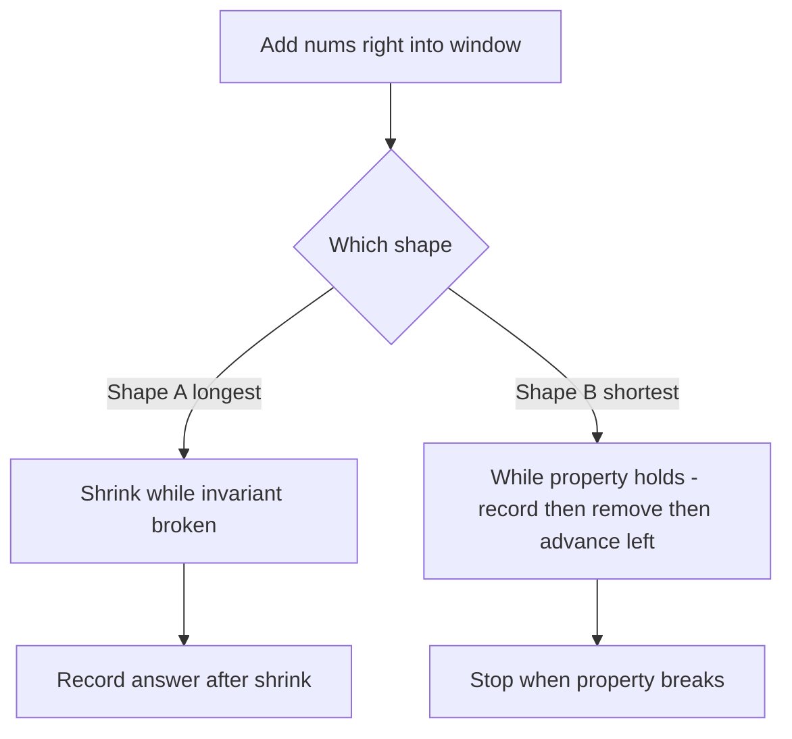
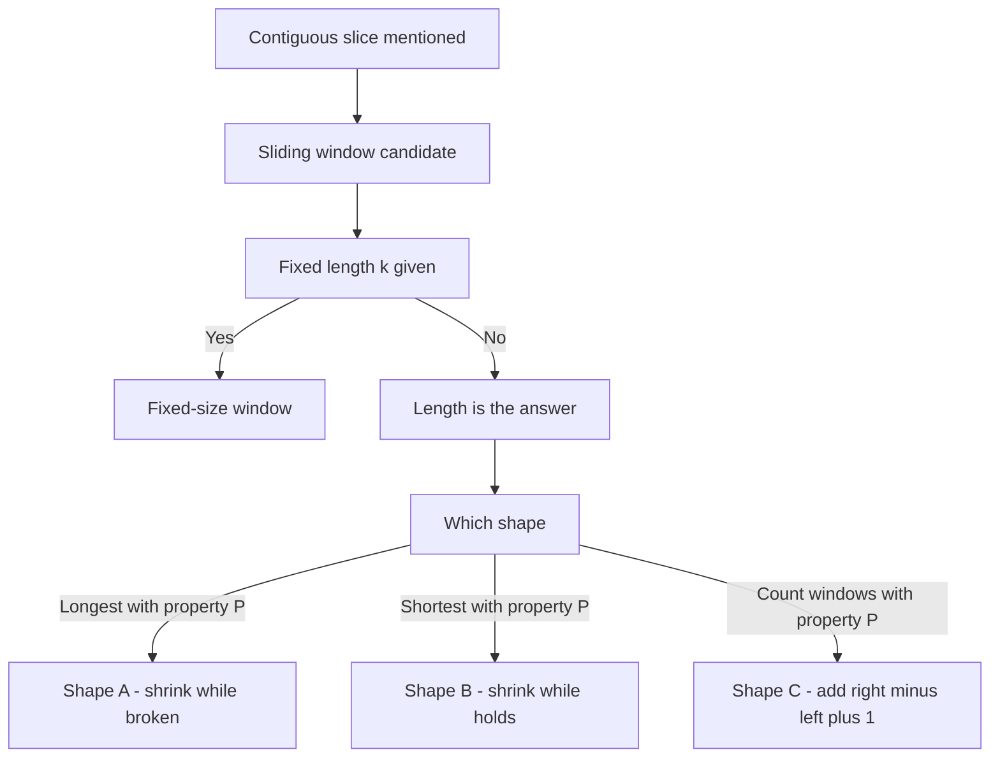

# Lecture 2 — The Shrinking and Growing Mechanics

> **Duration:** ~2 hours.
> **Outcome:** You can write the variable-size sliding-window loop without notes, decide *when to expand* and *when to shrink* from the prompt alone, and explain the difference between the "longest" shape and the "shortest" shape out loud.

Lecture 1 introduced the pattern and its two sub-shapes. This lecture goes deep on the variable-size case — because that's where 80% of the bugs live. The mechanics of *when to expand* and *when to shrink* are not interchangeable across problems; the shape flips depending on whether you want "longest" or "shortest." Picking the wrong shape produces code that runs but is silently incorrect — the worst kind of interview bug.

By the end of this lecture you should be able to look at a variable-size sliding-window problem and, before writing any code, say one of two things out loud: "expand `right` until invariant breaks, then shrink `left` to restore," or "expand `right` until property holds, then shrink `left` while property still holds, recording the answer inside the shrink."

---

## 1. Two indices that don't converge — the geometry

Visualize the indices on a number line:

```
0 ──────────────────────────────── n-1
^                                  ^
left                              right (eventually)

left ───→  ───→  ───→
              right ───→  ───→  ───→
```

Both start at `0`. `right` moves first; `left` follows. They never cross. They both move strictly forward. The window is the half-open or inclusive interval between them, depending on convention. In this course we use **inclusive on both ends**: `s[left..right]` is the window when `left <= right`, and an empty window when `left > right` (which we avoid in steady state).

Compare with two-pointer converging:

```
0 ──────────────────────────────── n-1
^                                  ^
left ───→                  ←─── right
```

Two-pointer converging has them moving *toward* each other; the algorithm ends when they meet. Sliding window has them moving *together*, in the same direction; the algorithm ends when `right` reaches `n-1`. Same number of pointers, opposite geometry.

This is the source of the most common conceptual mistake. *Both* patterns use "two pointers" — but the *direction of motion* is the distinguishing feature.

---

## 2. When to expand `right`

In every variable-size sliding window, `right` advances **exactly once per outer iteration**. The body of the outer `for right in range(n)` loop:

1. Read `nums[right]` or `s[right]`.
2. Update the auxiliary state to include the new element (`update_add`).
3. Decide whether to shrink, then potentially update the answer.

`right` is not conditional. It doesn't pause. It doesn't back up. It is a steady drumbeat from `0` to `n - 1`. That regularity is what gives sliding window its `O(n)` guarantee — the outer loop's iteration count is fixed.

The only thing that varies is what happens inside.

---

## 3. When to shrink `left`

`left` is where the mechanics differ. Three loop shapes cover the vast majority of variable-size sliding-window problems.

### Shape A: shrink while the invariant is *broken* (the "longest" shape)

```python
for right in range(n):
    update_add(state, nums[right])
    while invariant_broken(state):
        update_remove(state, nums[left])
        left += 1
    # Invariant holds. The window is the largest valid one ending at right.
    best = max(best, right - left + 1)
```

The invariant is something like:

- "At most `k` distinct values in the window."
- "No value appears twice in the window."
- "No value appears more than `m` times in the window."
- "The running total stays at or below a cap."

You expand `right`, possibly breaking the invariant. You shrink `left` until it holds again. *Then* you record the answer — the current window length, which by construction is the longest valid window ending at this `right`.

Problems in this week with this shape:

- **[The Longest Clean Run](../exercises/exercise-02-longest-clean-run.md)** (Exercise 2 — distinctness, returning a span)
- **[The Cold-Chain Load](../exercises/exercise-05-cold-chain-load.md)** (Exercise 5 — at most `k` distinct, `k` a parameter)

### Shape B: shrink while the property *still holds* (the "shortest" shape)

```python
for right in range(n):
    update_add(state, nums[right])
    while property_holds(state):
        # Record the answer *inside* the shrink loop.
        best = min(best, right - left + 1)
        update_remove(state, nums[left])
        left += 1
```

The property is something like:

- "The running total has reached the quota."
- "The window contains every item on the bill of materials."

You expand `right` until the property holds. Then you shrink `left` *while the property still holds*, recording the answer at each step, because shrinking may produce a smaller valid window. When the property breaks, you stop shrinking and let `right` resume.

Problems in this week with this shape:

- **[The Shortest Catchment](../exercises/exercise-04-shortest-catchment.md)** (Exercise 4 — a running total against a quota)
- **[The Shortest Kit Span](../challenges/challenge-01-shortest-kit-span.md)** (Challenge 1 — multiset containment)

The sign flip — shrink *while broken* vs. *while holding* — is the discriminator between longest and shortest. Get this wrong and the algorithm silently produces the right code for the wrong problem.

### Shape C: count of windows satisfying a property

For "**how many subarrays have property P**," neither shape A nor shape B directly applies. The trick: count, for each `right`, **how many valid windows end at that `right`**, then sum.

```python
for right in range(n):
    update_add(state, nums[right])
    while invariant_broken(state):
        update_remove(state, nums[left])
        left += 1
    # Number of valid windows ending at right is right - left + 1
    answer += right - left + 1
```

This works because, once the invariant holds at `right`, every window `[i..right]` for `i in [left..right]` is also valid — by **monotonicity of the invariant under shrinking**. Dropping elements from the left can only reduce the distinct count, or reduce the running total, or reduce the multiplicity of any value. So we count `right - left + 1` valid windows at this step and move on.

That monotonicity is a precondition, not a decoration. If the property were "*at least* `k` distinct values," shrinking could break it, the runs ending at `right` would not form a contiguous suffix of valid starts, and the `right - left + 1` shortcut would be wrong.

Problems in this week with this shape:

- **[The Tasting Flight Count](../mini-project/README.md)** (mini-project Problem 5 — count runs with at most `k` distinct styles)
- **[The Courier's Zone Count](../homework/README.md)** (homework Problem 2 — count runs with *exactly* `k` distinct zones)

For *exactly K*, use the trick from Lecture 1: **exactly K = at_most(K) − at_most(K − 1)**. Write `at_most` once, call it twice.

---

## 4. The four-piece anatomy of a sliding-window loop body

Every variable-size sliding window has the same four pieces inside its outer loop. The order matters; mixing it up produces bugs.

```python
for right in range(n):
    # 1. ADD: incorporate nums[right] into the window state.
    update_add(state, nums[right])

    # 2. SHRINK: while the loop condition holds, remove nums[left] and advance.
    while shrink_condition(state):
        update_remove(state, nums[left])
        left += 1

    # 3. RECORD: update the answer based on the current window.
    answer = combine(answer, current_window_value(left, right, state))
```

The interview-quality version states each step out loud during Assess options. "Add `nums[right]` to the window. Then shrink while the invariant is broken. Then record the window length."

When the answer is recorded **inside** the shrink loop (shape B, "shortest"), the four pieces re-order:

```python
for right in range(n):
    update_add(state, nums[right])
    while property_holds(state):
        # Record FIRST — the window is currently valid.
        answer = min(answer, right - left + 1)
        update_remove(state, nums[left])
        left += 1
```

The reorder is subtle. In shape A, the answer is recorded *once per outer iteration* (after the shrink). In shape B, the answer is recorded *every time `left` advances* (inside the shrink). Both are `O(n)` amortized — but the structure is different.



*Shape A records once after shrinking; shape B records repeatedly inside the shrink loop.*

---

## 5. Worked example A: the longest single-firing glaze run

A shape-A warm-up for Exercise 5.

**Problem.** A pottery studio logs the glaze applied to each piece as it is loaded into a kiln, in loading order. A single firing can carry at most `k` distinct glazes without cross-contamination. Given the log and `k`, return the length of the longest contiguous run of pieces that can go into one firing.

**FRAME compressed:**

- **F:** Restate. Contiguous run; the limit is on *distinct* glazes, not on piece count. Confirm `k >= 0`, and return 0 when the log is empty or `k == 0`. Walk an example: `glazes = ["ash", "ash", "iron", "ash", "cobalt", "iron"]` with `k = 2` gives `4` — the first four pieces, using only ash and iron.
- **R:** Variable-size sliding window, shape A. Auxiliary state: a frequency table over glaze names. The invariant is `len(table) <= k`.
- **A:** Outer loop on `right`. Add `glazes[right]` to the table. While `len(table) > k`: decrement the count of `glazes[left]`, delete the key if the count reaches 0, advance `left`. Then record `best = max(best, right - left + 1)`.
- **M:**

```python
def longest_single_firing(glazes: list[str], k: int) -> int:
    if k == 0 or not glazes:
        return 0
    counts: dict[str, int] = {}
    left = 0
    best = 0
    for right, glaze in enumerate(glazes):
        counts[glaze] = counts.get(glaze, 0) + 1
        while len(counts) > k:
            counts[glazes[left]] -= 1
            if counts[glazes[left]] == 0:
                del counts[glazes[left]]
            left += 1
        best = max(best, right - left + 1)
    return best
```

- **E (verify):** Trace `glazes = ["ash", "ash", "iron", "ash", "cobalt", "iron"]`, `k = 2`:
  - `r=0` ash: `{ash: 1}`, one distinct, window 0–0, `best = 1`.
  - `r=1` ash: `{ash: 2}`, one distinct, window 0–1, `best = 2`.
  - `r=2` iron: `{ash: 2, iron: 1}`, two distinct, window 0–2, `best = 3`.
  - `r=3` ash: `{ash: 3, iron: 1}`, two distinct, window 0–3, `best = 4`.
  - `r=4` cobalt: three distinct — shrink. Drop `glazes[0]` ash → count 2, still three, `left = 1`. Drop `glazes[1]` ash → count 1, still three, `left = 2`. Drop `glazes[2]` iron → count 0, **delete the key**, now two distinct, `left = 3`. Window 3–4, length 2. `best` stays 4.
  - `r=5` iron: `{ash: 1, cobalt: 1, iron: 1}` — three distinct, shrink. Drop `glazes[3]` ash → count 0, delete, now two distinct, `left = 4`. Window 4–5, length 2. `best` stays 4.
  - Return 4. ✓
- **E (cost):** **`O(n)` time** — amortized; each index moves forward at most `n` times across the whole run. **`O(k)` space** — the table holds at most `k + 1` entries, transiently, before the shrink restores the invariant. Tradeoff: the brute force that builds a fresh set for every start/end pair is `O(n³)`, and the smarter version that extends one set per start is `O(n²)`. The window reuses the shrink work. No improvement available.

This is the template for an entire family of problems. Internalize the shape — Exercise 5 is this template with a `(start, count)` contract and a tie-break bolted on, and the homework's "exactly K distinct" problem calls it twice.

---

## 6. Worked example B: the fewest shifts to hit a build target

A shape-B warm-up for Exercise 4, in a different factory.

**Problem.** A workshop logs how many finished units came off the bench in each shift, in shift order. A shift may produce nothing, but it can never produce a negative number of units. Given the log and a build target, return the **fewest consecutive shifts** whose combined output reaches the target. If the workshop never reaches the target over any run of shifts, return `0`.

**Why non-negativity matters:** the running total must be **monotone under shrinking** — dropping the leftmost shift can only lower the total, never raise it. That is what lets you stop shrinking the moment the total falls below the target and be certain no shorter qualifying run was skipped. If a shift could report a negative figure (a scrapped batch, say), shrinking from the left could *raise* the total, the guarantee dies, and sliding window is the wrong pattern — you would reach for prefix sums plus a hash map instead, the Week 2 Challenge shape.

**FRAME compressed:**

- **F:** Output figures are non-negative and may be zero. Return a *count of shifts*, not the output total and not a position. No qualifying run returns `0`. Walk: `output = [5, 1, 9, 2, 3, 4]`, `target = 12` → `3`. No single shift reaches 12 (the best is 9) and no pair does either (the best pair is `9 + 2 = 11`), so three is the floor; `5 + 1 + 9 = 15` reaches it.
- **R:** Variable-size sliding window, shape B (shortest). Auxiliary state: a single running total. The property maintained during the shrink is `running >= target`.
- **A:** Outer `for right`. Add `output[right]` to `running`. While `running >= target`: record `best = min(best, right - left + 1)`, subtract `output[left]`, advance `left`. After the outer loop, return `0` if `best` is still infinite, else `best`.
- **M:**

```python
def fewest_shifts_to_target(output: list[int], target: int) -> int:
    left = 0
    running = 0
    best = float("inf")
    for right, units in enumerate(output):
        running += units
        while running >= target:
            best = min(best, right - left + 1)
            running -= output[left]
            left += 1
    return 0 if best == float("inf") else best
```

- **E (verify):** Trace `output = [5, 1, 9, 2, 3, 4]`, `target = 12`:
  - `r=0` (5): `running = 5`. Below target, no shrink.
  - `r=1` (1): `running = 6`. Below target.
  - `r=2` (9): `running = 15` ≥ 12. Shrink: record length `2 - 0 + 1 = 3`, so `best = 3`; subtract `output[0] = 5` → `running = 10`, `left = 1`. Below target, exit.
  - `r=3` (2): `running = 12` ≥ 12. Shrink: record length `3 - 1 + 1 = 3`, `best` stays 3; subtract `output[1] = 1` → `running = 11`, `left = 2`. Below target, exit.
  - `r=4` (3): `running = 14` ≥ 12. Shrink: record length `4 - 2 + 1 = 3`, `best` stays 3; subtract `output[2] = 9` → `running = 5`, `left = 3`. Below target, exit.
  - `r=5` (4): `running = 9`. Below target.
  - Return 3. ✓
- **E (cost):** **`O(n)` time** — amortized; both indices move forward at most `n` times each across the whole run. **`O(1)` space** — one running total and two indices. Tradeoffs: checking every start/end pair is `O(n²)` time and `O(1)` space; prefix sums plus a binary search per start is `O(n log n)` time and `O(n)` space and, unlike the window, tolerates negative figures; the sliding window is `O(n)` time and `O(1)` space and is strictly best *given non-negativity*.

Exercise 4 is this template with a harder contract — it wants `(start, days)`, it breaks ties on the largest total, and it returns `None` rather than `0` when the quota is unreachable. Challenge 1 is the same shape again with a much richer invariant.

---

## 7. The frequency-invariant variant: covering a target multiset

The hardest sliding-window family uses an invariant like "**the window contains every item the order requires, with at least the required multiplicity**." Two problems this week live here: [Exercise 3 — The Rota Window](../exercises/exercise-03-rota-window.md), where the window is *fixed*-size and the invariant is table **equality**, and [Challenge 1 — The Shortest Kit Span](../challenges/challenge-01-shortest-kit-span.md), where the window is *variable*-size, shape B, and the invariant is table **containment**.

The naive move is to compare the window's whole frequency table against the target's on every step. That costs one probe per distinct required item — `O(catalogue)` per step — and, worse, it re-derives "is it covered?" from scratch every time instead of maintaining it.

The fix: maintain a single integer, `matched`, holding **how many distinct required items are currently satisfied in the window**. Let `distinct_wanted` be the number of distinct items the order needs. Then `matched == distinct_wanted` exactly when the window covers the order.

Here is the mechanism on its own, stripped down to return only a length, so the state updates are visible without the bookkeeping:

```python
from collections import Counter

def shortest_covering_length(supply: list[str], demand: list[str]) -> int:
    """Length of the shortest contiguous stretch of supply that contains every
    item in demand, counting duplicates. 0 if no stretch does."""
    if not demand:
        return 0
    wanted = Counter(demand)
    distinct_wanted = len(wanted)

    on_hand: dict[str, int] = {}
    matched = 0
    left = 0
    best = float("inf")

    for right, item in enumerate(supply):
        on_hand[item] = on_hand.get(item, 0) + 1
        if item in wanted and on_hand[item] == wanted[item]:
            matched += 1

        while matched == distinct_wanted:
            best = min(best, right - left + 1)
            dropped = supply[left]
            on_hand[dropped] -= 1
            if dropped in wanted and on_hand[dropped] < wanted[dropped]:
                matched -= 1
            left += 1

    return 0 if best == float("inf") else best
```

Two comparison operators carry the entire trick, and they are the two lines to stare at:

- Increment `matched` only when an item's window count becomes **exactly equal** to its requirement — `==`, never `>=`. A third bolt when the order wants one must not increment again.
- Decrement `matched` only when the count becomes **strictly less** than the requirement — `<`, never `<=`. Dropping from three bolts to two when the order wants one must not decrement.

Each required item's contribution to `matched` flips at most twice across the whole algorithm — once when its count first reaches the requirement, once when it later dips below. So `matched` costs `O(len(demand))` in total updates and every step of the loop is `O(1)`. The whole thing is `O(n + m)` amortized time, and `O(m + c)` space where `c` is the catalogue size.

**What this snippet is not.** It returns a bare length. Challenge 1 asks for `(start, length)`, defines a tie-break toward the larger start, distinguishes "empty order" from "impossible order," and expects you to justify the catalogue bound out loud. The mechanism above is the engine; the contract is the work. Read the challenge before you reach for this.

---

## 8. The bug census — what goes wrong in shrink loops

Across hundreds of learner solutions, these are the bugs that appear most often. Memorize them; they're the ones to scan for in Examine (verify).

- **Forgetting to update the answer in shape B.** Shape A records the answer *after* the shrink loop. Shape B records *inside* the shrink loop. Mixing them up means you either miss valid windows or count invalid ones.
- **Missing the inner-loop guard.** `while invariant_broken(state):` without an upper bound on `left` will run past the end of the array if the invariant can never be restored. Pair the condition with `and left <= right` for safety on weird inputs.
- **Not removing on `left` advance.** The shrink loop's body must call `update_remove(state, nums[left])` *before* `left += 1`. Otherwise the state still reflects the now-discarded element.
- **Order of operations in shape B.** Record-then-remove, not remove-then-record. If you remove first, the window you measured is no longer the one you're recording.
- **Recomputing the window value from scratch.** `len(set(s[left:right+1]))` looks innocent but is `O(n)` per call, which makes the whole algorithm `O(n²)`. Maintain the state incrementally.
- **Counter-as-state with negative counts.** `Counter` subtraction can leave keys with value 0 in the dict. `del` them when their count hits 0; otherwise `len(counts)` lies about distinct count.
- **Mixing up "at most" and "exactly."** "Exactly K distinct" is a different problem from "at most K distinct," and no single window computes it directly. Use the `at_most(K) − at_most(K − 1)` trick.
- **Forgetting the empty-input / k=0 case.** Most templates default to "return 0" on empty input or `k=0`. State it explicitly at the top of the function or in the loop precondition.

---

## 9. The shape decision flow, on a single page

Read the problem. Then, before writing code, run through this flow out loud:

```
1. Is this sliding window?
   - Contiguous slice mentioned? ─→ probably yes.
   - Negative numbers + "sum at most/least k"? ─→ NO; use prefix-sum + hash map.
   - Non-contiguous subsequence? ─→ NO; use DP.

2. Fixed or variable?
   - "Window of size k" or "every k-subarray"? ─→ fixed-size; Lecture 1 §4.
   - Length is the answer? ─→ variable-size; continue.

3. Variable — which shape?
   - "Longest with property P"? ─→ shape A: shrink while P broken.
   - "Shortest with property P"? ─→ shape B: shrink while P holds; record inside.
   - "Count windows with property P"? ─→ shape C: at each right, add (right - left + 1).

4. What's the auxiliary state?
   - Sum/count? ─→ single integer.
   - Distinctness? ─→ set or Counter.
   - Frequency match against a target? ─→ Counter + a matched-count integer.
   - Max/min over the window? ─→ monotonic deque (Week 9 territory).

5. What's the invariant, in one sentence?
   - State it out loud. If you can't, you don't yet understand the problem.
```



*Steps 1 through 3 of the decision flow: recognize the pattern, pick fixed or variable, then pick the shrink shape.*

By Sunday, this flow should be reflexive. Exercise 1 is fixed-size — easy warm-up. Drills 2 and 5 are shape A. Exercise 4 is shape B. Exercise 3 is fixed-size with a frequency invariant. Challenge 1 is the hardest combination: shape B, frequency invariant, matched count. Shape C appears nowhere in the drills on purpose — you meet it first in the [mini-project's Problem 5](../mini-project/README.md) and again in the [homework's exactly-K problem](../homework/README.md).

---

## 10. The full state-update playbook

For each auxiliary-state shape, here are the standard add/remove operations. Memorize them; you will use them every single time.

### Running sum

```python
def update_add(state, x):
    state["sum"] += x

def update_remove(state, x):
    state["sum"] -= x
```

### Frequency table (`Counter` or `defaultdict(int)`)

```python
def update_add(counts, x):
    counts[x] = counts.get(x, 0) + 1

def update_remove(counts, x):
    counts[x] -= 1
    if counts[x] == 0:
        del counts[x]              # critical for "distinct count" invariants
```

The `del` step is what most learners forget. Without it, `len(counts)` includes keys with count 0, and the at-most-K invariant becomes wrong.

### Set (distinctness)

```python
def update_add(seen, x):
    seen.add(x)

def update_remove(seen, x):
    seen.discard(x)                # or seen.remove(x) if you know it's there
```

For sets, you usually pair this with a "while x in seen: shrink" inner loop. The set has no duplicates by definition, so removal is unconditional once `left` reaches the duplicate.

### Frequency match against a target (the matched-count trick)

```python
# Setup
wanted = Counter(demand)
distinct_wanted = len(wanted)
matched = 0
on_hand: dict[str, int] = {}

# On add:
on_hand[item] = on_hand.get(item, 0) + 1
if item in wanted and on_hand[item] == wanted[item]:
    matched += 1

# On remove:
on_hand[dropped] -= 1
if dropped in wanted and on_hand[dropped] < wanted[dropped]:
    matched -= 1
```

The invariant: `matched == distinct_wanted` if and only if every required item is satisfied at its full multiplicity. Note the two operators — `==` on the add, `<` on the remove. Loosen either one and the count drifts. This is the precise tool for Challenge 1.

---

## 11. Self-check

Without notes, answer:

1. **What's the four-piece anatomy of a variable-size sliding-window loop?** (Add, shrink-condition, record — in either shape A's or shape B's order.)
2. **What's the difference between shape A and shape B?** (Shape A shrinks while invariant broken, records after; shape B shrinks while property holds, records inside.)
3. **Why is sliding window O(n) and not O(n²) despite the nested for/while?** (Amortized argument: each index advances at most n times in total across the whole algorithm.)
4. **What's the canonical bug in shape A's shrink loop?** (Forgetting to remove the element at `left` before advancing, leaving stale state.)
5. **Why does the sliding-window approach to "subarray sum at least K" require positive numbers?** (Shrinking from the left must monotonically decrease the sum; negatives break that monotonicity.)
6. **Trace the at-most-2-distinct window over the glaze log `["ash", "iron", "iron", "ash", "cobalt", "iron", "iron"]`.** (Longest valid run is indices 0–3, `ash iron iron ash`, length 4. Adding `cobalt` at index 4 forces the shrink; the run 4–6 that follows is only length 3. Answer: 4.)
7. **What's the auxiliary state for Challenge 1, The Shortest Kit Span?** (A `Counter` of the bill's frequencies, a `dict` of the window's frequencies, and two integers: how many distinct part codes the bill needs, and how many are currently matched.)

If you can answer all seven, proceed to the [exercises](../exercises/README.md). If you can't, re-read sections 3–7 before starting Exercise 1.

---

## Further reading

- **CP-Algorithms — Two Pointers Technique** (the article conflates two-pointer and sliding window in places — read critically): <https://cp-algorithms.com/two_pointers/two_pointers.html>
- **NeetCode's sliding-window playlist** (YouTube, free) — walks a canonical set of problems in vocabulary close to this lecture's.
- **Practice elsewhere.** The covering-multiset shape from §7 also appears as [LeetCode 76 · Minimum Window Substring](https://leetcode.com/problems/minimum-window-substring/) if you want a judge to run against, though the contract there differs from Challenge 1's. Solve the challenge first, from the pattern — reading someone else's write-up before you have derived it yourself is how a pattern fails to stick.

Next: the [exercises](../exercises/README.md). Five drills, in order. Recorder running.
