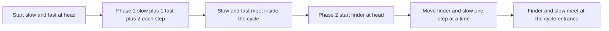
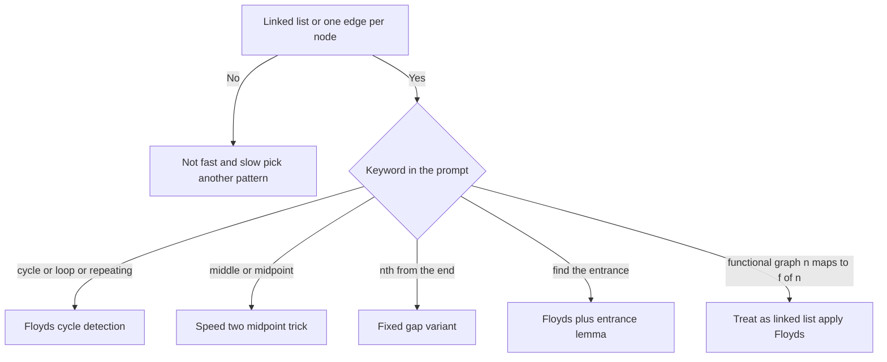

# Lecture 1 — Floyd's Tortoise and Hare

> **Duration:** ~2 hours.
> **Outcome:** You can recognize a fast/slow-pointer problem within 30 seconds, write Floyd's cycle detection without notes, derive the cycle-entrance algorithm out loud, and pick the right midpoint convention from the prompt.

Three weeks of patterns now. Two-pointer (Week 1) walked two indices toward each other, or in the same direction at the same speed. Sliding window (Week 3) walked two indices in the same direction, never backwards, defining a contiguous region. This week introduces the third "two-index" family: **fast and slow pointers** — two indices moving in the same direction *at different speeds*. The speed difference is the entire algorithmic idea.

By the end of this lecture you should be able to read a problem and, within 30 seconds, say one of three things out loud: "fast/slow on a linked list," "fast/slow on a functional graph (integer sequence)," or "not fast/slow — here's why."

---

## 1. What "fast/slow pointers" means

A **fast pointer** advances *more than one step per iteration* — almost always **two**. A **slow pointer** advances *one step per iteration*. Both start at the same place (usually the head of a linked list). Both move in the same direction. They never go backwards.

Visualization on a 7-node linked list, no cycle:

```
nodes:  A → B → C → D → E → F → G → None

step 0:  s=A, f=A
step 1:  s=B, f=C
step 2:  s=C, f=E
step 3:  s=D, f=G
step 4:  s=E, f=None      ← fast hit the end. No cycle.
```

Visualization on a 7-node linked list with a cycle starting at C:

```
nodes:  A → B → C → D → E → F → G
                ↑                ↓
                └────────────────┘

step 0:  s=A, f=A
step 1:  s=B, f=C
step 2:  s=C, f=E
step 3:  s=D, f=G
step 4:  s=E, f=D    ← fast wrapped around the cycle
step 5:  s=F, f=F    ← they meet inside the cycle. Cycle confirmed.
```

The pattern's power comes from one observation:

> **If a cycle exists, fast and slow will collide inside it within `O(n)` steps. If no cycle, fast will reach the end of the list within `O(n/2)` steps.**

The fast pointer "laps" the slow one inside any cycle. That's the entire algorithm. The proof is in section 4.

---

## 2. Why this is *not* two-pointer (and not sliding window)

You now know three two-index patterns. They look similar at the line level. The discriminators:

| | Two-pointer converging | Sliding window | Fast/slow pointers |
|--|--|--|--|
| **Where do they start?** | One at each end | Both at the start | Both at the start |
| **Direction of motion** | Toward each other | Same direction, lockstep | Same direction, different speed |
| **What they represent** | Endpoints of a range that shrinks | Both ends of a contiguous window | Two checkpoints in the same traversal |
| **Why use it** | Sorted-array pair search, palindrome check | Compute over every contiguous slice | Detect a cycle, find a midpoint, find nth-from-end |
| **Termination** | When indices cross | When right hits the end | When fast meets slow (cycle) or fast hits None (no cycle) |
| **Underlying structure** | Array, string | Array, string | Linked list, functional graph (sometimes array) |

Quick test. Read these prompts. Two-pointer, sliding window, or fast/slow?

1. "A parcel sorter's chutes each forward to one other chute. Does a parcel ever circulate forever?" → **Fast/slow.** Two checkpoints, different speeds, same traversal.
2. "Find the longest stretch of a badge-scan log in which no employee appears twice." → **Sliding window.** Already drilled in Week 3.
3. "A price list is sorted ascending. Find two prices that sum to a budget." → **Two-pointer converging.** Indices move toward each other.
4. "Find the middle segment of a live stream you can only follow forward, in one pass." → **Fast/slow.** Speed-2 hare lands on a middle when it reaches the end.
5. "A flash controller picks its next erase block by applying a fixed formula to the current one. Which blocks does it end up cycling through?" → **Fast/slow on a functional graph.** Not obviously a chain of objects, but the same algorithm applies.

When in doubt, ask: *"are there two indices in the same direction moving at different speeds?"* If yes, fast/slow. If no, it's one of the other two patterns.

---

## 3. The minimal Floyd's algorithm — cycle detection

```python
class ListNode:
    def __init__(self, val=0, nxt=None):
        self.val = val
        self.next = nxt

def has_cycle(head: ListNode | None) -> bool:
    slow = head
    fast = head
    while fast is not None and fast.next is not None:
        slow = slow.next
        fast = fast.next.next
        if slow is fast:
            return True
    return False
```

Six lines. Memorize the shape.

Four observations:

1. **The loop guard is `fast and fast.next`.** Both must be non-None *before* you advance fast two steps. Forgetting `fast.next` is the #1 bug — it crashes on null-tail lists.
2. **Advance, *then* compare.** If you compare before advancing, the loop body never gets to assert "cycle found" because slow and fast both start at `head`.
3. **Identity, not equality.** Use `slow is fast` (Python `is`), not `slow == fast`. Two distinct nodes might have the same `val` but they are not the same node. Identity comparison is correct.
4. **No auxiliary data structure.** No `set` of visited nodes. This is the algorithm's claim to fame — `O(1)` space. The naive cycle detection (hash-set of visited) is `O(n)` space; Floyd's is `O(1)`.

### Time and space

- **Time: O(n).** If no cycle, fast reaches None in at most `n/2` outer iterations. If a cycle exists of length `C` with a tail of length `T`, slow takes at most `T + C` steps to enter and traverse the cycle once; fast catches up within `C` of those. Total bounded by `n`.
- **Space: O(1).** Two pointers, no sets, no dicts. The interview tell.

Say the space defense out loud every time:

> "**O(1) space** because Floyd's uses only two pointers — no auxiliary set or dict. The alternative — `seen = set()`, walk once — works but is O(n) space. The whole point of Floyd's is to trade an obvious O(n)-space algorithm for an O(1)-space one with the same time complexity."

That is the sentence interviewers grade. Memorize the cadence.

---

## 4. The `2k = k + nC` cycle-entrance lemma

Detection is easy. Finding the **first node of the cycle** (the "entrance") is the part that looks like dark magic but is, in fact, a four-line proof.

### Setup

Let:

- `T` = length of the non-cycle prefix (number of nodes before the cycle begins).
- `C` = length of the cycle.
- `k` = number of steps slow took when it first meets fast inside the cycle.

When they meet:

- Slow has taken `k` steps total.
- Fast has taken `2k` steps total (twice the speed).
- Both are at the same node.

So the *difference* `2k - k = k` is some whole number of laps around the cycle:

```
k = nC   for some integer n ≥ 1
```

Now: slow has walked `k` steps. The first `T` of those got it to the cycle entrance. The remaining `k - T` steps walked it *into* the cycle. So slow is currently `k - T` steps past the cycle entrance — which is the same as `(k mod C) - T` if we think modulo `C`. And since `k = nC`, `k mod C = 0`, so slow is `-T mod C = C - T` steps past the entrance, equivalently `T` steps *before* the entrance (going around the cycle).

The clean way to state this:

> **If you start a third pointer at `head` and walk it at speed 1, while simultaneously walking slow at speed 1 from the meeting point, they will meet at the cycle entrance after exactly `T` steps.**

Because:
- The third pointer walks `T` steps from `head` and lands at the cycle entrance.
- Slow walks `T` steps from the meeting point. The meeting point is `k - T` past the entrance, so slow is now `(k - T) + T = k = nC` past the entrance — which is exactly the entrance (since `nC` is a whole number of laps).


*Two-phase Floyd's: detect the meeting point, then walk a fresh pointer from head to find where the cycle begins.*

### The code

```python
def detect_cycle(head: ListNode | None) -> ListNode | None:
    slow = head
    fast = head

    # Phase 1: detection
    while fast is not None and fast.next is not None:
        slow = slow.next
        fast = fast.next.next
        if slow is fast:
            break
    else:
        return None  # No cycle; loop ended via guard.
    # If we exited via break, slow and fast are at the meeting point.
    if fast is None or fast.next is None:
        return None  # Belt and suspenders.

    # Phase 2: find the entrance.
    finder = head
    while finder is not slow:
        finder = finder.next
        slow = slow.next
    return finder
```

Two notes on the Python:

- The `while/else` form: the `else` runs *only* if the loop ended via guard (no `break`). It's idiomatic Python; learn to read it.
- The "belt and suspenders" recheck after the break is defensive; in correct code with `break` it's redundant, but it costs nothing and protects against future edits.

The full algorithm is two `while` loops, both `O(n)`. Total time still `O(n)`, space still `O(1)`.

### Why this is in the lecture, not just the drill

If a mock hands you a "where does the loop start" problem, the interview tell is not whether you can code it — most candidates can fake their way through with the algorithm half-memorized. The tell is whether you can **explain the lemma in three sentences**. Out loud. While drawing on a whiteboard. Practice the explanation now.

[Exercise 2 — The Escalation Loop](../exercises/exercise-02-escalation-loop.md) is this, with one addition: it also asks for the *distance* from the start to the entrance. That number is free — phase 2 is already walking, so you only have to count — but asking for it is what separates understanding the lemma from having memorized the two-loop shape.

---

## 5. The midpoint micro-pattern

Find the middle node of a linked list in **one pass**. Naive: count nodes (`O(n)`), then walk to `n/2` (`O(n)`). Fast/slow: walk both pointers, slow lands on the middle exactly when fast reaches the end.

```python
def middle_node(head: ListNode | None) -> ListNode | None:
    slow = head
    fast = head
    while fast is not None and fast.next is not None:
        slow = slow.next
        fast = fast.next.next
    return slow
```

The convention question: for an **even-length** chain, which middle do we want? Two options, and they differ by exactly one node.

Take a four-node chain `A → B → C → D`.

- **Upper middle** is `C`. This is what the loop above returns — when fast runs out, slow has landed one past the halfway line. The guard is `while fast and fast.next`.
- **Lower middle** is `B`. To get it, shift the guard one position forward so it looks *ahead* of fast instead of at it:

```python
def middle_node_lower(head: ListNode | None) -> ListNode | None:
    if head is None:
        return None
    slow = head
    fast = head
    while fast.next is not None and fast.next.next is not None:
        slow = slow.next
        fast = fast.next.next
    return slow
```

Note the second guard dereferences `fast.next` on its very first evaluation, so the empty case has to be handled *before* the loop. The upper-middle guard does not have that problem — which is precisely why copying its structure while intending the lower middle breaks silently on an empty input.

That one-position guard shift is the entire difference between the two conventions, and naming it out loud is the difference between having the pattern and having memorized one loop. [Exercise 3 — The Mid-Roll Break](../exercises/exercise-03-midroll-break.md) specifies the **lower** middle, which is the less commonly published of the two, and it does that on purpose: if you carry the upper-middle loop over from memory, every even-length case fails.

When a prompt says "find the middle," **ask which one they want** before writing code. That is a U-step move and it is graded, even when the spec already answers it.

For odd-length chains both conventions return the same node, so the ambiguity only matters when the count is even. That is also why an odd-length trace can never catch this bug — trace both parities.

---

## 6. Fast/slow on a functional graph

Some fast/slow problems have no linked list in them at all. They live on *functional graphs* — graphs where every node has exactly one outgoing edge, defined by a function rather than stored in a field. Walk from any node and you must eventually either land on a fixed point or enter a cycle. There is no third option and no "runs off the end," because the state space is finite and nothing branches.

Here is the shape, with a successor function chosen so the arithmetic is easy to check by hand. Let the state be an integer in `[0, m)` and let

```
step(s) = (s * s + 1) % m
```

Every state has exactly one successor, so this is a functional graph on `m` states. Walk it from any seed and the picture is always the same: a **tail** of states visited once, then a **rotation** that repeats forever. Drawn for `m = 12` starting at `0`:

```
0 → 1 → 2 → 5 ⤾
        ↑______|      tail = 0, 1   (length 2)
                      rotation = 2, 5   (length 2)
```

Verify that by hand right now — `0² + 1 = 1`, `1² + 1 = 2`, `2² + 1 = 5`, `5² + 1 = 26`, and `26 % 12 = 2`, which we have already seen. Two states discarded, two states cycling.

Every technique from this lecture transfers to that picture without modification:

- Phase 1 (§3) finds a meeting point somewhere inside the rotation.
- Phase 2 (§4) converts the meeting point into the rotation's entrance, counting the tail on the way.
- A third walk measures the rotation, by stepping once around it from the entrance.

```python
def step(s: int, m: int) -> int:
    return (s * s + 1) % m

def walk_shape(seed: int, m: int) -> tuple[int, int]:
    """Return (tail_length, rotation_length) for the walk from `seed`."""
    slow = fast = seed
    while True:                      # No guard: the walk cannot end.
        slow = step(slow, m)
        fast = step(step(fast, m), m)
        if slow == fast:
            break

    finder, tail = seed, 0
    while finder != slow:
        finder = step(finder, m)
        slow = step(slow, m)
        tail += 1

    walker, rotation = step(finder, m), 1
    while walker != finder:
        walker = step(walker, m)
        rotation += 1

    return tail, rotation
```

Three things in that code are worth saying out loud, because each is a place candidates go wrong.

1. **Phase 1 has no loop guard.** That is not an oversight; it is a consequence of the finite state space. Writing a `return None` branch for "no cycle" produces unreachable code, and interviewers notice unreachable code.
2. **The comparison is `==`, not `is`.** These are integers, not objects. CPython interns small integers, so `is` appears to work below 256 and then silently stops matching — a bug that passes on a toy `m` and fails on a real one. This is the exact inverse of the rule in §3, where the nodes were objects and `is` was correct. Know which world you are in.
3. **The rotation walk takes its first step before comparing.** `walker` starts at `step(finder)`, not at `finder`, with the counter already at 1. Initialize it the other way and a fixed point — a rotation of length one, where a state is its own successor — reports a rotation of zero.

The structure is identical to the chain-of-objects version. The "node" is an integer, the "next pointer" is the function, and the "cycle" is a repeated value. The discriminator is one outgoing edge per state, and nothing else.

This is the recognition skill we are drilling: *seeing* the chain in a problem that mentions no chain. [Exercise 4 — The Wear-Level Rotation](../exercises/exercise-04-wear-level-rotation.md) puts this successor function inside a flash controller and asks for the tail and rotation as the deliverable. [Homework Problem 1](../homework/README.md) changes the successor function to "look up the next index in a table" and asks a yes/no question about the resulting shape. Same pattern, twice, both times invisible from the prompt.

---

## 7. The canonical recognition signals (the 30-second match)

Stop. Read the prompt slowly. Ask these in order:

1. **Is there a chain you can only step forward through, one step at a time?** If yes, fast/slow is a strong candidate.
2. **Does the prompt mention "cycle," "loop," "circulates," "forever," or "repeating"?** Strong signal for cycle detection.
3. **Does the prompt mention "middle," "midpoint," "halfway"?** Strong signal for the speed-2 midpoint trick — and immediately ask which middle.
4. **Does the prompt count backwards from the end without giving you a length?** Strong signal for the fixed-gap variant (homework Problem 2).
5. **Is the next value a function of the current one?** A formula, or a table lookup like `i → table[i]`. That is a functional graph; fast/slow applies, and nothing in the prompt will say so.
6. **Is the answer a position, a node, a count, or a yes/no about repetition?** Fast/slow's outputs are almost always one of those four.

A note on 5, because it is the one people miss. The tell is not a word in the prompt — it is a *structural* property you have to notice: exactly one successor per state, no branching. A table of indices has it. A recurrence has it. A general graph does not.

The 30-second decision tree:

```
linked list (or sequence with one outgoing edge per "node")?
├── No  ──→ not fast/slow. Pattern is two-pointer, sliding window, hash map, etc.
└── Yes
    ├── "cycle / loop / infinite / repeating"?         ──→ Floyd's cycle detection
    ├── "middle / midpoint / halfway"?                  ──→ Speed-2 midpoint trick
    ├── "nth from end" (no length given)?               ──→ Fixed-gap variant
    ├── "find the cycle entrance / start"?              ──→ Floyd's + 2k=k+nC lemma
    └── functional graph (n → f(n))?                   ──→ Treat as linked list; apply Floyd's
```


*The 30-second recognition tree: structure check first, then keyword match to pick the exact variant.*

This decision tree is what we want in muscle memory by Sunday.

---

## 8. When fast/slow doesn't fit

Equally important: knowing when to *reject* the pattern.

- **Arrays where you need random access.** Fast/slow makes sense on a *linked* structure where you can only step from one node to the next. If you can index into an array, you don't need fast/slow — use direct indexing.
- **Multiple cycles to find / classify.** Floyd's detects *one* cycle reachable from `head`. If a problem asks you to enumerate all cycles in a graph with multiple components, that's DFS or union-find (Weeks 7 and beyond).
- **Cycle in a *general* directed graph.** Fast/slow needs each node to have *exactly one* outgoing edge (a functional graph). General directed cycle detection is DFS-with-colors (Week 7).
- **The output is the *length* of the cycle.** This one does *not* reject the pattern — it extends it. Once slow and fast have met, the meeting point is guaranteed to be inside the cycle, so walking from there until you return, counting, measures it. The recognition move is to spot the cycle first and treat the measurement as a separate phase. Exercise 1 asks for exactly this, and the trap is a counting loop that never takes its first step.

Recognizing the *negative space* of the pattern matters as much as the positive recognition.

---

## 9. Worked example end-to-end: where does the loop start?

Full FRAME, abbreviated. [Exercise 2 — The Escalation Loop](../exercises/exercise-02-escalation-loop.md) is this problem with the on-call rota wrapped around it and one extra thing asked for; work the generic version here first so the drill is about the domain, not about the algorithm.

**The problem, as the interviewer would say it:** you are given the first link in a chain where every link points to exactly one other link or to nothing. If following the chain loops forever, return the first link that gets visited twice — the loop's entrance — and how many steps separate the start from it. If the chain ends, return `None`.

**[F — 2 minutes]**

> "So each link has exactly one outgoing pointer. I return the *entrance* — the first link inside the loop — not the last link before it, and not the point where my pointers happen to meet. Two things I want to pin down. First, if the starting link is itself inside the loop, the step count is zero, and I expect that to fall out of the algorithm rather than needing a branch. Second, a chain that ends returns `None` outright, not a pair with `None` in it. Let me walk one: links `A → B → C → D → E`, with `E` pointing back to `C`. The loop is `C → D → E → C`, the entrance is `C`, and `C` is two steps from `A`. Answer: `(C, 2)`."

**[R — 30 seconds]**

> "Fast/slow pointers. One outgoing edge per link plus 'where does it start repeating' is the canonical Floyd's-with-entrance application. Phase 1 detects by walking slow at one and fast at two until they collide inside the loop. Phase 2 restarts a finder at the head and walks it alongside slow at speed 1; by the `2k = k + nC` lemma they collide on the entrance, and the number of steps that takes *is* the distance I have to report. Auxiliary state is three pointers and a counter — O(1) space, which is the whole reason I am not keeping a visited set."

**[A — 2 minutes]**

> "Phase 1: slow = fast = head. Loop while `fast` and `fast.next`: advance slow by 1, fast by 2; if they meet, break. If the loop ends via the guard instead, there is no loop — return `None` before touching phase 2.
> Phase 2: finder = head, steps = 0. While `finder is not slow`: advance both by 1 and increment. Return `(finder, steps)`.
> Edge cases: empty chain — the guard's first test is `fast is not None`, which fails, so the loop never runs. A single link pointing at nothing — same, one test later. A single link pointing at itself — phase 1 meets on iteration one, phase 2's first comparison is already true, and the count is 0. No branch needed for any of them."

**[M — 3 minutes]**

```python
def find_loop_entrance(head: ListNode | None) -> tuple[ListNode, int] | None:
    slow = head
    fast = head
    while fast is not None and fast.next is not None:
        slow = slow.next
        fast = fast.next.next
        if slow is fast:
            break
    else:
        return None            # Ended via the guard: no loop.

    finder = head
    steps = 0
    while finder is not slow:
        finder = finder.next
        slow = slow.next
        steps += 1
    return finder, steps
```

**[E · verify — 2 minutes]**

> "Trace `A → B → C → D → E → (C)`. Here the tail `T` is 2 and the loop length `C` is 3.
> Phase 1 start: slow=A, fast=A.
> Iter 1: slow=B, fast=C. Not the same.
> Iter 2: slow=C, fast=E. Not the same.
> Iter 3: slow=D, fast=D — fast went `E → C → D`. They meet at **D**.
> Note that D is *not* the entrance. That is the whole reason phase 2 exists; if I returned the meeting point I would be one link off on this input.
> Phase 2: finder=A, slow=D, steps=0. Step: finder=B, slow=E, steps=1. Step: finder=C, slow=C — slow went `E → C`. They meet at **C**, steps=2. Return `(C, 2)`. ✓
> Now the degenerate one: a single link `A` pointing at itself. Phase 1 iteration 1 sets slow=A and fast=A, they match, break. Phase 2: finder is already slow, so the while never runs and steps is 0. Return `(A, 0)`. ✓ No special case fired, which is what I predicted in Assess options."

**[E · cost — 1 minute]**

> "**Time O(n)** — phase 1 runs at most `T + C` iterations, phase 2 exactly `T`, and both are bounded by the number of links. **Space O(1)** — three pointers and an integer; no set, no dict. Tradeoff: walking with a `seen` set is the same O(n) time and hands me the step count for free as the insertion index, so it is genuinely *easier* to write — it loses only on space. I would ship the set on a server and Floyd's on a device with a memory budget. **Best, average and worst are all O(n)**; no input shape changes the asymptotics."

That is FRAME on a textbook fast/slow problem, end to end, in about ten minutes. Two details in that transcript are the graded ones and are easy to skip: predicting in Assess options that the degenerate case needs no branch and then *checking* it in Examine (verify), and naming what the rejected approach is better at. Do both every single time.

---

## 10. Two common bug patterns

After watching ~50 candidates solve this family in mock interviews, two bugs come up repeatedly. Build them into your Examine (verify) checklist.

### Bug 1: forgetting the `fast.next` guard

```python
while fast is not None:        # WRONG — no fast.next guard
    slow = slow.next
    fast = fast.next.next      # crashes if fast.next is None
```

The fix:

```python
while fast is not None and fast.next is not None:
    ...
```

You need both `fast` *and* `fast.next` non-None before advancing fast two steps. The `and` short-circuits — if `fast` is None, we don't evaluate `fast.next`.

### Bug 2: using `==` instead of `is`

```python
if slow == fast:    # WRONG if nodes have a custom __eq__
    return True
```

`ListNode` in most interview prompts doesn't override `__eq__`, so `==` falls through to identity. But if it *did* override `__eq__` to compare by value, you'd get false positives — two distinct nodes with the same `val` would be reported as "the cycle." Identity comparison (`is`) is unambiguous.

Get in the habit. `is` for nodes, `==` for values.

---

## 11. Self-check

Without notes, answer:

**1.** What's a fast pointer?

<details>
<summary>Answer</summary>

One that advances more than one node per step — almost always exactly two.

</details>

**2.** What's the loop guard for Floyd's?

<details>
<summary>Answer</summary>

`while fast is not None and fast.next is not None`.

</details>

**3.** State the `2k = k + nC` lemma.

<details>
<summary>Answer</summary>

When slow and fast first meet, slow has walked `k` steps and fast `2k`. The difference `k` is some whole number of cycle laps. Starting a third pointer at head and walking both at speed 1 will land both at the cycle entrance after `T` more steps.

</details>

**4.** Why is Floyd's preferred over the hash-set approach?

<details>
<summary>Answer</summary>

Same `O(n)` time, but `O(1)` space instead of `O(n)`. The space efficiency is the interview tell.

</details>

**5.** What does the midpoint loop return for a chain of length 4?

<details>
<summary>Answer</summary>

The third node — the "upper middle." For the lower middle, shift the guard one position forward to `fast.next and fast.next.next`, and handle the empty case before the loop because that guard dereferences.

</details>

**6.** Why does fast/slow apply to a rule like `s → (s² + 1) % m`?

<details>
<summary>Answer</summary>

Because it gives every state exactly one successor, which is a functional graph. Floyd's works on any functional graph, and the state being an integer rather than an object changes only the comparison operator: `==`, not `is`.

</details>

**7.** When you have found a cycle, how do you measure it?

<details>
<summary>Answer</summary>

Walk from the meeting point — which is guaranteed to be inside the cycle — until you return to it, counting. Take the first step *before* the first comparison, or a self-loop reports zero.

</details>

If you can answer all seven without hesitation, proceed to [Lecture 2 — The Mock Interview Protocol](./02-the-mock-interview-protocol.md).

---

## Further reading

- **Wikipedia — Cycle detection**: <https://en.wikipedia.org/wiki/Cycle_detection> — the formal treatment. Read Floyd's section; skim Brent's, which is faster in practice and almost never asked for.
- **Wikipedia — Functional graph**: <https://en.wikipedia.org/wiki/Functional_graph> — one short article. The "tail plus rotation" shape from §6 is the whole content, stated formally.
Next: [Lecture 2 — The Mock Interview Protocol](./02-the-mock-interview-protocol.md).
