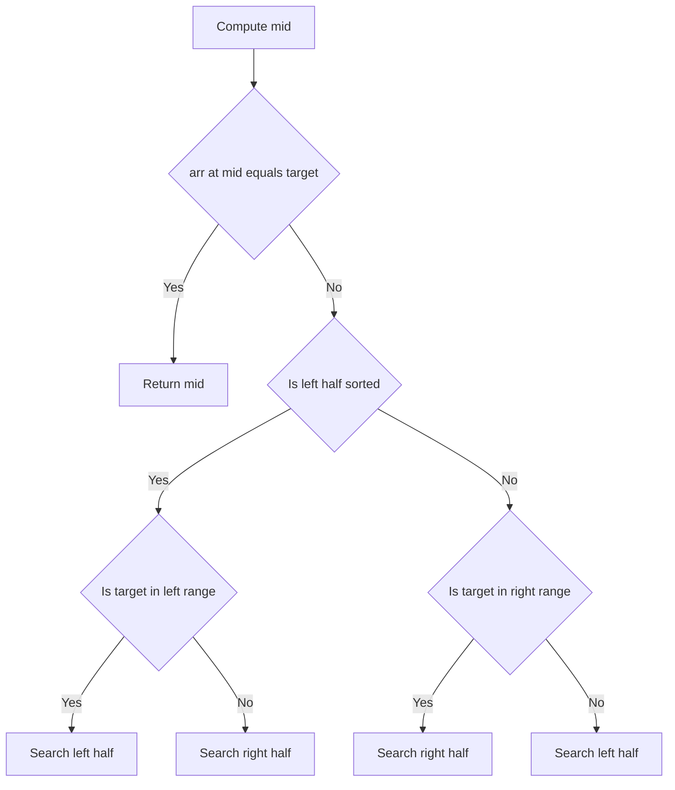
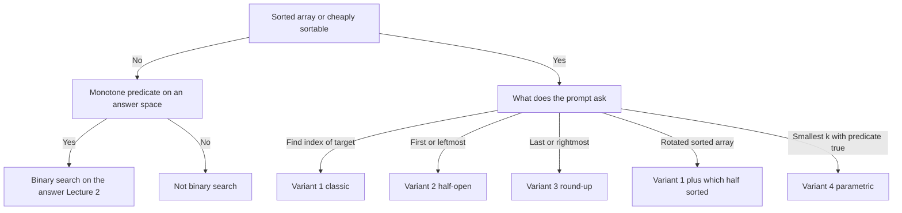

# Lecture 1 — The Binary-Search Template

> **Duration:** ~2 hours.
> **Outcome:** You can write the canonical `lo <= hi` loop from memory, pick the correct shrink rule for each of the four variants (find any / find first / find last / find boundary), defend your boundary convention out loud, and handle the rotated-sorted-array case without re-deriving the algorithm.

Four weeks of Phase 1 trained you on linear-time patterns — two-pointer, sliding window, fast/slow. This lecture introduces the first *logarithmic*-time pattern of the course. The geometry is different: instead of walking across the array linearly, you bisect it. The trade is also different: you give up the simplicity of "one pointer, one direction" for the asymptotic win of `O(log n)`, and you pay for the speed with *boundary discipline*. Every binary-search bug in interview history is a boundary bug.

By the end of this lecture you should be able to read a sorted-array problem and, within 30 seconds, say one of four things out loud: "classic binary search — find any," "binary search lower bound — find first," "binary search upper bound — find last," or "boundary search — find smallest `k` such that ...". The fifth thing — "this is not binary search, here is why" — is just as important and is graded in the quiz.

---

## 1. What binary search means

A **binary search** is an algorithm that, given a *sorted* sequence and a target property, halves the search space at each iteration until the target is located. The classical setting is "find a target value in a sorted array," but the *idea* generalizes: anywhere you can answer "is the answer to the left or to the right?" in `O(1)` based on a midpoint test, binary search applies.

Visualization on a 7-element sorted array, target = 13:

```
indices:  0    1    2    3    4    5    6
values: [ 1,   3,   7,  10,  13,  17,  21]

step 0:  lo=0, hi=6, mid=3  ─→ arr[3] = 10, 10 < 13, search right half
step 1:  lo=4, hi=6, mid=5  ─→ arr[5] = 17, 17 > 13, search left half
step 2:  lo=4, hi=4, mid=4  ─→ arr[4] = 13, found, return 4
```

Three iterations on a 7-element array. With `n = 1_000_000`, twenty iterations. With `n = 1_000_000_000`, thirty. The asymptotic complexity is `O(log₂ n)`. The base of the logarithm is fixed because the search space halves at each step.

The pattern's power comes from one observation:

> **At every iteration, you eliminate half of the remaining search space. If the search space has size `n`, the number of iterations is bounded by `⌈log₂ n⌉`.**

That is the entire algorithm. The hard part is writing the loop without an off-by-one error.

---

## 2. The canonical template — closed interval

```python
def binary_search(arr: list[int], target: int) -> int:
    """Return the index of target in arr, or -1 if not present. O(log n) time, O(1) space."""
    lo, hi = 0, len(arr) - 1
    while lo <= hi:
        mid = lo + (hi - lo) // 2
        if arr[mid] == target:
            return mid
        elif arr[mid] < target:
            lo = mid + 1
        else:
            hi = mid - 1
    return -1
```

Nine lines. Memorize the shape.

Five observations:

1. **Initialization: `lo = 0`, `hi = len(arr) - 1`.** Both endpoints are *valid indices*. The interval `[lo, hi]` is *closed* on both sides — every integer in it is a real index into `arr`. This is the **closed-interval convention**.
2. **Loop guard: `while lo <= hi`.** The `<=` pairs with the closed interval. When `lo == hi`, the interval contains exactly one element; we must test it. When `lo > hi`, the interval is empty and we exit.
3. **Mid formula: `mid = lo + (hi - lo) // 2`.** Equivalent to `(lo + hi) // 2` in Python (arbitrary-precision integers), but the form above is *overflow-safe* in C / Java / Rust. **Always write it this way.** The habit transfers.
4. **Shrink rules:**
   - `arr[mid] < target` → the answer (if it exists) is strictly right of mid → `lo = mid + 1`. We exclude mid because we just tested it.
   - `arr[mid] > target` → the answer is strictly left of mid → `hi = mid - 1`. Same reasoning.
   - `arr[mid] == target` → return mid.
   The `+ 1` and `- 1` are not optional. They are the reason the loop terminates — every iteration shrinks the interval by at least one element.
5. **Post-loop: `return -1`.** If the loop exits via the `lo <= hi` guard, the target is not in the array.

### Time and space

- **Time: O(log n).** Each iteration halves the search space; the loop body is `O(1)`.
- **Space: O(1).** Three integers (`lo`, `hi`, `mid`). No recursion stack.

Say the time defense out loud every time:

> "**O(log n) time** because each iteration halves the search interval — starting from `n` and dividing by two on each step gives `log₂(n)` iterations. **O(1) space** — three pointers, no recursion. The trade against linear search is the requirement that the array be *sorted*; if the input is unsorted, sorting first costs `O(n log n)`, which dominates and makes the optimization useless for a single query. Binary search is the right tool when the array is already sorted or when many queries amortize the sort cost."

That is the sentence interviewers grade. Memorize the cadence.

---

## 3. The closed vs half-open templates

Two boundary conventions exist for binary search. Both are correct; they shrink the space differently. Pick one and *defend it*.

### Convention A — closed interval `[lo, hi]`

```python
lo, hi = 0, len(arr) - 1
while lo <= hi:
    mid = lo + (hi - lo) // 2
    if arr[mid] < target:
        lo = mid + 1
    else:
        hi = mid - 1
```

- Initial `hi = len(arr) - 1`.
- Loop guard `lo <= hi`.
- Shrink with `mid + 1` and `mid - 1`.
- Terminates when `lo > hi`.
- Post-loop, `lo` is the lower-bound index (the leftmost position satisfying the predicate).

### Convention B — half-open interval `[lo, hi)`

```python
lo, hi = 0, len(arr)
while lo < hi:
    mid = lo + (hi - lo) // 2
    if arr[mid] < target:
        lo = mid + 1
    else:
        hi = mid
```

- Initial `hi = len(arr)` (one *past* the last valid index).
- Loop guard `lo < hi`.
- Shrink with `mid + 1` on the left and `mid` (not `mid - 1`) on the right.
- Terminates when `lo == hi`.
- Post-loop, `lo` (= `hi`) is the lower-bound index.

The half-open convention is what Python's `bisect_left` and C++'s `std::lower_bound` use internally. The closed convention is what most introductory textbooks use.

**This course uses the closed convention** for the "find any target" variant and the half-open convention for the "find boundary / first true" variant. The reason: the closed convention's post-loop assertion ("if found, returned inside the loop") is the cleanest fit for the classic search, and the half-open convention's post-loop assertion (`lo == hi == first true position`) is the cleanest fit for boundary search.

Pick a convention per *variant*, not per problem. Stick to those two conventions and you will write fewer bugs.

---

## 4. Off-by-one diagnostics — the four bug patterns

Off-by-one in binary search has four canonical shapes. Recognize them when you debug.

### Bug 1 — infinite loop

```python
lo, hi = 0, len(arr) - 1
while lo <= hi:
    mid = (lo + hi) // 2
    if arr[mid] < target:
        lo = mid       # WRONG — should be mid + 1
    else:
        hi = mid - 1
```

When `lo == hi == mid`, if `arr[mid] < target`, we set `lo = mid`, which is unchanged. The loop spins forever. The fix is `lo = mid + 1` — we already tested `mid`, so it is correct to exclude it.

**Rule of thumb:** in the closed convention, both shrink rules must *exclude* `mid`. Use `mid + 1` and `mid - 1`. Anything else loops forever.

### Bug 2 — overshoot

```python
lo, hi = 0, len(arr)         # WRONG — should be len(arr) - 1 with closed convention
while lo <= hi:
    mid = lo + (hi - lo) // 2
    if arr[mid] < target:    # crashes when mid == len(arr)
        lo = mid + 1
    else:
        hi = mid - 1
```

Initializing `hi = len(arr)` with the closed convention puts an invalid index into the interval. On the first iteration, `mid` could be `len(arr) - 1` (safe) — but if the input is the empty array, the loop runs once with `mid = 0` and crashes on `arr[mid]`. The mismatch between the initialization and the guard is the bug.

**Rule of thumb:** the initialization must match the guard. Closed `[lo, hi]` ↔ `hi = len(arr) - 1` ↔ `lo <= hi`. Half-open `[lo, hi)` ↔ `hi = len(arr)` ↔ `lo < hi`.

### Bug 3 — missed last element

```python
lo, hi = 0, len(arr) - 1
while lo < hi:               # WRONG — closed convention needs <=
    mid = lo + (hi - lo) // 2
    if arr[mid] == target:
        return mid
    elif arr[mid] < target:
        lo = mid + 1
    else:
        hi = mid - 1
return -1
```

When `lo == hi`, the interval still contains one element — but the `<` guard exits without testing it. If the target *is* that element, we incorrectly return `-1`.

**Rule of thumb:** use `<=` with the closed convention, `<` with the half-open convention. Match them.

### Bug 4 — wrong mid for "find last"

When searching for the *last* occurrence (upper-bound family), the mid formula must round *up*, not down:

```python
mid = lo + (hi - lo + 1) // 2   # round-up version, for the upper-bound family
```

Otherwise the loop hangs at `lo == hi - 1`. This is the most subtle bug in binary search. We will work it out in section 7 (find first / last with duplicates).

---

## 5. The four variants — a decision table

Most binary-search problems fit one of four shapes. Recognize the shape; pick the template.

| # | Variant | Problem shape | Convention | Mid formula | Shrink (less) | Shrink (greater-equal) | Return |
|---|---------|---------------|-----------|-------------|---------------|------------------------|--------|
| 1 | **Find any** | Is target in arr? | Closed `[lo, hi]` | `(hi - lo) // 2` | `lo = mid + 1` | `hi = mid - 1` | mid (in loop) or -1 |
| 2 | **Find first** (lower bound) | Leftmost i where arr[i] >= target | Half-open `[lo, hi)` | `(hi - lo) // 2` | `lo = mid + 1` | `hi = mid` | `lo` |
| 3 | **Find last** (upper bound) | Rightmost i where arr[i] <= target | Closed `[lo, hi]` | `(hi - lo + 1) // 2` | `lo = mid` | `hi = mid - 1` | `lo` |
| 4 | **Find boundary** (predicate) | Smallest k where feasible(k) is True | Half-open `[lo, hi)` | `(hi - lo) // 2` | `lo = mid + 1` | `hi = mid` | `lo` |

Variants 2 and 4 use the same template. Variant 4 is the parametric-search version — covered in Lecture 2.

Memorize the table. In a mock interview, when you read "find first / leftmost / smallest k," your hand should write variant 2 without thinking.

---

## 6. The "find first" template — lower bound

Find the leftmost index `i` such that `arr[i] >= target`. If no such index exists, return `len(arr)`.

```python
def lower_bound(arr: list[int], target: int) -> int:
    """Return the leftmost index i such that arr[i] >= target, or len(arr) if none."""
    lo, hi = 0, len(arr)
    while lo < hi:
        mid = lo + (hi - lo) // 2
        if arr[mid] < target:
            lo = mid + 1
        else:
            hi = mid
    return lo
```

Six lines. The half-open convention.

The invariant: at every step, **the answer is in `[lo, hi)`**. That is, every index `< lo` has `arr[i] < target`, and every index `>= hi` either does not exist or has `arr[i] >= target`.

When `lo == hi`, the interval is empty, and `lo` is the first position where the predicate (`arr[i] >= target`) flips from False to True. That is the lower bound, by definition.

### Worked trace on `arr = [1, 3, 3, 5, 8]`, target = 3

```
step 0:  lo=0, hi=5, mid=2, arr[2]=3, not < 3, hi=2
step 1:  lo=0, hi=2, mid=1, arr[1]=3, not < 3, hi=1
step 2:  lo=0, hi=1, mid=0, arr[0]=1, < 3, lo=1
step 3:  lo=1, hi=1, loop exits
return 1
```

The leftmost index with value `>= 3` is index 1. Correct.

### Trade with `bisect_left`

Python's `bisect.bisect_left(arr, target)` does exactly this. In an interview you may use it *if asked* — but the interview standard is to **write the loop yourself**. The library call gets a half-point; the hand-written loop gets full marks.

---

## 7. The "find last" template — upper bound

Find the rightmost index `i` such that `arr[i] <= target`. If no such index exists, return `-1`.

```python
def upper_bound_inclusive(arr: list[int], target: int) -> int:
    """Return the rightmost index i such that arr[i] <= target, or -1 if none."""
    lo, hi = -1, len(arr) - 1
    while lo < hi:
        mid = lo + (hi - lo + 1) // 2     # round up
        if arr[mid] <= target:
            lo = mid
        else:
            hi = mid - 1
    return lo
```

Seven lines. Note four differences from lower bound:

1. **`lo = -1`.** The "no valid answer" sentinel — interpreted as "before the array begins."
2. **`hi = len(arr) - 1`.** Closed-on-the-right convention.
3. **`mid` rounds *up*.** `lo + (hi - lo + 1) // 2`. Without the `+ 1`, the loop hangs at `lo == hi - 1`.
4. **Shrink `lo = mid` (not `mid + 1`).** We want to *keep* mid as a candidate; we just established `arr[mid] <= target`.

The round-up `mid` formula is non-obvious. Here is why it is necessary.

Suppose `lo = 3, hi = 4`. The standard mid `lo + (hi - lo) // 2 = 3 + 0 = 3`. If `arr[3] <= target`, we set `lo = 3` — unchanged. Infinite loop.

With the round-up mid: `lo + (hi - lo + 1) // 2 = 3 + 1 = 4`. If `arr[4] <= target`, we set `lo = 4`, and the loop exits. If `arr[4] > target`, we set `hi = 3`, and the loop exits.

The round-up `mid` is the price you pay for `lo = mid` (keeping mid as a candidate). The lower-bound variant has the dual problem with `hi = mid` and uses round-down.

**Mnemonic:** if you write `lo = mid` (keeping mid on the left), round up. If you write `hi = mid` (keeping mid on the right), round down. Anything else loops.

---

## 8. Find first and last of a value — both at once

Given a sorted array with possible duplicates, return `[first_index, last_index]` of `target`, or `[-1, -1]` if absent.

```python
def find_first_and_last(arr: list[int], target: int) -> list[int]:
    """Return [first, last] indices of target in arr, or [-1, -1] if absent."""
    if not arr:
        return [-1, -1]
    # find first
    lo, hi = 0, len(arr)
    while lo < hi:
        mid = lo + (hi - lo) // 2
        if arr[mid] < target:
            lo = mid + 1
        else:
            hi = mid
    first = lo
    if first == len(arr) or arr[first] != target:
        return [-1, -1]
    # find last
    lo, hi = 0, len(arr)
    while lo < hi:
        mid = lo + (hi - lo) // 2
        if arr[mid] <= target:
            lo = mid + 1
        else:
            hi = mid
    last = lo - 1
    return [first, last]
```

The trick is to use **two lower-bound searches**: one for `arr[i] >= target` (gives `first`), one for `arr[i] > target` (gives one past `last`). The half-open convention pairs cleanly with both.

This is Drill 2.

---

## 9. Rotated sorted array — the "which half is sorted?" trick

A rotated sorted array is a sorted array that has been cyclically shifted, e.g., `[4, 5, 6, 7, 0, 1, 2]`. It contains exactly one "pivot" where the order breaks.

At any step of binary search on a rotated array, **at least one of the two halves `[lo, mid]` and `[mid, hi]` is fully sorted** (un-rotated). Identify which half is sorted, then check whether the target lies in that half. If yes, recurse into the sorted half; if no, recurse into the other half.


*Each step picks the sorted half, then decides whether the target lies inside it.*

```python
def search_rotated(arr: list[int], target: int) -> int:
    """Search for target in a rotated sorted array. Returns index, or -1 if absent."""
    lo, hi = 0, len(arr) - 1
    while lo <= hi:
        mid = lo + (hi - lo) // 2
        if arr[mid] == target:
            return mid
        if arr[lo] <= arr[mid]:
            # left half [lo, mid] is sorted
            if arr[lo] <= target < arr[mid]:
                hi = mid - 1
            else:
                lo = mid + 1
        else:
            # right half [mid, hi] is sorted
            if arr[mid] < target <= arr[hi]:
                lo = mid + 1
            else:
                hi = mid - 1
    return -1
```

Twelve lines. The decision is `arr[lo] <= arr[mid]` — if the left endpoint is `<=` the middle, the left half is sorted; otherwise the right half is.

The `<=` (not `<`) handles the edge case where `lo == mid` (single-element interval on the left). The standard mistake is using strict `<` and breaking when the left half has length 1.

This is Drill 3. The pattern transfers to "find minimum in a rotated array" and "search in a rotated array with duplicates" (homework).

### Worked trace on `arr = [4, 5, 6, 7, 0, 1, 2]`, target = 0

```
step 0:  lo=0, hi=6, mid=3, arr[3]=7, != 0
         arr[0]=4 <= arr[3]=7, so [0, 3] is sorted
         is 0 in [4, 7)? No → lo = 4
step 1:  lo=4, hi=6, mid=5, arr[5]=1, != 0
         arr[4]=0 <= arr[5]=1, so [4, 5] is sorted
         is 0 in [0, 1)? Yes → hi = 4
step 2:  lo=4, hi=4, mid=4, arr[4]=0, == 0 → return 4
```

Three iterations. The shape is identical to classic binary search; the only added complexity is the "which half is sorted?" branch.

---

## 10. When binary search does not apply

Equally important: knowing when to *reject* the pattern.

- **Unsorted array, single query, no monotonicity.** If the array is unsorted and you have one lookup to make, sort + binary search is `O(n log n)`. Linear scan is `O(n)`. Linear wins for a single query. The trade flips for `>= log n` queries.
- **No monotone predicate.** Binary search needs a way to decide "left or right" at each midpoint. Without monotonicity (in values *or* in a predicate), the algorithm has no comparator and does not work.
- **Continuous parameter, discrete answer.** Bisection on a real interval works, but with care about epsilon and termination. Out of scope for Phase 2; revisit in Phase 3.
- **Hash-map territory.** "Is this key present?" with no order requirement is `O(1)` with a hash. Binary search is `O(log n)`. Hash wins unless you also need order-related queries (range, predecessor, successor).
- **Linked structures.** Binary search needs random access. A linked list has no `O(1)` `mid` access; you would walk the list linearly to find the middle, which destroys the asymptotic win.

Recognizing the *negative space* of the pattern matters as much as the positive recognition. Quiz Q4, Q8, and Q10 are negative-space questions.

---

## 11. Worked example end-to-end: classic binary search

We will work this in full UMPIRE, abbreviated. Drill 1 is this exact problem.

**[U — 1 minute]**

> "I am given a sorted array of integers and a target. Return the index of the target if present, or `-1` if absent. The array is sorted ascending. Confirm: no duplicates required for this problem (we will handle duplicates in Drill 2). Confirm: I cannot modify the array. Walk an example: `arr = [1, 3, 7, 10, 13, 17, 21]`, target = 13. Answer: index 4."

**[M — 20 seconds]**

> "Classic binary search — variant 1, 'find any.' The 30-second memo: *Linear sorted array, single target, log-n required by the structure. Auxiliary state: three integer pointers. Why not linear scan: works, but `O(n)` instead of `O(log n)` — interviewers reject the suboptimal answer when the structure permits the optimization. Why not hash map: hash maps don't preserve order; on a sorted array, binary search is the canonical fit.*"

**[P — 1 minute]**

> "Closed-interval convention. Initialize `lo = 0`, `hi = len(arr) - 1`. Loop while `lo <= hi`. Compute `mid = lo + (hi - lo) // 2` (overflow-safe habit). If `arr[mid] == target`, return mid. If `arr[mid] < target`, search right: `lo = mid + 1`. If `arr[mid] > target`, search left: `hi = mid - 1`. If the loop exits, return `-1`."

**[I — 2 minutes]**

```python
def binary_search(arr: list[int], target: int) -> int:
    lo, hi = 0, len(arr) - 1
    while lo <= hi:
        mid = lo + (hi - lo) // 2
        if arr[mid] == target:
            return mid
        elif arr[mid] < target:
            lo = mid + 1
        else:
            hi = mid - 1
    return -1
```

**[R — 1 minute]**

> "Trace on `[1, 3, 7, 10, 13, 17, 21]`, target = 13.
> Step 0: lo=0, hi=6, mid=3, arr[3]=10, 10 < 13, lo=4.
> Step 1: lo=4, hi=6, mid=5, arr[5]=17, 17 > 13, hi=4.
> Step 2: lo=4, hi=4, mid=4, arr[4]=13, found, return 4. ✓
> Trace on target = 4. lo=0, hi=6, mid=3, arr[3]=10, 10 > 4, hi=2. lo=0, hi=2, mid=1, arr[1]=3, 3 < 4, lo=2. lo=2, hi=2, mid=2, arr[2]=7, 7 > 4, hi=1. lo=2, hi=1, loop exits, return -1. ✓"

**[E — 1 minute]**

> "**Time O(log n)** — each iteration halves the search interval; the loop runs `⌈log₂ n⌉` times in the worst case. **Space O(1)** — three integer pointers. Tradeoff: linear scan is `O(n)`/`O(1)`; binary search trades the same space for `O(log n)` time, *if* the array is sorted. If not, sorting first is `O(n log n)`, which dominates. Improvement: none asymptotically; could micro-optimize by avoiding the `==` branch (return after the loop with `arr[lo]` check) but the savings are negligible. Best case `O(1)` (target at the first midpoint); worst case `O(log n)`; average `O(log n)`."

That is UMPIRE on classic binary search, end-to-end, in about 6 minutes. The drill is to do this every time, even when the algorithm feels trivial.

---

## 12. Two common bug patterns

After watching candidates write binary search in mocks, two bugs come up repeatedly. Build them into your Review checklist.

### Bug 1 — `mid = mid` infinite loop (variant 3)

```python
lo, hi = 0, len(arr) - 1
while lo < hi:
    mid = lo + (hi - lo) // 2     # WRONG for variant 3 — round-down on round-up variant
    if predicate(mid):
        lo = mid
    else:
        hi = mid - 1
```

When `lo == hi - 1`, mid = `lo + 0 = lo`. If the predicate is True, `lo = mid = lo` — unchanged. Infinite loop. Fix: round up. `mid = lo + (hi - lo + 1) // 2`.

**Rule:** if your shrink rule is `lo = mid`, round up. If `hi = mid`, round down. Match them.

### Bug 2 — wrong convention for the variant

```python
# Wanted: find first occurrence of target
lo, hi = 0, len(arr) - 1     # WRONG — should be 0, len(arr) with half-open
while lo <= hi:
    mid = lo + (hi - lo) // 2
    if arr[mid] < target:
        lo = mid + 1
    else:
        hi = mid - 1           # WRONG — should be hi = mid
return lo                       # ambiguous — could be one past last
```

Mixing the closed convention's guard (`<=`) with the half-open shrink (`hi = mid`) produces a loop that either misses the answer or overruns. The fix is to use one *complete* convention per variant. Lower bound: half-open. Upper bound: closed with round-up. No mixing.

Get in the habit: write the convention name at the top of your variable initializer comment. `# half-open [lo, hi)` or `# closed [lo, hi]`. Three seconds; saves five minutes of debug.

---

## 13. Self-check

Without notes, answer:

1. **What is the canonical loop guard for the closed-interval template?** (`while lo <= hi`.)
2. **What is the mid formula and why is it written that way?** (`mid = lo + (hi - lo) // 2`. Equivalent to `(lo + hi) // 2` in Python but overflow-safe in C / Java / Rust; habit transfers.)
3. **Why do you write `hi = mid - 1` in the closed convention but `hi = mid` in the half-open?** (Closed: every index in `[lo, hi]` is a candidate; we just tested `mid`, so we exclude it. Half-open: every index in `[lo, hi)` is a candidate; `hi` is exclusive, so writing `hi = mid` keeps the contract.)
4. **For the upper-bound variant (find last), why does `mid` round up?** (To avoid `mid = lo` when `lo == hi - 1`, which combined with `lo = mid` produces an infinite loop. Rounding up forces progress.)
5. **In a rotated sorted array, what is the discriminator at each midpoint?** (`arr[lo] <= arr[mid]` — if True, the left half is sorted; if False, the right half is.)
6. **What is the time and space complexity, with defense sentence?** (`O(log n)` time because each iteration halves the search space; `O(1)` space — three pointers, no recursion. Defense: linear scan is `O(n)`/`O(1)`; binary search trades the same space for `O(log n)` time *if* the array is sorted.)

If you can answer all six without hesitation, proceed to [Lecture 2 — Binary Search on the Answer](./02-binary-search-on-the-answer.md).

---

## 14. The 30-second recognition signals

Stop. Read the prompt slowly. Ask these in order:

1. **Is the input a sorted array, or can it be sorted cheaply?** If yes, binary search is a strong candidate for any "find" query.
2. **Does the prompt mention "find the index of," "is target present," "first / last occurrence of"?** Strong signal for variants 1, 2, 3 respectively.
3. **Is the prompt a rotated-sorted-array problem?** Almost always: variant 1 with the "which half sorted?" branch.
4. **Does the prompt say "logarithmic time" or "O(log n) required"?** That is the interview-tell signal — binary search is one of two `O(log n)` patterns at this level (the other is balanced-tree-backed `bisect`).
5. **Does the prompt ask "find the smallest `k` such that …" or "minimize the maximum X" or "maximize the minimum Y"?** That is the *parametric* signal — covered in Lecture 2.
6. **Is there a monotone predicate hiding in the problem?** Even when no array is given, if you can write a `feasible(k)` boolean that is monotone, parametric search applies.

The 30-second decision tree:

```
sorted array (or cheaply sortable)?
├── No  ──→ is there a monotone predicate on an answer space?
│              ├── Yes ──→ binary search on the answer (Lecture 2)
│              └── No  ──→ not binary search; pick another pattern
└── Yes
    ├── "is target present / find index of"?       ──→ variant 1 (classic)
    ├── "first / leftmost / lower bound"?           ──→ variant 2 (half-open)
    ├── "last / rightmost / upper bound"?           ──→ variant 3 (round-up)
    ├── "rotated sorted array"?                     ──→ variant 1 + "which half sorted?"
    └── "smallest k such that predicate is True"?   ──→ variant 4 (parametric on indices)
```


*Reading the prompt routes you to one of the four variants, or off the binary-search path entirely.*

This decision tree is what we want in muscle memory by Sunday.

---

## 15. The boundary-defense sentence

In Mock #2 (Week 9), you will get a binary-search problem. The interview tell is not whether you can write the loop — most candidates can fake it. The tell is whether you can **defend your boundary convention in one sentence, on demand**.

> "I picked the **closed-interval** convention `[lo, hi]` with `lo <= hi` because the search space is closed on both sides — every integer in the interval is a real candidate. The shrink rules `lo = mid + 1` and `hi = mid - 1` both exclude `mid` (which we just tested), so the loop strictly progresses and terminates when `lo > hi`. I could have used the half-open `[lo, hi)` with `lo < hi` — it works too — but I find the closed convention's invariant easier to state out loud."

That is the cadence interviewers want. Memorize the shape, plug in the names. The cadence carries across all four variants.

---

## Further reading

- **Wikipedia — Binary search algorithm**: <https://en.wikipedia.org/wiki/Binary_search_algorithm> — the formal treatment. Read the Variations section.
- **Joshua Bloch — "Nearly all binary searches are broken"**: <https://research.google/blog/extra-extra-read-all-about-it-nearly-all-binary-searches-and-mergesorts-are-broken/> — five minutes; permanent takeaway.
- **LeetCode 33, 34, 35, 704, 81** — the five problems that cover the classic family. Drills 1, 2, 3 use three of them; the others are in the homework.

Next: [Lecture 2 — Binary Search on the Answer](./02-binary-search-on-the-answer.md).
