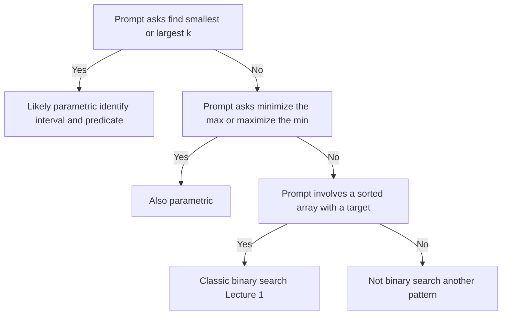

# Lecture 2 — Binary Search on the Answer

> **Duration:** ~2 hours.
> **Outcome:** You can recognize a parametric-search problem in 60 seconds, write the monotone predicate `feasible(k)` on demand, pick the search interval `[lo, hi]` defensibly, run the binary search to the boundary, and defend the total complexity (`O((n) log M)` where `M` is the answer-space width).

Lecture 1 covered binary search on a *sorted array* — variants 1, 2, 3. This lecture covers variant 4: binary search on the **answer space**, also called **parametric search**. The technique is the highest-yield interview skill of the week. It is what separates "I know binary search" from "I know what binary search is *for*."

The shift in framing: in Lecture 1, you searched for an index *into an array*. Here, you search for a *value*. The "array" is the interval of possible answers, often `[1, 10⁹]` or `[min(arr), max(arr)]`. The "comparator" is a monotone boolean predicate `feasible(k)`. The mechanic is identical — bisect, halve, return the boundary — but the *recognition* is what most candidates miss.

By the end of this lecture you should be able to read an optimization problem and, within 60 seconds, write down on paper: (a) the answer interval `[lo, hi]`, (b) the monotone predicate `feasible(k)`, and (c) the post-loop assertion. Then the implementation is mechanical.

---

## 1. The reframe: "find the smallest k such that …"

Every parametric-search problem can be rewritten in one canonical shape:

> **Find the smallest integer `k` in `[lo, hi]` such that `feasible(k)` is True.**

(Or its mirror: "find the largest `k` such that `feasible(k)` is True." Both are the same problem with the predicate inverted.)

Three of this week's problems look completely different on the surface and compile to the same shape:

- **The Paving Reach** ([Exercise 5](../exercises/exercise-05-paving-reach.md)). Find the smallest nightly reach `w` such that the crew repaves every section within the night budget. Predicate: `feasible(w) = (sum(ceil(section / w) for section in sections) <= nights)`. Search interval: `[1, max(sections)]`.
- **The Quote Rank** ([Exercise 4](../exercises/exercise-04-quote-rank.md)). Find the smallest price `v` such that at least `k` of the rate card's pairwise quotes cost no more than `v`. Predicate: `feasible(v) = (count_at_most(v) >= k)`. Search interval: `[cheapest possible quote, dearest possible quote]`.
- **The Kiln Firing Schedule** ([Homework Problem 1](../homework/README.md)). Find the smallest kiln volume `c` such that the rail clears within the firing budget. Predicate: `feasible(c) = (firings_needed(c) <= firings)`. Search interval: `[smallest legal volume holding the biggest piece, smallest legal volume holding the whole rail]`.

Notice how little the domains have in common — a road crew, a freight broker, a pottery studio — and how identical the three lines are once written down. That is the recognition skill this lecture installs. In all three, the structure is the same:

```python
def parametric_search(lo: int, hi: int, feasible) -> int:
    while lo < hi:
        mid = lo + (hi - lo) // 2
        if feasible(mid):
            hi = mid
        else:
            lo = mid + 1
    return lo
```

Six lines. Identical to the lower-bound template from Lecture 1. The work is *not* in the binary search; it is in writing `feasible` correctly.

---

## 2. The two preconditions for parametric search

Parametric search applies if and only if **both** of the following hold:

1. **The answer space is integer-bounded.** You can name `lo` and `hi` such that the answer is guaranteed to lie in `[lo, hi]`. (Continuous answer spaces work too with bisection but require epsilon handling — out of scope this week.)
2. **The predicate `feasible(k)` is monotone in `k`.** That is, `feasible(k) = True ⇒ feasible(k+1) = True`. The boolean flips from False to True exactly once over `[lo, hi]`, and never flips back.

If either fails, parametric search does not apply.

Monotonicity is the deeper of the two. The interview test is: *given a candidate answer `k`, would a slightly larger `k` make the answer "more feasible"?* If yes, the predicate is monotone; binary search applies. If no — if making `k` larger could *un-satisfy* the constraints — the predicate is not monotone and the technique fails.

Examples of monotone predicates:

- "Can the crew finish at nightly reach `w` within the budget?" — yes: a longer reach never increases the nights any one section needs. Monotone.
- "Can the rail clear within the budget at kiln volume `c`?" — yes: a bigger kiln never requires more firings. Monotone.
- "Are at least `k` quotes priced at or below `v`?" — yes: raising the ceiling never removes a quote that already fit. Monotone.

Example of a **non-monotone** predicate (so binary search on the answer does not apply):

- "Is there an interval of length exactly `k` with sum exactly `S`?" — increasing `k` could make True become False (the sums change). Not monotone. Use sliding window or DP.

The monotonicity check is the Research-constraints skill. In Mock #2 in Week 9, when you read a parametric prompt, **state the monotonicity claim out loud** before you write the predicate:

> "The predicate `feasible(k)` is monotone because a larger `k` never makes the constraints harder to satisfy — specifically, [one-line reason]. Therefore binary search on the answer applies."

That sentence is what the interviewer wants to hear. It is also what most candidates skip.

---

## 3. The three-step recipe

Given a parametric-search problem, the recipe is:


*The three-step recipe: bound the answer, define the predicate, then binary-search the boundary.*

### Step 1 — Identify the answer space `[lo, hi]`

The answer is an integer in some bounded range. Find that range.

- For "find the smallest rate / capacity / size," `lo` is the smallest *possibly valid* answer (often 1, or `max(input)`, or `0`).
- `hi` is an upper bound — frequently the *trivially valid* answer (the largest input, the sum of inputs, the worst case).

Bounds matter. Too-wide bounds make the search slower (more iterations); too-narrow bounds make the search incorrect (miss the answer). When in doubt, **wider is safer than tighter** — `O(log)` is cheap.

### Step 2 — Write `feasible(k)`

Write a boolean function `feasible(k)` that returns True if `k` satisfies the problem's constraints. This is usually *not* a binary search; it is a linear pass, a counting argument, or a small simulation.

The cost of `feasible(k)` dominates the total complexity. If `feasible` is `O(n)`, the total is `O(n log M)` where `M` is the answer-space width. If `feasible` is `O(n²)`, the total is `O(n² log M)`. Be explicit about this in the Examine (cost) section.

### Step 3 — Run the binary search to the boundary

Use the lower-bound template (variant 2 from Lecture 1). The post-loop value of `lo` is the smallest `k` such that `feasible(k)` is True — the answer.

```python
def parametric_search(lo: int, hi: int, feasible) -> int:
    while lo < hi:
        mid = lo + (hi - lo) // 2
        if feasible(mid):
            hi = mid
        else:
            lo = mid + 1
    return lo
```

The hi bound is *inclusive* in the sense that `feasible(hi)` is guaranteed True at the start — that is the invariant the loop preserves. If you pick `hi` such that `feasible(hi)` is False, the algorithm will return `hi + 1` (wrong) or run off the end.

---

## 4. Worked example: The Paving Reach

This is the cleanest parametric shape in the course and it is [Exercise 5](../exercises/exercise-05-paving-reach.md) of this week. Memorize the structure.

### Problem

A highway crew repaves a road cut into numbered sections; `sections[i]` is the length of section `i` in metres. The paving train works one night at a time and, by contract with the town, may only work on **one section per night**: it lays as much of that section as its nightly reach allows, then shuts down. A section longer than the reach takes several nights. The crew has `nights` nights before the road must reopen. Find the smallest whole-metre nightly reach that finishes the job in time.

### The reframe

> "Find the smallest `w` in `[1, max(sections)]` such that `sum(ceil(s / w) for s in sections) <= nights`."

### Step 1 — Bounds

- `lo = 1`. A reach of zero never advances the work, so one metre is the smallest meaningful answer.
- `hi = max(sections)`. At that reach every section finishes in exactly one night, so the total is `len(sections)` — the **smallest total achievable at any reach**. That last clause is the important one, and it is a better teaching case than the usual textbook bound because `feasible(hi)` is **not** guaranteed here. If `len(sections) > nights`, no reach on earth works and the answer is `None`. Checking `feasible(hi)` before the loop is not ceremony in this problem; it is the branch that produces the `None`.

### Step 2 — `feasible(w)`

```python
def feasible(w: int) -> bool:
    total = 0
    for s in sections:
        total += (s + w - 1) // w     # integer ceiling of s / w
        if total > nights:
            return False
    return True
```

`(s + w - 1) // w` is the integer ceiling idiom. A 30-metre section at reach 21 takes `⌈30/21⌉ = 2` nights. Use it rather than `math.ceil(s / w)`: at section lengths near `10**9` the float division is not exact and the ceiling can come out one too low — a bug that passes your small tests and fails in production.

The predicate is `O(n)` where `n = len(sections)`, with an early exit. Monotonicity: increasing `w` never increases `⌈s/w⌉` for any single section, so the sum is non-increasing in `w`, so `total <= nights` flips from False to True at most once. Monotone.

### Step 3 — Binary search

The full solution, guards included:

```python
def min_nightly_reach(sections: list[int], nights: int) -> int | None:
    if not sections:
        return 0                     # nothing to pave, no train needed
    if len(sections) > nights:
        return None                  # feasible(hi) is False: unsatisfiable

    def feasible(w: int) -> bool:
        total = 0
        for s in sections:
            total += (s + w - 1) // w
            if total > nights:
                return False
        return True

    lo, hi = 1, max(sections)        # half-open in spirit: hi is known feasible
    while lo < hi:
        mid = lo + (hi - lo) // 2
        if feasible(mid):
            hi = mid
        else:
            lo = mid + 1
    return lo
```

Eighteen lines, and the first four are the contract rather than the algorithm. That ratio is normal for parametric problems and it is why the Frame step matters so much here.

### Trace

`sections = [30, 12, 21, 5, 18]`, `nights = 6`. Five sections, six nights, so the guard passes. `lo = 1, hi = 30`.

```
mid = 15  →  2 + 1 + 2 + 1 + 2 = 8  > 6   False  →  lo = 16
mid = 23  →  2 + 1 + 1 + 1 + 1 = 6 <= 6   True   →  hi = 23
mid = 19  →  2 + 1 + 2 + 1 + 1 = 7  > 6   False  →  lo = 20
mid = 21  →  2 + 1 + 1 + 1 + 1 = 6 <= 6   True   →  hi = 21
mid = 20  →  2 + 1 + 2 + 1 + 1 = 7  > 6   False  →  lo = 21
lo == hi == 21  →  return 21
```

Five predicate calls to search a thirty-wide interval. The brute force would have made twenty-one.

### Complexity

- **Time: O(n log M)** where `n = len(sections)` and `M = max(sections)`. The search runs `⌈log₂ M⌉` iterations — about 30 at the top of the constraint range — and each calls an `O(n)` predicate.
- **Space: O(1)** — three integers in the search, one accumulator in the predicate.

Defense:

> "**O(n log M)** because we binary-search the answer interval `[1, max(sections)]` — `log₂(max(sections))` iterations — and each iteration calls `feasible(w)`, a single `O(n)` pass over the sections. The two factors come from different places: the `log M` is the search depth, the `n` is the predicate cost. Tradeoff: the brute force tries `w = 1, 2, 3, …` until one works, which is `O(n · M)` — a billion predicate calls at the top of the range. Parametric search replaces the linear sweep over the answer space with a logarithmic one; the predicate cost is unchanged."

---

## 5. Worked example: The Quote Rank

A freight broker prices a shipment as one handling fee plus one linehaul fee. Both fee lists arrive sorted ascending. Every handling fee may be paired with every linehaul fee, so the quotes the broker can produce are all `len(handling) × len(linehaul)` pairwise sums, counted **with multiplicity**. Find the `k`-th cheapest quote.

### The reframe

> "Find the smallest price `v` in `[handling[0] + linehaul[0], handling[-1] + linehaul[-1]]` such that `count_at_most(v) >= k`."

Where `count_at_most(v)` returns how many pairs sum to at most `v`.

### Why this is binary search on values, not on indices

There is no sorted list of quotes to index into. At the top of the constraint range there are ten billion of them: you cannot materialize them, cannot sort them, and cannot heap them. What you *do* have is a bounded value range and a count that is easy. That swap — from searching positions to searching prices — is the whole move, and it is the first sentence of your Research constraints.

### `count_at_most(v)` — `O(n + m)` via a two-pointer sweep

```python
def count_at_most(handling: list[int], linehaul: list[int], v: int) -> int:
    j = len(linehaul) - 1
    total = 0
    for h in handling:                       # ascending
        while j >= 0 and h + linehaul[j] > v:
            j -= 1
        total += j + 1                       # indices 0..j all fit
    return total
```

The sweep works because both lists ascend: as the handling fee rises, the dearest linehaul fee that still fits can only fall. So `j` is initialized **once, outside the loop** and never moves back up. That single fact is what makes the whole thing `O(n + m)` instead of `O(n · m)`, and it is a separate claim from the monotonicity of the predicate — interviewers grade both, so state them as two sentences, not one.

`total += j + 1` and not `total += j`: indices `0` through `j` are `j + 1` values. This is the most common off-by-one in the family.

This is [Exercise 4](../exercises/exercise-04-quote-rank.md).

### Binary search wrapper

```python
def kth_cheapest_quote(handling: list[int], linehaul: list[int], k: int) -> int | None:
    if not handling or not linehaul or k > len(handling) * len(linehaul):
        return None
    lo = handling[0] + linehaul[0]
    hi = handling[-1] + linehaul[-1]
    while lo < hi:
        mid = lo + (hi - lo) // 2
        if count_at_most(handling, linehaul, mid) >= k:
            hi = mid
        else:
            lo = mid + 1
    return lo
```

### Why `lo` ends up being an achievable quote

The search converges on the smallest integer `v` with `count_at_most(v) >= k`. That value is a real quote, not an arbitrary integer — because `count_at_most` is a step function that is constant between achievable quotes and jumps only *at* them. If `lo` were not achievable, then `lo - 1` would have the same count, and `lo - 1` would have satisfied the predicate first, contradicting minimality.

State it out loud in Examine (verify):

> "The post-loop value `lo` is the smallest integer `v` such that at least `k` quotes cost no more than `v`. Because `count_at_most` is non-decreasing in `v` and changes only at achievable quotes, the boundary value coincides with an achievable quote — specifically, the `k`-th cheapest. The algorithm never enumerates a single pair; it finds the price at which the count crosses `k`."

### Trace

`handling = [2, 5, 9]`, `linehaul = [1, 4, 4]`, `k = 4`. The nine quotes, in order, are `3, 6, 6, 6, 9, 9, 10, 13, 13`, so the answer should be `6`. `lo = 3, hi = 13`.

```
mid = 8   →  count_at_most(8) = 4   >= 4  True   →  hi = 8
mid = 5   →  count_at_most(5) = 1    < 4  False  →  lo = 6
mid = 7   →  count_at_most(7) = 4   >= 4  True   →  hi = 7
mid = 6   →  count_at_most(6) = 4   >= 4  True   →  hi = 6
lo == hi == 6  →  return 6
```

Walk the `v = 8` call by hand once, watching `j`: it starts at `2`; the handling fee `2` leaves it there and contributes `3`; the handling fee `5` walks it down to `0` and contributes `1`; the handling fee `9` walks it to `-1` and contributes `0`. Total `4`. `j` moved down three times across the whole call and never once moved up.

### Complexity

- **Time: O((n + m) · log V)** where `n` and `m` are the two list lengths and `V` is the width of the quote range. Each search iteration is one two-pointer sweep.
- **Space: O(1)** — nothing proportional to the pair count is ever built.

---

## 6. The recognition signals — the 60-second match

Parametric-search problems are sneakier than classic binary-search problems because the *array* is hidden. The recognition signals:

1. **"Find the smallest / largest k such that …"** — the structural signal. If you can rewrite the problem into this shape, binary search on the answer applies.
2. **"Minimize the maximum X subject to constraints"** — the optimization signal. The answer is the threshold; the constraint becomes the predicate.
3. **"Maximize the minimum Y subject to constraints"** — the mirror form. Same technique, mirrored predicate.
4. **"Find an integer threshold value."** Any time the answer is a bounded integer with a clear "is this enough?" test, parametric search is a candidate.
5. **A counting predicate is natural.** "How many elements are `<= k`?" or "How many groups can we form at threshold `k`?" — the count is monotone in `k`, which feeds parametric search.
6. **The brute force enumerates the answer space linearly.** If the obvious algorithm tries `k = 1, 2, 3, …` until it works, binary search on `k` is the standard upgrade.

When in doubt, ask: *"is there a monotone boolean predicate `feasible(k)` defined on a bounded integer interval, where the answer is the boundary?"* If yes, parametric search. If no, look elsewhere.

The 60-second decision flow:

```
prompt asks "find smallest / largest k such that …"?
├── Yes ──→ likely parametric. Identify the interval and the predicate. Done.
└── No
    ├── prompt asks "minimize the max" or "maximize the min"?  ──→ also parametric
    ├── prompt involves a sorted array with a target?           ──→ classic binary search (Lecture 1)
    └── otherwise                                                ──→ not binary search; another pattern
```


*The 60-second triage from prompt wording to the correct pattern.*

---

## 7. Picking `lo` and `hi` defensibly

A wrong `hi` is the most common parametric-search bug. The fix is to state the bounds *out loud* with their justification.

### Two safe heuristics

- **`hi = a trivially valid answer.`** Something so large that `feasible(hi)` is obviously True. For the paving crew, `max(sections)` works because at that reach every section finishes in one night, giving `len(sections)` nights in total — the fewest achievable at any reach.
- **`lo = the smallest meaningful answer.`** For the paving crew, `lo = 1`, because a reach of zero never advances the work. For the quote rank, `lo = handling[0] + linehaul[0]`, because nothing cheaper is achievable at all.

One warning the textbook version of this heuristic hides: "trivially valid" is a claim you must actually check. In the paving problem `feasible(max(sections))` can be **False** — that is what happens when there are more sections than nights — and the whole `None` branch of the contract lives in that check. Verify the claim; do not assume it.

### When `hi` is hard to bound

For some problems the answer space is huge (e.g., up to `10⁹` or `10¹⁸`). The cost is logarithmic in the width, so `O(log 10¹⁸) ≈ 60` iterations — fine. Pick a generous bound and move on.

If you cannot bound `hi` at all, parametric search may not be the right tool. Reconsider whether the predicate is monotone or whether the problem is actually unbounded.

### Sanity-check the bounds before coding

Before you write the search loop, verbalize:

> "`feasible(lo) = ?`, `feasible(hi) = ?`. The search interval contains the answer iff `feasible(lo) = False` and `feasible(hi) = True` — that is, the predicate flips inside `[lo, hi]`. If `feasible(lo)` is already True, `lo` is the answer (or the problem is degenerate). If `feasible(hi)` is False, the bounds are wrong; widen `hi`."

That check costs five seconds. It catches the wrong-bound bug.

---

## 8. The four parametric variants

Most parametric problems fit one of four patterns. Recognize the shape; the rest is mechanical.

### Pattern A — minimum rate or threshold that satisfies a constraint within a budget

- **The Paving Reach** ([Exercise 5](../exercises/exercise-05-paving-reach.md)) — smallest nightly reach that finishes the road within the night budget.
- **The Kiln Firing Schedule** ([Homework 1](../homework/README.md)) — smallest kiln volume that clears the loading rail within the firing budget.
- **The Relay Handoff** ([Homework 2](../homework/README.md)) — smallest achievable value of the longest rider's distance when the route is split into exactly `riders` contiguous blocks. The "minimise the maximum" phrasing is the same pattern wearing different words: the maximum block sum *is* the threshold.
- **The Sprinkler Reach** (Mini-Project Problem 4) — smallest sprinkler radius that waters every plant in the row.

Pattern: `lo = some minimum`, `hi = a threshold you can prove works`, `feasible(t) = (resource_needed_at_t <= budget)`. Binary-search for the smallest `t`.

### Pattern B — count threshold (kth smallest, rank queries)

- **The Quote Rank** ([Exercise 4](../exercises/exercise-04-quote-rank.md)) — smallest price `v` such that `count_at_most(v) >= k`.
- **The Merged Book Boundary** ([the challenge](../challenges/challenge-01-order-book-boundary.md)) — a rank query solved by a partition argument rather than a count, which is why it gets its own shape below.

Pattern: `lo, hi = the value range`, `feasible(v) = (count_at_most(v) >= k)`. Binary-search for the smallest `v`. The signature to train on: *the answer is a value in a bounded range, and counting things at or below `v` is cheap.*

### Pattern C — maximise the minimum (the mirror)

- **The Delivery Zones** (Mini-Project Problem 5) — split a street into exactly `couriers` contiguous zones so that the worst-off courier carries as many parcels as possible.

Pattern: `lo, hi = the value range`, `feasible(d) = (we can achieve threshold d)`, where `feasible` turns **False** as `d` rises rather than True. Binary-search for the **largest** `d` where it is True — which means the upper-bound template: round-up `mid`, `lo = mid` on True, `hi = mid - 1` on False. This is the shape that catches candidates out, because the direction flip is invisible until the loop hangs.

### Pattern D — first true on a hidden monotone sequence

- **The Firmware Cutover.** A device fleet has builds numbered `1..n`. Some build introduced a regression, and every build from that one onward is affected. You may call `is_faulty(build)`, which is slow — it flashes a spare unit and runs the test suite — so you want as few calls as possible. Find the first affected build.

Pattern: `lo = 1, hi = n`, `feasible(b) = is_faulty(b)`. Structurally identical to lower bound on a sorted array, with the array replaced by an expensive oracle. This is the purest form of the idea: there is no data structure at all, only a monotone answer to a yes/no question, and binary search still applies. If you can see this one, you can see all four.

All four patterns use the same template — with Pattern C using the mirrored half of it. Recognizing which pattern applies takes practice; writing the search once you have the predicate is mechanical.

---

## 9. Common pitfalls

### Pitfall 1 — non-monotone predicate

If `feasible(k)` is True for some `k`, False for `k+1`, and True for `k+2`, binary search will return a wrong boundary. *Always state the monotonicity claim before writing the predicate.* If you cannot articulate why the predicate is monotone, it probably is not — back out and try a different pattern.

### Pitfall 2 — bounds that miss the answer

If you pick `hi` too small — say `hi = sum(sections) // nights`, which looks like a sensible average — the answer can lie outside `[lo, hi]` and the algorithm returns garbage without complaining. Pick `hi` such that `feasible(hi)` is True *by construction*, not by hope, and then check the construction. Verify out loud. The failure mode here is silent: a too-small `hi` returns a number that is the right *type* and the wrong *value*, and no exception ever fires.

### Pitfall 3 — wrong shrink rule for the variant

The template `if feasible(mid): hi = mid else: lo = mid + 1` finds the *smallest* `k` with `feasible(k) = True`. The mirror — finding the *largest* `k` with `feasible(k) = True` — requires the upper-bound template (round-up mid, `lo = mid`, `hi = mid - 1`). Pick consciously.

### Pitfall 4 — predicate that mutates state

`feasible(k)` should be pure — no side effects on global state. If your predicate sorts an array, builds a dict, or otherwise mutates, two calls with the same `k` could disagree. Make `feasible` deterministic.

### Pitfall 5 — off-by-one in the predicate

The bug shifts from the binary search to the predicate. If `feasible(k)` is itself off-by-one (e.g., uses `<` instead of `<=`), the boundary will be wrong by one. Trace the predicate on `lo` and `hi` before integrating.

---

## 10. Worked example end-to-end: The Data Migration Window

A second parametric problem, worked in full FRAME, abbreviated. This one is not a drill or a homework problem — it exists so you can watch the cadence run twice on different data before you deliver it yourself.

**The prompt.** A platform team is migrating a database. The tables must move **in dependency order**, so the order is fixed and cannot be rearranged. Each night the team opens a maintenance window and migrates a **contiguous run of tables**, as many as fit inside that night's row budget; a table is never split across nights. The team has `nights` maintenance windows before the migration must be finished. `rows[i]` is the row count of table `i`. Find the smallest nightly row budget that finishes the migration in time.

**[F — 2 minutes]**

> "Confirm the shape. Tables migrate in the given order — no reordering, because of the dependencies. Each night takes a contiguous run from the front of what is left. A table is atomic: it never straddles two nights, which means the budget must be at least the largest single table or that table can never move at all. The answer is the **budget**, not the number of nights. Walk an example: `rows = [120, 45, 300, 80, 210, 65]`, `nights = 3`. I claim the answer is 355 — I will verify that in Examine (verify) rather than assert it now."

**[R — 30 seconds]**

> "Binary search on the answer. The 30-second memo: *A bounded integer answer, a monotone predicate, and an optimisation phrasing — that is the parametric signal, and nothing in the prompt said 'sorted' or 'logarithmic.' The interval is `[max(rows), sum(rows)]`: `max(rows)` because the budget must hold the largest single table, and `sum(rows)` because migrating everything in one night always works, so `feasible(hi)` is True by construction. The predicate `feasible(b) = (nights_needed(b) <= nights)` is monotone: a larger budget never increases the night count. Binary-search for the smallest `b` with `feasible(b)`.*"

**[A — 1 minute]**

> "Predicate: sweep the tables accumulating into a running `load`. When adding the next table would exceed the budget, start a new night and put that table at the head of it. Count nights; return `nights_needed <= nights`. Search: the lower-bound template, half-open, `lo = max(rows)`, `hi = sum(rows)`. Return the post-loop `lo`."

**[M — 3 minutes]**

```python
def min_nightly_rows(rows: list[int], nights: int) -> int:
    def nights_needed(budget: int) -> int:
        used = 1
        load = 0
        for r in rows:
            if load + r > budget:
                used += 1
                load = r
            else:
                load += r
        return used

    lo, hi = max(rows), sum(rows)
    while lo < hi:
        mid = lo + (hi - lo) // 2
        if nights_needed(mid) <= nights:
            hi = mid
        else:
            lo = mid + 1
    return lo
```

Note that `used` starts at `1`, not `0`: a non-empty migration always occupies at least one night, and starting at zero produces an answer one too small on every input. That single initializer is the most common bug in this pattern.

**[E · verify — 2 minutes]**

> "Trace on `rows = [120, 45, 300, 80, 210, 65]`, `nights = 3`. `lo = 300` (the largest table), `hi = 820` (the total).

```
mid = 560  →  [120,45,300,80] = 545, [210,65] = 275         →  2 nights  ≤ 3   →  hi = 560
mid = 430  →  [120,45], [300,80], [210,65]                  →  3 nights  ≤ 3   →  hi = 430
mid = 365  →  [120,45], [300], [80,210,65] = 355            →  3 nights  ≤ 3   →  hi = 365
mid = 332  →  [120,45], [300], [80,210] = 290, [65]         →  4 nights  > 3   →  lo = 333
mid = 349  →  [120,45], [300], [80,210] = 290, [65]         →  4 nights  > 3   →  lo = 350
mid = 357  →  [120,45], [300], [80,210,65] = 355            →  3 nights  ≤ 3   →  hi = 357
mid = 353  →  [120,45], [300], [80,210] = 290, [65]         →  4 nights  > 3   →  lo = 354
mid = 355  →  [120,45], [300], [80,210,65] = 355            →  3 nights  ≤ 3   →  hi = 355
mid = 354  →  [120,45], [300], [80,210] = 290, [65]         →  4 nights  > 3   →  lo = 355
lo == hi == 355  →  return 355
```

> "Nine predicate calls to search a 520-wide interval; the brute force would have made 56. And the answer checks out by hand: the only three-way cuts that keep every night at or below 355 are `[120] | [45,300] | [80,210,65]` at 120/345/355 and `[120,45] | [300] | [80,210,65]` at 165/300/355. Every other cut pushes some night over. At a budget of 354 the last night splits and the migration needs four."

**[E · cost — 1 minute]**

> "**Time `O(n log S)`** where `n = len(rows)` and `S = sum(rows)`. The search runs `⌈log₂ S⌉` iterations and each calls an `O(n)` predicate. **Space `O(1)`** — three integers in the search, two accumulators in the predicate. Best, average, and worst are all `O(n log S)`: no input shortcuts the search, because the loop always runs to convergence. Tradeoff: the brute force tries `b = max(rows), max(rows) + 1, …` until one works, which is `O(n · S)`. Improvement: `hi` could be tightened from `sum(rows)` toward `sum(rows) // nights + max(rows)`, but that saves a couple of iterations off a logarithm that is already tiny, and it costs you a bound you would then have to prove out loud. Not worth it."

---

## 11. The parametric-search defense sentence

In Mock #2 (Week 9), if you draw a parametric problem, the interview tell is whether you state the four elements *out loud, in order*, before writing code:

1. The **reframe** — "find the smallest `k` such that [property]."
2. The **interval** — `lo = …`, `hi = …`, with one-line justification each.
3. The **predicate** — `feasible(k)` returns True iff [property], and is monotone because [reason].
4. The **return** — post-loop `lo` is the answer because [post-loop invariant].

That is the cadence. Memorize the shape. [Exercise 5](../exercises/exercise-05-paving-reach.md) is a script for delivering it.

> "Reframe: find the smallest nightly reach `w` such that the crew finishes every section within the night budget.
> Interval: `lo = 1`, because a reach of zero never advances the work; `hi = max(sections)`, because at that reach every section finishes in exactly one night, so the total is `len(sections)` — the fewest nights achievable at any reach. If that total still exceeds the budget, no reach works and the answer is `None`.
> Predicate: `feasible(w)` returns True iff the total nights needed at reach `w` is at most the budget. Monotone because a larger `w` never increases any section's night count, so the sum is non-increasing in `w`.
> Return: the post-loop value of `lo` is the smallest reach where `feasible` is True — the cheapest train that meets the deadline."

That paragraph is about 25 seconds spoken aloud. Practice it until it comes out without a stumble, then practise swapping the nouns: the same four sentences carry the kiln, the ferry, the sprinkler, and every other Pattern A problem you will ever be asked.

---

## 12. Self-check

Without notes, answer:

**1.** What are the two preconditions for binary search on the answer?

<details>
<summary>Answer</summary>

Bounded integer answer space and a monotone predicate.

</details>

**2.** State the canonical template for "find smallest k with `feasible(k) = True`."

<details>
<summary>Answer</summary>

Half-open: `lo, hi = ...; while lo < hi: mid = lo + (hi-lo)//2; if feasible(mid): hi = mid else: lo = mid + 1; return lo`.

</details>

**3.** How do you choose `hi`?

<details>
<summary>Answer</summary>

Pick a value such that `feasible(hi)` is True by construction — the trivial upper bound. Pick `lo` as the smallest meaningful answer.

</details>

**4.** What is the total complexity of parametric search?

<details>
<summary>Answer</summary>

`O(P · log M)` where `P` is the predicate cost and `M` is the answer-space width.

</details>

**5.** State the monotonicity claim for the paving problem.

<details>
<summary>Answer</summary>

A larger reach never increases the nights required for any one section; therefore the total is non-increasing in `w`; therefore the predicate `total <= nights` flips from False to True at most once across `[1, max(sections)]`.

</details>

**6.** When does parametric search not apply?

<details>
<summary>Answer</summary>

When the predicate is not monotone, or when the answer space has no integer bounds, or when there is no `feasible` you can compute polynomially.

</details>

If you can answer all six without hesitation, proceed to the drills.

---

## 13. Why this is the highest-yield interview skill

Parametric search is the *premium* binary-search application. Most candidates can pass a sorted-array find-target test. Few can recognize parametric search on a problem that does not even mention an array.

The interview math: every Phase 2 mock and onsite includes at least one binary-search problem. The classic ones (variants 1-3) are graded as "expected"; the parametric ones (variant 4) are graded as "shows the candidate understands what binary search is *for*." If you ship Week 5 with parametric search in your hands, you are statistically distinguishable from the median candidate at the same level.

The reps: [Exercise 4](../exercises/exercise-04-quote-rank.md), [Exercise 5](../exercises/exercise-05-paving-reach.md), [Homework 1](../homework/README.md), [Homework 2](../homework/README.md), and Mini-Project Problems 4 and 5 are all parametric. Six at-bats this week, across three of the four sub-patterns. By Sunday the reframe-interval-predicate-return cadence should be reflexive.

---

## Further reading

- **Codeforces EDU — "Binary Search," Step 2 ("Searching for the answer")**: <https://codeforces.com/edu/course/2/lesson/6/2> — the cleanest free treatment.
- **Wikipedia — Parametric search**: <https://en.wikipedia.org/wiki/Parametric_search> — the formal name comes from optimization theory; the article is more general than interview practice but the framing is the same.
- **A judge to run against.** For extra volume once the week's problems are done, look for problems tagged both "binary search" and "greedy" wherever you practise — that intersection is where most of the parametric family lives. Read each contract from scratch rather than assuming it matches a problem you have already solved here.

Next: the [drills](../exercises/README.md). Exercise 5 — The Paving Reach — is the canonical parametric problem of the week; do not skip it. Then the [challenge](../challenges/challenge-01-order-book-boundary.md), the hardest binary-search shape in the course.
