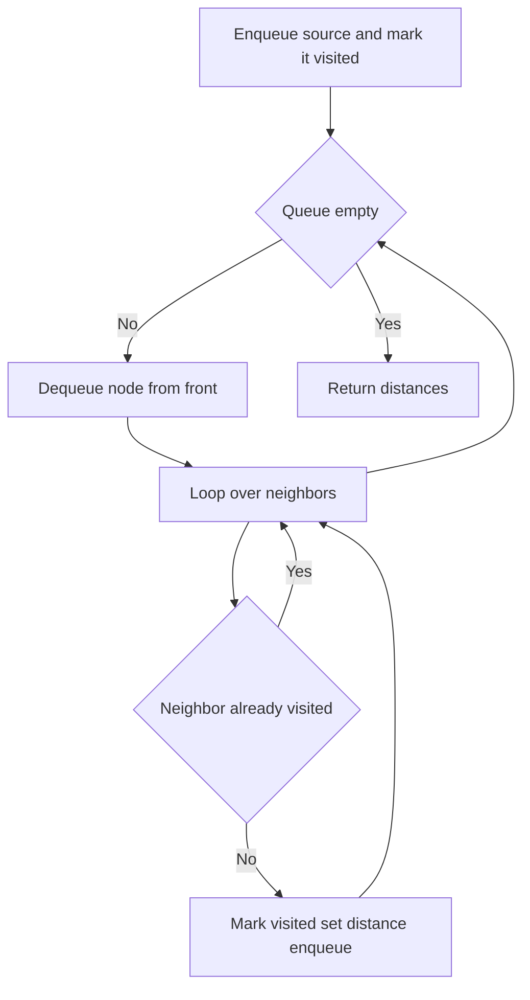
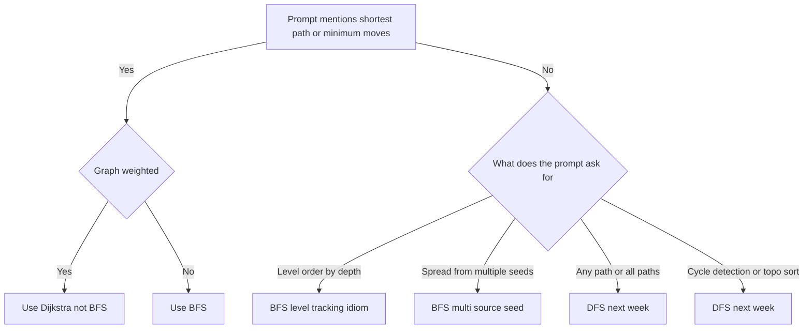

# Lecture 1 — The BFS Template

> **Duration:** ~2 hours.
> **Outcome:** You can write the canonical queue + visited-set BFS loop from memory, pick between level-tracking and per-node distance, defend the visited-set as an invariant out loud, and apply BFS to both grid and node sub-shapes.

Last week introduced the first logarithmic-time pattern of Phase 2. This lecture introduces the first **graph** pattern: BFS, the queue-driven traversal that visits nodes in order of distance from a source. The geometry is different from every Phase-1 pattern — instead of walking across an array or bisecting a search space, you fan outward on a graph, level by level. The trade is also different: BFS uses `O(V)` memory in the worst case (the queue can hold an entire level), but it earns the asymptotic gold standard for unweighted shortest paths.

By the end of this lecture you should be able to read a graph problem and, within 30 seconds, say one of three things out loud: "BFS — shortest path on an unweighted graph," "BFS — level-order output by depth," or "BFS — multi-source spread." The fourth thing — "this is not BFS, here is why" — is just as important and is graded in the quiz.

---

## 1. What BFS means

A **breadth-first search** is a graph traversal that visits nodes in order of their distance from a designated source. "Distance" here is **number of edges**, not weight — BFS is the unweighted-graph algorithm. The classical setting is "compute the shortest path from `s` to every reachable node," but the *idea* generalizes: anywhere you can model a problem as nodes with neighbors and the answer is "minimum number of steps," BFS applies.

Visualization on a small graph, source = A:

```
    A
   / \
  B   C
  |   |
  D   E
   \ / \
    F   G

BFS order from A:
level 0: A
level 1: B, C
level 2: D, E
level 3: F, G
```

Three levels. The order *within* a level depends on which neighbor you enumerate first, but the *partition into levels* is canonical: every node is in the level corresponding to its shortest-path distance from the source. That partition is the entire point of BFS.

The pattern's power comes from one observation:

> **At every iteration, BFS removes a node from the front of the queue and appends its unvisited neighbors to the back. Because the queue is FIFO, nodes are processed in non-decreasing order of distance from the source. The visited set ensures every node is enqueued at most once.**

Two corollaries:

1. **The first time you encounter a node, you have found its shortest path** from the source (in number of edges). You never need to revisit it.
2. **The total work is `O(V + E)`** — every node is enqueued once (so `O(V)` enqueue / dequeue operations) and every edge is examined twice (once from each endpoint, in an undirected graph) or once (in a directed graph).

The hard part is not the algorithm. The hard part is **modeling the problem as a graph in the first place** — for grid problems, recognizing that cells are nodes and orthogonal neighbors are edges; for string problems, recognizing that words are nodes and "one letter different" is an edge. That modeling step is Research constraints work.

---

## 2. The canonical template

```python
from collections import deque

def bfs(start, neighbors_fn):
    """Return the set of nodes reachable from start, and the distance to each."""
    queue = deque([start])
    visited = {start}
    dist = {start: 0}
    while queue:
        node = queue.popleft()
        for nbr in neighbors_fn(node):
            if nbr not in visited:
                visited.add(nbr)
                dist[nbr] = dist[node] + 1
                queue.append(nbr)
    return dist
```

Eleven lines. Memorize the shape.

Six observations:

1. **`from collections import deque`.** Using a `list` as a queue is `O(n)` per `pop(0)` — silent quadratic blowup. `deque.popleft()` is `O(1)`. Use `deque`.
2. **`queue = deque([start])`.** The queue is seeded with the source. For multi-source BFS, this list has multiple elements. The seed shape is the only difference between single-source and multi-source.
3. **`visited = {start}`.** The visited set is a `set`, not a `list` — `O(1)` membership testing. **Add to `visited` at enqueue time, not at dequeue time.** Adding at dequeue time risks enqueuing a node twice before either copy is dequeued; the second copy then re-processes the node and the algorithm is silently quadratic. This is the most common BFS bug.
4. **`dist = {start: 0}`.** Per-node distance dictionary. Optional — only needed if the answer depends on distance. Some BFS problems care only about visited set; others care about exact distance.
5. **`for nbr in neighbors_fn(node)`.** The neighbor function is the only thing that varies across sub-shapes. Grid-BFS: enumerate four offsets. Node-BFS: read from an adjacency list or generate from a `neighbors(node)` function.
6. **The `if nbr not in visited` check.** Both the visited check and the `visited.add(nbr)` happen *at enqueue time*. The dist update happens at enqueue time too. This is the canonical shape.



*The BFS loop: dequeue, expand unvisited neighbors, repeat until the queue drains.*

### Time and space

- **Time: `O(V + E)`.** Every node is enqueued once (`O(V)` enqueue / dequeue operations); every edge is examined at most twice in undirected graphs (once at each endpoint). Total work is linear in graph size.
- **Space: `O(V)`.** The visited set holds up to `V` entries; the queue holds at most one level at a time (worst case `V` for a star graph or a wide tree).

Say the time defense out loud every time:

> "**O(V + E) time** because every node enters the queue once (the visited set guarantees this) and every edge is examined at most twice (once from each endpoint in an undirected graph). **O(V) space** for the visited set and the queue — the queue can hold an entire level, which is bounded by `V`. Trade against DFS: same asymptotic time, same space; DFS uses the call stack instead of an explicit queue, which can blow the recursion limit on long paths. BFS is the right tool when the answer is a *shortest path* on an unweighted graph; DFS is the right tool for cycle detection, topological sort, and any-path problems."

That is the sentence interviewers grade. Memorize the cadence.

---

## 3. Why BFS finds shortest paths on unweighted graphs

The claim: **the first time BFS visits a node, the distance recorded is the shortest-path distance from the source.**

The proof is short and worth knowing.

**Invariant.** At every iteration of BFS, the queue contains nodes whose distances differ by at most one. That is, if `u` and `v` are in the queue with `u` ahead of `v`, then `dist[u] <= dist[v] <= dist[u] + 1`.

**Why the invariant holds.** Initially the queue contains only the source, `dist[source] = 0`. Trivially satisfied.

Inductive step: suppose the invariant holds, and consider dequeuing `u`. We enqueue each unvisited neighbor `w` of `u`, setting `dist[w] = dist[u] + 1`. The new queue front is some `v` with `dist[v] >= dist[u]` (by the invariant). After enqueuing `w`, the queue tail has `dist[w] = dist[u] + 1`. We need `dist[v] <= dist[w]` — i.e., `dist[v] <= dist[u] + 1`. This is satisfied because `dist[v] <= dist[u] + 1` was already true (by the invariant before dequeuing `u`).

**Consequence.** Distances are recorded in non-decreasing order. The first time a node `w` is visited, `dist[w]` is set to the shortest-path distance — because any later visit would either equal or exceed this distance, but the visited check prevents the update.

You will *not* be asked to prove this in interview. You *will* be asked to assert it ("BFS finds shortest paths because…"), and the right response is the one-liner: **"BFS visits nodes in non-decreasing order of distance from the source; the first visit is therefore the shortest."** That is the defense sentence.

---

## 4. The two distance-tracking idioms

There are two correct ways to record distance during BFS. Both are common in interview answers. Pick one consciously per problem.

### Idiom A — per-node distance dictionary

```python
queue = deque([start])
visited = {start}
dist = {start: 0}
while queue:
    node = queue.popleft()
    for nbr in neighbors_fn(node):
        if nbr not in visited:
            visited.add(nbr)
            dist[nbr] = dist[node] + 1
            queue.append(nbr)
```

The `dist` dictionary records the BFS distance to each node. Use this idiom when:

- The answer asks for *one specific target's* distance ("shortest path from `s` to `t`").
- You need distances to *all* reachable nodes (rare in interviews but common in production).
- The problem stores the distance as part of the answer (e.g., shortest path in a binary matrix returns the number of cells in the path).

Alternative form: queue stores `(node, dist)` tuples. Equivalent; choose based on which is more readable for the problem.

### Idiom B — level tracking

```python
queue = deque([start])
visited = {start}
level = 0
while queue:
    for _ in range(len(queue)):
        node = queue.popleft()
        # process node at this level
        for nbr in neighbors_fn(node):
            if nbr not in visited:
                visited.add(nbr)
                queue.append(nbr)
    level += 1
```

The outer loop is the level. The inner `for _ in range(len(queue))` consumes exactly one level's worth of nodes (the snapshot of `len(queue)` is taken before any new nodes are enqueued). Use this idiom when:

- The answer is *by level* (level-order traversal, right side view).
- You want to *return early* when a condition is met at a known level (e.g., word ladder: return `level` when the end word is dequeued).
- You want to *batch process* all nodes at one depth before moving on.

**The critical trick:** `range(len(queue))` is evaluated *once* per outer iteration. The snapshot of `len(queue)` is what bounds the inner loop. Newly enqueued nodes do not extend the current iteration.

### Which idiom when

| Output shape | Idiom |
|--------------|-------|
| "Shortest path length from s to t" | A (per-node distance) or store `(node, dist)` on the queue |
| "Shortest path length but with very few targets" | A (per-node distance) |
| "Level order traversal of a tree" | B (level tracking) |
| "Right side view / leftmost at each level / by-level operation" | B (level tracking) |
| "the cable pull — shortest transformation length" | Either; B is cleaner because the answer is a level count |
| "All shortest paths from s" | A (per-node distance) |

Both idioms are correct. The discriminating skill in mock interviews is **explaining why you picked one over the other**. Single defensible sentence: *"I picked level tracking because the answer is a level count and the outer loop's level variable maps cleanly to the answer."* Or: *"I picked per-node distance because the answer requires distance to one specific target, so storing distances per node is more natural than tracking levels and returning early."*

---

## 5. Off-by-one diagnostics — the four bug patterns

BFS has fewer off-by-one bugs than binary search, but the four listed here cover ~90% of incorrect submissions in mocks. Recognize them.

### Bug 1 — adding to visited at dequeue time

```python
queue = deque([start])
visited = set()
while queue:
    node = queue.popleft()
    if node in visited:        # WRONG idiom
        continue
    visited.add(node)
    for nbr in neighbors_fn(node):
        queue.append(nbr)
```

The bug: a node can be enqueued multiple times before any copy is dequeued. The visited check at dequeue time eventually fires, but each duplicate enqueue still happened. For a graph with high branching factor, the queue grows to `O(E)` instead of `O(V)`, and the total work becomes `O(V * E)` instead of `O(V + E)`.

**Fix:** add to `visited` at enqueue time, immediately after the membership check.

```python
queue = deque([start])
visited = {start}
while queue:
    node = queue.popleft()
    for nbr in neighbors_fn(node):
        if nbr not in visited:
            visited.add(nbr)        # at enqueue time
            queue.append(nbr)
```

**Rule of thumb:** enqueue-time visiting is the canonical idiom. Use it always.

### Bug 2 — using a list as a queue

```python
queue = [start]
while queue:
    node = queue.pop(0)            # WRONG — O(n)
    ...
```

`list.pop(0)` is `O(n)` because it shifts every remaining element. With `V` dequeue calls, the total cost is `O(V²)` — silent quadratic blowup. On `V = 10⁴` this is `10⁸` operations, which is several seconds of pure shifting and enough to time out any graded runner.

**Fix:** use `collections.deque`. `deque.popleft()` is `O(1)`.

### Bug 3 — level tracking off-by-one

```python
queue = deque([start])
visited = {start}
level = 1                          # WRONG — should start at 0
while queue:
    for _ in range(len(queue)):
        node = queue.popleft()
        ...
    level += 1
```

When the source itself is at "distance 0" from itself, `level` should start at 0. Starting at 1 gives a count off-by-one. The correct convention: `level = 0` if you increment at the *end* of each outer iteration (after processing the level); `level = 1` if you increment at the *start*. Pick one and be consistent.

Most BFS write-ups choose `level = 0`, increment at the end. That makes `level == dist(source, ...)`.

### Bug 4 — forgetting the start node in visited

```python
queue = deque([start])
visited = set()                    # WRONG — start not added
while queue:
    node = queue.popleft()
    visited.add(node)
    for nbr in neighbors_fn(node):
        if nbr not in visited:
            queue.append(nbr)
```

If the graph has a self-loop or a back-edge to the source, `start` may be re-enqueued before the visited check. Combined with Bug 1, this can produce exponential blowups.

**Fix:** initialize `visited = {start}` *before* the loop. Always.

---

## 6. The canonical pattern, fully written out

A single, copy-pasteable BFS skeleton that handles both single-source and multi-source, both level-tracking and per-node-distance, on both grid and node graphs:

```python
from collections import deque

def bfs_shortest_distance(start, neighbors_fn, *, is_goal=None):
    """
    Generic BFS skeleton.
      start         - either a single starting node or an iterable of starts (multi-source)
      neighbors_fn  - callable: neighbors_fn(node) -> iterable of nodes
      is_goal       - optional callable: is_goal(node) -> bool; returns dist when True
    Returns dist dict (or shortest distance if is_goal given).
    """
    starts = [start] if not isinstance(start, (list, set, tuple)) else list(start)
    queue = deque((s, 0) for s in starts)
    visited = set(starts)
    dist = {s: 0 for s in starts}
    while queue:
        node, d = queue.popleft()
        if is_goal is not None and is_goal(node):
            return d
        for nbr in neighbors_fn(node):
            if nbr not in visited:
                visited.add(nbr)
                dist[nbr] = d + 1
                queue.append((nbr, d + 1))
    return -1 if is_goal is not None else dist
```

Twenty lines. Read it line by line; the same shape powers Drills 1, 2, 3, 4, 5 and the challenge.

The only thing that varies across problems is **`neighbors_fn`**:

- **Exercise 1 (level order):** `neighbors_fn(node) = [n for n in (node.left, node.right) if n is not None]`.
- **Exercise 2 (shortest path in grid):** `neighbors_fn((r, c)) = [(r+dr, c+dc) for dr, dc in DIRS if in_bounds(r+dr, c+dc) and grid[r+dr][c+dc] == 0]`.
- **Exercise 3 (rotting oranges):** same grid neighbor function as Exercise 2; the *seed* is multi-source.
- **Exercise 4 (word ladder):** `neighbors_fn(word) = bucket_lookup(word)` where the bucket index groups words by wildcard patterns.
- **Exercise 5 (right side view):** same as Exercise 1; the level-tracking idiom emits the last node of each level.

The lesson: **the algorithm is the same; the neighbor function and the seed are the variations.** Recognize that, and Week 6 collapses into "what is `neighbors_fn`?" plus boilerplate.

---

## 7. The visited-set invariant — said cleanly

The visited set is the **invariant** of BFS. The interview defense:

> "The visited set guarantees every node enters the queue at most once. We add to `visited` at *enqueue* time — immediately after the membership check — so no duplicate copies of a node can be in the queue at any moment. This bounds total work at `O(V + E)`: every node generates its outgoing edges exactly once. Without the visited set, a cyclic graph would loop forever; with visited added at *dequeue* time, the algorithm is correct but silently quadratic. The canonical idiom is enqueue-time visiting."

Memorize that paragraph. It is roughly 30 seconds spoken aloud. In a mock interview, it is what the interviewer wants to hear during your Research constraints step on any BFS problem.

---

## 8. Level tracking, worked example

We will trace level-order on a small tree:

```
       1
      / \
     2   3
    /   / \
   4   5   6
```

Code:

```python
def level_order(root):
    if root is None:
        return []
    result = []
    queue = deque([root])
    while queue:
        level = []
        for _ in range(len(queue)):
            node = queue.popleft()
            level.append(node.val)
            if node.left is not None:
                queue.append(node.left)
            if node.right is not None:
                queue.append(node.right)
        result.append(level)
    return result
```

Trace:

```
init:     queue = [1],          result = []
iter 1:   snapshot len = 1
          dequeue 1, level=[1], enqueue 2, 3
          queue = [2, 3]
          append [1] to result
          result = [[1]]
iter 2:   snapshot len = 2
          dequeue 2, level=[2], enqueue 4
          dequeue 3, level=[2, 3], enqueue 5, 6
          queue = [4, 5, 6]
          append [2, 3] to result
          result = [[1], [2, 3]]
iter 3:   snapshot len = 3
          dequeue 4, level=[4]
          dequeue 5, level=[4, 5]
          dequeue 6, level=[4, 5, 6]
          queue = []
          append [4, 5, 6] to result
          result = [[1], [2, 3], [4, 5, 6]]
iter 4:   queue empty, exit
return [[1], [2, 3], [4, 5, 6]]
```

Three levels, three outer iterations. The `range(len(queue))` snapshot is what makes this work — it freezes the size of "this level" before any of "next level" is enqueued.

This is Exercise 1.

---

## 9. Per-node distance, worked example

We will trace shortest path from cell `(0, 0)` to cell `(2, 2)` on the grid:

```
grid = [[0, 0, 0],
        [1, 1, 0],
        [0, 0, 0]]
```

`0` is walkable, `1` is wall. Diagonal moves not allowed (4-directional).

```python
def shortest_path(grid):
    n = len(grid)
    if grid[0][0] == 1 or grid[n-1][n-1] == 1:
        return -1
    DIRS = [(-1, 0), (1, 0), (0, -1), (0, 1)]
    queue = deque([(0, 0, 1)])
    visited = {(0, 0)}
    while queue:
        r, c, d = queue.popleft()
        if (r, c) == (n - 1, n - 1):
            return d
        for dr, dc in DIRS:
            nr, nc = r + dr, c + dc
            if 0 <= nr < n and 0 <= nc < n and grid[nr][nc] == 0 and (nr, nc) not in visited:
                visited.add((nr, nc))
                queue.append((nr, nc, d + 1))
    return -1
```

Trace:

```
queue: [(0, 0, 1)]                 visited: {(0,0)}
dequeue (0, 0, 1)
  neighbors: (1, 0)=1 wall, (0, -1) oob, (0, 1)=0 free
  enqueue (0, 1, 2)                visited: {(0,0), (0,1)}

dequeue (0, 1, 2)
  neighbors: (-1, 1) oob, (1, 1)=1 wall, (0, 0) visited, (0, 2)=0 free
  enqueue (0, 2, 3)                visited adds (0,2)

dequeue (0, 2, 3)
  neighbors: (-1, 2) oob, (1, 2)=0 free, (0, 1) visited, (0, 3) oob
  enqueue (1, 2, 4)                visited adds (1,2)

dequeue (1, 2, 4)
  neighbors: (0, 2) visited, (2, 2)=0 free, (1, 1)=1 wall, (1, 3) oob
  enqueue (2, 2, 5)                visited adds (2,2)

dequeue (2, 2, 5)
  goal! return 5
```

Five cells in the shortest path: `(0,0) → (0,1) → (0,2) → (1,2) → (2,2)`. Correct.

This is Exercise 2.

---

## 10. When BFS does not apply

Equally important: knowing when to *reject* the pattern.

- **Weighted graphs.** If edges have non-unit weights, BFS does not find shortest paths in general — it finds shortest paths *in edge count*, not in total weight. Use **Dijkstra's algorithm** for non-negative weights (priority queue instead of FIFO queue). For graphs with zero / one weights, **0-1 BFS** with a `deque` (push-left for zero-edges, push-right for one-edges) works. For general weighted graphs with possible negatives, use **Bellman-Ford**. All of these are out of scope this week; covered in C5.
- **Shortest paths under non-edge constraints.** "Shortest path with at most `k` turns" or "shortest path with fuel constraints" is no longer a pure BFS — the state must encode the additional variable. Sometimes a *state-space BFS* on `(node, k)` works; sometimes you need DP. The grader is *can you augment the state to recover unit-cost edges?*
- **Counting paths, not finding one.** "How many shortest paths are there from `s` to `t`?" requires augmenting BFS with a counter; the algorithm is still BFS but with extra bookkeeping. Standard interview problem; out of scope for this week's drills.
- **Problems where the answer is not a distance.** Cycle detection, topological sort, connected component count — DFS is usually cleaner here. BFS works but is more verbose.
- **Implicit graphs with exponential state space and no pruning.** Subset/permutation generation has `2^n` or `n!` states; pure BFS would enumerate all of them. Use backtracking (Week 8) with constraint propagation.

Recognizing the *negative space* of the pattern matters as much as the positive recognition. Quiz Q3, Q5, Q8 are negative-space questions.

---

## 11. Worked example end-to-end: shortest path in a binary matrix

We will work this in full FRAME, abbreviated. Exercise 2 is this exact problem with 8-directional moves.

**[F — 1 minute]**

> "I am given an `n x n` binary matrix where `0` is walkable and `1` is a wall. Return the length of the shortest path from `(0, 0)` to `(n-1, n-1)`, where 'length' is the number of cells in the path. Diagonal moves are allowed (8-directional). Return `-1` if no path exists. Confirm: empty input is invalid by problem spec. Walk an example: a 3x3 grid where the diagonal is open, the answer is 3."

**[R — 30 seconds]**

> "BFS on an unweighted grid. The 30-second memo: *Grid-BFS — the canonical shortest-path-on-an-implicit-graph idiom. Nodes are cells; edges are 8-directional offsets to walkable neighbors. Auxiliary state: FIFO queue, visited set, distance accumulator. Why not DFS: DFS finds any path but not the shortest; BFS's level-by-level expansion is what guarantees shortest. Why not Dijkstra: the graph is unweighted (every move has cost 1), and Dijkstra on unit costs degenerates to BFS — BFS is the right tool by spec.*"

**[A — 1 minute]**

> "Initialize: queue with `(0, 0, 1)`, visited with `{(0,0)}`. Eight direction vectors. Loop: dequeue `(r, c, d)`. If `(r, c) == (n-1, n-1)`, return `d`. For each direction, compute `(nr, nc)`. Bounds check, walkability check, visited check. If passes, mark visited and enqueue `(nr, nc, d+1)`. After loop, return `-1`."

**[M — 3 minutes]**

```python
from collections import deque

def shortest_path_binary_matrix(grid: list[list[int]]) -> int:
    n = len(grid)
    if grid[0][0] != 0 or grid[n-1][n-1] != 0:
        return -1
    DIRS = [(-1,-1), (-1,0), (-1,1), (0,-1), (0,1), (1,-1), (1,0), (1,1)]
    queue = deque([(0, 0, 1)])
    visited = {(0, 0)}
    while queue:
        r, c, d = queue.popleft()
        if (r, c) == (n - 1, n - 1):
            return d
        for dr, dc in DIRS:
            nr, nc = r + dr, c + dc
            if 0 <= nr < n and 0 <= nc < n and grid[nr][nc] == 0 and (nr, nc) not in visited:
                visited.add((nr, nc))
                queue.append((nr, nc, d + 1))
    return -1
```

**[E · verify — 1 minute]**

> "Trace on the 3x3 grid `[[0,0,0],[1,1,0],[1,1,0]]`.
> Dequeue (0,0,1). Eight neighbors; the valid ones are (0,1) and (1,1) blocked. Add (0,1).
> Dequeue (0,1,2). Valid neighbors: (0,2), (1,2). Add both.
> Dequeue (0,2,3). Valid neighbors: (1,2) visited; (1,1) wall. No new adds.
> Dequeue (1,2,3). Valid neighbors: (2,2), (2,1) wall. Add (2,2).
> Dequeue (2,2,4). Goal! Return 4. ✓
> Trace on a closed grid: never reach the goal, queue empties, return -1. ✓"

**[E · cost — 1 minute]**

> "**Time O(R × C)** where `R x C` is the grid size. Every cell enters the queue once; each visit examines eight neighbors in `O(1)`. **Space O(R × C)** for the visited set; the queue can hold up to one level, bounded by `R × C` in the worst case. Tradeoff: DFS is the same asymptotic complexity but does *not* return the shortest path. Dijkstra on unit costs is BFS with extra log-factor overhead — strictly worse here. Best case `O(1)` (start equals goal); worst case `O(R × C)`. Improvement: bidirectional BFS could halve the visited set when source and target are both fixed (we know both here), but the constant-factor win is not worth the implementation complexity unless `R × C >= 10⁶`."

That is FRAME on shortest-path-in-grid, end-to-end, in about 7 minutes. The drill is to do this every time.

---

## 12. Self-check

Without notes, answer:

**1.** What data structure does BFS use, and why?

<details>
<summary>Answer</summary>

FIFO queue. `deque.popleft()` is `O(1)`; the FIFO order guarantees nodes are processed in non-decreasing distance from the source.

</details>

**2.** When do you add a node to the visited set?

<details>
<summary>Answer</summary>

At enqueue time, immediately after the membership check. Adding at dequeue time silently degrades complexity to `O(V × E)`.

</details>

**3.** What is the time and space complexity, with defense sentence?

<details>
<summary>Answer</summary>

`O(V + E)` time because every node enters the queue once and every edge is examined at most twice; `O(V)` space for the visited set and queue. Trade against DFS: same asymptotic; BFS for shortest path on unweighted, DFS for cycle detection / topological sort.

</details>

**4.** Name the two distance-tracking idioms and when to use each.

<details>
<summary>Answer</summary>

Per-node distance dict — for "shortest path to a specific target." Level tracking with outer `for _ in range(len(queue))` — for "by level" outputs and early-return-at-level idioms.

</details>

**5.** Why does BFS find shortest paths on unweighted graphs?

<details>
<summary>Answer</summary>

Because the queue stores nodes in non-decreasing order of distance; the first visit to any node is therefore the shortest. Use the invariant from §3.

</details>

**6.** When does BFS *not* find shortest paths?

<details>
<summary>Answer</summary>

When edges have non-unit weights. Use Dijkstra for non-negative weights, Bellman-Ford for graphs with negative weights, 0-1 BFS for `{0, 1}`-weighted graphs.

</details>

If you can answer all six without hesitation, proceed to [Lecture 2 — Grid BFS and Graph BFS](./02-grid-bfs-and-graph-bfs.md).

---

## 13. The 30-second recognition signals

Stop. Read the prompt slowly. Ask these in order:

1. **Does the prompt mention "shortest path," "minimum moves," "fewest steps," "minimum number of operations to reach …"?** Strong signal — almost certainly BFS.
2. **Is the input a grid (matrix) with walkable / blocked cells?** Almost certainly grid-BFS.
3. **Is the input an explicit adjacency list or an implicit graph (words with one-letter changes, board positions reachable by moves, etc.)?** Node-BFS — Lecture 2 covers this.
4. **Does the prompt mention "from any of these starting points" or "spread from multiple sources simultaneously"?** Multi-source BFS — seed the queue with all starts. Same algorithm, multi-element seed.
5. **Does the prompt mention "level," "depth," "by tier"?** Level-tracking idiom.
6. **Does the prompt have *weighted edges*?** Not BFS. Use Dijkstra (out of scope; C5).

The 30-second decision tree:

```
prompt mentions "shortest" / "minimum moves"?
├── Yes ──→ graph weighted?
│              ├── Yes ──→ Dijkstra (not this week)
│              └── No  ──→ BFS
└── No
    ├── prompt asks for "level-order output by depth"?     ──→ BFS, level-tracking idiom
    ├── prompt asks for "spread from multiple seeds"?      ──→ BFS, multi-source seed
    ├── prompt asks for "any path" or "all paths"?         ──→ DFS (next week)
    ├── prompt asks for "cycle detection / topo sort"?     ──→ DFS (next week)
    └── otherwise — re-read; the pattern is probably not BFS
```



*The 30-second recognition tree: weighted edges send you to Dijkstra, everything else routes into BFS or DFS by shape.*

This decision tree is what we want in muscle memory by Sunday.

---

## 14. The visited-set defense sentence

In Mock #2 (Week 9), if you draw a BFS problem, the interview tell is whether you can **defend the visited-set invariant in one sentence, on demand**.

> "The visited set is the invariant: every node enters the queue at most once. We add to `visited` immediately at *enqueue time*, not at dequeue time — that prevents duplicate enqueues that would silently degrade total work from `O(V + E)` to `O(V × E)`. The queue is a `deque` so `popleft()` is `O(1)`; using a `list` would degrade dequeue to `O(n)` and the algorithm to `O(V²)`."

That is the cadence interviewers want. Memorize the shape, plug in the names. The cadence carries across all five drills.

---

## Further reading

- **Wikipedia — Breadth-first search**: <https://en.wikipedia.org/wiki/Breadth-first_search> — the pseudocode is the canonical reference.
- **CSES Competitive Programmer's Handbook — Chapter 12**: <https://cses.fi/book/book.pdf> — twenty minutes; the cleanest free pseudocode treatment.

Next: [Lecture 2 — Grid BFS and Graph BFS](./02-grid-bfs-and-graph-bfs.md).
