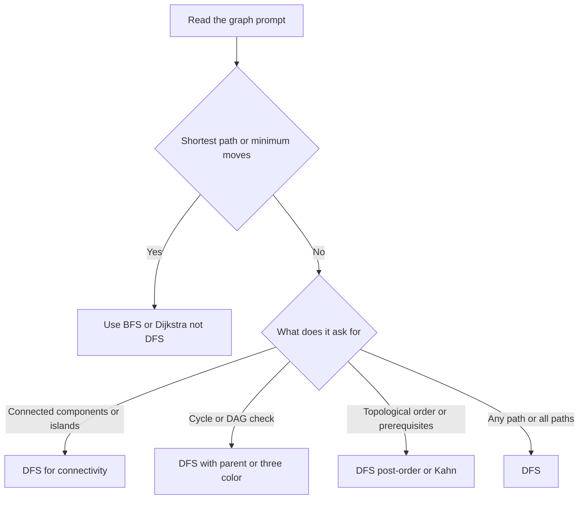

# Lecture 1 — Recursive DFS

> **Duration:** ~2 hours.
> **Outcome:** You can write the canonical recursive DFS template from memory, defend the visited-set as an invariant out loud, distinguish pre-order from post-order in one sentence, and apply DFS to both connectivity and any-path problems on graphs and trees.

Last week installed BFS: the queue, the visited set, the level-monotonic shortest-path argument. This lecture installs **DFS** — depth-first search, the recursion-driven traversal that visits a node, then a child, then *that* child's child, before returning to siblings. The asymptotic complexity is identical to BFS (`O(V + E)` time, `O(V)` space), but the *shape* of the algorithm is different: BFS expands outward in concentric rings; DFS dives along one path until forced to backtrack.

By the end of this lecture you should be able to read a graph problem and, within 30 seconds, say one of three things out loud: "DFS — connectivity / connected components," "DFS — any-path or all-paths," or "DFS — cycle detection / topological sort (covered in Lecture 3)." The fourth thing — "this is *not* DFS, here is why" — is just as important and is graded in the quiz.

This lecture covers the recursive form. Lecture 2 covers the iterative form (explicit stack) — the version that survives Python's recursion limit on long chains. Lecture 3 covers cycle detection and topological sort — the two applications that anchor Phase-2 mocks.

---

## 1. What DFS means

A **depth-first search** is a graph traversal that visits each reachable node by descending as deep as possible along each path before backtracking. "Depth-first" is the order of the visits — children are processed before siblings — which contrasts with BFS, where siblings are processed before children.

Visualization on a small graph, source = A:

```
    A
   / \
  B   C
  |   |
  D   E
   \ / \
    F   G

DFS pre-order from A (left-first):
A, B, D, F, C, E, G

DFS pre-order from A (right-first):
A, C, E, G, F, B, D
```

Notice: the DFS order depends on which child you visit first. Unlike BFS, there is no canonical "level-by-level" ordering — DFS produces a traversal that depends on the neighbor enumeration order. This is a feature, not a bug, but it means *the partition into levels is no longer the algorithm's output*. The output is the visit order, which by itself answers "is this node reachable?" but does not answer "what is the shortest path to it?"

The pattern's power comes from one observation:

> **At every recursive call, DFS enters a node, marks it visited, then recursively visits each unvisited neighbor. The recursion stack acts as the "queue of nodes to backtrack to." Because the stack is LIFO, the most recently entered path is the next one explored — DFS dives.**

Three corollaries:

1. **DFS visits every node reachable from the source.** Just like BFS. Both are graph traversals; both visit each reachable node exactly once.
2. **The total work is `O(V + E)`** — same as BFS. Every node is entered once; every edge is examined twice (once from each endpoint) in an undirected graph.
3. **DFS does *not* find shortest paths.** The visit order is path-dependent; the *first* time DFS visits a node may be via a long detour. This is the discriminator with BFS — DFS is for connectivity / cycle / topo, not shortest path.

The hard part this week is **not** the algorithm — recursive DFS is six lines. The hard part is **the invariants you maintain on the recursion stack**: the visited set is one; the three colors (Lecture 3) are another; the parent pointer (for undirected cycle detection) is a third. Maintaining the right invariant for the right problem is Research constraints work.

---

## 2. The canonical recursive template

```python
from typing import Hashable, Callable, Iterable

def dfs(
    start: Hashable,
    neighbors_fn: Callable[[Hashable], Iterable[Hashable]],
) -> set[Hashable]:
    """Return the set of nodes reachable from start, via depth-first search."""
    visited: set[Hashable] = set()

    def _dfs(node: Hashable) -> None:
        visited.add(node)
        for nbr in neighbors_fn(node):
            if nbr not in visited:
                _dfs(nbr)

    _dfs(start)
    return visited
```

Ten lines. Memorize the shape.

Six observations:

1. **The visited set is declared in the *outer* function**, not in `_dfs`. This is the closure idiom — `_dfs` captures `visited` from the enclosing scope and mutates it. The alternative — passing `visited` as an argument — works but is more verbose.
2. **`visited.add(node)` happens at *entry*** to `_dfs`, immediately. This is the discriminator with the BFS visited-set discipline: BFS adds at *enqueue time* (before recursion would begin); DFS adds at *function-entry time* (after recursion has begun). Functionally identical; the timing is the same "mark before exploring outgoing edges."
3. **The `if nbr not in visited` check is *before* the recursive call**, not inside it. This avoids re-entering `_dfs` for a visited node, which would push a useless stack frame.
4. **The neighbor function** is the only thing that varies across problems. Tree-DFS: enumerate `node.left` and `node.right`. Graph-DFS: read from an adjacency list. Implicit-graph-DFS: generate from a problem-specific function.
5. **No explicit return value from `_dfs`.** This template computes reachability, which is read off `visited` after `_dfs(start)` returns. For path-existence problems, `_dfs` returns a bool. For tree-DP problems, `_dfs` returns the subtree's contribution to the answer.
6. **The recursion depth is bounded by the longest path in the graph from `start`.** For a path graph of length `V`, this is `V` — and Python's default recursion limit is 1000, so any graph with a path longer than ~990 nodes will hit `RecursionError`. Lecture 2 covers the iterative version that avoids this.

### Time and space

- **Time: `O(V + E)`.** Every reachable node enters `_dfs` once (the visited set guarantees this); every edge is examined twice in an undirected graph (once from each endpoint). Total work is linear in graph size.
- **Space: `O(V)`.** The visited set holds up to `V` entries. The recursion stack holds up to `V` frames in the worst case (a path graph) or `O(log V)` for a balanced tree.

Say the time defense out loud every time:

> "**O(V + E) time** because every node enters DFS once (the visited set guarantees this) and every edge is examined at most twice (once from each endpoint in an undirected graph). **O(V) space** for the visited set and the recursion stack — the recursion depth is bounded by the longest path from the source, worst-case `V` for a path graph. Trade against BFS: same asymptotic time, same space; BFS uses an explicit queue, DFS uses the call stack. BFS is the right tool for shortest path on unweighted graphs; DFS is the right tool for connectivity, cycle detection, topological sort, and any-path problems."

That is the sentence interviewers grade. Memorize the cadence.

---

## 3. The visited-set invariant — said cleanly

The visited set is the **invariant** of DFS. The interview defense:

> "The visited set guarantees every node enters `dfs` at most once. We add to `visited` at the *top* of the recursive function — immediately on entry — so no recursive call is made for an already-visited node. This bounds total work at `O(V + E)`: every node generates its outgoing edges exactly once. Without the visited set, a cyclic graph would loop forever; on a tree the visited set is technically optional (no cycles), but defending it explicitly is the senior signal. The canonical idiom is mark-on-entry."

Memorize that paragraph. It is roughly 25 seconds spoken aloud. In a mock interview, it is what the interviewer wants to hear during your Research constraints step on any DFS problem.

---

## 4. Pre-order vs post-order — the two processing times

DFS gives you two natural places to do work on a node: **before** descending into the children (pre-order) and **after** all descendants have finished (post-order). Both are first-class; choose based on what the work is.

### Pre-order

```python
def dfs_preorder(node: Hashable, adj: dict, visited: set) -> None:
    visited.add(node)
    process(node)              # work happens BEFORE recursion
    for nbr in adj.get(node, []):
        if nbr not in visited:
            dfs_preorder(nbr, adj, visited)
```

Use pre-order when the work on a node does *not* depend on its descendants' results — printing the node, marking it visited, computing a path from the source down to here.

### Post-order

```python
def dfs_postorder(node: Hashable, adj: dict, visited: set) -> None:
    visited.add(node)
    for nbr in adj.get(node, []):
        if nbr not in visited:
            dfs_postorder(nbr, adj, visited)
    process(node)              # work happens AFTER recursion
```

Use post-order when the work on a node *depends* on its descendants' results — computing a topological order (a node is added to the order only after all descendants have finished), aggregating subtree sums or sizes, computing the height of a tree, the low-link values in Tarjan's bridge algorithm.

### The discriminating sentence

In Research constraints, state which one and why:

> "Pre-order because the work on a node does not depend on the children's results."
> "Post-order because the answer for a node aggregates the answers for its descendants."

Compare with the level-tracking idiom from BFS (Lecture 1 §4). Pre-order in DFS is the closest analogue to level-tracking-pre-processing in BFS; post-order has no clean BFS analogue (BFS does not have a "wait for the descendants" mechanism without an explicit second pass).

---

## 5. Off-by-one and discipline bugs — the four patterns

DFS has fewer off-by-one bugs than binary search and fewer subtle queue bugs than BFS, but the four listed here cover ~90% of incorrect submissions in mocks. Recognize them.

### Bug 1 — adding to visited at the wrong time

```python
def dfs(node, adj, visited):
    for nbr in adj.get(node, []):
        if nbr not in visited:
            visited.add(nbr)        # WRONG idiom — adds at child time, not entry time
            dfs(nbr, adj, visited)
```

This *also* works, because a child is added before recursion begins. But the cleaner shape is `visited.add(node)` at function entry, then iterate children. The "add at function entry" idiom is what generalizes to the three-color invariant (Lecture 3) and to backtracking (Week 8); the "add at child-visit" idiom does not. Use the canonical shape.

```python
def dfs(node, adj, visited):
    visited.add(node)                # at function entry
    for nbr in adj.get(node, []):
        if nbr not in visited:
            dfs(nbr, adj, visited)
```

### Bug 2 — recursion-limit overflow

```python
def dfs(node, adj, visited):
    visited.add(node)
    for nbr in adj.get(node, []):
        if nbr not in visited:
            dfs(nbr, adj, visited)

# Input: graph is a path of 10000 nodes. RecursionError at depth ~1000.
```

Python's default recursion limit is 1000 frames. A path graph of length `>= 1000` will crash. Two fixes:

1. **`sys.setrecursionlimit(10**6)`** — raise the limit. Works for LeetCode (most problems have `V <= 10⁵`); risky in production because Python itself uses some of the stack.
2. **Iterative DFS with an explicit stack** — Lecture 2. The correct fix for production code.

The interview-tell move: **mention the recursion-limit risk in Research constraints** if `V` could be large. *"The recursive version is `O(V)` stack space — for `V <= 1000` this is fine; for larger `V` I would switch to the iterative version with an explicit stack."*

### Bug 3 — using a list for the visited set

```python
visited = [start]                  # WRONG — O(n) membership
if nbr not in visited:             # O(n) per call
    ...
```

Membership testing on a `list` is `O(n)`. Total DFS becomes `O(V × E)` — silent quadratic blowup. Use `set`.

### Bug 4 — forgetting that undirected graphs need parent pointers for cycle detection

```python
def has_cycle_undirected(adj):
    visited = set()
    def dfs(node):
        visited.add(node)
        for nbr in adj[node]:
            if nbr in visited:
                return True        # WRONG — every undirected edge looks like a cycle
            if dfs(nbr):
                return True
        return False
    return dfs(0)
```

In an undirected graph, every edge `(u, v)` is stored as `u → v` and `v → u`. When DFS descends from `u` to `v`, the very next iteration sees `v → u` and incorrectly reports a cycle. The fix is the parent pointer:

```python
def has_cycle_undirected(adj):
    visited = set()
    def dfs(node, parent):
        visited.add(node)
        for nbr in adj[node]:
            if nbr not in visited:
                if dfs(nbr, node):
                    return True
            elif nbr != parent:     # back-edge to non-parent → cycle
                return True
        return False
    return dfs(0, -1)
```

The parent pointer is the undirected discriminator. Directed graphs use the three-color invariant instead (Lecture 3). Mixing them is one of the most common DFS bugs — be deliberate about which graph type you have.

---

## 6. DFS on a tree — the special case

A tree is a graph with no cycles. The visited set is therefore optional — if you descend from `node` to `node.left`, you cannot loop back to `node` because trees have no back-edges. This collapses the DFS template to the familiar three-line recursion:

```python
class TreeNode:
    def __init__(self, val: int = 0, left: "TreeNode | None" = None, right: "TreeNode | None" = None) -> None:
        self.val = val
        self.left = left
        self.right = right

def dfs_tree(root: TreeNode | None) -> None:
    if root is None:
        return
    process(root)
    dfs_tree(root.left)
    dfs_tree(root.right)
```

Five lines. The `if root is None: return` is the base case (the "visited check" replacement); the two recursive calls are the children.

### Pre-order vs in-order vs post-order on a tree

```python
def preorder(root: TreeNode | None) -> None:
    if root is None:
        return
    process(root)             # visit BEFORE recursion
    preorder(root.left)
    preorder(root.right)

def inorder(root: TreeNode | None) -> None:
    if root is None:
        return
    inorder(root.left)
    process(root)             # visit BETWEEN left and right
    inorder(root.right)

def postorder(root: TreeNode | None) -> None:
    if root is None:
        return
    postorder(root.left)
    postorder(root.right)
    process(root)             # visit AFTER recursion
```

Three lines change between the three orderings. On a binary search tree, in-order gives you the values in sorted order — a property worth memorizing.

### When tree-DFS returns a value

The most common tree-DFS pattern is post-order with a return value — the node's answer aggregates its children's answers.

```python
def max_depth(root: TreeNode | None) -> int:
    if root is None:
        return 0
    return 1 + max(max_depth(root.left), max_depth(root.right))
```

Three lines. The recursion is bottom-up: each node returns `1 + max(left_depth, right_depth)`. This is the *foundation* of every tree-DP problem in Phase 3 and a recurring fixture in Mock #2.

---

## 7. Worked example end-to-end: number of provinces (LC 547)

We will work this in full FRAME, abbreviated. Exercise 1 is this exact problem.

**[F — 1 minute]**

> "I am given an `n × n` matrix `isConnected` where `isConnected[i][j] == 1` if city `i` is directly connected to city `j` and `0` otherwise. A province is a maximal group of directly or indirectly connected cities. Return the number of provinces. The matrix is symmetric (`isConnected[i][j] == isConnected[j][i]`); the diagonal is always 1 (every city is connected to itself). Confirm: the input encodes an undirected graph as an adjacency matrix. Walk an example: `[[1,1,0],[1,1,0],[0,0,1]]` — cities 0 and 1 are connected; city 2 is alone. Two provinces."

**[R — 30 seconds]**

> "Connectivity / connected components on an undirected graph. The 30-second memo: *Graph-DFS on an adjacency matrix. Nodes are cities (indices 0..n-1); edges are matrix `1`-entries off the diagonal. The answer counts the number of times we start a fresh DFS from an unvisited city — each fresh start covers exactly one province. Why not BFS: same asymptotic complexity but DFS is shorter to write recursively, and shortest path is not the answer. Why not union-find: works equally well in `O(n² × α(n))`; DFS is `O(n²)` and structurally simpler.*"

**[A — 1 minute]**

> "Initialize: `visited` as an empty set, `provinces = 0`. Outer loop: for each city `i` from 0 to `n-1`, if `i not in visited`, increment `provinces` and run DFS from `i` to mark every reachable city as visited. DFS body: add `node` to visited, iterate neighbors via the matrix row, recurse on unvisited connected neighbors. After the outer loop, return `provinces`."

**[M — 2 minutes]**

```python
from typing import List

def find_circle_num(is_connected: List[List[int]]) -> int:
    n = len(is_connected)
    visited: set[int] = set()
    provinces = 0

    def dfs(node: int) -> None:
        visited.add(node)
        for nbr in range(n):
            if is_connected[node][nbr] == 1 and nbr not in visited:
                dfs(nbr)

    for i in range(n):
        if i not in visited:
            provinces += 1
            dfs(i)
    return provinces
```

**[E · verify — 1 minute]**

> "Trace on `[[1,1,0],[1,1,0],[0,0,1]]`. i=0: not visited; provinces=1; dfs(0). visited={0}; neighbors of 0 are columns where matrix[0][col]==1 → col=0 (self, visited) and col=1. dfs(1). visited={0,1}; neighbors of 1 are col=0 (visited), col=1 (self, visited). Return. Return. i=1: visited; skip. i=2: not visited; provinces=2; dfs(2). visited={0,1,2}; col=2 (self, visited). Return. Loop done. Return 2. ✓
> Trace on `[[1]]`: single city. i=0: provinces=1; dfs(0). Visited. Return 1. ✓
> Trace on `[[1,0],[0,1]]`: two isolated cities. provinces=2 after both outer iterations. ✓"

**[E · cost — 1 minute]**

> "**Time `O(n²)`** because the adjacency matrix has `n²` entries; the DFS scans every row in the worst case, and across all DFS calls every cell is examined exactly once. **Space `O(n)`** for the visited set and the recursion stack (worst case the graph is a single chain through all `n` cities). Tradeoff: BFS solves the same problem in the same `O(n²)` time; union-find solves it in `O(n² × α(n))` which is effectively `O(n²)` with a slightly larger constant. DFS is the cleanest of the three. Best case `O(n²)` (we always have to read the matrix); worst case `O(n²)`."

That is FRAME on number of provinces, end-to-end, in about 6 minutes. The exercise is to do this every time.

---

## 8. The 30-second recognition signals

Stop. Read the prompt slowly. Ask these in order:

1. **Does the prompt mention "connected components," "islands," "groups," "regions"?** Strong signal — almost certainly DFS-for-connectivity.
2. **Does the prompt mention "cycle," "is this graph acyclic," "is this a DAG"?** Strong signal — DFS with parent-pointer (undirected) or three-color invariant (directed). Lecture 3.
3. **Does the prompt mention "topological order," "prerequisites," "valid sequence," "build order"?** Topological sort — DFS post-order or Kahn's. Lecture 3.
4. **Does the prompt mention "any path from `s` to `t`" or "all paths from `s` to `t`"?** DFS — recursion explores paths naturally; BFS works but uses more memory.
5. **Does the prompt mention "shortest path," "minimum moves," "fewest steps"?** NOT DFS. Use BFS (Week 6) or Dijkstra (C5).
6. **Is the input a tree (with `left`/`right` or `children`)?** Tree-DFS — usually post-order with a return value. The visited set is implicit.
7. **Does the prompt ask you to *generate all configurations* (subsets, permutations, combinations)?** Backtracking — DFS with an undo step. Covered Week 8.

The 30-second decision tree:

```
prompt mentions "shortest" / "minimum moves"?
├── Yes ──→ NOT DFS. Use BFS (unweighted) or Dijkstra (weighted).
└── No
    ├── "connected components" / "islands"           ──→ DFS-for-connectivity
    ├── "cycle" / "is this a DAG"                    ──→ DFS with parent (undirected) or 3-color (directed)
    ├── "topological order" / "prerequisites"        ──→ DFS post-order or Kahn (Lecture 3)
    ├── "any path" / "all paths from s to t"         ──→ DFS
    ├── input is a tree                              ──→ Tree-DFS, usually post-order
    ├── "generate all subsets/permutations"          ──→ Backtracking (Week 8)
    └── otherwise — re-read; the pattern is probably not DFS
```


*The 30-second recognition tree: what the prompt asks for determines which DFS variant applies.*

This decision tree is what we want in muscle memory by Sunday.

---

## 9. The defense sentence

In Mock #2 (Week 9), if you draw a DFS problem, the interview tell is whether you can **defend the visited-set invariant in one sentence, on demand**.

> "The visited set is the invariant: every node enters DFS at most once. We add to `visited` at *function entry*, immediately — that prevents revisiting and bounds total work at `O(V + E)`. The recursion stack provides the natural backtracking structure; for inputs with `V > 1000` I would switch to the iterative version with an explicit stack to avoid Python's recursion-limit crash."

That is the cadence interviewers want. Memorize the shape, plug in the names. The cadence carries across all three exercises and the mini-project.

---

## 10. When DFS does not apply

Equally important: knowing when to *reject* the pattern.

- **Shortest paths on unweighted graphs.** Use BFS. DFS does not visit nodes in order of distance from the source.
- **Shortest paths on weighted graphs.** Use Dijkstra (non-negative) or Bellman-Ford (possibly negative). Covered in C5.
- **Level-by-level outputs.** Use BFS. DFS visits siblings far apart in the traversal order.
- **Streaming / online algorithms.** DFS requires the full graph in memory; for "edges arrive one at a time, answer queries on the current graph" problems, use union-find (next week's bonus topic) or specialized streaming algorithms.
- **Problems where the answer is "how many nodes within distance `k` of the source?"** Use BFS with a level counter. DFS could be made to work but is awkward.

Recognizing the *negative space* of the pattern matters as much as the positive recognition. Quiz Q2, Q5, Q9 are negative-space questions.

---

## 11. Self-check

Without notes, answer:

1. **What data structure does recursive DFS use, and why?** (The Python call stack. The LIFO discipline of the stack is what produces depth-first order — the most recently entered node is the next one explored.)
2. **When do you add a node to the visited set?** (At function entry, immediately. This generalizes to the gray-state in the three-color invariant from Lecture 3.)
3. **What is the time and space complexity, with defense sentence?** (`O(V + E)` time because every node enters DFS once and every edge is examined at most twice; `O(V)` space for the visited set and recursion stack — the depth is bounded by the longest path from the source.)
4. **Name the two processing times and when to use each.** (Pre-order — process before recursion; use when the work does not depend on descendants. Post-order — process after recursion; use when the work aggregates descendants, e.g., topological sort, tree-DP.)
5. **Why does DFS *not* find shortest paths?** (The visit order is path-dependent — the first time DFS visits a node may be via a long detour. BFS is level-monotonic; DFS is not.)
6. **What is the cycle-detection technique for an undirected graph? For a directed graph?** (Undirected: DFS with a parent pointer — a back-edge to a non-parent is a cycle. Directed: DFS with the three-color invariant — a back-edge to a gray node is a cycle. Mixing the two is the most common cycle-detection bug.)

If you can answer all six without hesitation, proceed to [Lecture 2 — Iterative DFS](./02-iterative-dfs.md).

---

## 12. Worked example: detecting a cycle in an undirected graph

The cleanest illustration of why undirected and directed cycle detection are different algorithms.

**Problem.** Given an undirected graph as an adjacency list, return `True` if it contains a cycle.

**The trap.** The "obvious" implementation says "a back-edge to any visited node is a cycle." This is *wrong for undirected graphs* — every undirected edge `(u, v)` is stored twice (`u → v` and `v → u`), so when DFS descends from `u` to `v`, the very next iteration sees `v → u` and the naive check fires.

**The fix.** Pass the parent in the recursion and exclude the back-edge to the parent.

```python
from typing import Dict, List

def has_cycle_undirected(adj: Dict[int, List[int]]) -> bool:
    visited: set[int] = set()

    def dfs(node: int, parent: int) -> bool:
        visited.add(node)
        for nbr in adj.get(node, []):
            if nbr not in visited:
                if dfs(nbr, node):
                    return True
            elif nbr != parent:
                return True
        return False

    for v in list(adj):
        if v not in visited:
            if dfs(v, -1):
                return True
    return False
```

Twelve lines. The discriminator is `elif nbr != parent`. Without that check, every leaf-to-parent backward traversal looks like a cycle. With it, only true cycles (back-edges to non-parent ancestors) fire.

Defense sentence:

> "In an undirected graph, every edge is stored as two directed half-edges. DFS naturally traverses the back-half-edge to the parent, which we must *exclude* from cycle detection. The parent pointer is the exclusion mechanism. A back-edge to any *non-parent* visited node is a true cycle."

This is the kind of one-paragraph defense the rubric grades — the difference between "the code works" and "the code is robust." We will compose this with the three-color invariant in Lecture 3 to handle directed graphs.

---

## 13. Why this is the highest-yield Phase 2 graph skill

DFS is the *recursion-shaped* graph algorithm — and recursion is the structural skill that powers backtracking (W8), tree-DP (Phase 3), and divide-and-conquer (C3). Every graph algorithm in C5 builds on DFS or BFS.

For Phase 2 interview prep specifically, DFS shows up in:

- Mock #2 (Week 9): at least one DFS / topo problem is the median allocation.
- The capstone (Week 15): DFS is on the "patterns you must own" list, alongside BFS.
- Every FAANG onsite: at least one graph problem; BFS or DFS — and topological sort if the domain is build systems, scheduling, or course-prerequisite UI.

The drill: Exercises 1-3 cover connectivity, iterative DFS, and topological sort. Homework problems 1-2 reinforce. The mini-project writes one DFS + one topo write-up. Six at-bats this week. By Sunday the "DFS? connectivity or cycle or topo?" cadence should be reflexive.

---

## Further reading

- **Wikipedia — Depth-first search**: <https://en.wikipedia.org/wiki/Depth-first_search> — the pseudocode is the canonical reference.
- **CSES Competitive Programmer's Handbook — Chapters 12 and 16**: <https://cses.fi/book/book.pdf> — twenty minutes; the cleanest free pseudocode treatment of DFS, cycle detection, and topological sort.
- **LeetCode 547, 200, 207, 210, 261, 802** — six problems that anchor the connectivity / cycle / topo families. Exercises and homework cover four of them; the others are stretch.

Next: [Lecture 2 — Iterative DFS](./02-iterative-dfs.md).
