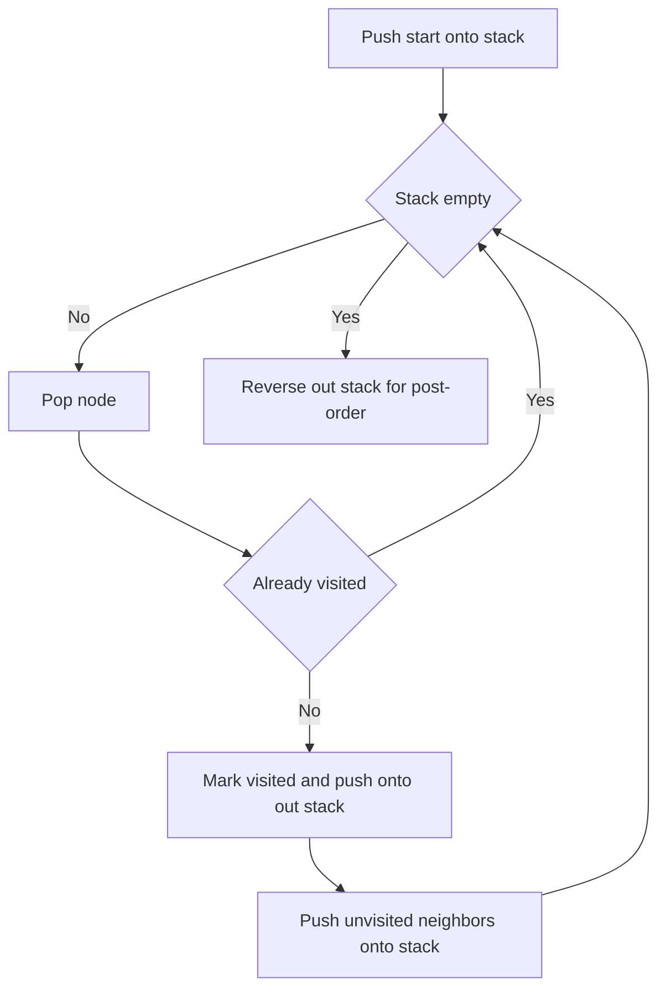

# Lecture 2 — Iterative DFS

> **Duration:** ~2 hours.
> **Outcome:** You can write the iterative DFS template with an explicit stack from memory, defend why pushing children in reverse preserves pre-order parity with the recursive version, and know when iterative DFS is mandatory (recursion-limit risk) versus optional (readability).

Lecture 1 covered the recursive form. This lecture covers the **iterative form** — DFS with an explicit `list`-as-stack instead of the implicit call stack. The asymptotic complexity is unchanged (`O(V + E)` time, `O(V)` space), but the constant factor on space is *lower* in practice (no per-call frame overhead), and the implementation does not hit Python's recursion limit.

By the end of this lecture you should be able to:

- Write the iterative DFS template in under 90 seconds without notes.
- Defend the *push-children-in-reverse* trick that makes iterative pre-order parity-preserving with the recursive version.
- State when to choose iterative over recursive in interview Match: "for `V > 1000` or when the depth is unbounded by the input shape."
- Recognize that iterative *post-order* is harder than iterative pre-order — and choose between the three implementation patterns (two-stack, reverse-pre-order, or single-stack with state tags).

This lecture is shorter than Lecture 1 because the algorithm is the same — only the data-structure choice changes. Most interview problems accept either form; the iterative version is the "robust production code" answer when asked "what would you change for `V = 10⁶`?"

---

## 1. Why iterative DFS exists

Three reasons to prefer the iterative form:

1. **Python's recursion limit is 1000 frames by default.** A path graph of length ≥ 1000 will crash recursive DFS with `RecursionError: maximum recursion depth exceeded in comparison`. The iterative form has no such bound — the stack lives on the heap, which is bounded only by available memory.
2. **Per-frame overhead is higher than per-stack-entry overhead.** Each Python function call allocates a frame object (~200 bytes) plus argument binding and local-variable setup. An entry in a `list` stack is one reference (~28 bytes). For `V = 10⁵`, the constant factor difference is about 5x on memory.
3. **Iterative DFS is easier to interrupt or step through.** The state of the traversal is the explicit stack; you can pause, serialize, and resume. The recursive version's state is implicit in the call stack and not easily inspectable.

Reasons to *prefer* the recursive form:

1. **Shorter code.** Recursive DFS is six lines; iterative DFS is twelve.
2. **Cleaner post-order.** Post-order DFS is one line of code change in the recursive version (move `process(node)` to after the loop); the iterative form requires either two stacks or a state-tag trick.
3. **Cleaner backtracking.** Backtracking (Week 8) is naturally recursive — the "undo" step happens after the recursive call returns. Iterating it requires explicit "do" / "undo" tagging on each stack entry.

The Match-step move: **use recursive DFS unless `V > 1000` or you need to interrupt the traversal**. State this out loud. The interviewer will either say "iterative version, please" or accept the recursive version.

---

## 2. The canonical iterative template (pre-order)

```python
from typing import Hashable, Callable, Iterable

def dfs_iterative(
    start: Hashable,
    neighbors_fn: Callable[[Hashable], Iterable[Hashable]],
) -> set[Hashable]:
    """Return the set of nodes reachable from start, via iterative pre-order DFS."""
    visited: set[Hashable] = set()
    stack: list[Hashable] = [start]
    while stack:
        node = stack.pop()
        if node in visited:
            continue
        visited.add(node)
        for nbr in neighbors_fn(node):
            if nbr not in visited:
                stack.append(nbr)
    return visited
```

Twelve lines. Memorize the shape.

Five observations:

1. **`stack: list[Hashable] = [start]`** — the stack is just a Python `list`. `list.append()` and `list.pop()` are both `O(1)` amortized. Unlike BFS (`deque.popleft()` is `O(1)`, `list.pop(0)` is `O(n)`), DFS pops from the end, where `list.pop()` is already `O(1)`. No `deque` needed.
2. **`if node in visited: continue`** — the visited check happens at *pop time*, not push time. This is the discriminator with the recursive form: the recursive `dfs()` is only called for unvisited nodes (the check is on the calling side); iterative DFS pushes possibly-duplicate entries and filters at pop time. Both are correct; the iterative form's check is at pop time because a node can be pushed multiple times before being popped (from multiple unvisited predecessors).
3. **`visited.add(node)`** happens *after* the visited check and *before* exploring neighbors — the same "mark on entry" discipline as the recursive form.
4. **`for nbr in neighbors_fn(node): if nbr not in visited: stack.append(nbr)`** — push neighbors in iteration order. The push-time visited check is an optimization (avoids pushing already-finished nodes); the pop-time check is the correctness invariant.
5. **Pop-time visited check is *required*.** Push-time check alone is not sufficient: a node can be pushed once, then before it pops, another DFS path pushes it again, and the second push sneaks past a push-time check because the first push hasn't been visited yet. The pop-time check is the canonical invariant.

### Time and space

- **Time: `O(V + E)`.** Every node is pushed and popped at most a bounded number of times (the stack may contain duplicates, but each pop after the first is filtered as visited). Every edge is examined at most twice (once from each endpoint). Total work is linear in graph size.
- **Space: `O(V)`.** The visited set holds up to `V` entries; the stack holds at most `O(V)` entries (including possible duplicates, but duplicates are bounded by the in-degree of each node — total across the algorithm is `O(E)`).

Defense sentence:

> "**O(V + E) time** — every node is popped at most a bounded number of times (the stack can contain duplicates from multiple predecessors, but each pop after the first is filtered as visited); every edge is examined at most twice. **O(V) space** — the visited set is `O(V)`; the stack is `O(V)` in the worst case (a path graph). The iterative form avoids Python's recursion-depth limit, at the cost of slightly more code than the recursive version."

---

## 3. Why "push children in reverse" preserves pre-order

If you want the iterative pre-order to visit nodes in the *same order* as the recursive pre-order, you must push children in **reverse iteration order**.

The reason is the LIFO discipline of the stack: the last child pushed is the first child popped. The recursive version processes children left-to-right (in iteration order); the iterative version, if it pushes left-to-right, pops them right-to-left. To match, push right-to-left.

```python
def dfs_iterative_preorder_matched(
    start: Hashable,
    neighbors_fn: Callable[[Hashable], Iterable[Hashable]],
) -> list[Hashable]:
    """Iterative pre-order DFS that matches the recursive visit order."""
    visited: set[Hashable] = set()
    order: list[Hashable] = []
    stack: list[Hashable] = [start]
    while stack:
        node = stack.pop()
        if node in visited:
            continue
        visited.add(node)
        order.append(node)
        # Push children in REVERSE so they pop in forward order.
        for nbr in reversed(list(neighbors_fn(node))):
            if nbr not in visited:
                stack.append(nbr)
    return order
```

The discriminator is `reversed(list(neighbors_fn(node)))` on line 14. Without `reversed`, the iterative traversal *still visits every reachable node* — it just visits them in a different order than the recursive form.

Whether the order matters depends on the problem. For pure connectivity (Exercise 1) — order is irrelevant; both forms answer the same question. For Word Ladder II (which counts all shortest paths) — order is irrelevant; the set of paths is the same. For problems where the *first* path found matters (e.g., the first valid topological order produced by Kahn's varies with tie-breaking) — order is relevant; choose deliberately.

The interview-tell move: **if the problem cares about visit order, push children in reverse and state out loud that you are doing so**. *"Pushing children in reverse so the iterative pre-order matches the recursive — same visit order, no behavior change."*

---

## 4. Iterative post-order — three implementation patterns

Iterative post-order is harder than iterative pre-order. The recursive form processes a node *after* all descendants finish; the iterative form must somehow defer the processing until the children have been popped and finished.

### Pattern A — two-stack (the standard textbook answer)

```python
def dfs_iterative_postorder_two_stack(
    start: Hashable,
    neighbors_fn: Callable[[Hashable], Iterable[Hashable]],
) -> list[Hashable]:
    """Iterative post-order via the two-stack trick."""
    if start is None:
        return []
    visited: set[Hashable] = set()
    out_stack: list[Hashable] = []
    stack: list[Hashable] = [start]
    while stack:
        node = stack.pop()
        if node in visited:
            continue
        visited.add(node)
        out_stack.append(node)
        for nbr in neighbors_fn(node):
            if nbr not in visited:
                stack.append(nbr)
    # out_stack is in reverse post-order; reverse for post-order.
    out_stack.reverse()
    return out_stack
```

The trick: do a pre-order-like traversal, collecting nodes in an `out_stack`. Because we pop in LIFO order, `out_stack` ends up in *reverse post-order*. Reverse it for post-order.

This is the canonical implementation for topological sort via DFS — *reverse post-order is a topological order* on a DAG. Lecture 3 builds on this.


*Pattern A: a pre-order-style sweep collects nodes, then one reversal turns it into post-order.*

### Pattern B — state-tag (single stack with visit markers)

```python
def dfs_iterative_postorder_state_tag(
    start: Hashable,
    neighbors_fn: Callable[[Hashable], Iterable[Hashable]],
) -> list[Hashable]:
    """Iterative post-order via state-tag single stack."""
    DESCEND, EMIT = 0, 1
    visited: set[Hashable] = set()
    out: list[Hashable] = []
    stack: list[tuple[int, Hashable]] = [(DESCEND, start)]
    while stack:
        state, node = stack.pop()
        if state == EMIT:
            out.append(node)
            continue
        if node in visited:
            continue
        visited.add(node)
        # Re-push self as EMIT (will pop AFTER children).
        stack.append((EMIT, node))
        # Push children in reverse for forward-order processing.
        for nbr in reversed(list(neighbors_fn(node))):
            if nbr not in visited:
                stack.append((DESCEND, nbr))
    return out
```

The trick: each node is pushed twice. First as `(DESCEND, node)` — when popped, the children are pushed and `node` is re-pushed as `(EMIT, node)`. The re-push lives below the children on the stack, so the children pop and process first; when `node` finally pops in `EMIT` state, the children are all finished.

This pattern generalizes: any "do something after recursion returns" can be encoded as a state tag on the stack. It is the iterative analogue of backtracking and is the pattern of choice for the iterative version of "in-order traversal" and "iterative deepening."

### Pattern C — Morris traversal (no stack at all)

For binary trees only, Morris traversal achieves `O(1)` auxiliary space by temporarily mutating the tree to thread parent pointers through unused right-child links. Out of scope this week; mention it in interview as "the constant-space tree traversal" if asked about space optimizations.

### Which pattern when

| Goal | Pattern |
|------|---------|
| Topological sort via DFS post-order | A (two-stack, reverse) |
| Generic post-order with custom processing | B (state-tag) |
| Constant-space binary tree traversal | C (Morris) |

Pattern A is the simplest and works for topological sort. Pattern B is the more general "iterative-recursion" trick that powers iterative backtracking. Memorize A; understand B; mention C if asked.

---

## 5. Iterative DFS on a tree — the typical case

The canonical iterative tree-DFS pre-order:

```python
class TreeNode:
    def __init__(self, val: int = 0, left: "TreeNode | None" = None, right: "TreeNode | None" = None) -> None:
        self.val = val
        self.left = left
        self.right = right

def preorder_iterative(root: TreeNode | None) -> list[int]:
    if root is None:
        return []
    out: list[int] = []
    stack: list[TreeNode] = [root]
    while stack:
        node = stack.pop()
        out.append(node.val)
        # Push right then left, so left pops first (pre-order).
        if node.right is not None:
            stack.append(node.right)
        if node.left is not None:
            stack.append(node.left)
    return out
```

Eleven lines. Two things to note:

1. **No visited set on a tree.** Trees have no cycles; each node is reachable from the root via exactly one path. The visited set is unnecessary.
2. **`if node.right is not None`** filters `None` children before pushing. Without this, the next pop hits `None.val` and crashes.

The classic in-order iterative pattern (binary trees specifically) uses Pattern B's "state-tag" idea implicitly — descend left as far as possible, then emit, then descend right:

```python
def inorder_iterative(root: TreeNode | None) -> list[int]:
    out: list[int] = []
    stack: list[TreeNode] = []
    node = root
    while node is not None or stack:
        while node is not None:
            stack.append(node)
            node = node.left
        node = stack.pop()
        out.append(node.val)
        node = node.right
    return out
```

Eleven lines. The outer `while` runs until both the current node and the stack are exhausted. The inner `while` descends left; the `pop` and emit happen when there is no more left; the `node = node.right` queues the right subtree for the next outer iteration.

This is the cleanest iterative tree traversal pattern and is worth memorizing — it appears in Mock #2 as a "implement iterator over a BST" subproblem.

---

## 6. Common pitfalls

### Pitfall 1 — pop-time check missing

```python
stack = [start]
visited = set()
while stack:
    node = stack.pop()
    visited.add(node)              # WRONG — no pre-check
    for nbr in neighbors_fn(node):
        if nbr not in visited:
            stack.append(nbr)
```

If `node` is pushed twice (from two different unvisited predecessors), it will be popped twice. The second pop re-processes the node — extra work, possibly incorrect side effects if `process(node)` is not idempotent. Add the pop-time visited check.

### Pitfall 2 — using `pop(0)` instead of `pop()`

```python
stack = [start]
while stack:
    node = stack.pop(0)            # WRONG — this is BFS, not DFS.
    ...
```

`pop(0)` removes from the front of the list — that is FIFO, which is BFS, not DFS. Use `pop()` (which defaults to popping from the end, LIFO). Also: `list.pop(0)` is `O(n)`, while `deque.popleft()` is `O(1)` — if you want BFS, use `deque`.

### Pitfall 3 — recursion-limit on the recursive version

```python
import sys
sys.setrecursionlimit(10000)       # WORKAROUND, not a fix
def dfs(node, adj, visited):
    visited.add(node)
    for nbr in adj.get(node, []):
        if nbr not in visited:
            dfs(nbr, adj, visited)
```

`setrecursionlimit(10000)` works for most LeetCode inputs but can crash if the input grows further. The right fix is to convert to iterative; setrecursionlimit is the temporary patch.

In interview: state "I will use recursive DFS; if `V` could exceed 1000 I would switch to iterative" — this is the senior signal. Setting the recursion limit silently is the junior signal.

### Pitfall 4 — building `list(neighbors_fn(node))` repeatedly

```python
for nbr in reversed(list(neighbors_fn(node))):    # OK
    stack.append(nbr)

# vs

for nbr in reversed(neighbors_fn(node)):           # WRONG if neighbors_fn returns a generator
    stack.append(nbr)
```

`reversed()` requires a sized sequence. If `neighbors_fn` returns a generator, the call fails. Either materialize via `list()`, or define `neighbors_fn` to always return a list.

The interview-tell move: when a Python type-checker would flag this, fix it before writing the test. Type hints on the neighbor function would catch this in linting.

---

## 7. Worked example: number of islands (LC 200), iterative

Exercise 1 is the recursive version. The iterative version is a one-stack-deep change.

**[U — 1 minute]**

> "Given an `m × n` 2-D grid where `1` is land and `0` is water, return the number of islands (maximal 4-connected regions of land). Confirm: 4-directional adjacency; the grid is implicit; the visited set is on `(r, c)` tuples."

**[M — 30 seconds]**

> "Grid-DFS for connectivity. Walk the grid; when finding an unvisited land cell, run iterative DFS from it to mark its entire connected component. Increment the island counter. Iterative because the grid could be `300 × 300 = 90000` cells, and a snake-shaped island would blow the recursion limit. Why not BFS: same asymptotic complexity; DFS is shorter. Why not union-find: works equally well; DFS is structurally simpler."

**[P — 1 minute]**

> "Outer loop: for each cell `(r, c)`, if `grid[r][c] == '1'` and `(r, c) not in visited`, increment islands and run iterative DFS. DFS body: stack initialized with `[(r, c)]`. While stack: pop, skip if visited, mark visited, push 4-direction land neighbors that are unvisited."

**[I — 3 minutes]**

```python
from typing import List

def num_islands(grid: List[List[str]]) -> int:
    if not grid or not grid[0]:
        return 0
    m, n = len(grid), len(grid[0])
    visited: set[tuple[int, int]] = set()
    islands = 0
    DIRS: List[tuple[int, int]] = [(-1, 0), (1, 0), (0, -1), (0, 1)]
    for r in range(m):
        for c in range(n):
            if grid[r][c] != "1" or (r, c) in visited:
                continue
            islands += 1
            stack: List[tuple[int, int]] = [(r, c)]
            while stack:
                cr, cc = stack.pop()
                if (cr, cc) in visited:
                    continue
                visited.add((cr, cc))
                for dr, dc in DIRS:
                    nr, nc = cr + dr, cc + dc
                    if (
                        0 <= nr < m
                        and 0 <= nc < n
                        and grid[nr][nc] == "1"
                        and (nr, nc) not in visited
                    ):
                        stack.append((nr, nc))
    return islands
```

**[R — 1 minute]**

> "Trace on `[['1','1','0'],['0','1','0'],['0','0','1']]`. r=0, c=0: land, not visited. islands=1. stack=[(0,0)]. Pop (0,0); mark; push (1,0)? No, water. Push (0,1) land. Stack=[(0,1)]. Pop (0,1); mark; push (0,0) visited, push (0,2) water, push (1,1) land. Stack=[(1,1)]. Pop (1,1); mark; push neighbors — all water or visited. Stack empty. Move on. r=0, c=1: visited. r=0, c=2: water. r=1, c=0: water. r=1, c=1: visited. r=1, c=2: water. r=2, c=0: water. r=2, c=1: water. r=2, c=2: land, not visited. islands=2. Single-cell DFS. Done. Return 2. ✓"

**[E — 1 minute]**

> "**Time `O(m × n)`** — every cell is visited at most once across all DFS calls; the outer loop is `O(m × n)`. **Space `O(m × n)`** for the visited set; the stack worst case is also `O(m × n)` (a single snake-shaped island). Tradeoff: recursive DFS is `O(m × n)` time, same space, but risks `RecursionError` for snake-shaped islands with `m × n > 1000`. Iterative DFS is strictly safer. Best `O(m × n)` (we always scan the grid); worst `O(m × n)`."

---

## 8. Defense sentence — the recursion-limit caveat

In Mock #2, if you draw a DFS problem with `V > 1000` in the input bounds, the interview tell is whether you **mention the recursion-limit risk in Match before writing code**.

> "I will write recursive DFS for clarity. The input bound says `V ≤ 10⁵`, which is past Python's default recursion limit of 1000. For an adversarial input shaped as a long chain, the recursive version would crash. My options: (a) `sys.setrecursionlimit(10**6)` as a workaround; (b) convert to iterative DFS with an explicit stack — same asymptotic, safer constant. For interview clarity I will write the recursive version; if asked to harden for production I would convert."

That cadence is the senior signal. Saying it cleanly is what distinguishes "I wrote DFS" from "I understand DFS's failure modes."

---

## 9. The 30-second sub-shape recognition

Two sub-shapes for DFS:

1. **Recursive DFS** — when `V ≤ 1000` (or you have permission to raise the recursion limit). Cleaner code, easier post-order.
2. **Iterative DFS** — when `V > 1000`, when you need to interrupt the traversal, or when the interviewer asks for the explicit-stack version.

The decision rule in 5 seconds:

```
V <= 1000?
├── Yes ──→ Recursive DFS (default; cleaner)
└── No  ──→ Iterative DFS (mandatory; recursion-limit risk)
```

If the input bound is unclear, ask in Understand: *"What is the maximum size of `V`?"* The answer dictates the form.

---

## 10. Self-check

Without notes, answer:

1. **Why does iterative DFS use `list.pop()` (not `list.pop(0)`)?** (`pop()` is `O(1)` and produces LIFO order, which is DFS. `pop(0)` is `O(n)` and produces FIFO order, which would be BFS — and slow BFS at that.)
2. **What does "push children in reverse" achieve?** (It makes iterative pre-order match the recursive pre-order visit order. Without it, children are visited right-to-left instead of left-to-right.)
3. **Why do we need a pop-time visited check?** (Because a node can be pushed multiple times from different predecessors before any copy is popped. The push-time check alone misses these duplicates.)
4. **Name the three iterative post-order patterns.** (Two-stack reverse; state-tag single stack; Morris traversal for binary trees.)
5. **When should you choose iterative over recursive?** (When `V > 1000` or the graph could contain a chain longer than ~990 nodes; when you need to interrupt or serialize the traversal state.)
6. **What is the space complexity of iterative vs recursive DFS?** (Both `O(V)`. Recursive uses the call stack; iterative uses heap-allocated stack entries. Per-entry constant is smaller for iterative.)

If you can answer all six without hesitation, proceed to [Lecture 3 — Topological Sort](./03-topological-sort.md).

---

## 11. Why this matters

Iterative DFS is what production-grade graph traversal *looks like*. Every real system that walks a large graph — a build system computing the topological order of 100k build targets, a garbage collector marking 10M live objects, a route planner expanding 500k road-segment nodes — uses iterative DFS or BFS with an explicit work queue. Recursive DFS is a teaching tool and a LeetCode shortcut; iterative DFS is the artifact you would ship.

For interview purposes, the discriminator is whether you can write *both* fluently. If you can write the recursive version and state out loud that you would convert for production, the interviewer hears "this person understands the engineering trade-off." If you can also write the iterative version on demand, the interviewer hears "this person has shipped graph code."

The exercises and mini-project this week grade both. Exercise 1 is recursive; Exercise 2 is mandated iterative; Exercise 3 (topological sort) is free choice with a defense. The mini-project's DFS problem may be either; the topo problem typically pairs cleanly with Kahn's (iterative by construction) or DFS post-order (recursive but with the iterative two-stack version mentioned as the alternative).

---

## Further reading

- **Wikipedia — Depth-first search** (Pseudocode section): <https://en.wikipedia.org/wiki/Depth-first_search#Pseudocode> — both recursive and iterative pseudocode side-by-side.
- **CSES Competitive Programmer's Handbook — Chapter 12**: <https://cses.fi/book/book.pdf> — twenty minutes.
- **LeetCode 200, 695, 547, 1971** — the four problems that anchor iterative-DFS-on-grids. Homework Problem 1 covers one; the others are stretch.

Next: [Lecture 3 — Topological Sort](./03-topological-sort.md). Topological sort is the canonical Phase-2 graph problem; Lecture 3 covers both the DFS post-order method and Kahn's BFS-shaped method, plus the three-color invariant for directed cycle detection.
