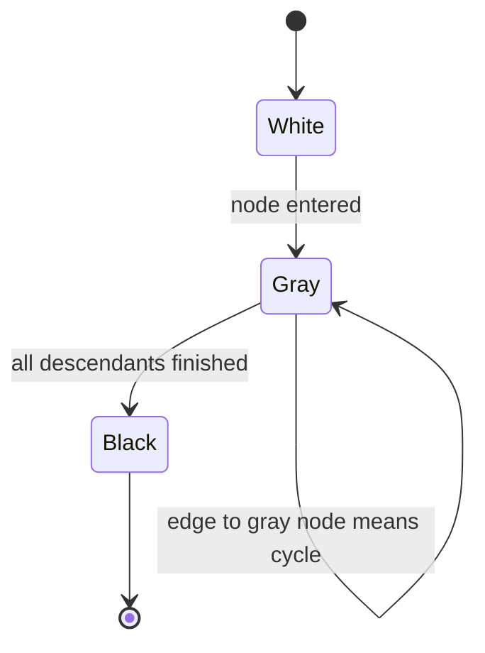
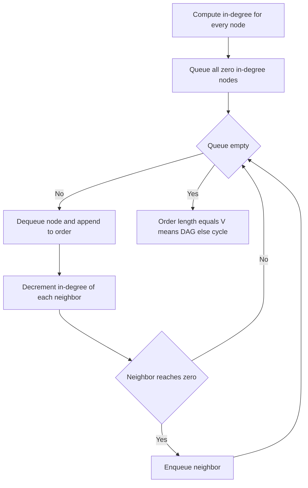

# Lecture 3 — Topological Sort and Cycle Detection

> **Duration:** ~2 hours.
> **Outcome:** You can write Kahn's algorithm and DFS post-order topological sort from memory; you can state the three-color invariant and use it to detect cycles in a directed graph; you can defend the choice between Kahn and DFS post-order out loud per problem.

Lecture 1 covered recursive DFS. Lecture 2 covered iterative DFS. This lecture covers the **two highest-leverage Phase-2 applications** of DFS: cycle detection in a directed graph (the three-color invariant) and topological sort (two algorithms, both `O(V + E)`).

Topological sort is the canonical Week-7 problem and is graded heavily in Mock #2. Course Schedule (LC 207) and Course Schedule II (LC 210) — the two textbook problems — are both in the homework or exercises. By Sunday you should be able to read either prompt and write the canonical Kahn or DFS post-order template without notes, in under three minutes.

By the end of this lecture you should be able to read a graph problem and, within 30 seconds, say one of three things out loud: "Topological sort — Kahn's algorithm with in-degree array," "Topological sort — DFS post-order with three-color cycle check," or "Cycle detection only — DFS with three-color invariant, no order produced."

---

## 1. What topological sort means

A **topological sort** (also called a topological order or topological ordering) of a directed graph is a linear ordering of its nodes such that for every directed edge `u → v`, node `u` appears before `v` in the ordering.

**Existence theorem.** A topological order exists if and only if the graph is a **DAG** (directed acyclic graph). A graph with a cycle has no topological order — for any cycle `u → v → … → u`, you would need `u` before `v` and `v` before `u`, a contradiction.

**Uniqueness.** A topological order is *not* unique in general. A DAG with two zero-in-degree nodes admits at least two distinct topological orders. Most interview problems ask for *any* valid order, not a specific one.

Visualization on a small DAG:

```
    A
   / \
  B   C
  |   |
  D   E
   \ /
    F
```

Valid topological orders: `A, B, C, D, E, F` — or `A, C, B, E, D, F` — or `A, B, D, C, E, F`. All three respect the edge directions: no edge points "backward."

The pattern's power comes from two equivalent observations:

1. **Kahn's framing.** "Repeatedly remove a zero-in-degree node from the graph, append it to the output, and decrement the in-degrees of its neighbors. If the graph becomes empty, the appended order is a topological order. If a non-empty subgraph remains with no zero-in-degree nodes, the graph has a cycle."
2. **DFS framing.** "Run DFS. Post-order finish times reverse-order is a topological order. A back-edge to a gray node during DFS reveals a cycle."

Both algorithms run in `O(V + E)`. Both detect cycles as a by-product. The choice between them is on code structure (iterative vs recursive) and on what extra information you want (Kahn computes "all valid orders" extensions naturally; DFS computes SCCs naturally).

---

## 2. The three-color invariant — directed cycle detection

Before topological sort, master the three-color invariant. It is the cleanest cycle-detection technique for directed graphs and is the underlying invariant that makes DFS-based topological sort correct.

**The three colors.**

| Color | Meaning |
|-------|---------|
| **White** (`0`) | Unvisited |
| **Gray** (`1`) | On the current DFS path (entered, not yet finished) |
| **Black** (`2`) | Finished — DFS has exited this node and all descendants |

**The invariant.** A node is gray if and only if it is on the current DFS recursion stack.

**The cycle test.** A directed edge from `u` to a gray node `v` is a **back-edge** — `v` is an ancestor of `u` in the DFS tree. A back-edge is a cycle.

A directed edge from `u` to a black node `v` is *not* a cycle. `v` is finished — that subtree is fully explored and we are crossing over to it from a different branch. This is called a **cross-edge** (or forward-edge in certain DFS classifications); it does not indicate a cycle.


*A node moves white to gray to black; an edge landing back on a gray node is the cycle signal.*

### Canonical template

```python
from typing import Dict, List

def has_cycle_directed(adj: Dict[int, List[int]]) -> bool:
    """Return True if the directed graph contains a cycle."""
    WHITE, GRAY, BLACK = 0, 1, 2
    color: Dict[int, int] = {v: WHITE for v in adj}

    def dfs(node: int) -> bool:
        color[node] = GRAY
        for nbr in adj.get(node, []):
            if color.get(nbr, WHITE) == GRAY:
                return True                # back-edge — cycle
            if color.get(nbr, WHITE) == WHITE:
                if dfs(nbr):
                    return True
            # color[nbr] == BLACK: cross-edge; not a cycle, no recursion needed.
        color[node] = BLACK
        return False

    for v in list(adj):
        if color[v] == WHITE:
            if dfs(v):
                return True
    return False
```

Eighteen lines. Three observations:

1. **`color[node] = GRAY`** on entry; **`color[node] = BLACK`** on exit. The gray → black transition is the "I am finished" signal — and is exactly when DFS post-order would *emit* this node.
2. **The cycle check is `color[nbr] == GRAY`** — back-edge detection. Without this check, the algorithm is correct on DAGs but fails to detect cycles on non-DAGs.
3. **The outer loop handles disconnected graphs.** A directed graph may have multiple components; we must start DFS from every unvisited node. This is the same disconnected-component handling used in connected-component counting (Exercise 1).

### Time and space

- **Time: `O(V + E)`.** Standard DFS.
- **Space: `O(V)`.** Color array plus recursion stack.

### Defense sentence

> "The three-color invariant: a node is gray if and only if it is currently on the DFS recursion stack. A directed edge from `u` to a gray node is a back-edge — `u`'s ancestor in the DFS tree — and any back-edge in a directed graph is a cycle. A directed edge to a black node is a cross-edge to a finished subtree; not a cycle. The invariant is `O(V + E)` time and `O(V)` space; identical asymptotics to plain DFS, with the color array as the only added state."

That cadence is the senior signal for any "is this graph a DAG?" question.

---

## 3. Topological sort via DFS post-order

The DFS-based algorithm: run DFS on every unvisited node; emit each node in *post-order* (after all descendants finish); the reverse of the post-order emission is a topological order.

**Why it works.** When DFS finishes a node `u`, every node reachable from `u` has already finished. Therefore `u` is emitted *after* all its descendants in the DFS tree, which means *before* them when the list is reversed. For a DAG, descendants in the DFS tree are exactly the nodes reachable via outgoing edges — so reverse post-order respects edge direction.

**With cycle detection built in.** Combine with the three-color invariant: if DFS finds a back-edge (an outgoing edge to a gray node), the graph has a cycle and no topological order exists.

### Canonical template

```python
from typing import Dict, List, Optional

def topological_sort_dfs(adj: Dict[int, List[int]], n: int) -> Optional[List[int]]:
    """
    Return a topological order of an n-node DAG with adjacency list `adj`.
    Nodes are integers 0..n-1. Returns None if the graph has a cycle.
    """
    WHITE, GRAY, BLACK = 0, 1, 2
    color: List[int] = [WHITE] * n
    order: List[int] = []

    def dfs(node: int) -> bool:
        color[node] = GRAY
        for nbr in adj.get(node, []):
            if color[nbr] == GRAY:
                return False               # cycle detected
            if color[nbr] == WHITE:
                if not dfs(nbr):
                    return False
        color[node] = BLACK
        order.append(node)                 # post-order emit
        return True

    for v in range(n):
        if color[v] == WHITE:
            if not dfs(v):
                return None
    order.reverse()
    return order
```

Eighteen lines. Three observations:

1. **`order.append(node)` happens after the children loop** — this is the post-order emission. The node is recorded *after* all descendants have finished.
2. **`order.reverse()`** at the end produces the topological order. The reverse of post-order respects edge direction on a DAG.
3. **`return False` from `dfs` short-circuits the cycle.** When a cycle is detected, we propagate `False` up the call chain and return `None` from the outer function. No partial order is returned.

### Time and space

- **Time: `O(V + E)`.** Standard DFS work plus the post-order emit.
- **Space: `O(V)`.** Color array, output list, recursion stack.

### Defense sentence

> "DFS post-order topological sort: emit each node in post-order; reverse the emission list. The correctness argument is the three-color invariant — a node is finished only after all its descendants are finished, which by DAG-edge direction means it must come *before* them in the topological order; reversing post-order achieves that. `O(V + E)` time, `O(V)` space. Cycle detection is automatic: a back-edge to a gray node aborts the algorithm. Trade against Kahn: recursive, cleaner if you already need DFS for SCCs; Kahn is iterative and naturally extends to 'find all valid orders.'"

---

## 4. Topological sort via Kahn's algorithm

The BFS-shaped algorithm: maintain an **in-degree array**; the initial queue contains every zero-in-degree node; on dequeue, append the node to the output and decrement the in-degrees of its neighbors; any neighbor that drops to zero in-degree is enqueued.

**Why it works.** A zero-in-degree node has no prerequisites — it can be the next element of a topological order. After "removing" it (appending to the output and decrementing neighbor in-degrees), the resulting subgraph still admits a valid topological order; repeat.

**Cycle detection by exhaustion.** If after the algorithm terminates the output has fewer than `V` entries, the graph contains a cycle — some nodes never reached zero in-degree because they participated in a cycle.


*Kahn peels off zero in-degree nodes one at a time until the graph is empty or stuck.*

### Canonical template

```python
from collections import deque
from typing import Dict, List, Optional

def topological_sort_kahn(adj: Dict[int, List[int]], n: int) -> Optional[List[int]]:
    """
    Return a topological order of an n-node DAG with adjacency list `adj`.
    Nodes are integers 0..n-1. Returns None if the graph has a cycle.
    """
    in_degree: List[int] = [0] * n
    for u in range(n):
        for v in adj.get(u, []):
            in_degree[v] += 1
    queue: deque[int] = deque(v for v in range(n) if in_degree[v] == 0)
    order: List[int] = []
    while queue:
        node = queue.popleft()
        order.append(node)
        for nbr in adj.get(node, []):
            in_degree[nbr] -= 1
            if in_degree[nbr] == 0:
                queue.append(nbr)
    if len(order) != n:
        return None                        # cycle: some nodes never reached zero
    return order
```

Sixteen lines. Three observations:

1. **In-degree computation.** Walk every edge once; increment the target's in-degree. This is `O(V + E)` — `O(V)` for initializing the array, `O(E)` for the increments.
2. **Initial seed.** Every zero-in-degree node enters the queue. For a DAG, there is always at least one such node (otherwise, follow incoming edges backward indefinitely → cycle).
3. **Cycle detection.** If `len(order) != n`, the algorithm did not consume every node — the remaining nodes form a cycle (each has positive in-degree from inside the cycle, so none ever queued).

### Time and space

- **Time: `O(V + E)`.** The in-degree computation is `O(V + E)`; the queue loop visits each node once and decrements each edge's target once.
- **Space: `O(V)`.** In-degree array, queue, output list.

### Defense sentence

> "Kahn's algorithm: repeatedly remove a zero-in-degree node from the graph, append it to the order, and decrement neighbor in-degrees. Any neighbor that drops to zero is queued. The invariant: nodes in the output have no remaining prerequisites — they can be safely processed next. `O(V + E)` time and space. Cycle detection is by exhaustion: if the output has fewer than `V` nodes, some nodes never reached zero in-degree — they participate in a cycle. Trade against DFS post-order: iterative (no recursion-limit risk), naturally extends to 'enumerate all valid orders' via backtracking on choice of zero-in-degree node."

---

## 5. The decision — Kahn or DFS post-order?

Both algorithms are `O(V + E)`. Both detect cycles as a by-product. The choice is on code structure and on the extra information you need.

| Question | Kahn | DFS post-order |
|----------|:----:|:--------------:|
| Just need *any* topological order | ✓ | ✓ |
| Cycle detection without order | both work; the three-color version is cleaner | both work |
| Need *all* topological orders | ✓ (backtrack on zero-in-degree choices) | possible but awkward |
| Need to detect cycles *and* produce a partial order | both work | ✓ (more natural) |
| Need SCCs (strongly-connected components) | no (BFS-shaped, no post-order) | ✓ (Tarjan/Kosaraju) |
| Streaming graph (edges arrive over time) | ✓ (decrement in-degrees as edges arrive) | no (need full graph) |
| Recursion-limit concerns (`V > 1000`) | ✓ (iterative) | mandatory iterative two-stack version |
| Cleaner code on a balanced DAG | tie | tie |
| Cleaner code on a sparse DAG | ✓ (less in-degree bookkeeping vs DFS) | tie |

The default for Phase-2 interviews: **Kahn's algorithm**, because it is iterative, has no recursion-limit risk, and the in-degree computation is a clean and inspectable invariant. State this out loud in Research constraints: *"I will use Kahn's algorithm because the input bound is `V ≤ 10⁵` and Kahn is iterative — no recursion limit, no `setrecursionlimit` workaround."*

If the problem specifically asks for **cycle detection with a partial order on failure** (rare but real), DFS post-order is cleaner — you get the order up to the cycle's first node naturally. If the problem asks for **SCCs**, you need Tarjan or Kosaraju — both DFS post-order. If you anticipate a follow-up like "enumerate all valid orders" (interviewers love this), Kahn extends naturally.

---

## 6. Worked example: course schedule II (LC 210)

This is **the** canonical topological-sort interview problem and Exercise 3 of this week. Memorize the structure.

### Problem

You are given `numCourses` courses labeled `0..numCourses-1` and a list of prerequisites where `[a, b]` means "to take course `a`, you must first complete course `b`." Return *any* valid order in which the courses can be taken. If it is impossible (cycle in the prerequisite graph), return an empty array.

### The reframe

> "Build a directed graph where an edge `b → a` means 'b is a prerequisite of a.' Run topological sort. If the graph has a cycle, return `[]`; else return the topological order."

### Step 1 — Build the graph

```python
adj: dict[int, list[int]] = defaultdict(list)
for a, b in prerequisites:
    adj[b].append(a)
```

`[a, b]` means "b before a" → edge `b → a`. The Kahn in-degree array counts incoming edges; the in-degree of `a` is the number of prerequisites of `a`.

### Step 2 — Kahn's topological sort

Standard template from §4. Initial queue contains every course with zero prerequisites.

### Step 3 — Cycle check

If the output has fewer than `numCourses` entries, return `[]`; else return the order.

### Code

```python
from collections import defaultdict, deque
from typing import List

def find_order(num_courses: int, prerequisites: List[List[int]]) -> List[int]:
    adj: dict[int, list[int]] = defaultdict(list)
    in_degree: List[int] = [0] * num_courses
    for a, b in prerequisites:
        adj[b].append(a)
        in_degree[a] += 1
    queue: deque[int] = deque(c for c in range(num_courses) if in_degree[c] == 0)
    order: List[int] = []
    while queue:
        c = queue.popleft()
        order.append(c)
        for nxt in adj[c]:
            in_degree[nxt] -= 1
            if in_degree[nxt] == 0:
                queue.append(nxt)
    return order if len(order) == num_courses else []
```

Sixteen lines. Direct application of the Kahn template.

### Complexity

- **Time: `O(V + E)`** — `V = numCourses`, `E = len(prerequisites)`.
- **Space: `O(V + E)`** — adjacency list plus in-degree array plus output.

### Defense

> "**O(V + E) time** — the graph is built in `O(V + E)`, the in-degree computation is `O(V + E)`, and Kahn's loop visits each node once and decrements each edge's target once. **O(V + E) space** for the adjacency list. The cycle check is `len(order) != num_courses`: if some courses never reached zero in-degree, they participate in a cycle. Trade against DFS post-order: iterative (no recursion-limit risk for `V = 10⁵`), and Kahn naturally extends to 'list all valid course orders' via backtracking on choice of zero-in-degree node."

This is the cleanest Phase-2 topological sort write-up. Exercise 3 grades this template exactly.

---

## 7. Worked example: cycle detection via DFS

Course Schedule (LC 207) is the cycle-detection-only variant of Course Schedule II — return `True` if all courses can be finished (DAG), else `False`. We can use either the three-color DFS or Kahn (check `len(order) == num_courses`). Both are `O(V + E)`. Here is the DFS form, to drill the three-color invariant.

```python
from collections import defaultdict
from typing import List

def can_finish(num_courses: int, prerequisites: List[List[int]]) -> bool:
    adj: dict[int, list[int]] = defaultdict(list)
    for a, b in prerequisites:
        adj[b].append(a)
    WHITE, GRAY, BLACK = 0, 1, 2
    color: List[int] = [WHITE] * num_courses

    def dfs(node: int) -> bool:
        color[node] = GRAY
        for nbr in adj[node]:
            if color[nbr] == GRAY:
                return False               # cycle
            if color[nbr] == WHITE:
                if not dfs(nbr):
                    return False
        color[node] = BLACK
        return True

    for c in range(num_courses):
        if color[c] == WHITE:
            if not dfs(c):
                return False
    return True
```

Eighteen lines. The three-color invariant is the entire algorithm.

### The senior signal

Out loud, in Research constraints:

> "Two equivalent approaches: three-color DFS for cycle detection, or Kahn's algorithm checking whether the queue empties before all `V` nodes are processed. I will use the three-color DFS because the problem asks only for the yes/no, and the three-color invariant is the cleanest statement: a back-edge to a gray node is a cycle. If the problem asked for the order, I would use Kahn's instead."

Choosing the algorithm explicitly and defending the choice is the Research constraints skill being graded.

---

## 8. The 30-second recognition signals

Stop. Read the prompt slowly. Ask these in order:

1. **Does the prompt mention "topological order," "valid sequence," "build order," "course prerequisite," "task scheduling"?** Strong signal — topological sort.
2. **Does the prompt mention "all courses can be finished," "is this graph a DAG," "is there a cycle"?** Cycle detection — either three-color DFS or Kahn (then check the output size).
3. **Does the prompt mention "all valid orders" or "enumerate the topological sorts"?** Kahn's algorithm with backtracking on zero-in-degree choices.
4. **Is the input a directed graph (edges have a "from" and "to")?** Topo / cycle territory.
5. **Is the input an undirected graph?** Use undirected-DFS with parent-pointer cycle detection (Lecture 1 §12); topological sort does not apply to undirected graphs.

The 30-second decision tree:

```
prompt mentions "topological order" / "valid sequence" / "build order"?
├── Yes ──→ Topological sort
│   ├── just any order ──→ Kahn (default; iterative)
│   ├── all orders ──→ Kahn + backtracking
│   └── partial order on cycle failure ──→ DFS post-order
├── "cycle" / "is this a DAG"?
│   ├── directed ──→ DFS three-color invariant
│   └── undirected ──→ DFS parent-pointer (Lecture 1)
└── otherwise — re-read; the pattern is probably not topo
```

This decision tree is what we want in muscle memory by Sunday.

---

## 9. Common pitfalls

### Pitfall 1 — wrong edge direction

```python
adj = defaultdict(list)
for a, b in prerequisites:
    adj[a].append(b)               # WRONG — reverses the dependency
```

In Course Schedule, `[a, b]` means "b is a prerequisite of a" — the edge is `b → a` (do `b`, then `a`). Reversing the edge gives the wrong topological order (which is also a valid topo sort of the *reversed* graph, just not the one the problem asks for). Always read the prompt twice to fix the direction.

### Pitfall 2 — using DFS recursion on `V = 10⁵`

```python
sys.setrecursionlimit(10**6)
def dfs(node):
    ...                            # Works on LeetCode; risky in production
```

For `V > 1000`, recursive DFS in Python can crash. The setrecursionlimit workaround is acceptable but the cleaner answer is Kahn (iterative by construction). Research constraints move: state the recursion-limit risk before writing recursive code.

### Pitfall 3 — confusing undirected and directed cycle detection

```python
# WRONG: applying three-color to an undirected graph treats every back-half-edge
# as a cycle.
```

Undirected graphs need the parent-pointer technique (Lecture 1 §12). Directed graphs need the three-color invariant. The two algorithms are not interchangeable.

### Pitfall 4 — missing the disconnected case

```python
def topo(adj, n):
    return dfs(0)                  # WRONG — only covers nodes reachable from 0
```

The outer `for v in range(n)` loop handles disconnected components. Without it, you only get the topological order of the component containing node 0. For a graph with two disconnected DAGs, your output will be missing half the nodes.

### Pitfall 5 — emitting in the wrong order

```python
def dfs(node):
    order.append(node)             # WRONG — pre-order, not post-order
    color[node] = GRAY
    for nbr in adj[node]:
        ...
```

DFS topological sort requires *post-order* emission, not pre-order. Pre-order produces a depth-first traversal but does *not* respect edge direction. Always emit after the children loop.

### Pitfall 6 — Kahn with `list.pop(0)`

```python
queue = [v for v in range(n) if in_degree[v] == 0]
while queue:
    node = queue.pop(0)            # WRONG — O(n) per pop
    ...
```

`list.pop(0)` is `O(n)`. With `V` pops, total `O(V²)`. Use `collections.deque` and `popleft()` — same `O(1)` discipline as BFS in Week 6.

---

## 10. Self-check

Without notes, answer:

1. **State the three-color invariant.** (White = unvisited; gray = on the current DFS path; black = finished. A node is gray if and only if it is on the current recursion stack.)
2. **What is the cycle test in the three-color invariant?** (A directed edge from any node to a gray node is a back-edge — a cycle. A directed edge to a black node is a cross-edge — not a cycle.)
3. **Why does reverse post-order produce a topological order?** (A node finishes after all descendants finish; reversing the finish order puts the node *before* its descendants, which respects edge direction in a DAG.)
4. **State Kahn's algorithm in one sentence.** (Repeatedly remove a zero-in-degree node, append it to the order, and decrement the in-degrees of its outgoing neighbors; queue any neighbor that drops to zero in-degree.)
5. **How does Kahn detect a cycle?** (By exhaustion: if the output has fewer than `V` entries after the queue empties, some nodes never reached zero in-degree because they participate in a cycle.)
6. **When should you choose Kahn over DFS post-order?** (When `V > 1000` and recursion-limit is a risk; when you anticipate "enumerate all valid orders" as a follow-up; when the graph is streaming and edges arrive over time.)

If you can answer all six without hesitation, proceed to the [exercises](../exercises/README.md).

---

## 11. The bridge to Tarjan — preview

The week's [challenge](../challenges/challenge-01-chokepoint-mains.md) is **Chokepoint Mains** — finding the pipes whose failure splits a water network, using discovery times and low-links. The structural cousin: low-link is a *DFS post-order* computation, but instead of emitting nodes in reverse finish order, you compute a numerical value per node (the smallest discovery time reachable from the subtree). The post-order pattern is identical; the work-on-finish is different.

Mastery of Lecture 3 — the three-color invariant and the post-order emission — is the foundation for understanding Tarjan's algorithm. If you can write topological sort via DFS post-order cleanly, the bridge algorithm is a one-paragraph extension.

---

## 12. The defense sentences

In Mock #2, if you draw a topo / cycle problem, the interview tell is whether you state the algorithm choice and defend it before writing code.

**For Kahn:**

> "Kahn's algorithm — BFS-shaped topological sort. Build the in-degree array; queue every zero-in-degree node; on dequeue, append to the order and decrement neighbor in-degrees. Any neighbor that drops to zero is queued. Cycle detection by exhaustion: if `len(order) != V`, the unprocessed nodes form a cycle. `O(V + E)` time, `O(V + E)` space. Iterative; no recursion-limit risk for large `V`."

**For DFS post-order:**

> "DFS post-order topological sort with the three-color invariant. White = unvisited; gray = on the current DFS path; black = finished. Emit each node when it transitions gray to black — that is post-order. A back-edge to a gray node aborts (cycle). Reverse the emission list for the topological order. `O(V + E)` time, `O(V)` space. Risk: recursion depth equals the longest path; for `V > 1000` either raise the recursion limit or convert to iterative."

Memorize both. The discriminator in interview is which you choose and why; deliver the corresponding cadence with confidence.

---

## Further reading

- **Wikipedia — Topological sorting**: <https://en.wikipedia.org/wiki/Topological_sorting> — both algorithms side-by-side with pseudocode.
- **CSES Competitive Programmer's Handbook — Chapter 16**: <https://cses.fi/book/book.pdf> — cycle detection and topological sort in clean pseudocode.
- **Cormen, Leiserson, Rivest, Stein — Introduction to Algorithms, Chapter 22** (the standard graph-algorithms textbook; the 4th edition's free instructor materials at <https://mitpress.mit.edu/9780262046305/introduction-to-algorithms/> include the full chapter outline). The post-order topological-sort proof is in §22.4.
- **LeetCode 207, 210, 269, 802, 1136, 1462** — six topological-sort problems covering Course Schedule (cycle detection), Course Schedule II (full order), Alien Dictionary (the challenge stretch), Find Eventual Safe States, Parallel Courses, and Course Schedule IV. Exercise 3 covers LC 210; the challenge stretch covers LC 269.

Next: the [exercises](../exercises/README.md). Exercise 4 (Refit Order) is the canonical topological-sort drill of the week — do not skip it. Then the [challenge](../challenges/challenge-01-chokepoint-mains.md) — chokepoint mains via discovery times and low-links, the hardest depth-first application in the standard repertoire.
