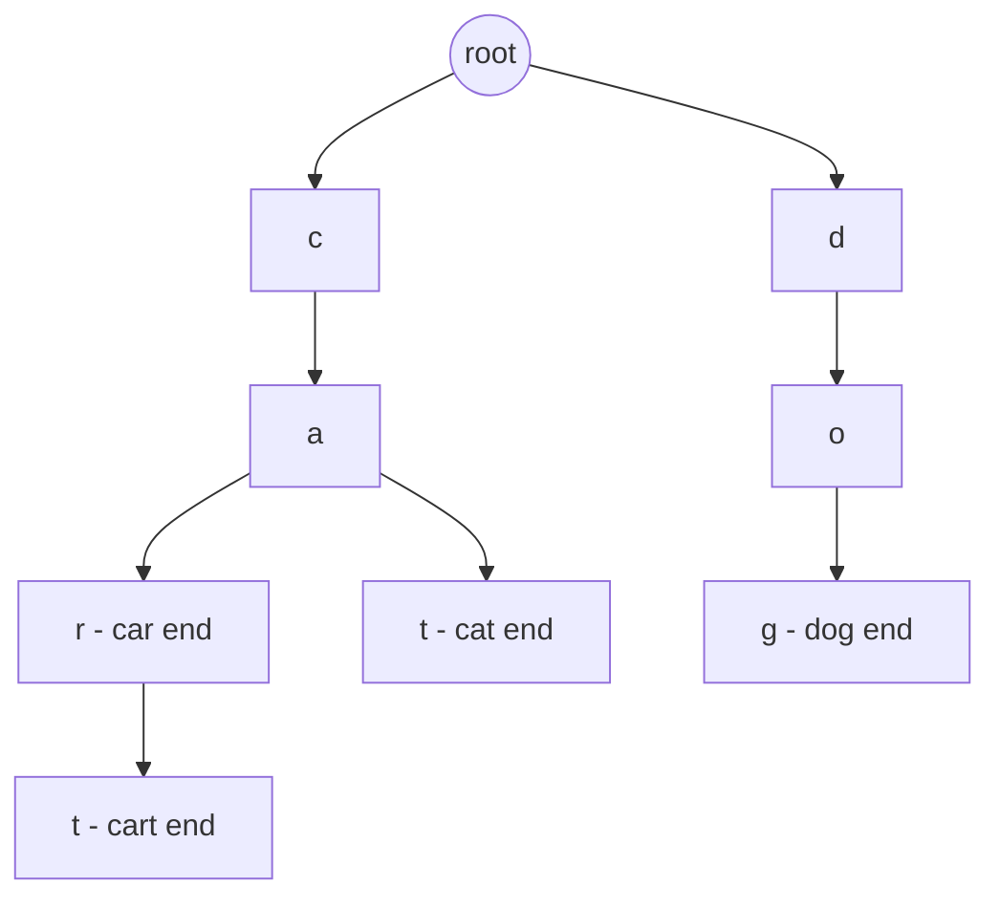
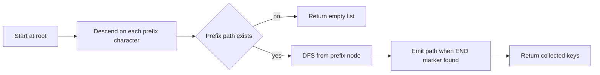

# Lecture 1 — Trie Basics and Autocomplete

> **Duration:** ~2 hours.
> **Outcome:** You can write a trie from memory in both forms (dict-of-dict and `TrieNode` class), implement `insert` / `search` / `starts_with` in under five minutes, run the autocomplete walk to enumerate all keys under a prefix, and explain why a trie is `O(L)` worst-case and a hash set is `O(L)` expected — with the distinction said cleanly out loud.

Last week installed the heap — the partial-order data structure whose invariant is the parent-child comparison. This lecture installs the **trie** — the prefix-tree data structure whose invariant is *each edge is a single character*. The trie is not in the standard library; you build it from `dict` or from a small `TrieNode` class. The implementation is short — fewer than thirty lines for the canonical three operations — and the recognition is the work this week.

By the end of this lecture you should be able to read a problem and, within 30 seconds, say one of three things out loud: "trie — `insert` / `search` / `starts_with` template," "trie — autocomplete walk (this lecture §5)," or "trie — word-break or dictionary-on-grid composition (covered in Lecture 2)." The fourth thing — "this is *not* a trie problem, here is why" — is just as important and is graded in the quiz.

This lecture covers the foundation: the trie data structure, both implementation forms, the canonical three operations, the autocomplete walk, and the four common bugs. Lecture 2 covers word-break, longest-common-prefix, and the Aho-Corasick read. Lecture 3 covers KMP and the Z-algorithm.

---

## 1. What a trie is

A **trie** (sometimes pronounced "tree," sometimes "try" — both are accepted) is a rooted tree in which **every edge is labeled by a single character**, and **every path from the root to a marked node spells out one stored key**. The marked nodes carry a flag — `is_end = True` in the class form, or a sentinel key like `END = "$"` in the dict form — that distinguishes a stored key from an arbitrary path through the tree.

A trie storing the keys `{"car", "cart", "cat", "dog"}`:

```
                root
               /    \
              c      d
              |      |
              a      o
             / \     |
            r   t    g*    (* marks is_end)
           /|   |
          t*   *
          |
         (none)
```

Read top-down: the root has two children, `c` and `d`. The `c` branch splits at `a` into `r` and `t`. The `r` branch ends at a terminal (the key `car`); it also has a child `t` for the longer key `cart`. The `d` branch ends at `dog`.

Three corollaries follow directly:

1. **Keys with a common prefix share their initial nodes.** "car", "cart", and "cat" all share the path `c -> a`. This is the space efficiency of the trie when the key set has heavy prefix overlap.
2. **The path to any terminal *is* the key.** There is no separate storage; the structure encodes the keys.
3. **A prefix query is a partial walk.** `starts_with("ca")` succeeds iff the trie has the path `root -> c -> a`, regardless of whether `ca` itself is a stored key.


*The shared c-a prefix branches into car, cart, and cat while d leads to dog.*

The hard part this week is **not** the algorithm — `insert` and `search` are short loops over the characters. The hard part is the *Research-constraints recognition*: half of all trie problems do not say "trie" anywhere in the prompt. They say "given a dictionary," "find all words from a list on a grid," "longest word that begins with `pre`," "replace each word by its shortest root in this dictionary." Owning the recognition is the work.

---

## 2. Why a trie instead of a hash set

A `Set[str]` answers exact-match queries — does the set contain the word `"cart"`? — in `O(L)` *expected* time, where `L = len("cart")`. Under pathological hash collisions, this degrades to `O(n)` worst-case, where `n` is the set size. In practice, Python's `str.__hash__` is salted and well-distributed, and `O(L)` expected is the bound you use in interviews.

A trie answers the same exact-match query in `O(L)` *worst-case* — there is no probability-of-failure mode. The path length is the key length, period. For most LeetCode problems this distinction does not matter; for systems that promise SLAs under adversarial input it does.

The discriminator is **prefix queries**. A hash set cannot answer "does any stored key start with `pre`" without iterating every key — `O(n L)` worst case, or `O(n)` if you index by length. A trie answers it in `O(P)` where `P = len(pre)`. That capability is the reason tries exist as a separate data structure.

Defended out loud:

> "**A hash set answers exact-match in `O(L)` expected; a trie answers exact-match in `O(L)` worst-case** — both are linear in the key length. The discriminator is **prefix queries**: the hash set cannot answer them in less than `O(n L)`; the trie answers them in `O(P)`. If the problem mentions any of *autocomplete*, *starts with*, *longest word with prefix*, *dictionary on grid*, or *enumerate keys with prefix*, that is the cue to reach for a trie. If the problem only asks exact-match queries and `L` is small, a `Set[str]` is simpler and competitive."

That is the sentence interviewers grade. Memorize the cadence.

---

## 3. The dict-of-dict form

The most idiomatic Python implementation. The root is an empty `dict`; each level is a `dict[str, dict[str, ...]]`; a sentinel key `END = "$"` (or any character not in the alphabet) marks terminals.

```python
from __future__ import annotations

from typing import Any, Dict, List

END = "$"  # sentinel; pick any character not in the input alphabet


def insert(root: Dict[str, Any], word: str) -> None:
    """Insert `word` into the trie rooted at `root`."""
    node = root
    for ch in word:
        node = node.setdefault(ch, {})
    node[END] = True


def search(root: Dict[str, Any], word: str) -> bool:
    """Return True iff `word` was inserted into the trie."""
    node = root
    for ch in word:
        if ch not in node:
            return False
        node = node[ch]
    return END in node


def starts_with(root: Dict[str, Any], prefix: str) -> bool:
    """Return True iff any inserted key has `prefix` as a prefix."""
    node = root
    for ch in prefix:
        if ch not in node:
            return False
        node = node[ch]
    return True


def make_trie(words: List[str]) -> Dict[str, Any]:
    """Construct a trie from `words`."""
    root: Dict[str, Any] = {}
    for word in words:
        insert(root, word)
    return root
```

Forty lines including types and docstrings. Three observations:

1. **`setdefault(ch, {})` is the line beginners forget.** It atomically reads-or-creates the child dict. Without it, you write the four-line "create-if-missing" boilerplate by hand. (`from collections import defaultdict` does *not* help here — a `defaultdict(dict)` would auto-create children of children, but the trie wants `dict[str, Any]` so it can also hold the `END` sentinel value.)
2. **The terminal is a sentinel key, not a flag.** Using `END = "$"` as a key keeps the trie structurally uniform — every node is a `dict`. Some implementations use a tuple `(children_dict, is_end)` or a class — both work; the sentinel form is the shortest.
3. **The `END` key holds `True`, but the value is irrelevant.** What matters is the key's presence. You could use any value (`1`, `None`, `word`) and the algorithm is identical. Stashing the original word at `END` is a useful trick when the trie holds payload — exercise 2 uses this.

### Walk-through

Building the trie from `["car", "cart", "cat"]`:

1. **Insert "car":** start at `root = {}`. For `c`: `setdefault("c", {})` → `root["c"] = {}`. For `a`: `setdefault("a", {})` inside `root["c"]` → `root["c"]["a"] = {}`. For `r`: `setdefault("r", {})` inside `root["c"]["a"]` → `root["c"]["a"]["r"] = {}`. Then `node[END] = True` → `root["c"]["a"]["r"]["$"] = True`.

   State: `root = {"c": {"a": {"r": {"$": True}}}}`.

2. **Insert "cart":** the path `c -> a -> r` already exists; `setdefault` returns the existing dict each time. Then `t` is new: `root["c"]["a"]["r"]["t"] = {}`. Mark terminal: `root["c"]["a"]["r"]["t"]["$"] = True`.

   State: `root = {"c": {"a": {"r": {"$": True, "t": {"$": True}}}}}`.

3. **Insert "cat":** path `c -> a` already exists; `t` is new inside `root["c"]["a"]`: `root["c"]["a"]["t"] = {}`. Mark terminal.

   State: `root = {"c": {"a": {"r": {"$": True, "t": {"$": True}}, "t": {"$": True}}}}`.

The shared prefix `c -> a` is visited three times but allocated once. That is the trie's space win.

`search("car")`: walk `c -> a -> r`; check `END in node` → True. Returns True.

`search("ca")`: walk `c -> a`; check `END in node` → False (the `a` node has no `END` key; "ca" was never inserted). Returns False.

`starts_with("ca")`: walk `c -> a`; the path exists. Returns True. The difference between `search` and `starts_with` is the final `END` check — that is the entire semantic distinction.

---

## 4. The `TrieNode` class form

The strongly-typed alternative. Verbose, but the form an interviewer expects when porting to Java / C++ or when attaching per-node metadata.

```python
from __future__ import annotations

from typing import Dict, Optional


class TrieNode:
    """Single node in a trie."""

    __slots__ = ("children", "is_end")

    def __init__(self) -> None:
        self.children: Dict[str, TrieNode] = {}
        self.is_end: bool = False


class Trie:
    """Trie supporting insert, search, and starts_with."""

    def __init__(self) -> None:
        self.root: TrieNode = TrieNode()

    def insert(self, word: str) -> None:
        node = self.root
        for ch in word:
            child = node.children.get(ch)
            if child is None:
                child = TrieNode()
                node.children[ch] = child
            node = child
        node.is_end = True

    def search(self, word: str) -> bool:
        node = self._walk(word)
        return node is not None and node.is_end

    def starts_with(self, prefix: str) -> bool:
        return self._walk(prefix) is not None

    def _walk(self, s: str) -> Optional[TrieNode]:
        node: Optional[TrieNode] = self.root
        for ch in s:
            assert node is not None
            child = node.children.get(ch)
            if child is None:
                return None
            node = child
        return node
```

Three observations specific to the class form:

1. **`__slots__` saves about 100 bytes per node** on a 64-bit CPython. For tries with millions of nodes this is meaningful. For a 10-key interview problem it does not matter, but mentioning it in the write-up is a small senior signal.
2. **`node.children.get(ch)` is preferred over `node.children[ch]` with `KeyError` handling.** `.get` returns `None` on missing key; the `if child is None` test is one of the cleanest control patterns in Python.
3. **The `_walk` helper unifies `search` and `starts_with`.** Both need the "walk to the end of the string, return the final node or None" primitive; pulling it out avoids duplication. The difference is the final `is_end` check.

For Mock #2, default to dict-of-dict unless the prompt clearly wants per-node state (e.g., "for each node, store the count of keys passing through it"). The class form is correct but writes more code than the timer allows.

---

## 5. The autocomplete walk

The trie's defining capability. Given a prefix, enumerate every stored key with that prefix.

```python
from __future__ import annotations

from typing import Any, Dict, List

END = "$"


def autocomplete(root: Dict[str, Any], prefix: str) -> List[str]:
    """Return all stored keys with `prefix` as a prefix, in DFS order."""
    node = root
    for ch in prefix:
        if ch not in node:
            return []
        node = node[ch]
    out: List[str] = []
    _collect(node, prefix, out)
    return out


def _collect(node: Dict[str, Any], path: str, out: List[str]) -> None:
    """DFS from `node`, accumulating `path`; emit when END is reached."""
    if END in node:
        out.append(path)
    for ch, child in node.items():
        if ch == END:
            continue
        _collect(child, path + ch, out)
```

Two phases:

- **Phase 1: descend to the prefix node.** `O(P)` where `P = len(prefix)`. If any character is missing, return `[]` early.
- **Phase 2: DFS from the prefix node.** `O(Q)` where `Q = sum(len(w) for w in matches)`. Every node in the subtree is visited once; every terminal contributes one string of length `≤` height.


*Autocomplete first descends to the prefix node, then DFS-collects every key beneath it.*

Total time: `O(P + Q)`. There is no way to do better — you must at least produce the output, and the output's total length is `Q`.

Two bugs beginners introduce:

1. **Forgetting to skip the `END` key in the DFS loop.** When iterating `node.items()`, the `END` sentinel will appear as a key with value `True`. Descending into `True` (treating it as a dict) crashes with `TypeError`. The fix is the `if ch == END: continue` line.
2. **Building strings via `path + ch` versus a list-and-join.** Interview-safe is `path + ch`. For million-character outputs, this is `O(n²)` total because each concatenation copies. The list-and-join pattern uses a `List[str]` accumulator and `"".join(...)` at the leaf; this is `O(n)` total. The trade-off is worth mentioning in the write-up.

### A worked autocomplete trace

Trie from `["car", "cart", "cat", "dog"]`. Call `autocomplete(root, "ca")`.

1. Descend: `root` has `c`; `root["c"]` has `a`. We are now at `root["c"]["a"]`, with `path = "ca"`.
2. DFS from `root["c"]["a"]`. The children dict is `{"r": ..., "t": ...}` (no `END`, since "ca" itself was not inserted).
3. Recurse into `r` with `path = "car"`. The `r` node is `{"$": True, "t": ...}`. `END` is present → emit `"car"`. Recurse into `t` with `path = "cart"`. The `t` node is `{"$": True}`. `END` is present → emit `"cart"`. No more children.
4. Back at `root["c"]["a"]`, recurse into `t` with `path = "cat"`. The `t` node is `{"$": True}`. `END` is present → emit `"cat"`. No more children.
5. Return `["car", "cart", "cat"]` (in DFS order; the order is unspecified by `dict`, but in CPython 3.7+ it is insertion order).

Total work: 2 descent steps + 7 DFS visits = 9 unit operations. The output is 3 strings of total length 10. Time is `O(P + Q) = O(2 + 10) = O(12)`, matching the bound.

---

## 6. Complexity defense

Say each time out loud:

> "**`insert(word)` and `search(word)` are `O(L)` worst-case** where `L` is the key length. Each operation walks one root-to-terminal path; the path length equals the key length. **`starts_with(prefix)` is `O(P)` worst-case** where `P = len(prefix)`. Same walk; no terminal check. **Autocomplete is `O(P + Q)` worst-case** where `Q = sum(len(w) for w in matches)`. The `O(P)` is the descent; the `O(Q)` is the DFS over the subtree, which must visit every emitted character. **Space is `O(N)`** where `N` is the total number of characters across all stored keys — each character is one trie node in the worst case (no prefix sharing); with prefix sharing, the trie is strictly smaller, but the bound `O(sum of key lengths)` is the safe one to state."

That paragraph is roughly 30 seconds spoken aloud. In a mock interview, it is the defense the interviewer wants on any trie problem.

Trade-off versus the hash set:

- **Hash set:** `O(L)` expected for exact-match; cannot answer prefix queries; `O(N)` space; constant-factor smaller than the trie because no per-node overhead.
- **Trie:** `O(L)` worst-case for exact-match; `O(P)` for `starts_with`; `O(P + Q)` for autocomplete; `O(N)` space with prefix sharing.

If you need prefix queries, the trie is the only structure that answers them in sub-linear time. If you only need exact-match and `L` is small, the hash set wins on simplicity and constant factors. State the choice out loud during the Research constraints step.

---

## 7. The four common bugs

After hundreds of FRAME write-ups, the same four bugs show up.

### Bug 1 — Forgetting the `END` sentinel

```python
def search_buggy(root: Dict[str, Any], word: str) -> bool:
    """Returns True for any prefix, not just stored keys."""
    node = root
    for ch in word:
        if ch not in node:
            return False
        node = node[ch]
    return True  # WRONG — should be `END in node`
```

This is actually a correct `starts_with` implementation. The bug is calling it `search`. The fix is to add the `END in node` check at the bottom of `search` and only that check.

### Bug 2 — Descending into the `END` sentinel during autocomplete

```python
def _collect_buggy(node: Dict[str, Any], path: str, out: List[str]) -> None:
    if END in node:
        out.append(path)
    for ch, child in node.items():
        _collect_buggy(child, path + ch, out)  # WRONG — recurses into END:True
```

When the loop reaches `("$", True)`, it calls `_collect_buggy(True, "ca$", out)`, which tries to iterate `True.items()` and crashes with `AttributeError`. The fix is `if ch == END: continue` at the top of the loop body.

### Bug 3 — Mutating the trie during a search

```python
def search_buggy_2(root: Dict[str, Any], word: str) -> bool:
    node = root
    for ch in word:
        node = node.setdefault(ch, {})  # WRONG — creates missing branches
    return END in node
```

Using `setdefault` instead of the `if ch not in node: return False` check accidentally *inserts* the prefix of the missing word. Future searches will see the partial path and behave unpredictably. This is the trie analog of "modifying the visited set during DFS" — the canonical mutation-during-read bug.

### Bug 4 — Off-by-one on the longest-common-prefix walk

The LCP walk (covered in Lecture 2 §1) terminates when a node has more than one child *or* is a terminal. The off-by-one is forgetting the *or* — the LCP of `["car", "carry"]` is `"car"`, not `"carr"`, because the `r` node after `car` is itself a terminal. Forgetting this returns `"carr"` (one character too long).

---

## 8. A worked Implement-Trie example

LC 208 — Implement Trie (Prefix Tree). The canonical entry-level trie problem.

**Research constraints.** A trie problem because the operations are exactly `insert / search / starts_with`. No other data structure offers `starts_with` in `O(P)`.

**Assess options.** Use the dict-of-dict form. Three methods, each a four-to-six-line walk. Initialize `self.root: Dict[str, Any] = {}` in `__init__`.

**Make the solution.**

```python
from typing import Any, Dict


END = "$"


class Trie:
    def __init__(self) -> None:
        self.root: Dict[str, Any] = {}

    def insert(self, word: str) -> None:
        node = self.root
        for ch in word:
            node = node.setdefault(ch, {})
        node[END] = True

    def search(self, word: str) -> bool:
        node = self.root
        for ch in word:
            if ch not in node:
                return False
            node = node[ch]
        return END in node

    def startsWith(self, prefix: str) -> bool:
        node = self.root
        for ch in prefix:
            if ch not in node:
                return False
            node = node[ch]
        return True
```

(LeetCode uses `startsWith` rather than `starts_with` — match the harness. In your portfolio, prefer the PEP 8 form.)

**Examine · verify.** Test on `["apple", "app"]`. After both inserts, `search("apple") == True`, `search("app") == True`, `search("ap") == False`, `startsWith("ap") == True`. Each matches the spec.

**Examine · cost.** Time: `O(L)` per operation, where `L` is the input length. Space: `O(N)` where `N` is the total length of inserted words — with prefix sharing, strictly less. Trade against `set[str] + length-indexed-set` for `startsWith` — that approach is `O(n L)` to scan the candidate words; the trie is `O(P)`. The trie wins.

---

## 9. When *not* to use a trie

The negative-space discriminator. Recognizing where the trie does not apply is graded in the quiz.

- **Exact-match queries only, with small `L`.** `set[str]` is simpler. Mention the trie as a "more general" answer; defend the simpler one.
- **Sorted enumeration regardless of prefix.** A sorted list or a `bisect`-indexed array is the right tool. The trie does not give you global sort cheaply.
- **Fuzzy / approximate matching.** A trie with edit-distance DP (e.g., Levenshtein-on-trie) is a Phase-3 stretch; for entry-level, BK-trees or `difflib` are simpler.
- **Variable-length keys with no prefix overlap.** The trie degenerates to one path per key — `O(sum of L)` nodes with no sharing. A `set[str]` is then both simpler and constant-factor smaller.
- **Substring matching (not prefix).** "Find all positions where `pattern` occurs in `text`" is a substring problem, not a prefix problem. The right tools are KMP, Z, or Aho-Corasick (Lecture 3, Lecture 2 §3).

A clean way to articulate the negative space:

> "The trie's discriminating capability is the prefix query. If the problem does not need prefix queries, default to the hash set; mention the trie as a generalization and pick the simpler structure. Reach for the trie when the prompt says *starts with*, *autocomplete*, *given a dictionary, for each word find the shortest root*, or *find all words from a list on a 2-D grid*. Without one of those cues, you are choosing the trie for ceremony, not for capability."

---

## 10. What to do this week

After this lecture, your weekly path is:

1. **Exercise 1 — Implement Trie (LC 208).** The dict-of-dict template; the canonical warm-up. Aim for 20 minutes including FRAME.
2. **Read the resources entries on the dict-of-dict and class forms.** Memorize both shapes; you will pick one in Mock #2 based on the prompt.
3. **Skim five LeetCode Trie-tag problem titles.** For each, predict in 5 seconds: `insert/search/starts_with`? autocomplete? word-break? dictionary-on-grid? Drill the recognition.
4. **Move to Lecture 2** for word-break and longest-common-prefix.

The single most important rep this week is **typing the canonical dict-of-dict trie from memory three times**. Three reps installs the muscle memory. Without it, Mock #2 will catch the hesitation.

---

*Next: [Lecture 2 — Word Break and Aho-Corasick (read only)](./02-word-break-and-aho-corasick.md).*
