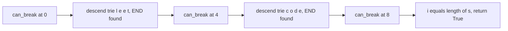
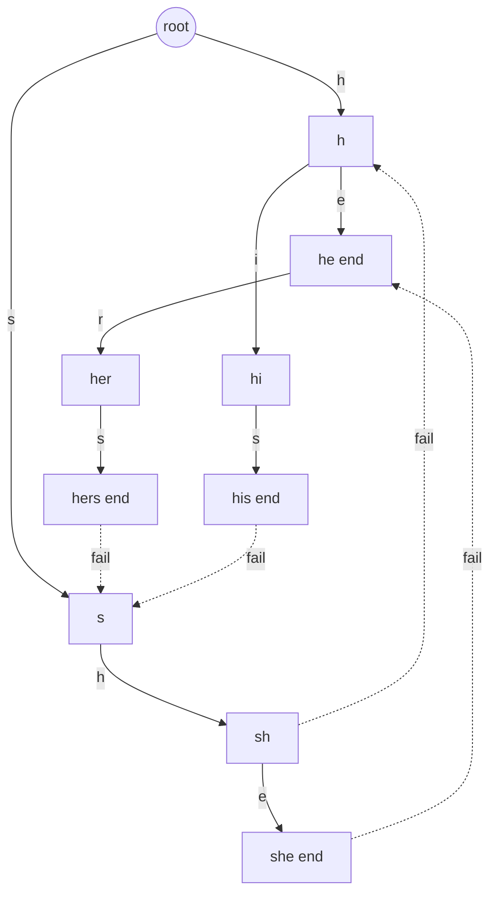

# Lecture 2 — Word Break, Longest Common Prefix, and Aho-Corasick (read only)

> **Duration:** ~2 hours.
> **Outcome:** You can solve word-break (LC 139) with memoization plus a trie for the dictionary, defend the asymptotic improvement over the hash-set baseline on inputs with overlapping prefixes; you can solve longest-common-prefix three ways and articulate when each wins; and you can read an Aho-Corasick description without panic and say in one sentence what the failure links do.

Lecture 1 installed the trie itself — `insert`, `search`, `starts_with`, and the autocomplete walk. This lecture installs three compositions: **word-break** (trie + memoization), **longest-common-prefix** (the three classical solutions, one of which is the trie variant), and the **read-only introduction to Aho-Corasick** for multi-pattern substring matching.

The Aho-Corasick section is honest about its register: you will not implement Aho-Corasick under interview pressure this week. You will *read* it once at a level that lets you (a) name the algorithm when the prompt fits, (b) describe the failure-link idea in one sentence, and (c) defend `O(n + m + z)` over the naive `O(nm + nW)` baseline. Three sentences. That is the interview-grade outcome.

---

## 1. Longest common prefix — three classical solutions

LC 14 — Longest Common Prefix. Given a list of strings, return the longest string that is a prefix of every string in the list. Returns `""` for an empty list or for a list whose first character differs across entries.

This problem has three textbook solutions; the trie one is the third and least common, but instructive.

### Solution A — Vertical scan

Walk character index by character index. At each index, check that every string agrees. Stop at the first disagreement or at the first string that runs out.

```python
from typing import List


def lcp_vertical(strs: List[str]) -> str:
    """Vertical scan: O(n * L) where n = number of strings, L = length of the shortest."""
    if not strs:
        return ""
    for i in range(len(strs[0])):
        ch = strs[0][i]
        for s in strs[1:]:
            if i >= len(s) or s[i] != ch:
                return strs[0][:i]
    return strs[0]
```

Time: `O(n * L)` where `L` is the length of the LCP. Space: `O(1)`. The cleanest solution; what you should write under time pressure unless told otherwise.

### Solution B — Horizontal scan

Compute `lcp(strs[0], strs[1])`, then `lcp(result, strs[2])`, and so on. Each pairwise LCP is one linear scan.

```python
from typing import List


def lcp_horizontal(strs: List[str]) -> str:
    """Horizontal scan: O(n * L) total; same bound as vertical, different constants."""
    if not strs:
        return ""
    prefix = strs[0]
    for s in strs[1:]:
        # Shrink prefix until it is a prefix of s.
        while not s.startswith(prefix):
            prefix = prefix[:-1]
            if not prefix:
                return ""
    return prefix
```

Time: `O(n * L)`. Space: `O(L)` for the prefix string. Slightly less elegant; same asymptotics.

### Solution C — Trie walk

Build a trie of all strings; walk from the root while every node has exactly one child *and* is not a terminal. The path so far is the LCP.

```python
from typing import Any, Dict, List

END = "$"


def lcp_trie(strs: List[str]) -> str:
    """Trie walk: O(N) build + O(L) walk, where N is total length, L is LCP length."""
    if not strs:
        return ""
    if any(s == "" for s in strs):
        return ""
    # Build trie.
    root: Dict[str, Any] = {}
    for s in strs:
        node = root
        for ch in s:
            node = node.setdefault(ch, {})
        node[END] = True
    # Walk while there is a single non-terminal continuation.
    out: List[str] = []
    node = root
    while len(node) == 1 and END not in node:
        ch, child = next(iter(node.items()))
        out.append(ch)
        node = child
    return "".join(out)
```

Time: `O(N)` to build + `O(L)` to walk = `O(N)` total, where `N = sum(len(s) for s in strs)`. Space: `O(N)` for the trie.

The trie solution is **slower in absolute terms** than the vertical scan for this specific problem — vertical scan does `O(n * L)` work and never allocates a tree. But the trie generalizes to "for each query, find the longest prefix shared with the dictionary" and to "incrementally add strings and re-query LCP" — both of which the linear-scan solutions handle poorly.

The interview senior signal:

> "Vertical scan is the right answer when the inputs are fixed and the query is one-shot. The trie is the right answer when the dictionary is reused across many queries or grows over time. For LC 14 as stated, vertical scan is simpler; mention the trie as the alternative for the multi-query variant."

The walk's stopping condition has two parts. `len(node) == 1` says "exactly one continuation"; `END not in node` says "and that continuation is not the end of a key." Forgetting the second part is the canonical off-by-one (Lecture 1, Bug 4): the LCP of `["car", "carry"]` is `"car"`, and the walk must stop at the `r` node because the `r` node is itself a terminal — even though it also has one child `y`.

---

## 2. Word break — trie + memoization

LC 139 — Word Break. Given a string `s` and a list of dictionary words, return True if `s` can be segmented into a space-separated sequence of one or more dictionary words.

The simplest correct solution is DP over positions: let `dp[i] = True` if `s[:i]` can be segmented. Then `dp[i] = True` iff there exists `j < i` such that `dp[j] == True` and `s[j:i]` is in the dictionary. Time: `O(n²)` (or `O(n² * L)` with naive substring extraction). Space: `O(n)`.

The trie variant runs the dictionary lookup along a trie descent, which keeps the inner loop honest at `O(L)` per starting position regardless of the dictionary structure.

```python
from typing import Any, Dict, List

END = "$"


def make_trie(words: List[str]) -> Dict[str, Any]:
    root: Dict[str, Any] = {}
    for word in words:
        node = root
        for ch in word:
            node = node.setdefault(ch, {})
        node[END] = True
    return root


def word_break(s: str, words: List[str]) -> bool:
    """Return True iff `s` segments into space-separated dictionary words."""
    trie = make_trie(words)
    memo: Dict[int, bool] = {}
    return _can_break(s, 0, trie, memo)


def _can_break(s: str, i: int, trie: Dict[str, Any], memo: Dict[int, bool]) -> bool:
    if i == len(s):
        return True
    if i in memo:
        return memo[i]
    node = trie
    j = i
    while j < len(s) and s[j] in node:
        node = node[s[j]]
        j += 1
        if END in node and _can_break(s, j, trie, memo):
            memo[i] = True
            return True
    memo[i] = False
    return False
```

The recursion at index `i` walks the trie from the root, advancing `j` one character at a time. Every time `END in node`, the prefix `s[i:j]` is a valid dictionary word; recurse on `i = j`. The memo cuts repeated subproblems.

### Walk-through

Input: `s = "leetcode"`, `words = ["leet", "code"]`. Trie has paths `l -> e -> e -> t (END)` and `c -> o -> d -> e (END)`.

1. `_can_break(s, 0, ...)`: walk trie from `l`. `l` is in `trie`; node = `trie["l"]`. `e`, `e`, `t` all advance; at `t`, `END in node`. Recurse on `i = 4`.
2. `_can_break(s, 4, ...)`: walk trie from `c`. `c`, `o`, `d`, `e` all advance; at `e`, `END in node`. Recurse on `i = 8`.
3. `_can_break(s, 8, ...)`: `i == len(s)`. Return True.
4. Back-propagate True up the stack. Final answer: True.


*Each recursive call descends the trie from its start index until it hits an END marker, then recurses from there.*

### Complexity defense

Say it out loud:

> "**Time is `O(n²)`** where `n = len(s)`. Each position `i` triggers at most one trie descent; the descent advances `j` at most `n - i` times. Summing over `i` gives `n + (n-1) + ... + 1 = O(n²)`. The memo prevents repeated work at the same `i`. **Space is `O(n + sum(len(w) for w in words))`** — `O(n)` for the memo, the rest for the trie."

### Trie vs hash set version

Without the trie, the inner loop iterates over the dictionary at each starting position: `O(W * L)` per position, `O(n * W * L)` total. With the trie, each position is `O(n)` regardless of `W` — the trie has effectively *indexed* the dictionary by prefix, so we visit each candidate continuation at most once.

The crossover where the trie wins is when `W >> n` (large dictionary, short query) or when dictionary words share many prefixes (`["a", "ap", "app", "appl", "apple"]` — the trie has 5 nodes; the hash set has 5 entries but the per-position scan is 5x).

For LeetCode-grade inputs (`n <= 300`, `W <= 1000`), both solutions pass. The trie is preferred in the write-up because it generalizes to "for each query, find all dictionary words starting at position `i` in `s`" — Word Break II (LC 140) — which the hash set version handles poorly.

---

## 3. Aho-Corasick (read only)

A trie with **failure links** that turns "find every occurrence of every pattern in a long text" from `O(nm + nW)` into `O(n + m + z)` where `n` is the text length, `m` is the total pattern length, and `z` is the number of matches.

You will not implement Aho-Corasick this week. The read-level outcome is the three sentences below.

### The data structure

Start with a trie built from the pattern set. Augment each node `v` with a **failure link** `fail(v)` pointing to the longest proper suffix of the path-to-`v` that is also a prefix in the trie. The root's failure link is itself. For a node `v` whose path is `s`, `fail(v)` is the node whose path is the longest *proper* suffix of `s` that is also a *prefix of some pattern* in the trie.

Example trie from patterns `["he", "she", "his", "hers"]`:

```
              root
            /     \
           h       s
           |       |
           e*      h
          / \      |
         r   .     e*
         |
         s*
```

(Marks: `*` indicates is_end. The trie has 9 nodes: root, `h`, `he` (end), `her`, `hers` (end), `hi`, `his` (end), `s`, `sh`, `she` (end).)

The failure links:

- `fail(h) = root`
- `fail(he) = root` (the proper suffix `"e"` is not a prefix in the trie; fall back to root)
- `fail(her) = root` (similar)
- `fail(hers) = s` (the proper suffix `"s"` matches the path to the `s` node)
- `fail(hi) = root`
- `fail(his) = s` (the proper suffix `"s"` matches)
- `fail(s) = root`
- `fail(sh) = h` (the proper suffix `"h"` matches the path to the `h` node)
- `fail(she) = he` (the proper suffix `"he"` matches the path to the `he` node — which is itself a pattern, so following the failure link reports the match `"he"` at this position)


*Solid arrows are trie edges; dashed arrows are failure links skipping to the longest matching suffix.*

### The matching procedure

Process the text once, character by character. Maintain a *current node* `cur`, starting at root. For each text character `c`:

1. While `c` is not a child of `cur` and `cur` is not root: `cur = fail(cur)`.
2. If `c` is a child of `cur`: `cur = cur.children[c]`.
3. Report every pattern reachable by following failure links from `cur` (more precisely, every pattern node in the **dictionary-suffix-link** chain from `cur`).

The total work is `O(n)` for the text scan plus `O(m)` for the trie build plus `O(z)` for the match reports — `O(n + m + z)` total. The key trick is that the text pointer never moves backward, the trie pointer can only move *up* via failure links (and each "up" is paid for by a previous "down"), and each match report is `O(1)`.

### When Aho-Corasick is the right answer

Three signals from the prompt:

1. **One long text and many short patterns.** E.g., "Given a list of forbidden words and a paragraph, find every occurrence of every forbidden word." If the patterns are fixed and the text varies, Aho-Corasick is the right tool.
2. **Total pattern length is small enough to build a trie, but the text is huge.** E.g., 1000 patterns of average length 10, text of length `10^8`. Naive `O(nm)` is `10^12` — too slow. KMP per pattern is `O(n + m)` per pattern, `O(nW + m)` total — still `10^11` for `W = 1000`. Aho-Corasick is `O(n + m + z) = O(10^8 + 10^4 + z)` — feasible.
3. **All-occurrences output, not first-occurrence.** "Find every occurrence" is the cue. "Find the first occurrence" is KMP territory.

If the prompt says "given a dictionary of *one* pattern, find it in the text," that is KMP — Aho-Corasick is overkill. If the prompt says "given a single text and one query, return True if any pattern occurs," and patterns are short and few, even the naive `O(nm)` is fine.

### The three-sentence interview answer

> "**Aho-Corasick** is a trie augmented with failure links — each node has a link to the longest proper suffix of its path that is also a prefix in the trie. **The algorithm processes the text once, never moving the text pointer backward**, descending the trie on matches and following failure links on mismatches, and reports every pattern occurrence in `O(n + m + z)` time where `z` is the number of matches. **The classical application is multi-pattern substring matching** — intrusion-detection signature scanners, plagiarism detectors, spam-filter token matchers, the original `fgrep` — and the discriminating prompt phrase is *given a long text and many patterns, find all occurrences*."

Memorize that paragraph at the *recognition* level — not the implementation level. The implementation is a Phase-3 stretch.

---

## 4. The trie-on-grid composition

A standalone topic that combines the trie with backtracking. Word Search II (LC 212) is the canonical instance — see Challenge 1 for the full treatment. The recognition cue is:

> "Given a 2-D grid of characters and a list of words, find every word from the list that can be formed by sequentially-adjacent cells (no cell reused)."

The naive solution is to run a DFS per word — `O(W * m * n * 4^L)` where `W` is the dictionary size, `m * n` is the grid, and `L` is the longest word. For 50 words of length 10 on a 12x12 grid, this is `50 * 144 * 4^10 ≈ 7.5 * 10^9` — too slow.

The trie solution builds a trie of the dictionary, then runs *one* DFS per grid cell that walks the grid and descends the trie in lockstep: at each cell, look up the cell's character in the current trie node's children; if present, descend; if `is_end` is True at the new node, emit the word and continue (to find longer words). The complexity drops to `O(m * n * 4^L)` because the trie shares work across words.

The Research-constraints recognition:

> "Dictionary on a grid → trie. DFS over the grid in lockstep with descent in the trie. Mark visited cells, unmark on backtrack. Mark words as found to avoid duplicates. Stop the descent when the trie node has no matching child."

Full code lives in Challenge 1. The pattern is one of the most heavily-graded Phase-2 trie problems on Mock #2.

---

## 5. The longest-word-in-dictionary family

A short family of LeetCode problems built on the same template. Recognition reps:

- **LC 720 — Longest Word in Dictionary.** Given a list of strings, find the longest string that can be built one character at a time by other words in the list. Sort + trie + DFS.
- **LC 648 — Replace Words.** Given a dictionary of roots and a sentence, replace every word in the sentence by the shortest root that is a prefix. Trie of roots + per-word walk. (Challenge 2.)
- **LC 211 — Design Add and Search Words Data Structure.** Trie + wildcard search. The wildcard recursion is the extension; the underlying structure is a plain trie.
- **LC 642 — Design Search Autocomplete System.** Trie + heap. The trie answers "give me all keys with prefix `pre`"; the heap orders the results by frequency.

All four share the recognition cue *"given a fixed dictionary, query something about prefixes."* That phrase is the trigger. Internalize the trigger before the implementation details.

---

## 6. Picking the right form for the prompt

A short cheat sheet for Mock #2.

| Prompt cue | Trie form | Why |
|-----------|-----------|-----|
| `Implement Trie` (LC 208) | dict-of-dict | Three methods; less code; mutates in place |
| `Word Break` (LC 139) | dict-of-dict | Dictionary is read-only; no per-node state needed |
| `Word Search II` (LC 212) | dict-of-dict, but stash the word at `END` | Need to emit words on match; storing `END: word` lets you emit without rebuilding the path |
| `Replace Words` (LC 648) | dict-of-dict | Walk per query word; `END` flag is enough |
| `Add and Search Word` (LC 211) | `TrieNode` class | The recursive wildcard search is cleaner with explicit nodes |
| `Design Search Autocomplete` (LC 642) | `TrieNode` with per-node `(sentence, count)` list | Per-node payload is required; class form is mandatory |
| Production trie for a long-running service | `TrieNode` with `__slots__` | Memory savings matter at scale |

The dict-of-dict form covers about 80% of LeetCode trie problems. Default to it unless per-node metadata is required.

---

## 7. Putting it together — the trie composition checklist

Before writing code on any trie problem, run the four-question checklist:

1. **What are the operations?** Insert-only? Insert + search? Insert + search + starts_with? Insert + autocomplete? Each adds about five lines.
2. **What is the alphabet?** ASCII lowercase? Unicode? Bytes? The alphabet determines the size of each `children` dict; for `[a-z]`, some implementations use a length-26 list of children, which is faster but uglier. For interview Python, a `dict` is always correct.
3. **Is there per-node state?** Word frequency? Original word (for emit)? Best-suffix payload? If yes, the class form is preferred. If no, dict-of-dict.
4. **What is the query pattern?** One query per insert? Many queries per insert? Streaming? The query pattern affects whether the trie is right at all — for pure exact-match with few queries, the hash set is simpler.

Four questions, ninety seconds. Asking them before writing code is the senior habit that earns Assess-options credit.

---

## 8. What to do this week

1. **Exercise 2 — Word Break (LC 139).** The trie + memo composition. Target 35 minutes including FRAME.
2. **Exercise 3 — Longest Common Prefix (LC 14).** The three-solutions problem. Implement all three; write up which you would default to and why.
3. **Read the Aho-Corasick Wikipedia article.** Aim for 20 minutes. The "Goto function" and "Failure function" sections are the focal points. You will not implement; you will read.
4. **Move to Lecture 3** for KMP and the Z-algorithm.

The single most important rep this week is **stating the Aho-Corasick three-sentence answer from memory**, with the failure-link description in the second sentence. If you can deliver those three sentences in 30 seconds, you have the recognition-level outcome of this read.

---

*Next: [Lecture 3 — KMP and the Z-Algorithm](./03-kmp-and-z-algorithm.md).*
