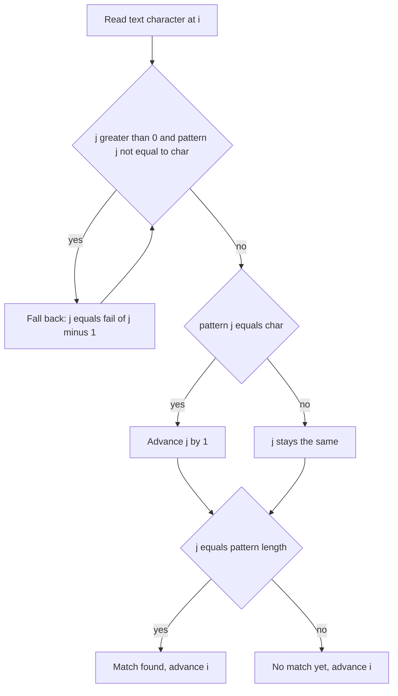

# Lecture 3 — KMP and the Z-Algorithm

> **Duration:** ~2 hours.
> **Outcome:** You can implement KMP's failure function and matcher for (`strStr`) from a reference, defend the failure-function intuition out loud, recognize when an `O(n + m)` matcher beats the naive `O(nm)` scan, and name the Z-algorithm as the sibling with the same asymptotics and slightly different bookkeeping.

Lectures 1 and 2 installed the trie — a structure for *prefix* queries. This lecture installs two algorithms for *exact-substring* queries: **KMP** (Knuth-Morris-Pratt) and the **Z-algorithm**. Both run in `O(n + m)` time and `O(m)` extra space. Both are linear-time alternatives to the naive `O(nm)` two-pointer scan. Both are honest interview material at the "name the algorithm and explain when it applies" level; full re-derivation from scratch is a Phase-3 stretch.

The interview register of this lecture is different from the trie material. The Research-constraints expectation is:

> "Given the constraints, the naive `O(nm)` scan is too slow. I would reach for KMP — `O(n + m)` via the failure function, which records the longest proper prefix that is also a suffix of each prefix of the pattern. In production Python 3.10+, `text.find(pattern)` is already linear-time via CPython's two-way + bitap hybrid; for the interview, I'll write the KMP."

That paragraph is the senior signal. The implementation is the second part. Both are graded; the recognition is graded more heavily.

---

## 1. The naive scanner — and why it loses

```python
def naive_find(text: str, pattern: str) -> int:
    """Return the index of the first occurrence of pattern in text, or -1."""
    if not pattern:
        return 0
    n, m = len(text), len(pattern)
    for i in range(n - m + 1):
        if text[i:i + m] == pattern:
            return i
    return -1
```

Six lines. Correct. Worst-case `O(nm)`: every starting position `i` may compare up to `m` characters before failing. The canonical pathological input is `text = "aaaaa...aaab"` (length `n`, all `a`'s ending in `b`) and `pattern = "aaab"` (length `m`). At each `i`, we compare `m - 1` matching `a`'s before the final `b` mismatches; we slide forward by one. Total: `(n - m + 1) * m ≈ nm` comparisons.

At the sizes a practice problem uses (`n, m <= 10^4`), this is `10^8` comparisons — borderline acceptable. At `n = 10^6`, `m = 10^3` it is `10^9`, which is too slow anywhere.

The key observation that KMP exploits: **after a mismatch, we know something about the text characters we already compared.** Specifically, we know they matched a prefix of the pattern. The naive scanner discards that information and starts fresh at `i + 1`; KMP uses it to skip ahead.

---

## 2. The failure function — what it is

The **failure function** (also called the **prefix function** or `pi` array) of a pattern `P` of length `m` is the array `fail[0..m-1]` defined by:

> `fail[i] = length of the longest proper prefix of P[:i+1] that is also a suffix of P[:i+1]`.

"Proper" means strictly shorter than `P[:i+1]` itself.

Worked example on `P = "ABABAC"`:

| `i` | `P[:i+1]` | Proper prefixes | Proper suffixes | LCP/LCS | `fail[i]` |
|----:|----------|----------------|------------------|---------|----------:|
| 0 | `"A"` | (none) | (none) | empty | 0 |
| 1 | `"AB"` | `"A"` | `"B"` | empty | 0 |
| 2 | `"ABA"` | `"A"`, `"AB"` | `"A"`, `"BA"` | `"A"` | 1 |
| 3 | `"ABAB"` | `"A"`, `"AB"`, `"ABA"` | `"B"`, `"AB"`, `"BAB"` | `"AB"` | 2 |
| 4 | `"ABABA"` | `"A"`, `"AB"`, `"ABA"`, `"ABAB"` | `"A"`, `"BA"`, `"ABA"`, `"BABA"` | `"ABA"` | 3 |
| 5 | `"ABABAC"` | `"A"`, `"AB"`, `"ABA"`, `"ABAB"`, `"ABABA"` | `"C"`, `"AC"`, `"BAC"`, `"ABAC"`, `"BABAC"` | empty | 0 |

The intuition: `fail[i]` is "if I've matched `i + 1` characters of the pattern and the next one mismatches, how far back in the pattern can I resume without losing the partial match I already have?"

For `P = "ABABAC"` and `fail[4] = 3`: after matching `"ABABA"` (5 chars) in the text, a mismatch at the 6th character (the pattern's `"C"`) means I can resume comparing from `P[3]`, because the last 3 text characters (`"ABA"`) match the first 3 pattern characters (`"ABA"`). The text pointer does not move backward; only the pattern pointer adjusts.

---

## 3. The failure function — how to build it

The construction itself runs in `O(m)` via a clever two-pointer loop. The code is short; the cleverness is in the invariant.

```python
from typing import List


def build_failure(pattern: str) -> List[int]:
    """Build the KMP failure function for `pattern`.

    fail[i] = length of the longest proper prefix of pattern[:i+1]
              that is also a suffix of pattern[:i+1].
    """
    m = len(pattern)
    fail: List[int] = [0] * m
    k = 0  # length of the current matched prefix
    for i in range(1, m):
        # If the next character does not extend the current match, fall back
        # along the failure chain until it does or until k = 0.
        while k > 0 and pattern[k] != pattern[i]:
            k = fail[k - 1]
        if pattern[k] == pattern[i]:
            k += 1
        fail[i] = k
    return fail
```

The invariant after iteration `i`: `k` equals `fail[i]`. The `while` loop walks the failure chain to find the next extendable prefix; the `if` extends if possible. The amortized cost of the inner `while` is `O(m)` total over the run — each iteration of the inner loop strictly decreases `k`, and `k` can only increase by 1 per outer iteration, so the total work is bounded by the outer loop count.

### Walk-through on `P = "ABABAC"`

- `i = 1`, `pattern[1] = 'B'`: `k = 0`; `pattern[0] = 'A' != 'B'`; no extension; `fail[1] = 0`.
- `i = 2`, `pattern[2] = 'A'`: `k = 0`; `pattern[0] = 'A' == 'A'`; `k = 1`; `fail[2] = 1`.
- `i = 3`, `pattern[3] = 'B'`: `k = 1`; `pattern[1] = 'B' == 'B'`; `k = 2`; `fail[3] = 2`.
- `i = 4`, `pattern[4] = 'A'`: `k = 2`; `pattern[2] = 'A' == 'A'`; `k = 3`; `fail[4] = 3`.
- `i = 5`, `pattern[5] = 'C'`: `k = 3`; `pattern[3] = 'B' != 'C'`. Fall back: `k = fail[2] = 1`. `pattern[1] = 'B' != 'C'`. Fall back: `k = fail[0] = 0`. `pattern[0] = 'A' != 'C'`; no extension; `fail[5] = 0`.

Final: `[0, 0, 1, 2, 3, 0]`. Matches the table.

The Wikipedia walked example uses `ABCDABD` — same shape, different alphabet. Pick whichever is in front of you and run it by hand once. After one hand-run, the `while` loop's role clicks.

---

## 4. KMP — the matcher

With `fail` precomputed, the text scan is the same shape:

```python
from typing import List


def kmp_search(text: str, pattern: str) -> int:
    """Return the index of the first occurrence of pattern in text, or -1."""
    if not pattern:
        return 0
    fail = build_failure(pattern)
    j = 0  # index into pattern: number of characters matched so far
    for i, ch in enumerate(text):
        while j > 0 and pattern[j] != ch:
            j = fail[j - 1]
        if pattern[j] == ch:
            j += 1
        if j == len(pattern):
            return i - j + 1
    return -1
```

Two invariants:

1. **The text pointer `i` never moves backward.** It is the outer-`for` loop variable. This is the linear-time guarantee.
2. **`j` is the length of the longest prefix of `pattern` that is also a suffix of `text[:i+1]`.** Equivalently, `j` is the current partial match length.


*Per text character, KMP walks the failure chain on mismatch instead of ever stepping the text pointer backward.*

When `j == m`, the pattern matches at text position `i - j + 1`. To find *all* occurrences instead of the first, replace the `return` with `record(i - j + 1); j = fail[j - 1]` to continue.

### Complexity defense

Say it out loud:

> "**Time is `O(n + m)`** where `n = len(text)` and `m = len(pattern)`. The text pointer `i` is monotonic — it walks `n` positions, period. The pattern pointer `j` can increase by at most 1 per text character (so it increases at most `n` times total), and can decrease arbitrarily via the failure chain, but each decrease is paid for by a previous increase. Total work on `j` is bounded by the total number of increases, which is `n`. Plus the `O(m)` failure-function build. Total: `O(n + m)`. **Space is `O(m)`** for the failure array."

That defense is the discriminating sentence. Memorize the cadence.

### Why this beats the naive scanner

The naive scanner repeats comparisons. On `text = "AAAAB"`, `pattern = "AAAB"`: the naive scanner starts at `i = 0`, matches `AAA`, mismatches at `B`. The naive scanner slides to `i = 1` and *re-compares* `AAA` from scratch. KMP says: "I already matched 3 characters at `i = 0`; the failure function tells me I can resume at pattern index `fail[2] = 2` without re-reading any text character." The text pointer never goes backward; the pattern pointer adjusts.

The asymptotic improvement is `O(nm) -> O(n + m)`. For `n = 10^6`, `m = 10^3`, that is `10^9 -> 10^6` — three orders of magnitude.

---

## 5. The Z-algorithm — the sibling

The **Z-array** of a string `s` of length `n` is the array `z[0..n-1]` where:

> `z[i] = length of the longest substring starting at index i that matches a prefix of s`.

By convention, `z[0] = n` (the whole string matches the prefix trivially; some sources leave `z[0]` undefined).

Worked example on `s = "AABAACAABAA"`:

| `i` | `s[i:]` | LCP with `s` | `z[i]` |
|----:|--------|--------------|-------:|
| 0 | `AABAACAABAA` | full | 11 |
| 1 | `ABAACAABAA` | `A` | 1 |
| 2 | `BAACAABAA` | (empty) | 0 |
| 3 | `AACAABAA` | `AA` | 2 |
| 4 | `ACAABAA` | `A` | 1 |
| 5 | `CAABAA` | (empty) | 0 |
| 6 | `AABAA` | `AABAA` | 5 |
| 7 | `ABAA` | `A` | 1 |
| 8 | `BAA` | (empty) | 0 |
| 9 | `AA` | `AA` | 2 |
| 10 | `A` | `A` | 1 |

The pattern: any position where `z[i] == len(pattern)` (in the `pattern + sep + text` setup) is the start of a match. Specifically:

```python
from typing import List


def z_array(s: str) -> List[int]:
    """Build the Z-array of `s` in O(n) time."""
    n = len(s)
    z: List[int] = [0] * n
    if n == 0:
        return z
    z[0] = n
    l, r = 0, 0  # current Z-box: s[l:r+1] matches s[0:r-l+1]
    for i in range(1, n):
        if i < r:
            z[i] = min(r - i, z[i - l])
        while i + z[i] < n and s[z[i]] == s[i + z[i]]:
            z[i] += 1
        if i + z[i] > r:
            l, r = i, i + z[i]
    return z


def z_search(text: str, pattern: str) -> int:
    """Return the index of the first occurrence of pattern in text, or -1.

    Build the Z-array of `pattern + sep + text` for some sentinel `sep` not
    in the alphabet; any Z-value >= len(pattern) in the text portion is a match.
    """
    if not pattern:
        return 0
    sep = "\x01"  # any character not in the input alphabet
    combined = pattern + sep + text
    z = z_array(combined)
    m = len(pattern)
    for i in range(m + 1, len(combined)):
        if z[i] >= m:
            return i - m - 1
    return -1
```

Same `O(n + m)` time, same `O(n + m)` space (for the combined string and its Z-array). The implementation has slightly different bookkeeping — the "Z-box" `[l, r]` tracks the rightmost match-so-far against the prefix.

For almost every problem you will be asked, the two are interchangeable. The failure function is the more famous; the Z array is more common in contest work and slightly simpler to derive from scratch (some find the Z-box bookkeeping easier than the failure-chain walk).

The interview-grade recognition:

> "If the interviewer asks for KMP, give them KMP. If they ask for any linear-time substring matcher, mention both — KMP and Z, same `O(n + m)`, slightly different invariants. The Z-array is often easier to reason about when the problem requires the full match-length profile, not just the first match."

---

## 6. When to reach for KMP / Z

The Research-constraints trigger phrases:

1. **"Find the first / all occurrences of pattern in text."** The canonical substring problem. KMP or Z.
2. **"Find the longest prefix of `text` that is also a suffix of `text`."** A textbook KMP application — run `build_failure` on `text` itself; `fail[n - 1]` is the answer.
3. **"Find the period of a string."** Period = `n - fail[n - 1]` if it divides `n` (a classical KMP application).
4. **"Find the shortest rotation that is lexicographically smallest."** Composes KMP with the rotation trick `s + s`.
5. **"Find the longest substring that occurs `k` times."** Z-array on `s` plus a counter.

The Research-constraints *negative* signals:

1. **"Are these two strings anagrams?"** Counting / sort. Not KMP.
2. **"Is this a palindrome?"** Two-pointer. Not KMP.
3. **"Find the longest common substring of `s` and `t`."** Suffix arrays / DP. KMP can help in some special cases; default to DP for the interview.
4. **"Find all words from a list of patterns in this text."** Aho-Corasick (Lecture 2 §3). KMP per pattern is `O(nW + m)`; Aho-Corasick is `O(n + m + z)` for `W > 1`.

Recognize the trigger phrases before writing code.

---

## 7. The CPython grounding

A senior-interview-grade aside.

CPython 3.10+ uses a tuned hybrid for `str.find`, `bytes.find`, and the `in` operator. The implementation in `Objects/stringlib/fastsearch.h` is based on a **two-way string-matching algorithm** (Crochemore-Perrin, 1991) combined with a **bitap precomputation** for short patterns. The linear-time worst-case guarantee was added in 3.10 (the patch landed in 2021 via gh-91113 and the surrounding follow-ups).

For interview purposes, this means:

> "In production Python 3.10+, `text.find(pattern)` is already linear-time. Reaching for KMP in production is unnecessary; reaching for it in the interview is to demonstrate I understand the failure-function machinery."

If the interviewer asks "why not just use `find`," the answer is: "In production I would. In the interview I am writing the algorithm explicitly so you can grade the implementation, not just the API call."

That answer turns a perceived weakness ("I'm reinventing the wheel") into a strength ("I know both layers and I am picking the appropriate one for the context").

---

## 8. A worked substring-search example

The classic contract, and the one every language's standard library exposes in some form. Given a `haystack` and a `needle`, return the index of the first occurrence of `needle` in `haystack`, or `-1` when it does not occur.

**Reason about constraints.** This is exact-substring search. The naive `O(nm)` is the baseline. At the sizes a practice problem uses (`n, m <= 10^4`), the naive is acceptable; in an interview, name the failure function anyway.

**Assess options.** Build the KMP failure function on `needle`; run the matcher on `haystack` with the failure array. Return `i - m + 1` at the first full match.

**Make the solution.**

```python
from typing import List


def str_str(haystack: str, needle: str) -> int:
    if not needle:
        return 0
    fail = _build_failure(needle)
    j = 0
    for i, ch in enumerate(haystack):
        while j > 0 and needle[j] != ch:
            j = fail[j - 1]
        if needle[j] == ch:
            j += 1
        if j == len(needle):
            return i - j + 1
    return -1


def _build_failure(pattern: str) -> List[int]:
    fail: List[int] = [0] * len(pattern)
    k = 0
    for i in range(1, len(pattern)):
        while k > 0 and pattern[k] != pattern[i]:
            k = fail[k - 1]
        if pattern[k] == pattern[i]:
            k += 1
        fail[i] = k
    return fail
```

**Examine · verify.** Trace on `haystack = "ABABDABACDABABCABAB"`, `needle = "ABABCABAB"`. The failure array for `needle` is `[0, 0, 1, 2, 0, 1, 2, 3, 4]`. The matcher finds the match at index 10. Hand-verify the first few iterations:

- `i = 0`, `ch = 'A'`: `j = 0`; `needle[0] = 'A' == 'A'`; `j = 1`.
- `i = 1`, `ch = 'B'`: `j = 1`; `needle[1] = 'B' == 'B'`; `j = 2`.
- `i = 2`, `ch = 'A'`: `j = 2`; `needle[2] = 'A' == 'A'`; `j = 3`.
- `i = 3`, `ch = 'B'`: `j = 3`; `needle[3] = 'B' == 'B'`; `j = 4`.
- `i = 4`, `ch = 'D'`: `j = 4`; `needle[4] = 'C' != 'D'`; fall back to `fail[3] = 2`. `needle[2] = 'A' != 'D'`; fall back to `fail[1] = 0`. `needle[0] = 'A' != 'D'`; no extension; `j = 0`.

And so on. Each step either advances `i` (always) or adjusts `j` without re-reading `haystack`.

**Examine · cost.** Time: `O(n + m)`. Space: `O(m)` for the failure array. Trade against the naive `O(nm)`: KMP wins by a factor of `m` when `m` is large. Trade against `haystack.find(needle)`: same asymptotics in CPython 3.10+; KMP is the explicit-implementation form.

---

## 9. Common KMP bugs

After hundreds of write-ups, the same four bugs appear.

### Bug 1 — Failure indexing off by one

```python
while k > 0 and pattern[k] != pattern[i]:
    k = fail[k]  # WRONG — should be fail[k - 1]
```

The failure array is indexed by `k - 1`, not `k`, when falling back. Reason: `fail[i]` is the length-of-prefix-suffix *up to and including* index `i`; falling back to the chain means "for a partial match of length `k`, jump to a partial match of length `fail[k - 1]`."

### Bug 2 — Failure inner loop on the wrong variable

```python
while k > 0 and pattern[i] != pattern[i]:  # WRONG — both indices are i
    k = fail[k - 1]
```

A typo, but a common one in transcribed code. The first index is `k`, the second is `i`. The inner loop is over the *pattern* at position `k`; the outer loop is over the *pattern* at position `i` during build, or the *text* at position `i` during search.

### Bug 3 — Skipping the empty-needle case

 specifies "return 0 if needle is empty." Forgetting this returns `-1` (the matcher's empty-loop default). One-line fix: `if not needle: return 0`.

### Bug 4 — Returning `i` instead of `i - j + 1`

The match position is `i - j + 1` where `j == len(pattern)` at the match. Forgetting the `+ 1` returns `i - m`, which is one off the left of the match.

---

## 10. What to do this week

1. **Read the Wikipedia KMP article**, specifically the worked example on `ABCDABD`. About 15 minutes. The hand-walk is what makes the failure function click.
2. **Implement `strStr` via KMP from memory.** Compare your output to the test cases. Target 20 minutes including the build-failure helper.
3. **Read the Codeforces Z-algorithm blog post.** About 10 minutes. You do not need to implement; you need to recognize the Z-array form.
4. **Move to the exercises and the mini-project.** The KMP write-up in the mini-project is the deliverable form of this lecture.

The single most important rep this week is **delivering the KMP three-sentence Research-constraints memo from memory**. If you can say "exact-substring search, naive is `O(nm)` and too slow for these constraints, KMP gives `O(n + m)` via the failure function which tracks the longest proper prefix-suffix at each pattern position" in 25 seconds, you have the interview-grade recognition.

---

*Next: [Exercises](../exercises/README.md).*
