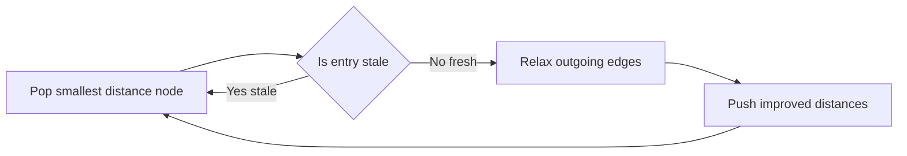
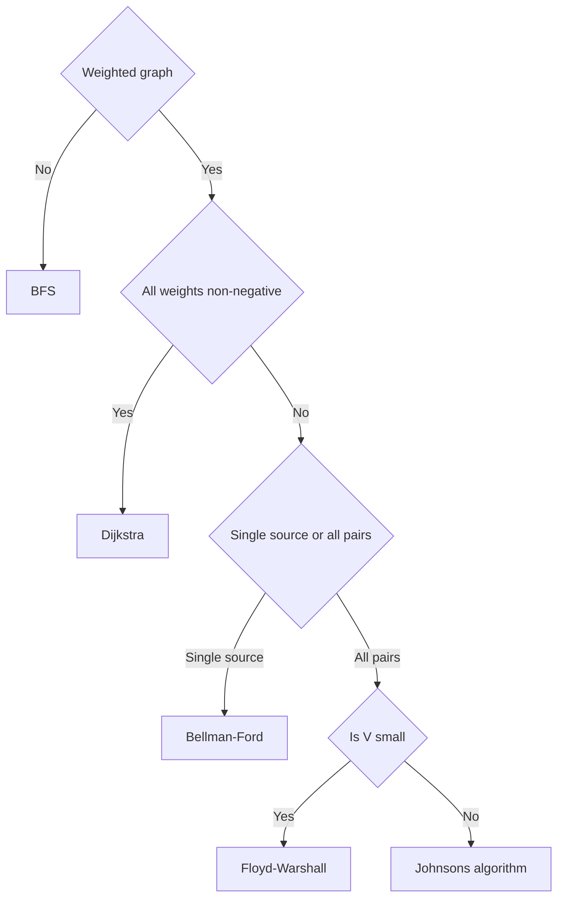

# Lecture 1 — Dijkstra and the Shortest-Path Picker

> **Duration:** ~2 hours.
> **Outcome:** You can write a heap-Dijkstra from memory in under ten minutes, defend the `O((V + E) log V)` bound with a `heapq` reference, articulate why the algorithm fails on negative weights with a three-vertex counter-example, and walk the shortest-path picker flowchart from the constraint signals — weighted, non-negative, single-source, hop-constrained — to the correct algorithm without rehearsal.

Last week installed the trie — the prefix-tree data structure whose invariant is *each edge is a single character*. This lecture installs **Dijkstra's algorithm** — the single-source shortest-paths algorithm whose invariant is *settle each vertex once, in non-decreasing order of distance*. The implementation is short — fewer than twenty-five lines with `heapq` — but the *Research-constraints recognition* (knowing when Dijkstra applies versus Bellman-Ford versus Floyd-Warshall versus BFS) is the work this week.

By the end of this lecture you should be able to read a problem and, within 30 seconds, say one of four things out loud: "Dijkstra — non-negative weights, single source"; "Bellman-Ford — has negative weights or needs negative-cycle detection (covered in Lecture 2)"; "Floyd-Warshall — all-pairs, `V` is small (covered in Lecture 2)"; "BFS — unweighted (Week 6, not this week)." The fifth thing — "this is *not* a shortest-path problem, here is why" — is just as important and is graded in the quiz.

This lecture covers the foundation: the algorithm, the heap-based implementation, the "settle once" invariant, the negative-weights failure, and the recognition flowchart. Lecture 2 covers Bellman-Ford, Floyd-Warshall, and MST. Lecture 3 covers Union-Find.

---

## 1. What Dijkstra computes

Given a directed weighted graph `G = (V, E)` with non-negative edge weights `w(u, v) >= 0`, and a source vertex `s`, Dijkstra's algorithm computes `dist[v]` for every vertex `v` reachable from `s` — the **weight of the shortest path from `s` to `v`**, where the weight of a path is the sum of the weights of its edges.

If `v` is not reachable from `s`, `dist[v] = inf` (or `dist[v]` is simply absent from the returned dictionary, depending on the implementation).

Three corollaries follow:

1. **Shortest paths are not unique.** If two paths from `s` to `v` have the same total weight, both are valid shortest paths. `dist[v]` is the *length*, not the *route*. If you need the route, store a `prev[v]` predecessor pointer at each relaxation.
2. **Shortest paths to all vertices form a tree** rooted at `s`. This is the **shortest-path tree** (SPT). It is *not* in general a minimum spanning tree (Lecture 2 §4).
3. **The order in which Dijkstra "settles" vertices is non-decreasing in `dist`.** The first vertex settled is `s` itself (with `dist = 0`); the second is the closest neighbor; the third is the second-closest reachable vertex; and so on. This monotonic property is the engine of the algorithm.

The hard part this week is **not** the algorithm — `heapq` does the heavy lifting and the relaxation loop is short. The hard part is the *Research-constraints recognition*: half of all weighted-graph problems do not say "shortest path" anywhere in the prompt. They say "minimum cost," "fastest route," "lowest-latency network delay," "smallest total fare." Owning the recognition is the work.

---

## 2. Why a heap instead of a linear scan

The textbook description of Dijkstra walks roughly like this: maintain a set of unsettled vertices; repeatedly remove the one with the smallest `dist`, settle it, then relax all its outgoing edges. The "remove the smallest" step is the expensive operation. Three implementations are common:

| Implementation | Per-extract | Per-decrease-key | Total time |
|----------------|------------:|-----------------:|-----------:|
| Array / linear scan | `O(V)` | `O(1)` | `O(V^2 + E)` |
| Binary heap (`heapq`) | `O(log V)` | `O(log V)` | `O((V + E) log V)` |
| Fibonacci heap | `O(log V)` | `O(1)` amortized | `O(V log V + E)` |

For dense graphs (`E = O(V^2)`), the array form is competitive. For sparse graphs (`E = O(V)` or `O(V log V)`), the binary heap wins by orders of magnitude. The Fibonacci heap is asymptotically the best but has high constants; CPython's `heapq` is a binary heap and is the right reach for interview purposes.

Defended out loud:

> "**Dijkstra with `heapq` is `O((V + E) log V)`** — each vertex is settled at most once (`V` heap extractions), each edge is relaxed at most once and may push onto the heap (`E` heap pushes), and each heap operation is `O(log V)` worst-case in CPython's binary-heap implementation. The product gives the bound. The space is `O(V)` for the distance dictionary plus `O(E)` worst-case for the heap if every relaxation pushes a duplicate entry."

That is the sentence interviewers grade. Memorize the cadence.

---

## 3. The canonical heap-Dijkstra

The most idiomatic Python implementation. Lazy deletion via the `if d > dist[node]: continue` guard handles stale heap entries without needing a decrease-key operation (which CPython's `heapq` does not provide).

```python
from __future__ import annotations

import heapq
from collections import defaultdict
from typing import Dict, List, Tuple


def dijkstra(graph: Dict[int, List[Tuple[int, int]]], source: int) -> Dict[int, float]:
    """Compute shortest distances from `source` to all reachable vertices.

    Args:
        graph: Adjacency list. `graph[u]` is a list of `(v, weight)` pairs.
            Weights MUST be non-negative; the algorithm is incorrect on
            negative weights (see Section 4).
        source: The source vertex.

    Returns:
        A dict mapping each reachable vertex to its shortest distance from
        `source`. Unreachable vertices are absent (or, equivalently, have
        distance `float('inf')`).
    """
    dist: Dict[int, float] = defaultdict(lambda: float("inf"))
    dist[source] = 0
    heap: List[Tuple[float, int]] = [(0.0, source)]

    while heap:
        d, node = heapq.heappop(heap)
        if d > dist[node]:
            continue  # stale entry from an earlier, since-improved relaxation
        for neighbor, weight in graph.get(node, []):
            new_dist = d + weight
            if new_dist < dist[neighbor]:
                dist[neighbor] = new_dist
                heapq.heappush(heap, (new_dist, neighbor))

    return dict(dist)
```

Twenty-three lines including the docstring. The `defaultdict(lambda: float("inf"))` is the idiomatic distance map — it returns `inf` for any key not yet relaxed, which is what we want for the comparison `if new_dist < dist[neighbor]`.

Three lines deserve close attention:

- **`heap: List[Tuple[float, int]] = [(0.0, source)]`**. The heap stores `(distance, node)` tuples. `heapq` compares tuples lexicographically, so the smallest-distance entry rises to the top. The `0.0` (float) keeps the type consistent with the comparison below; in practice CPython compares `int` and `float` without issue, but the float type is what `defaultdict(lambda: float("inf"))` produces.
- **`if d > dist[node]: continue`**. This is the lazy-delete guard. When we relax an edge and push `(new_dist, neighbor)`, we never remove any older `(old_dist, neighbor)` entry from the heap — `heapq` has no decrease-key. The guard catches and skips these stale entries when they eventually pop. Without it, you still get the correct answer (the relaxation `if new_dist < dist[neighbor]` short-circuits), but you do `O(E)` extra heap pops in the worst case.
- **`for neighbor, weight in graph.get(node, []):`**. `graph.get(node, [])` is the idiomatic way to iterate the neighbors of a vertex that may have no outgoing edges (a sink). Using `graph[node]` would raise `KeyError`; using a defaultdict-of-list works too but couples the read access to dict mutation, which is a Lecture-2 bug source.


*The pop, check-stale, relax, push cycle that drives heap-based Dijkstra.*

---

## 4. Why Dijkstra fails on negative weights

The greedy invariant: when Dijkstra pops `(d, node)` from the heap and the guard passes (`d == dist[node]`), the algorithm **commits `dist[node]` as final** — no future relaxation will improve it. This is the "settle once" invariant.

The invariant holds on non-negative weights because: any future path to `node` must go through some not-yet-settled vertex `v`; that vertex must have `dist[v] >= d` (else the heap would have popped it first); the edge `v -> ... -> node` adds non-negative weight; so the total is `>= d`. No improvement.

The invariant **breaks** on negative weights. The canonical three-vertex counter-example:

```
         (2)
    A ─────────► C
    │            ▲
    │ (1)        │ (-5)
    ▼            │
    B ───────────┘
```

Edges: `A -1-> B`, `A -2-> C`, `B -(-5)-> C`. Run Dijkstra from `A`:

| Step | Heap pops | `dist` so far | Action |
|------|-----------|---------------|--------|
| 1 | `(0, A)` | `{A: 0}` | Relax `A -> B` (dist 1), `A -> C` (dist 2). Push both. |
| 2 | `(1, B)` | `{A: 0, B: 1, C: 2}` | Relax `B -> C` (dist 1 + (-5) = -4). Push `(-4, C)`. |
| 3 | `(-4, C)` | `{A: 0, B: 1, C: -4}` | Relax outgoing edges of `C` (none). |
| 4 | `(2, C)` | (guard: `2 > -4`, skip) | Stale entry; lazy-deleted. |

In this case the lazy-delete guard catches the improvement and we get the *right answer* of `dist[C] = -4`. But this is a lucky accident — the algorithm processed `B` *before* committing `C`'s distance because the heap order happened to favor `B` (weight 1 vs. weight 2).

Change the example slightly to break this:

```
    A ─(1)─► B ─(2)─► C
    │                ▲
    │ (3)            │ (-10)
    └────────────────┘
```

Wait — this still works because Dijkstra would settle `C` via `B` at distance 3, but then never re-relax. Let us be more careful. The canonical *clean* counter-example requires the heap to commit a vertex *before* a negative edge from a later-settled vertex can improve it. The simplest form:

```
    A ─(1)─► B          edges: A -1-> B, A -2-> C, C -(-10)-> B
    │        ▲
    │ (2)    │ (-10)
    ▼        │
    C ───────┘
```

Run Dijkstra from `A`:

| Step | Pop | Action |
|------|-----|--------|
| 1 | `(0, A)` | Push `(1, B)`, `(2, C)`. |
| 2 | `(1, B)` | **Settle `B = 1`.** No outgoing edges from `B`. |
| 3 | `(2, C)` | Settle `C = 2`. Relax `C -> B` with `dist 2 + (-10) = -8`. Push `(-8, B)`. |
| 4 | `(-8, B)` | Guard: `-8 < 1`, so `dist[B]` would be updated to `-8` — *if the guard were written as `<=`*. With the standard `if d > dist[node]: continue`, this passes and we update. |

In practice the standard implementation *does* update on `(-8, B)` because the guard is `>`, not `>=`. So we get the right answer — by accident.

The honest statement: **the lazy-delete `heapq` Dijkstra happens to produce the correct answer on many small negative-weight examples**, but the *invariant* the algorithm relies on (settle each vertex once, in non-decreasing order of distance) is violated. On larger inputs with negative weights, the algorithm is unreliable; on graphs with negative cycles, it loops forever or returns nonsense. The textbook discipline is: **if any edge has negative weight, reach for Bellman-Ford instead.**

For the interview: state the invariant, give a three-vertex counter-example, and say "Bellman-Ford is the correct algorithm on negative weights." Do not try to repair Dijkstra; that path leads to Johnson's algorithm and a long detour.

---

## 5. The shortest-path picker — recognition flowchart

When you see a weighted-graph problem, walk this in 30 seconds:

```
1. Is the graph weighted?
   No  -> BFS (Week 6). Stop.
   Yes -> continue.

2. Are all weights non-negative?
   Yes -> Dijkstra. Stop.
   No  -> continue.

3. Is the problem single-source or all-pairs?
   Single  -> Bellman-Ford (Lecture 2 §2).
   All     -> continue.

4. Is V small (V <= 400 or so)?
   Yes -> Floyd-Warshall (Lecture 2 §3).
   No  -> Johnson's algorithm (Phase-3 stretch).

5. Is there a hop-count constraint?
   Yes -> Bellman-Ford bounded by K + 1 passes, OR
          Dijkstra with state (node, hops_used) in the heap.
          (Lecture 2 §2, Exercise 2, Challenge 1.)
```

The signal hierarchy is **weights first, sign second, source-count third, hop-count last**. Most LeetCode prompts settle the algorithm at step 1 or 2; the constraint signals at steps 3-5 are the discriminating moves for senior-level problems.

The negative-space reflections — what is *not* a shortest-path problem — are equally graded:

- **"Number of paths"** is not Dijkstra; it is DFS-counting or DP.
- **"Reach every node"** without a cost is not Dijkstra; it is BFS or DFS.
- **"Minimum cost to connect all nodes"** is not Dijkstra; it is MST (Lecture 2 §4).
- **"Number of connected components"** is not Dijkstra; it is BFS/DFS counting (Week 6) or DSU (Lecture 3).

Owning the *rejection* of Dijkstra on these prompts is the senior signal — junior candidates over-apply Dijkstra to any problem that smells like a graph; senior candidates pause to ask "what is being optimized?" before reaching for the heap.


*The recognition flowchart: walk weights, sign, source-count, then size to pick the right algorithm.*

---

## 6. Worked example — network delay

A small example end-to-end. Given the directed weighted graph below, source `s = 1`, compute shortest distances.

```
       (1)         (4)
   1 ──────► 2 ──────► 4
   │         │         ▲
(4)│      (2)│         │(1)
   ▼         ▼         │
   3 ──────► 4 ─(3)─►  5
       (1)
```

Edges (as `graph[u] = [(v, w), ...]`):

```python
graph = {
    1: [(2, 1), (3, 4)],
    2: [(4, 4), (4, 2)],  # the (4, 4) edge is the upper path 2->4; the (4,2) is the redirect 2->4
    3: [(4, 1)],
    4: [(5, 3)],
    5: [],
}
```

(Resolve the duplicate by taking the smaller weight in this trace: `2 -> 4` is weight `2`.)

Trace of the algorithm from source `1`:

| Step | `heap` after pop | `dist` after relax | Action |
|------|-----------------|-------------------|--------|
| 0 | `[(0, 1)]` initial | `{1: 0}` | Initial state |
| 1 | pop `(0, 1)`; push `(1, 2)`, `(4, 3)` | `{1: 0, 2: 1, 3: 4}` | Relax outgoing from 1 |
| 2 | pop `(1, 2)`; push `(3, 4)` (via `2-2->4`) | `{1: 0, 2: 1, 3: 4, 4: 3}` | Relax outgoing from 2 |
| 3 | pop `(3, 4)`; push `(6, 5)` | `{1: 0, 2: 1, 3: 4, 4: 3, 5: 6}` | Relax outgoing from 4 |
| 4 | pop `(4, 3)`; relax `3->4` with `4+1=5 > 3`; no push | (unchanged) | Skip; `dist[4]` already 3 |
| 5 | pop `(5, 4)` (the stale entry from step 4 if any); guard skip | (unchanged) | Lazy delete |
| 6 | pop `(6, 5)`; no outgoing | (unchanged) | Done |

Final: `dist = {1: 0, 2: 1, 3: 4, 4: 3, 5: 6}`.

The point of the trace is not the arithmetic; it is the *order* in which vertices settle and the *moment* at which a vertex's `dist` value is finalized. Vertex `4` settles at step 3 with `dist = 3`; the later relaxation through vertex `3` (which would give `dist = 5`) is correctly rejected because `5 > 3`. The "settle once" invariant holds: each vertex's `dist` is finalized at its first pop with `d == dist[node]`.

---

## 7. Reconstructing the shortest path

The function above returns distances only. To reconstruct the *route*, store a predecessor pointer at each relaxation:

```python
from __future__ import annotations

import heapq
from collections import defaultdict
from typing import Dict, List, Optional, Tuple


def dijkstra_with_paths(
    graph: Dict[int, List[Tuple[int, int]]], source: int
) -> Tuple[Dict[int, float], Dict[int, Optional[int]]]:
    """Compute shortest distances and predecessor pointers from `source`.

    Returns a `(dist, prev)` pair where `prev[v]` is the predecessor of `v`
    on the shortest path from `source`, or `None` for `source` itself or for
    unreachable vertices.
    """
    dist: Dict[int, float] = defaultdict(lambda: float("inf"))
    prev: Dict[int, Optional[int]] = {source: None}
    dist[source] = 0
    heap: List[Tuple[float, int]] = [(0.0, source)]

    while heap:
        d, node = heapq.heappop(heap)
        if d > dist[node]:
            continue
        for neighbor, weight in graph.get(node, []):
            new_dist = d + weight
            if new_dist < dist[neighbor]:
                dist[neighbor] = new_dist
                prev[neighbor] = node
                heapq.heappush(heap, (new_dist, neighbor))

    return dict(dist), prev


def reconstruct(prev: Dict[int, Optional[int]], target: int) -> List[int]:
    """Walk `prev` from `target` back to the source. Returns the path forwards."""
    path: List[int] = []
    cur: Optional[int] = target
    while cur is not None:
        path.append(cur)
        cur = prev.get(cur)
    path.reverse()
    return path
```

The `prev` dictionary doubles the space (still `O(V)`) and adds two lines to the core loop. The reconstruction walk is `O(L)` where `L` is the path length. This is the canonical form for "return the route, not just the distance" prompts.

---

## 8. The four common bugs

Junior-grade implementations of Dijkstra fail in four predictable ways. Recognizing each bug pattern lets you debug your own implementation in under a minute.

**Bug 1 — Forgetting the lazy-delete guard.** Without `if d > dist[node]: continue`, the algorithm is still correct but does `O(E)` extra heap pops. On large graphs this is the difference between accepted and TLE on LeetCode 743.

```python
# WRONG (slow but correct):
while heap:
    d, node = heapq.heappop(heap)
    for neighbor, weight in graph.get(node, []):
        new_dist = d + weight
        if new_dist < dist[neighbor]:
            dist[neighbor] = new_dist
            heapq.heappush(heap, (new_dist, neighbor))
```

The `d` popped here may be stale. Without the guard, we re-relax outgoing edges from a vertex whose distance has already been finalized — wasted work but not wrong.

**Bug 2 — Using a `visited` set instead of the guard.** Some implementations track a `visited` set and skip already-visited nodes. This is correct *only if* you mark `node` as visited at the *pop* step, not at the *push* step. Marking at push is the classic bug:

```python
# WRONG (incorrect):
visited = set()
while heap:
    d, node = heapq.heappop(heap)
    if node in visited:
        continue
    visited.add(node)
    for neighbor, weight in graph.get(node, []):
        new_dist = d + weight
        if neighbor not in visited:  # <-- bug: skips improvements via earlier vertices
            ...
```

The bug: a vertex pushed onto the heap with a non-optimal distance gets marked visited, blocking the later optimal relaxation. The lazy-delete guard is the cleaner pattern; if you must use a `visited` set, only mark at the pop step.

**Bug 3 — Confusing directed and undirected graphs.** For undirected weighted graphs, every edge appears twice in the adjacency list — `graph[u].append((v, w))` *and* `graph[v].append((u, w))`. Forgetting one direction means the algorithm only relaxes one way and gives wrong distances on the other side.

**Bug 4 — Running Dijkstra on negative weights and getting silently-wrong answers.** As discussed in §4, the lazy-delete `heapq` form happens to produce correct answers on many small negative-weight examples — which makes the bug invisible until it shows up on adversarial input. The discipline: *if any edge weight is negative, use Bellman-Ford instead, full stop*.

---

## 9. Defending Dijkstra in interview voice

Five sentences. Memorize the cadence.

1. **"Dijkstra computes single-source shortest paths on a graph with non-negative edge weights, in `O((V + E) log V)` time using a binary heap."**
2. **"The invariant is 'settle each vertex once, in non-decreasing order of distance from the source' — when we pop a vertex from the heap with `d == dist[node]`, we commit `dist[node]` as final."**
3. **"The `heapq` form uses lazy deletion: we never remove stale entries from the heap; the `if d > dist[node]: continue` guard skips them when they pop."**
4. **"The algorithm fails on negative weights because the 'settle once' invariant breaks — a later edge can improve a vertex's distance after it has been committed. For negative weights, use Bellman-Ford instead."**
5. **"For all-pairs shortest paths on a small graph, Floyd-Warshall is `O(V^3)` and simpler; for hop-constrained shortest paths, modified Bellman-Ford with the outer loop bounded by `K + 1` is the cleaner fit."**

That cadence — algorithm, invariant, implementation note, failure mode, alternative — is the senior-grade defense. The implementation is the second part. Both are graded; the recognition is graded more heavily.

---

## What's next

Lecture 2 covers Bellman-Ford (negative weights, negative-cycle detection), Floyd-Warshall (all-pairs, small `V`), and the MST family (Kruskal and Prim). Lecture 3 covers Union-Find — the data structure that backs Kruskal and stands on its own as the answer to "merge / components / equivalence class" problems.
