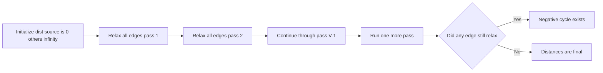
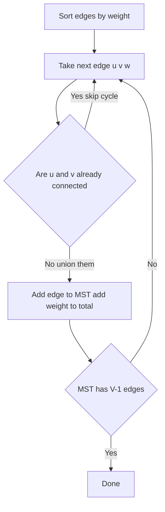

# Lecture 2 — Bellman-Ford, Floyd-Warshall, and Minimum Spanning Trees

> **Duration:** ~2 hours.
> **Outcome:** You can implement Bellman-Ford in `V - 1` outer passes with the `V`-th pass as a negative-cycle detector, defend Floyd-Warshall's three-nested-loop intuition with the intermediate-vertex `k` placed outermost, write Kruskal's MST in twenty lines on top of the Union-Find class from Lecture 3, and recognize Prim's MST as the Dijkstra-shaped sibling. The recognition step — *which of these four algorithms does this prompt want?* — is the senior signal.

Lecture 1 installed Dijkstra and the shortest-path picker. This lecture installs the three algorithms Dijkstra cannot handle: **Bellman-Ford** for negative weights and negative-cycle detection, **Floyd-Warshall** for all-pairs shortest paths on small graphs, and the **minimum spanning tree** family — **Kruskal** (sort edges + DSU) and **Prim** (Dijkstra-shaped). The implementations are short; the recognition is the work.

The interview register of this lecture is more honest about what you will and will not implement under pressure. **Bellman-Ford and Floyd-Warshall are "name and apply" algorithms** — you recognize when they apply, you may be asked to implement, and you should be able to write either in ten minutes from memory, but you will spend more interview time *defending the choice* than writing the code. **MST problems come up roughly every fifth onsite at infrastructure-heavy companies** (cabling, network layout, clustering algorithms); the disguise rate is high — "minimum cost to connect" almost never says "MST" in the prompt.

---

## 1. Bellman-Ford — what it is

Bellman-Ford computes single-source shortest paths on a directed weighted graph that **may contain negative edge weights**. It does *not* require negative-weight-free input, only **negative-cycle-free input** — the algorithm's first job is often to *detect* whether a negative cycle exists at all.

The core idea: relax every edge `V - 1` times. After the `i`-th outer pass, `dist[v]` is correct for every vertex `v` whose shortest path from the source uses at most `i` edges. Since any acyclic shortest path uses at most `V - 1` edges, `V - 1` outer passes suffice.

The implementation:

```python
from __future__ import annotations

from typing import Dict, List, Optional, Tuple


def bellman_ford(
    edges: List[Tuple[int, int, float]], num_vertices: int, source: int
) -> Optional[Dict[int, float]]:
    """Compute shortest distances from `source`; return None if a negative cycle exists.

    Args:
        edges: List of `(u, v, weight)` directed edges. Weights may be negative.
        num_vertices: The number of vertices, labeled `0..num_vertices-1`.
        source: The source vertex.

    Returns:
        A dict mapping each vertex to its shortest distance from `source`,
        or `None` if a negative cycle is reachable from `source`.
    """
    dist: Dict[int, float] = {v: float("inf") for v in range(num_vertices)}
    dist[source] = 0.0

    # V - 1 outer passes of edge relaxation.
    for _ in range(num_vertices - 1):
        updated = False
        for u, v, w in edges:
            if dist[u] + w < dist[v]:
                dist[v] = dist[u] + w
                updated = True
        if not updated:
            break  # early termination — no edges improved this pass

    # Pass V detects a negative cycle: if any edge can still be relaxed,
    # there is a negative cycle reachable from `source`.
    for u, v, w in edges:
        if dist[u] + w < dist[v]:
            return None

    return dist
```

Twenty-five lines. The structure is simpler than Dijkstra — no heap, no guard, no defaultdict. The complexity is `O(V E)`: `V - 1` outer passes times `E` inner relaxations.

Three observations:

1. **The `V`-th pass is the negative-cycle detector.** After `V - 1` passes, the distances are correct *if* no negative cycle exists. A `V`-th pass that still improves any distance proves a negative cycle exists on some path from the source. This is the canonical interview line: *"to detect a negative cycle, run one more pass; if any edge relaxes, there is a negative cycle."*

2. **Early termination is a practical speedup but does not change the asymptotic bound.** The `if not updated: break` is worth ten lines of explanation in an interview — it shows you understand that a fixpoint is reached when no edge improves any distance, and that on most real inputs Bellman-Ford finishes well before `V - 1` passes.

3. **The order of edges within a pass does not matter for correctness** but affects practical speed. For interview purposes, iterate `edges` in input order; for competitive programming, sort or reorder for cache locality.


*V-1 relaxation passes settle every distance; a Vth pass that still improves an edge proves a negative cycle.*

---

## 2. Bellman-Ford with a hop-count constraint

The variant that shows up most in LeetCode interview prompts. The problem: find the cheapest path from `source` to `target` using **at most `K` intermediate stops** (i.e., at most `K + 1` edges).

Bellman-Ford handles this naturally. The `i`-th outer pass produces distances correct for paths of at most `i` edges. So **`K + 1` outer passes** give distances correct for paths of at most `K + 1` edges — exactly the constraint.

```python
from __future__ import annotations

from typing import Dict, List, Tuple


def cheapest_within_k_stops(
    edges: List[Tuple[int, int, float]],
    num_vertices: int,
    source: int,
    target: int,
    k: int,
) -> float:
    """Cheapest path from `source` to `target` using at most `k` intermediate stops.

    Returns `float('inf')` if no such path exists.
    """
    dist: Dict[int, float] = {v: float("inf") for v in range(num_vertices)}
    dist[source] = 0.0

    # K + 1 outer passes (K stops + 1 final hop).
    for _ in range(k + 1):
        # CRITICAL: snapshot dist before relaxing to avoid using this-pass updates
        # within the same pass. Otherwise we count more than `i` edges in pass `i`.
        prev_dist = dist.copy()
        for u, v, w in edges:
            if prev_dist[u] + w < dist[v]:
                dist[v] = prev_dist[u] + w

    return dist[target]
```

The **snapshot** (`prev_dist = dist.copy()`) is the discriminating implementation detail. Without it, within a single pass an edge `u -> v` might be relaxed using a *just-updated* `dist[u]` value, which corresponds to a path of more edges than the pass-count allows. The snapshot freezes the per-pass starting state.

This is the LC 787 (Cheapest Flights Within K Stops) shape, exactly. Exercise 2 and Challenge 1 both build on this template; the snapshot bug is the single most common reason a Bellman-Ford submission fails LC 787 with a wrong answer rather than a TLE.

The alternative — modified Dijkstra with state `(node, hops_used)` in the heap — is also correct and often runs faster on graphs where most paths terminate before the hop limit:

```python
import heapq
from typing import Dict, List, Tuple


def cheapest_within_k_stops_dijkstra(
    graph: Dict[int, List[Tuple[int, int]]],
    source: int,
    target: int,
    k: int,
) -> float:
    """Modified-Dijkstra variant with `hops_used` in the state."""
    # State: (distance, node, hops_used)
    heap: List[Tuple[float, int, int]] = [(0.0, source, 0)]
    # best[(node, hops)] = the best distance to reach `node` with exactly `hops` stops
    best: Dict[Tuple[int, int], float] = {}

    while heap:
        d, node, hops = heapq.heappop(heap)
        if node == target:
            return d
        if hops > k:
            continue
        if (node, hops) in best and best[(node, hops)] <= d:
            continue
        best[(node, hops)] = d
        for neighbor, weight in graph.get(node, []):
            heapq.heappush(heap, (d + weight, neighbor, hops + 1))

    return float("inf")
```

The state `(node, hops_used)` is the key — without it, the heap would settle a vertex at its overall-shortest distance, ignoring the hop budget. This is the canonical "Dijkstra with state" pattern; you will use it again in Phase 3.

Which variant is preferred depends on the graph shape. Bellman-Ford is simpler to defend and runs in `O(K * E)`; Dijkstra-with-state can be faster when the target is reachable in few hops but is harder to write correctly under pressure. For interview purposes, write the Bellman-Ford form first and mention the Dijkstra variant in Examine · cost.

---

## 3. Floyd-Warshall — what it is

Floyd-Warshall computes **all-pairs shortest paths** in `O(V^3)` time and `O(V^2)` space. It works on any graph (negative edges allowed, as long as no negative cycle exists) and is the cleanest illustration of a *dynamic-programming* formulation on graphs.

The core idea: build up the all-pairs distance matrix by allowing one more intermediate vertex at each iteration. After iteration `k`, `dist[i][j]` is the shortest path from `i` to `j` that uses only vertices `0..k-1` as intermediates. The recurrence:

> `dist[i][j] = min(dist[i][j], dist[i][k] + dist[k][j])`

over `i`, `j`, and `k` ranging over all vertices, **with `k` as the outermost loop**.

```python
from __future__ import annotations

from typing import List


def floyd_warshall(dist: List[List[float]]) -> List[List[float]]:
    """All-pairs shortest paths via Floyd-Warshall.

    Args:
        dist: An adjacency matrix. `dist[i][j]` is the weight of the edge
            from `i` to `j`, or `float('inf')` if no such edge exists.
            `dist[i][i]` should be 0. The input is mutated in place AND
            returned for convenience.

    Returns:
        The same matrix, updated so that `dist[i][j]` is the shortest path
        weight from `i` to `j`. Returns the matrix unchanged if a negative
        cycle exists (caller should check `dist[i][i] < 0` for some `i`).
    """
    n = len(dist)
    for k in range(n):
        for i in range(n):
            for j in range(n):
                if dist[i][k] + dist[k][j] < dist[i][j]:
                    dist[i][j] = dist[i][k] + dist[k][j]
    return dist
```

Eight lines of algorithm; the rest is type annotation. Three observations:

1. **Loop order matters.** `k` *must* be the outermost loop. Putting `i` or `j` outermost gives a buggy implementation that under-relaxes some pairs. The intuition: after the `k`-th iteration of the outer loop, the invariant "`dist[i][j]` is the shortest path using intermediates from `{0..k}`" must hold *for all* `(i, j)`. Setting `k` outermost is what makes the invariant hold.

2. **Negative cycles surface as negative diagonal entries.** After the algorithm runs, if `dist[i][i] < 0` for any `i`, the graph contains a negative cycle reachable from `i`. This is the all-pairs analogue of Bellman-Ford's `V`-th-pass check.

3. **The `O(V^3)` runtime is tight.** For `V = 400`, that is `6.4 * 10^7` operations — about half a second in Python. For `V = 1000`, it is `10^9` — too slow in Python but fine in C++. The constraint "all-pairs shortest paths with `V <= 400`" is the recognition cue for Floyd-Warshall.

The right Research-constraints framing for Floyd-Warshall:

> "*All-pairs shortest paths with `V` bounded under 400 or so. Floyd-Warshall: three nested loops with `k` outermost; `O(V^3)` time and `O(V^2)` space. For sparse graphs with `V > 400`, Johnson's algorithm — Bellman-Ford to reweight, then Dijkstra `V` times — beats Floyd-Warshall. For interview purposes I would write Floyd-Warshall unless the constraints are unusual.*"

---

## 4. Minimum spanning trees — what they are

A **spanning tree** of a connected undirected graph is a subgraph that touches every vertex and is itself a tree (i.e., `V - 1` edges and no cycles). A **minimum spanning tree (MST)** is a spanning tree whose total edge weight is minimum among all spanning trees.

The disguises in interview prompts:

- "Minimum cost to connect all cities."
- "Cheapest way to lay cable / fiber / network connections between every pair of locations."
- "Find a road system that links all towns with minimum total road length."
- "Cluster the points into `k` groups such that the maximum inter-cluster distance is minimized" (the **single-linkage clustering** variant — drop the `k - 1` heaviest MST edges).
- "Minimum cost to build a network where every node can communicate with every other node."

If the prompt asks you to *connect every node with minimum total weight*, it is MST. The "connect every node" is the spanning property; the "minimum total weight" is the M.

Three structural properties of every MST:

1. **It has exactly `V - 1` edges.** This is the spanning-tree property. If the graph is disconnected, no spanning tree exists; report this as a precondition violation.
2. **It contains the unique cheapest edge of any cut.** A "cut" is a partition of the vertices into two non-empty sets; the "crossing edges" of a cut are those with one endpoint in each. The **cut property**: the lightest crossing edge of any cut is in *some* MST.
3. **It is not necessarily unique.** If two edges have the same weight and are interchangeable across some cut, multiple MSTs exist. The total weight is unique.

Two algorithms compute MSTs. Both are greedy. Both rely on the cut property.

---

## 5. Kruskal's MST

The simplest MST algorithm, and the cleanest illustration of DSU's leverage. Sort the edges by weight; iterate them in order; accept an edge iff its endpoints are in different DSU components.

```python
from __future__ import annotations

from typing import List, Tuple

from union_find import UnionFind  # see Lecture 3


def kruskal(
    edges: List[Tuple[int, int, float]], num_vertices: int
) -> Tuple[float, List[Tuple[int, int, float]]]:
    """Kruskal's MST.

    Args:
        edges: List of `(u, v, weight)` undirected edges.
        num_vertices: The number of vertices, labeled `0..num_vertices-1`.

    Returns:
        A `(total_weight, mst_edges)` pair. If the graph is disconnected,
        `mst_edges` has fewer than `num_vertices - 1` entries; check the
        length to detect disconnection.
    """
    edges_sorted = sorted(edges, key=lambda e: e[2])
    uf = UnionFind(num_vertices)
    mst: List[Tuple[int, int, float]] = []
    total: float = 0.0

    for u, v, w in edges_sorted:
        if uf.union(u, v):
            mst.append((u, v, w))
            total += w
            if len(mst) == num_vertices - 1:
                break  # MST complete; no further edges needed

    return total, mst
```

Twenty lines (counting imports and docstring). The structure is short because DSU does the heavy lifting; the `uf.union(u, v)` call returns `False` if the endpoints are already in the same set, which is exactly the "would this edge form a cycle" check.

Three observations:

1. **`O(E log E)` time, dominated by the sort.** The DSU operations are amortized `O(alpha(V))` per call; there are `E` of them; the product `E * alpha(V)` is dominated by `E log E` for any realistic input. Since `E <= V^2`, this is `O(E log V)` — but the sort term is what you cite in interviews.

2. **Early termination at `V - 1` edges.** Once `V - 1` edges are accepted, the MST is complete; we break. Without this, we still finish in `O(E log E)` (the loop terminates when edges run out), but the break is the discipline.

3. **Disconnected graphs produce a "minimum spanning forest."** If the graph has multiple components, Kruskal returns the MST of each, totaling fewer than `V - 1` edges. Check `len(mst) == num_vertices - 1` to detect disconnection.


*Kruskal accepts an edge only if the DSU union merges two different components, stopping once V-1 edges are chosen.*

---

## 6. Prim's MST — the Dijkstra-shaped variant

Prim grows the MST from a starting vertex by repeatedly adding the lightest edge that crosses from the in-tree set to the out-of-tree set. The implementation is structurally identical to Dijkstra — heap of `(weight, vertex)` pairs, lazy delete, mark-visited — with two differences:

1. The heap key is the **edge weight**, not the cumulative distance from the source.
2. The "settled" set is the in-tree set, not the shortest-path-known set.

```python
from __future__ import annotations

import heapq
from typing import Dict, List, Set, Tuple


def prim(
    graph: Dict[int, List[Tuple[int, int]]], start: int
) -> Tuple[float, List[Tuple[int, int, float]]]:
    """Prim's MST starting from `start`.

    Args:
        graph: Undirected adjacency list. `graph[u]` is a list of
            `(v, weight)` neighbors; the graph must be symmetric.
        start: The starting vertex.

    Returns:
        A `(total_weight, mst_edges)` pair.
    """
    in_tree: Set[int] = {start}
    heap: List[Tuple[float, int, int]] = []  # (weight, from_vertex, to_vertex)
    for v, w in graph.get(start, []):
        heapq.heappush(heap, (float(w), start, v))

    mst: List[Tuple[int, int, float]] = []
    total: float = 0.0

    while heap and len(in_tree) < len(graph):
        w, u, v = heapq.heappop(heap)
        if v in in_tree:
            continue  # stale entry; both endpoints already in the tree
        in_tree.add(v)
        mst.append((u, v, w))
        total += w
        for nbr, weight in graph.get(v, []):
            if nbr not in in_tree:
                heapq.heappush(heap, (float(weight), v, nbr))

    return total, mst
```

Twenty-five lines. The structure is Dijkstra with the heap key being the edge weight rather than the distance-from-source. `O(E log V)` time.

Two observations:

1. **Prim wins on dense graphs.** For `E = V^2`, Prim's `O(E log V) = O(V^2 log V)` beats Kruskal's `O(E log E) = O(V^2 log V^2) = O(V^2 log V)` — they tie asymptotically, but Prim's constants are smaller because there is no global sort. For sparse graphs, Kruskal is simpler and often faster in practice.

2. **The DSU is *not* needed for Prim.** The "is this vertex already in the tree" check is a simple set membership. This is what makes Prim independent of the Lecture-3 DSU material — you can ship Prim before you ship Union-Find. For interview purposes, ship Kruskal first (DSU is the better illustration); Prim is the variant.

---

## 7. The MST disguises — recognition cues

The high-leverage Research-constraints skill for MST problems is recognizing the disguise. Some surface forms:

- **"Minimum cost to connect all points"** (LC 1584) — MST on a complete graph where edge weights are Manhattan distances.
- **"Optimize water distribution in a village"** (LC 1168) — MST on a graph with a virtual source vertex; well-construction costs become source-to-house edges.
- **"Find the city with the smallest number of neighbors at a threshold distance"** (LC 1334) — *not* MST; it is all-pairs shortest paths (Floyd-Warshall).
- **"Connect the ropes with minimum cost"** — *not* MST; it is the "greedy + heap" pattern from W8 (Huffman-like).
- **"Connecting cities with minimum cost"** (LC 1135) — MST on the city graph.
- **"Critical and pseudo-critical edges in MST"** (LC 1489) — MST with edge-by-edge analysis; the variant is to run MST with and without each edge.

The negative-space rejections — what is *not* MST — are equally important. Anything that asks for the *path between two specific vertices* is not MST; that is Dijkstra (or Bellman-Ford on negative weights). MST is about *connecting every vertex*, not about paths.

---

## 8. The picker, expanded

Combining Lectures 1 and 2:

| Constraint signal | Algorithm | Complexity |
|-------------------|-----------|-----------:|
| Unweighted, shortest hops | BFS (W6) | `O(V + E)` |
| Non-negative weights, single source | Dijkstra | `O((V + E) log V)` |
| Has negative weights, single source | Bellman-Ford | `O(V E)` |
| Has negative weights, detect negative cycle | Bellman-Ford + `V`-th pass | `O(V E)` |
| All-pairs, small `V` | Floyd-Warshall | `O(V^3)` |
| All-pairs, sparse, large `V`, negative weights OK | Johnson's algorithm (P3) | `O(V^2 log V + V E)` |
| Hop-count constraint (`K` stops) | Bellman-Ford bounded by `K + 1` OR Dijkstra-with-state | `O(K E)` or similar |
| Connect all vertices with minimum total weight | MST (Kruskal or Prim) | `O(E log E)` |
| Number of components after streaming unions | DSU (Lecture 3) | `O(E alpha(V))` |

The senior signal: walk this table from the constraint signal to the algorithm in 30 seconds, without rehearsal.

---

## 9. The four common bugs (Bellman-Ford and MST edition)

**Bug 1 — Forgetting the snapshot in hop-constrained Bellman-Ford.** As discussed in §2, within a single pass an edge `u -> v` may be relaxed using a `dist[u]` value that was *itself* just updated by an earlier edge in the same pass. The snapshot (`prev_dist = dist.copy()`) prevents this.

**Bug 2 — Running Bellman-Ford on a directed graph as if it were undirected.** For undirected graphs, each edge `{u, v}` must appear as both `(u, v, w)` and `(v, u, w)` in the edge list. Forgetting one direction silently produces wrong answers on the reverse direction.

**Bug 3 — Wrong loop order in Floyd-Warshall.** Putting `i` or `j` as the outermost loop breaks the algorithm. The `k`-outermost order is the *only* correct order. If you find yourself getting wrong answers, swap loop order before debugging anything else.

**Bug 4 — Kruskal accepting an edge whose endpoints are already connected.** The `uf.union(u, v)` call must return `True` (a new merge happened) for the edge to be accepted. If your DSU's `union` method does not return this signal, modify it. The common bug is checking `uf.find(u) != uf.find(v)` *and then* calling `uf.union(u, v)` unconditionally — that works but does two extra finds per edge; the boolean-return form is cleaner.

---

## 10. Defending each algorithm in interview voice

Three sentences per algorithm; memorize the cadence for the one that comes up.

**Bellman-Ford:**

> "Bellman-Ford computes single-source shortest paths on graphs with possibly-negative edge weights, in `O(V E)` time. It works by relaxing every edge `V - 1` times — after `i` passes, `dist[v]` is correct for any vertex reachable in at most `i` edges, and `V - 1` edges suffice for any acyclic shortest path. The `V`-th pass is the negative-cycle detector: if any edge can still be relaxed after `V - 1` passes, a negative cycle exists on a path from the source."

**Floyd-Warshall:**

> "Floyd-Warshall computes all-pairs shortest paths in `O(V^3)` time and `O(V^2)` space. It is a dynamic-programming formulation: after the `k`-th iteration of the outermost loop, `dist[i][j]` is the shortest path from `i` to `j` using only vertices `0..k-1` as intermediates. The loop order `k, i, j` is non-negotiable; swapping the loop order breaks the algorithm. For `V <= 400` this is the cleanest all-pairs algorithm; for larger sparse graphs with negative edges, Johnson's algorithm beats it."

**Kruskal:**

> "Kruskal's MST sorts the edges by weight in `O(E log E)`, then iterates in order, accepting an edge iff its endpoints are in different DSU components. The DSU `union` returns `True` on a new merge and `False` if the endpoints are already connected. The algorithm terminates at `V - 1` accepted edges; if fewer are accepted, the graph is disconnected."

**Prim:**

> "Prim's MST is structurally Dijkstra-shaped: a heap of `(edge_weight, from, to)` tuples; pop the lightest edge whose far endpoint is not yet in the tree; add the endpoint and push its outgoing edges. `O(E log V)` time. Preferable over Kruskal on dense graphs; for sparse graphs Kruskal is simpler and competitive."

That cadence is the senior-grade defense. The implementation is the second part. Both are graded.

---

## What's next

Lecture 3 covers Union-Find — the data structure that backs Kruskal and stands on its own as the answer to "merge / components / equivalence class" problems. After Lecture 3, the week's algorithms are complete; the rest of the week is exercises, the challenge, the homework, and the mini-project.
