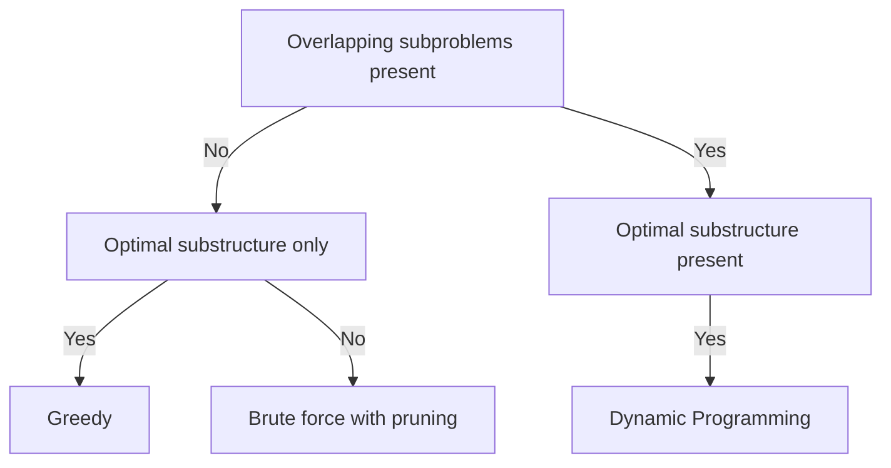
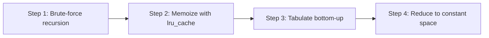

# Lecture 1 — The DP Pipeline and 1D States

> **Duration:** ~2 hours.
> **Outcome:** You can recognize a DP problem in 30 seconds by checking two boxes (overlapping subproblems plus optimal substructure), write a brute-force recursion, decorate it with `functools.lru_cache`, convert it mechanically to a bottom-up table in four steps, and articulate why each 1D problem in this lecture has the recurrence it does — Fibonacci, climbing stairs, house robber, decode ways, and word break.

Last week installed the weighted-graph family — Dijkstra, Bellman-Ford, Floyd-Warshall, MST, and DSU. The work was *picking the right algorithm* from constraint signals. This week installs **dynamic programming**, where the work is different in kind: it is *running a disciplined process* — the four-step pipeline — on every DP problem you see, instead of trying to "see the answer."

By the end of this lecture you should be able to read a 1D-DP problem and, within 30 seconds, say two things out loud: "**this is DP because [overlapping subproblems + optimal substructure]**," and "**the state is `dp[i] = [semantic description]` and the recurrence is `dp[i] = [transition]`**." The third thing — implementing the bottom-up loop from that recurrence — is the work of the second hour.

This lecture covers the foundations: the two recognition triggers, the four-step pipeline, and the 1D-DP suite. Lecture 2 covers 2D DP and the grid / string-pair shapes. Lecture 3 covers state-space reduction and the recognition flowchart for the full week.

---

## 1. The two triggers

Dynamic programming applies if **and only if** the problem has both:

1. **Overlapping subproblems** — the recursive call tree of a brute-force solution revisits the same arguments many times. Caching collapses exponential time to polynomial.
2. **Optimal substructure** — the optimum of the full problem composes from optima of subproblems. The Bellman principle.

If both hold, the problem is DP. If only optimal substructure holds, the problem is greedy (each step's local optimum extends to a global optimum without re-examination). If neither holds, the problem is brute-force search with pruning.


*The two triggers decide whether a problem is DP, greedy, or brute force.*

**Test for overlapping subproblems.** Write a brute-force recursion. Draw the call tree for a small input (say, `n = 5`). Count how many times each unique call appears. If any call appears more than once, you have overlapping subproblems.

For Fibonacci:

```
                          fib(5)
                         /      \
                    fib(4)       fib(3)
                    /    \       /    \
               fib(3)  fib(2) fib(2)  fib(1)
                /  \    / \   / \
           fib(2) fib(1) ... ... ...
```

`fib(3)` appears twice. `fib(2)` appears three times. `fib(1)` appears five times. Overlapping subproblems confirmed.

**Test for optimal substructure.** Ask: "if I knew the optimum of every smaller subproblem, could I compose them into the optimum of the full problem?" If yes, optimal substructure. For Fibonacci, `fib(n) = fib(n-1) + fib(n-2)` is the composition. For house robber, `dp[i] = max(dp[i-1], dp[i-2] + nums[i])` is the composition: the optimum loot from houses `0..i` is either the optimum from `0..i-1` (skip house `i`) or `nums[i] + optimum from 0..i-2` (rob house `i`).

If both triggers fire, the problem is DP. Memorize the cadence: *overlapping subproblems plus optimal substructure*. Interviewers expect you to say both phrases aloud.

---

## 2. The four-step pipeline

The most important muscle this week. On every DP problem, run the four steps in order. Do **not** try to skip steps. The pipeline is short, mechanical, and produces a correct answer every time.


*The four-step pipeline every DP problem runs through, in order.*

### Step 1 — Brute-force recursion

Write a pure recursive function with the state as parameters. Do not optimize. Do not memoize yet. The goal is correctness on small inputs and a clear statement of the recurrence.

For house robber:

```python
from __future__ import annotations

from typing import List


def rob_naive(nums: List[int], i: int) -> int:
    """Maximum loot from houses 0..i (inclusive). i is the index parameter."""
    if i < 0:
        return 0
    return max(rob_naive(nums, i - 1), rob_naive(nums, i - 2) + nums[i])
```

The state is `i`. The transition is `max(skip, take)`. The base case is `i < 0` (no houses to consider). Time: `O(2^n)` because each call branches into two subcalls.

### Step 2 — Memoize

Add `@functools.lru_cache(maxsize=None)`. The decorator caches the return value of the function keyed on the argument tuple. The first call with a given argument computes; every subsequent call with the same argument returns the cached value in `O(1)`.

```python
from __future__ import annotations

import functools
from typing import Tuple


@functools.lru_cache(maxsize=None)
def rob_memo(nums: Tuple[int, ...], i: int) -> int:
    """Same as rob_naive, but memoized. Tuple is hashable; list is not."""
    if i < 0:
        return 0
    return max(rob_memo(nums, i - 1), rob_memo(nums, i - 2) + nums[i])
```

Two things to notice:

1. **`nums` is a tuple, not a list.** `@lru_cache` requires hashable arguments. Lists are not hashable; tuples are. The caller converts: `rob_memo(tuple(nums), len(nums) - 1)`. The alternative is to pass only the index and have `nums` live in an outer scope (closure or class attribute).
2. **The complexity collapses to `O(n)`.** Each unique `i` from `-1` to `n - 1` is computed once. The cache holds `n + 1` entries; each computation is `O(1)` (a max of two cached subproblems plus an addition). Total `O(n)` time, `O(n)` space.

### Step 3 — Tabulate

Convert to a bottom-up loop over a `dp` array. The state is `i`; the recurrence is the same; the iteration order is "left to right" so each `dp[i]` is computed before `dp[i+1]` or `dp[i+2]` need to read it.

```python
from __future__ import annotations

from typing import List


def rob_table(nums: List[int]) -> int:
    """Bottom-up tabulation. dp[i] = max loot from houses 0..i."""
    n = len(nums)
    if n == 0:
        return 0
    if n == 1:
        return nums[0]

    dp: List[int] = [0] * n
    dp[0] = nums[0]
    dp[1] = max(nums[0], nums[1])
    for i in range(2, n):
        dp[i] = max(dp[i - 1], dp[i - 2] + nums[i])
    return dp[n - 1]
```

The base cases `dp[0]` and `dp[1]` are set explicitly. The loop starts at `i = 2` so the recurrence has valid `dp[i - 1]` and `dp[i - 2]` to read. The final answer is `dp[n - 1]`.

### Step 4 — Reduce space

The recurrence reads only `dp[i - 1]` and `dp[i - 2]`. The entire `dp` array is unnecessary; two scalars suffice.

```python
from __future__ import annotations

from typing import List


def rob_rolling(nums: List[int]) -> int:
    """O(1) space via rolling pair. prev2 = dp[i-2]; prev1 = dp[i-1]."""
    prev2, prev1 = 0, 0
    for num in nums:
        prev2, prev1 = prev1, max(prev1, prev2 + num)
    return prev1
```

`prev2` and `prev1` shift forward at each iteration. The simultaneous-assignment `prev2, prev1 = prev1, max(prev1, prev2 + num)` is the canonical Python idiom for the rolling-pair update. Without it, a beginner writes `prev2 = prev1; prev1 = max(prev1, prev2 + num)` and the second line uses the already-updated `prev2`, producing wrong answers.

The pipeline is the rubric. Under interview pressure, write steps 1 and 2 always. Write step 3 if asked to convert. Write step 4 only if asked to reduce space.

---

## 3. Fibonacci — the canonical DP warm-up

Fibonacci is the smallest DP that exhibits both triggers. The four-step pipeline on Fibonacci is in [resources.md §4](../resources.md#on-the-four-step-pipeline). Read it now if you have not.

The progression is the visceral demonstration of why DP matters. Run each of the four forms on `n = 35`:

| Form | Time on `n = 35` (rough) | Space |
|------|--------------------------:|------:|
| Naive recursion | ~10 seconds | `O(n)` stack |
| Memoized | <1 millisecond | `O(n)` cache |
| Tabulated | <1 millisecond | `O(n)` table |
| Rolling pair | <1 millisecond | `O(1)` |

The naive form runs `2^35 ≈ 3.4 * 10^10` operations. The memoized form runs `35` cached computations. The asymptotic difference is `10^9` — a billion-fold speedup from a one-line decorator.

The lecture-time takeaway: **memoization is essentially free under interview conditions.** Write the recursion, write `@functools.lru_cache(maxsize=None)`, run the tests. If correct, you have a DP solution. The conversion to tabulation is the optimization step, not the correctness step.

---

## 4. Climbing stairs (LC 70) — Fibonacci in disguise

> *You are climbing a staircase. It takes `n` steps to reach the top. Each time you can climb 1 or 2 steps. How many distinct ways can you climb to the top?*

**Match.** The brute-force recursion: `ways(n) = ways(n - 1) + ways(n - 2)` (take a 1-step from `n - 1`, or take a 2-step from `n - 2`). Base cases: `ways(0) = 1` (one way to stand still); `ways(1) = 1` (one way: a single 1-step). Overlapping subproblems and optimal substructure both hold. DP.

**State semantics.** `dp[i] = number of distinct ways to reach step i`. This is the senior-grade Match move: name the state in words, not just the formula. The interviewer is checking that you understand why the recurrence has the shape it does, not just that you remember the shape.

**Recurrence.** `dp[i] = dp[i - 1] + dp[i - 2]`. The number of ways to reach step `i` is the number of ways to reach step `i - 1` (then take a 1-step) plus the number of ways to reach step `i - 2` (then take a 2-step). The two paths are disjoint (the final step is different), so addition is correct.

**Tabulation.**

```python
from __future__ import annotations


def climb_stairs(n: int) -> int:
    """Number of distinct ways to climb n stairs, taking 1 or 2 steps at a time."""
    if n <= 2:
        return n
    prev2, prev1 = 1, 2
    for _ in range(3, n + 1):
        prev2, prev1 = prev1, prev2 + prev1
    return prev1
```

Eight lines including the base case. The rolling-pair reduction is the natural form; the `dp` array form is shown in [resources.md §4](../resources.md#on-the-four-step-pipeline).

**Defense.** "Climbing stairs is Fibonacci in disguise. The state is `dp[i] = ways to reach step i`. The recurrence sums the two preceding states. `O(n)` time, `O(1)` space with the rolling pair."

---

## 5. House robber (LC 198) — the take-or-skip recurrence

> *You are a professional robber planning to rob houses along a street. Each house has a certain amount of money. The constraint is that adjacent houses are connected and will automatically contact the police if both are robbed on the same night. Return the maximum amount of money you can rob without alerting the police.*

**Match.** The brute-force recursion: for each house `i`, decide to rob it (collect `nums[i]` and skip house `i - 1`) or skip it (move on to house `i - 1`). `rob(i) = max(rob(i - 1), rob(i - 2) + nums[i])`. Overlapping subproblems and optimal substructure both hold. DP.

**State semantics.** `dp[i] = maximum loot considering houses 0..i (inclusive)`. The state is the index of the rightmost house under consideration; the DP captures "what is the best we can do up to here?"

**Recurrence.** `dp[i] = max(dp[i - 1], dp[i - 2] + nums[i])`. The first term is "skip house `i`"; the second is "rob house `i` and the best from houses `0..i - 2`." The two cases are exhaustive (you either rob or skip the current house) and the max picks the better.

**Why not greedy?** A naive greedy is "rob every other house starting from the largest." This fails on `[2, 7, 9, 3, 1]`: greedy picks `9 + 7 = 16` (greedy by index) or `9 + 2 = 11` (greedy by alternating from the largest), but the optimum is `2 + 9 + 1 = 12`. DP is required because the local optimum (the largest single house) does not extend to a global optimum without re-examination.

**Tabulation with rolling pair.**

```python
from __future__ import annotations

from typing import List


def rob(nums: List[int]) -> int:
    """Maximum loot from a row of houses; adjacent houses cannot both be robbed."""
    prev2, prev1 = 0, 0
    for num in nums:
        prev2, prev1 = prev1, max(prev1, prev2 + num)
    return prev1
```

Six lines. The rolling pair is identical in structure to climbing stairs, only the transition differs (max instead of sum).

**Defense.** "House robber is the simplest combinatorial-choice 1D. The state is `dp[i] = max loot from houses 0..i`. The recurrence is max over two choices: skip house `i` (`dp[i-1]`) or rob it (`dp[i-2] + nums[i]`). Why not greedy: the local optimum does not extend; DP is required."

---

## 6. Decode ways (LC 91) — the conditional-transition 1D

> *A message containing letters from A–Z is encoded to numbers using the mapping 'A' -> '1', 'B' -> '2', ..., 'Z' -> '26'. Given a string `s` containing only digits, return the number of ways to decode it.*

**Match.** The brute-force recursion: for each position `i`, decide whether to consume one digit (if `s[i]` is in `1..9`) or two digits (if `s[i..i+1]` is in `10..26`). The count is the sum of the counts from each valid choice. Overlapping subproblems and optimal substructure both hold. DP.

**State semantics.** `dp[i] = number of ways to decode the prefix s[:i]`. `dp[0] = 1` (the empty string has one decoding: itself). `dp[n]` is the answer.

**Recurrence.** This is the discriminating problem of the lecture. The recurrence has **two conditional branches**:

```
dp[i] = (dp[i - 1] if s[i - 1] is in '1'..'9') + (dp[i - 2] if s[i - 2 : i] is in '10'..'26')
```

The first branch adds the number of ways to decode `s[:i-1]` if `s[i-1]` is a valid single-digit code. The second branch adds the number of ways to decode `s[:i-2]` if `s[i-2:i]` is a valid two-digit code.

**Canonical edge cases.**

1. **Leading zero.** `s = "06"` has zero decodings because `'0'` alone is not a valid code and `'06'` is not in `10..26`. The DP catches this: `dp[1] = 0` (since `s[0] = '0'` fails the single-digit check), and `dp[2] = 0` (since `dp[1] = 0` and `s[0:2] = "06"` fails the two-digit check).
2. **Single zero in middle.** `s = "100"` has one decoding: `[1, 0, 0]` is invalid because `0` is not a code; `[10, 0]` is invalid for the same reason; `[1, 00]` is invalid because `00` is not in `10..26`. Wait — actually `s = "100"`: `dp[1] = 1` (decode as `'1'`), `dp[2] = 1` (decode `"10"` as `'10'`; single-digit check on `'0'` fails so no contribution from `dp[1]`), `dp[3]`: single-digit check on `'0'` fails; two-digit check on `"00"` fails. So `dp[3] = 0`. The string `"100"` has zero decodings, not one. Confirm by hand if doubtful — this is the canonical bug source.
3. **Two-digit boundary.** `s = "27"`: single-digit check passes on `'7'` so `dp[2] += dp[1] = 1`; two-digit check on `"27"` fails (27 > 26) so no contribution from `dp[0]`. `dp[2] = 1`.

**Tabulation.**

```python
from __future__ import annotations


def num_decodings(s: str) -> int:
    """Number of ways to decode a digit string under A=1..Z=26."""
    n = len(s)
    if n == 0:
        return 0

    dp: list[int] = [0] * (n + 1)
    dp[0] = 1
    dp[1] = 1 if s[0] != "0" else 0

    for i in range(2, n + 1):
        # Single-digit decode of s[i-1]
        if s[i - 1] != "0":
            dp[i] += dp[i - 1]
        # Two-digit decode of s[i-2 : i]
        two = int(s[i - 2 : i])
        if 10 <= two <= 26:
            dp[i] += dp[i - 2]

    return dp[n]
```

Eighteen lines. The two conditional branches are visible in the loop body. The rolling-pair reduction works (only `dp[i - 1]` and `dp[i - 2]` are read).

**Defense.** "Decode ways is a 1D DP with a conditional transition. The state is `dp[i] = ways to decode s[:i]`. The recurrence has two conditional branches: add `dp[i-1]` if the single digit is valid, add `dp[i-2]` if the two digits form a valid code. The canonical bug is forgetting one of the validity checks or mishandling the leading-zero edge case."

---

## 7. Word break (LC 139) — the segmentation 1D

> *Given a string `s` and a dictionary of strings `wordDict`, return True if `s` can be segmented into a space-separated sequence of one or more dictionary words.*

**Match.** The brute-force recursion: try every possible split point `j`; if `s[:j]` is segmentable and `s[j:]` is a dictionary word, the answer is True. The recursion revisits the same subproblems (e.g., the segmentability of every prefix). Overlapping subproblems and optimal substructure both hold. DP.

**State semantics.** `dp[i] = True iff s[:i] can be segmented`. `dp[0] = True` (the empty string is trivially segmentable). `dp[n]` is the answer.

**Recurrence.**

```
dp[i] = any(dp[j] and s[j:i] in word_set for j in range(i))
```

For each `i`, check every possible position `j` where the last word might begin. If `s[:j]` is segmentable (`dp[j]`) and `s[j:i]` is in the dictionary, then `s[:i]` is segmentable.

**Why use a set for the dictionary?** Linear-search-in-list is `O(len(wordDict) * len(s[j:i]))` per check; set-lookup is `O(len(s[j:i]))` expected. Converting `wordDict` to a `set` is the one-line speedup.

**Complexity.** `O(n^2 * L)` time where `n = len(s)` and `L` is the average word length (the substring slice and hash). `O(n)` space for the DP array.

**Tabulation.**

```python
from __future__ import annotations

from typing import List


def word_break(s: str, word_dict: List[str]) -> bool:
    """Return True iff s can be segmented into a sequence of dictionary words."""
    word_set = set(word_dict)
    n = len(s)
    dp: List[bool] = [False] * (n + 1)
    dp[0] = True

    for i in range(1, n + 1):
        for j in range(i):
            if dp[j] and s[j:i] in word_set:
                dp[i] = True
                break

    return dp[n]
```

Fourteen lines. The inner loop short-circuits on the first valid split (the `break`), which does not improve the worst case but is a common practical speedup.

**Defense.** "Word break is a 1D DP with a string-set check. The state is `dp[i] = True iff s[:i] is segmentable`. The recurrence ORs over every valid split point `j`. The dictionary is converted to a set for `O(1)`-expected lookups. The bound is `O(n^2 * L)`."

---

## 8. Worked example — climbing stairs by hand on `n = 5`

The trace is the standard lecture-closing exercise. Walk it without looking ahead.

```
dp[0] = 1   (base case: zero stairs, one way)
dp[1] = 1   (base case: one stair, one way: a single 1-step)
dp[2] = dp[1] + dp[0] = 1 + 1 = 2     (1+1 or 2)
dp[3] = dp[2] + dp[1] = 2 + 1 = 3     (1+1+1, 1+2, 2+1)
dp[4] = dp[3] + dp[2] = 3 + 2 = 5     (1+1+1+1, 1+1+2, 1+2+1, 2+1+1, 2+2)
dp[5] = dp[4] + dp[3] = 5 + 3 = 8     (eight enumerations; verify by hand)
```

The Fibonacci sequence `1, 1, 2, 3, 5, 8` is visible. The answer for `n = 5` is `8`.

Memorize the trace shape: state column on the left, formula in the middle, value on the right. Under interview pressure, you will be asked to walk a trace by hand on a small input — this is the format.

---

## 9. Closing — the pipeline as a reflex

Three takeaways:

1. **The pipeline is the rubric.** Under interview pressure, write the brute-force recursion first, decorate with `@lru_cache`, verify on samples, then convert to tabulation if asked. The pipeline produces a correct answer in 15–20 minutes on every 1D DP this week.
2. **The state semantics is the senior signal.** Naming the state in words ("ways to reach step `i`", "max loot considering houses `0..i`", "True iff `s[:i]` is segmentable") demonstrates that you understand *why* the recurrence has its shape, not just that you have memorized it. Interviewers grade this hard.
3. **The four-step pipeline scales to 2D.** Lecture 2 reuses every step — write the recursion, memoize, tabulate, reduce space — only the state and the recurrence change shape. The discipline carries.

The 1D suite is the foundation. The 2D suite in Lecture 2 introduces the grid and string-pair shapes. State-space reduction in Lecture 3 closes the week.

[Back to the README](../README.md). On to [Lecture 2 — 2D DP and the grid and string-pair shapes](./02-2d-dp-and-the-grid-and-string-shapes.md).
