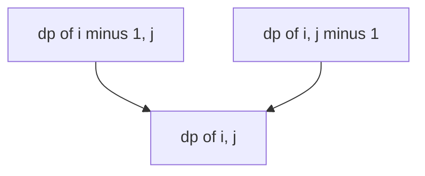
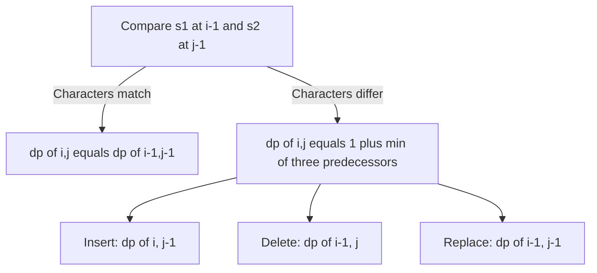

# Lecture 2 — 2D DP and the Grid and String-Pair Shapes

> **Duration:** ~2 hours.
> **Outcome:** You can recognize the 2D-DP shapes (grid traversal, string-pair, single-string-with-two-ends), write a 2D `dp[i][j]` table from memory for unique paths and longest common subsequence, articulate the three-way-min recurrence in edit distance, and distinguish subsequence DP (skipping allowed) from substring DP (contiguity required).

Lecture 1 installed the four-step pipeline on the 1D-DP suite. This lecture installs the pipeline on **2D DP** — problems whose state is a pair of indices rather than a single index. Two shapes recur: **grid traversal** (the state is `(row, col)`; the recurrence pulls from the top and the left) and **string-pair DP** (the state is `(i, j)` where `i` and `j` index two strings; the recurrence is built from the comparison `s1[i-1] == s2[j-1]`).

By the end of this lecture you should be able to:

- Walk the pipeline on **unique paths (LC 62)** — the canonical 2D grid DP.
- Walk the pipeline on **longest common subsequence (LC 1143)** — the canonical 2D string-pair DP.
- Walk the pipeline on **edit distance (LC 72)** — the three-way-min string-pair DP.
- Articulate the difference between **subsequence DP** and **substring DP** — the most-missed Phase-2 distinction.
- Reduce a 2D DP to `O(min(m, n))` space when the recurrence only reads the previous row.

Lecture 3 covers state-space reduction in general, the diagonal-fill iteration order for longest palindromic subsequence, and the week-level recognition flowchart.

---

## 1. The 2D state — when one index is not enough

A DP needs as many state parameters as it takes to fully determine a subproblem. For Fibonacci, one parameter (the index `n`) suffices. For Edit Distance — "transform `s1` into `s2`" — one parameter is not enough; you need to know *where you are in both strings*, so the state is `(i, j)`.

The state-design test: ask "if I tell you the state, can you tell me the answer for that subproblem without needing more information?" If yes, the state is sufficient. If no, add a parameter.

For unique paths on an `m x n` grid: the state is `(i, j)` because the number of paths from `(0, 0)` to `(i, j)` depends only on `i` and `j` (and the grid dimensions, which are fixed). The state is two-dimensional. The recurrence is a sum over the two predecessor cells.

For LCS on strings `s1` and `s2`: the state is `(i, j)` because the LCS of `s1[:i]` and `s2[:j]` depends only on `i` and `j` (and the two strings, which are fixed). The state is two-dimensional. The recurrence has two cases (match / no match) and a max over two predecessors in the no-match case.

For edit distance on strings `s1` and `s2`: the state is `(i, j)` because the edit distance of `s1[:i]` and `s2[:j]` depends only on `i` and `j`. The state is two-dimensional. The recurrence has two cases (match / no match) and a min over three predecessors in the no-match case.

The 2D state is the **same shape** for all three problems. The state semantics differ; the recurrence differs; the table form is identical. This commonality is what makes 2D DP a single learnable shape.

---

## 2. Unique paths (LC 62) — the canonical 2D grid DP

> *A robot is located at the top-left corner of an `m x n` grid. The robot can only move either down or right at any point in time. How many possible unique paths are there to reach the bottom-right corner?*

**Research constraints.** Brute force: from each cell `(i, j)`, recursively count paths from `(i, j)` to `(m - 1, n - 1)`. The recursion makes two calls (move right, move down) and revisits the same cells many times. Overlapping subproblems and optimal substructure both hold. 2D DP.

**State semantics.** `dp[i][j] = number of unique paths from (0, 0) to (i, j)`. The first row is all 1s (only one way to reach any cell in the top row: keep moving right). The first column is all 1s (only one way to reach any cell in the leftmost column: keep moving down).

**Recurrence.** `dp[i][j] = dp[i - 1][j] + dp[i][j - 1]`. The paths to `(i, j)` are exactly those that arrive from the top (`dp[i - 1][j]`) plus those that arrive from the left (`dp[i][j - 1]`). The two sets are disjoint (the final step is different), so addition is correct.


*Each grid cell's path count sums arrivals from the cell above and the cell to the left.*

**Tabulation.**

```python
from __future__ import annotations

from typing import List


def unique_paths(m: int, n: int) -> int:
    """Number of unique paths from (0,0) to (m-1, n-1) moving only down or right."""
    dp: List[List[int]] = [[1] * n for _ in range(m)]

    for i in range(1, m):
        for j in range(1, n):
            dp[i][j] = dp[i - 1][j] + dp[i][j - 1]

    return dp[m - 1][n - 1]
```

Eight lines. The first row and first column are initialized to 1s by the initializer; the loop starts at `i = 1, j = 1` so the recurrence has valid predecessors.

**Trace on `m = 3, n = 3`.**

```
Initial:
  1 1 1
  1 _ _
  1 _ _

After i = 1, j = 1: dp[1][1] = dp[0][1] + dp[1][0] = 1 + 1 = 2
After i = 1, j = 2: dp[1][2] = dp[0][2] + dp[1][1] = 1 + 2 = 3
After i = 2, j = 1: dp[2][1] = dp[1][1] + dp[2][0] = 2 + 1 = 3
After i = 2, j = 2: dp[2][2] = dp[1][2] + dp[2][1] = 3 + 3 = 6

Answer: dp[2][2] = 6
```

**Rolling-row reduction.** The recurrence reads `dp[i - 1][j]` (the row above) and `dp[i][j - 1]` (the cell to the left in the same row). Only one previous row is needed.

```python
from __future__ import annotations

from typing import List


def unique_paths_rolling(m: int, n: int) -> int:
    """O(n) space via rolling row."""
    dp: List[int] = [1] * n
    for _ in range(1, m):
        for j in range(1, n):
            dp[j] = dp[j] + dp[j - 1]
    return dp[n - 1]
```

Six lines. The trick: `dp[j]` on the right-hand side is the *previous-row* value (not yet overwritten); after the assignment, it is the *current-row* value. The single array does double duty.

**Defense.** "Unique paths is a 2D grid DP. The state is `dp[i][j] = number of paths to (i, j)`. The recurrence sums the two predecessors (top and left). `O(mn)` time. With a rolling row, `O(n)` space."

---

## 3. Longest common subsequence (LC 1143) — the canonical 2D subsequence DP

> *Given two strings `text1` and `text2`, return the length of their longest common subsequence. A subsequence of a string is a new string generated from the original string with some characters (possibly none) deleted without changing the order of the remaining characters.*

**Research constraints.** Brute force: at each `(i, j)`, decide what `dp[i][j]` should be. If `s1[i - 1] == s2[j - 1]`, the current characters match and we can extend the LCS by 1 — `dp[i][j] = dp[i - 1][j - 1] + 1`. Otherwise, we skip one character from either string — `dp[i][j] = max(dp[i - 1][j], dp[i][j - 1])`. Overlapping subproblems and optimal substructure both hold. 2D DP.

**State semantics.** `dp[i][j] = length of the LCS of s1[:i] and s2[:j]`. The first row is all 0s (LCS with an empty string is 0). The first column is all 0s. `dp[m][n]` is the answer.

**Index offset.** Note the off-by-one: `dp[i][j]` corresponds to prefixes `s1[:i]` and `s2[:j]`, which contain `i` and `j` characters respectively. The characters themselves are `s1[i - 1]` (the last character of the prefix `s1[:i]`) and `s2[j - 1]`. The table is dimension `(m + 1) x (n + 1)` to include the empty-prefix base cases.

**Recurrence.**

```
if s1[i - 1] == s2[j - 1]:
    dp[i][j] = dp[i - 1][j - 1] + 1     # extend the LCS by 1
else:
    dp[i][j] = max(dp[i - 1][j],         # skip s1[i - 1]
                   dp[i][j - 1])         # skip s2[j - 1]
```

**Why is the no-match case a max over two and not over three?** The third case would be "skip both characters" — `dp[i - 1][j - 1]`. But `dp[i - 1][j - 1]` is dominated by both `dp[i - 1][j]` and `dp[i][j - 1]` (adding a character to either prefix can only increase or maintain the LCS length). So the max over three is the same as the max over two; the implementation drops the redundant term.

**Tabulation.**

```python
from __future__ import annotations

from typing import List


def longest_common_subsequence(s1: str, s2: str) -> int:
    """Length of the longest common subsequence of s1 and s2."""
    m, n = len(s1), len(s2)
    dp: List[List[int]] = [[0] * (n + 1) for _ in range(m + 1)]

    for i in range(1, m + 1):
        for j in range(1, n + 1):
            if s1[i - 1] == s2[j - 1]:
                dp[i][j] = dp[i - 1][j - 1] + 1
            else:
                dp[i][j] = max(dp[i - 1][j], dp[i][j - 1])

    return dp[m][n]
```

Thirteen lines. The off-by-one (`s1[i - 1]`, not `s1[i]`) is the canonical bug; the base cases live in row 0 and column 0 which are zero-initialized.

**Trace on `s1 = "abcde", s2 = "ace"`.**

```
     ""  a  c  e
""    0  0  0  0
a     0  1  1  1
b     0  1  1  1
c     0  1  2  2
d     0  1  2  2
e     0  1  2  3

Answer: dp[5][3] = 3 (the LCS is "ace")
```

**Defense.** "LCS is a 2D string-pair DP. The state is `dp[i][j] = length of LCS of s1[:i] and s2[:j]`. The recurrence has two cases: match extends `dp[i-1][j-1]` by 1; no-match takes the max of `dp[i-1][j]` and `dp[i][j-1]`. The third predecessor `dp[i-1][j-1]` is dominated and can be dropped. `O(mn)` time, `O(min(m, n))` rolling space."

---

## 4. Edit distance (LC 72) — the three-way-min DP

> *Given two strings `word1` and `word2`, return the minimum number of operations required to convert `word1` to `word2`. You have the following three operations permitted: insert a character, delete a character, replace a character.*

**Research constraints.** Brute force: at each `(i, j)`, decide what `dp[i][j]` should be. If `s1[i - 1] == s2[j - 1]`, no edit is needed for this character — `dp[i][j] = dp[i - 1][j - 1]`. Otherwise, the minimum is 1 plus the minimum over three options: insert (`dp[i][j - 1]`), delete (`dp[i - 1][j]`), or replace (`dp[i - 1][j - 1]`). Overlapping subproblems and optimal substructure both hold. 2D DP.

**State semantics.** `dp[i][j] = minimum edits to convert s1[:i] into s2[:j]`. The first row is `[0, 1, 2, ..., n]` (converting an empty string to a length-`j` string takes `j` insertions). The first column is `[0, 1, 2, ..., m]` (converting a length-`i` string to an empty string takes `i` deletions).

**Recurrence.**

```
if s1[i - 1] == s2[j - 1]:
    dp[i][j] = dp[i - 1][j - 1]                     # no edit needed
else:
    dp[i][j] = 1 + min(dp[i][j - 1],                # insert s2[j - 1] at position i
                       dp[i - 1][j],                # delete s1[i - 1]
                       dp[i - 1][j - 1])            # replace s1[i - 1] with s2[j - 1]
```

**Why three predecessors?** The three operations are independent and each corresponds to a different precursor state. Insert: the previous state is `(i, j - 1)` — we have already converted `s1[:i]` to `s2[:j - 1]` and now insert `s2[j - 1]` to extend. Delete: the previous state is `(i - 1, j)` — we have already converted `s1[:i - 1]` to `s2[:j]` and now delete `s1[i - 1]`. Replace: the previous state is `(i - 1, j - 1)` — we have already converted `s1[:i - 1]` to `s2[:j - 1]` and now replace.

The discriminator versus LCS: LCS picks max over two predecessors (skipping is free); edit distance picks min over three predecessors plus 1 (every operation costs 1).


*Edit distance branches on a character match, then mins over three edit operations.*

**Tabulation.**

```python
from __future__ import annotations

from typing import List


def min_distance(word1: str, word2: str) -> int:
    """Minimum number of edits (insert/delete/replace) to convert word1 to word2."""
    m, n = len(word1), len(word2)
    dp: List[List[int]] = [[0] * (n + 1) for _ in range(m + 1)]

    for i in range(m + 1):
        dp[i][0] = i
    for j in range(n + 1):
        dp[0][j] = j

    for i in range(1, m + 1):
        for j in range(1, n + 1):
            if word1[i - 1] == word2[j - 1]:
                dp[i][j] = dp[i - 1][j - 1]
            else:
                dp[i][j] = 1 + min(
                    dp[i][j - 1],       # insert
                    dp[i - 1][j],       # delete
                    dp[i - 1][j - 1],   # replace
                )

    return dp[m][n]
```

Eighteen lines. The base-case initialization in the two short loops is non-zero (unlike LCS), which is the canonical bug source for edit distance — beginners forget the initialization and get wrong answers on edge cases like `word1 = "abc", word2 = ""`.

**Trace on `word1 = "horse", word2 = "ros"`.**

```
     ""  r  o  s
""    0  1  2  3
h     1  1  2  3
o     2  2  1  2
r     3  2  2  2
s     4  3  3  2
e     5  4  4  3

Answer: dp[5][3] = 3 (delete 'h', delete 'e', replace 'o' with 'o' wait... 
       horse -> rorse -> rose -> ros: replace 'h' with 'r', delete 'r', delete 'e' = 3)
```

**Defense.** "Edit distance is the three-way-min 2D string-pair DP. The state is `dp[i][j] = min edits to convert s1[:i] to s2[:j]`. The recurrence has two cases: match copies `dp[i-1][j-1]`; no-match adds 1 to the min over three predecessors corresponding to insert, delete, and replace. `O(mn)` time, `O(min(m, n))` rolling space. The base cases are non-zero — `dp[i][0] = i` and `dp[0][j] = j`."

---

## 5. Subsequence vs. substring — the most-missed distinction

A **subsequence** allows skipping. "abc" is a subsequence of "axbycz" because deleting `x`, `y`, and `z` gives "abc" without reordering. The LCS DP allows skipping: the no-match case `max(dp[i - 1][j], dp[i][j - 1])` corresponds to skipping a character from either string.

A **substring** (or contiguous subsequence) does not allow skipping. "axb" is a substring of "axbycz" because it appears as a contiguous block. "abc" is **not** a substring of "axbycz" because the `a`, `b`, and `c` are separated.

The longest common *substring* problem has a different recurrence than LCS:

```python
# Longest common SUBSTRING (not on the syllabus, included for contrast)
def longest_common_substring(s1: str, s2: str) -> int:
    """Length of the longest common substring (contiguous)."""
    m, n = len(s1), len(s2)
    dp: list[list[int]] = [[0] * (n + 1) for _ in range(m + 1)]
    best = 0
    for i in range(1, m + 1):
        for j in range(1, n + 1):
            if s1[i - 1] == s2[j - 1]:
                dp[i][j] = dp[i - 1][j - 1] + 1     # extend
                best = max(best, dp[i][j])
            # else: dp[i][j] = 0 (reset), but it is already 0
    return best
```

Three differences from LCS:

1. **The no-match case resets to 0.** A break in the match means no contiguous block extends through this position; the count restarts.
2. **The answer is the max over the entire table**, not `dp[m][n]`. The longest substring may end at any position, not at the end of both strings.
3. **The recurrence has no `max(dp[i - 1][j], dp[i][j - 1])`** — those are the *subsequence-style* skips, which substring DP forbids.

The discriminator in problem prompts:

| Prompt language | Subsequence DP | Substring DP |
|-----------------|---------------|--------------|
| "subsequence" | yes | no |
| "substring" | no | yes |
| "common ... in order" | usually subsequence | usually substring |
| "contiguous" | no | yes |
| "deleting characters" | yes | no |

If the prompt does not say which, **ask the interviewer**. Interpreting "longest common pattern" as subsequence when the interviewer meant substring (or vice versa) is a Research-constraints failure that costs the entire problem.

The longest palindromic subsequence (Lecture 3 §1, Challenge 2) and the longest palindromic substring (Phase 3) are the classic pair illustrating this distinction.

---

## 6. Space reduction — rolling rows for 2D DP

The space-reduction trick: if the recurrence only reads the previous row (and possibly the current row up to `dp[i][j - 1]`), the entire table can be collapsed to one row plus a few scalars.

The check is mechanical: look at the recurrence. For LCS:

```
dp[i][j] = (something involving dp[i - 1][j - 1], dp[i - 1][j], dp[i][j - 1])
```

The reads are: `dp[i - 1][j - 1]` (previous row, previous column), `dp[i - 1][j]` (previous row, current column), `dp[i][j - 1]` (current row, previous column).

Two rows suffice. Or one row with careful management of the `dp[i - 1][j - 1]` value before it is overwritten.

```python
from __future__ import annotations

from typing import List


def lcs_rolling(s1: str, s2: str) -> int:
    """O(min(m, n)) space LCS."""
    # Ensure n is the smaller dimension
    if len(s1) < len(s2):
        s1, s2 = s2, s1
    m, n = len(s1), len(s2)

    prev: List[int] = [0] * (n + 1)
    curr: List[int] = [0] * (n + 1)

    for i in range(1, m + 1):
        for j in range(1, n + 1):
            if s1[i - 1] == s2[j - 1]:
                curr[j] = prev[j - 1] + 1
            else:
                curr[j] = max(prev[j], curr[j - 1])
        prev, curr = curr, [0] * (n + 1)

    return prev[n]
```

Sixteen lines. The two-row form is easier to write under pressure than the one-row form. The single-row form requires saving `dp[i - 1][j - 1]` in a temporary scalar before it is overwritten — a Phase-3 optimization that is recognition-grade for Phase 2.

For edit distance, the rolling reduction is identical in shape; only the recurrence differs.

For unique paths, the rolling reduction was shown in §2 — the single-row variant where `dp[j]` is updated in place.

**Defense.** "The recurrence reads only the previous row plus the current row up to `dp[i][j - 1]`. The space reduces from `O(mn)` to `O(min(m, n))` with two rolling rows. The two-row form is the easy version; the single-row form needs to save `dp[i - 1][j - 1]` in a scalar before the in-place update."

---

## 7. The 2D pipeline as a reflex

Three takeaways from this lecture:

1. **The 2D pipeline is the 1D pipeline with two indices.** Step 1 — write a recursion with two parameters. Step 2 — memoize with `@functools.lru_cache(maxsize=None)`. Step 3 — tabulate with a `(m + 1) x (n + 1)` table, indexing the strings with `i - 1` and `j - 1`. Step 4 — reduce to rolling rows if asked. The cadence is identical.
2. **LCS and edit distance share the table shape.** The state, the dimensions, the base cases, and the iteration order are the same. Only the recurrence differs (max over two for LCS; min over three plus 1 for edit distance). Recognizing this is the senior-grade Research constraints move that turns two problems into one shape.
3. **Subsequence vs. substring is the trap.** The most-missed Phase-2 distinction. When in doubt, ask the interviewer. The subsequence form allows skipping (the LCS recurrence). The substring form does not (the reset-to-zero recurrence). The two have different time complexities only in extreme cases; the difference is in *correctness*, not *speed*.

Lecture 3 covers state-space reduction (the longest palindromic subsequence and the diagonal-fill iteration order) and the week-level recognition flowchart.

[Back to the README](../README.md). On to [Lecture 3 — State-space reduction and recognition](./03-state-space-reduction-and-recognition.md).
