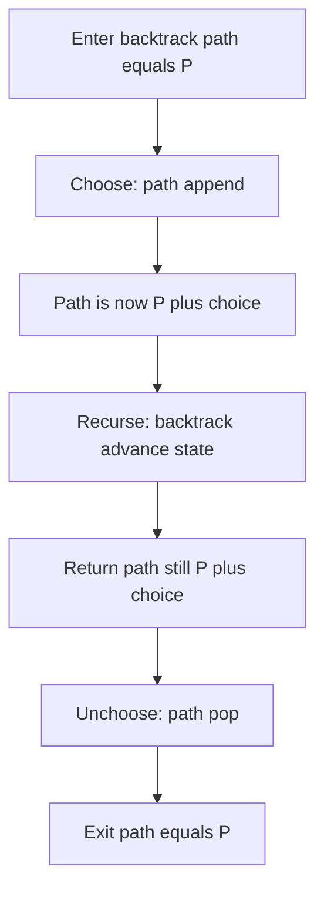
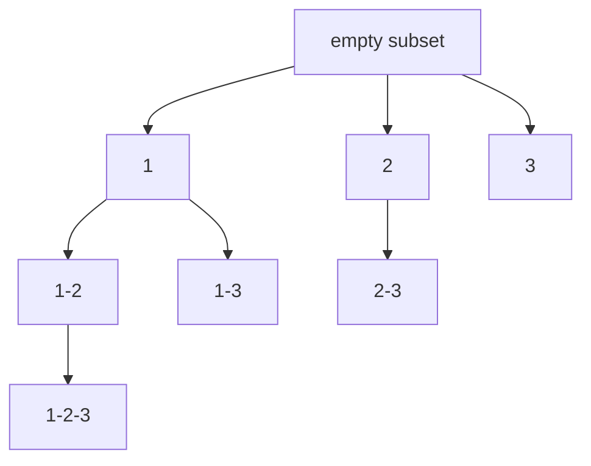

# Lecture 1 — The Backtracking Template and the Three Warm-ups

> **Duration:** ~2 hours.
> **Outcome:** You can write the choose-explore-unchoose template from memory; you can implement subsets, permutations, and combinations in 10 minutes each; you can defend the leaf-copy discipline and explain why backtracking does not benefit from `functools.lru_cache`.

Week 11 installed the dynamic-programming pipeline — write a brute-force recursion, decorate with `@lru_cache`, convert to a bottom-up table, reduce space with a rolling array. Week 12 installs a different disciplined recursion: **backtracking**, the choose-explore-unchoose template that **enumerates** all solutions to a combinatorial decision problem.

The two recursions are siblings. Both descend a decision tree depth-first. The discriminator is the output. DP caches `(state) -> value` because the same state recurs with the same continuation; the cache is correct because the value at a state does not depend on how that state was reached. Backtracking does **not** cache, because the **path** to a state **is** part of the output, the same state reached via different paths produces different solutions, and the optimization target is "every solution," not "one optimum."

This lecture installs the three-line template (`choose -> recurse -> unchoose`), walks the three combinatorial warm-ups (subsets, permutations, combinations), and closes with the leaf-copy discipline that prevents the most common backtracking bug.

---

## 1. The three-line template

The shape of every backtracking recursion:

```python
def backtrack(state) -> None:
    if is_leaf(state):
        result.append(path[:])      # deep-copy the path
        return
    for choice in choices(state):
        if not is_valid(choice, state):
            continue                # constraint-propagation pruning
        path.append(choice)         # CHOOSE
        backtrack(advance(state))   # RECURSE
        path.pop()                  # UNCHOOSE
```

Six lines of body, three of which are the choose-recurse-unchoose triad. The other three are: the leaf check (when to record), the candidate iteration (the branching factor), and the validity check (the constraint-propagation prune).

**The invariant.** On entry to `backtrack(state)`, the `path` has some value `P`. On exit from `backtrack(state)`, the `path` must equal `P`. The choose-recurse-unchoose template guarantees this:

- `path.append(choice)` mutates the caller's path to `P + [choice]`.
- `backtrack(...)` may make further choices on top of `P + [choice]` and is itself invariant — exits with the path equal to `P + [choice]`.
- `path.pop()` restores the path to `P`.

Any function that fails this invariant produces aliased paths or duplicate results. The invariant is the single discipline this week installs.


*The choose-recurse-unchoose invariant: the path always returns to its entry value.*

**The alternative (immutable-path) form.** Instead of mutating the caller's path, pass `path + [choice]` to the recursive call. The caller's path is never mutated, so there is no unchoose step.

```python
def backtrack(state, path) -> None:
    if is_leaf(state):
        result.append(path)         # no copy needed; path is local
        return
    for choice in choices(state):
        if not is_valid(choice, state):
            continue
        backtrack(advance(state), path + [choice])    # new list per call
```

Cleaner code; allocates `O(n)` per recursive call (the list concatenation). For `n = 20`, the allocation cost is real. Senior candidates write the mutable form (`O(1)` per call) and explain the immutable form as an alternative.

This lecture uses the mutable form. The exercises use the mutable form. The mini-project sudoku solver uses the mutable form (in-place board mutation). The immutable form is mentioned in the resources and the Lecture 1 closing.

---

## 2. Subsets (LC 78) — the canonical warm-up

> *Given an integer array `nums` of unique elements, return all possible subsets (the power set). The solution set must not contain duplicate subsets. Return the solution in any order.*

**Research constraints.** Combinatorial enumeration of `2^n` subsets. Every element is either included or excluded — the decision tree has depth `n` and branching factor 2. Equivalently, at each "level" we choose which next element (if any) to include from the remaining tail. The path at every node is a valid subset.

**State semantics.** `(start_index, path)` where `start_index` is the next element eligible for selection (no reuse, no duplicates) and `path` is the current subset under construction. Every node — not just leaves — represents a valid subset.

**Implementation.**

```python
from __future__ import annotations

from typing import List


def subsets(nums: List[int]) -> List[List[int]]:
    """Return all 2^n subsets of nums in any order."""
    result: List[List[int]] = []
    path: List[int] = []

    def backtrack(start: int) -> None:
        result.append(path[:])              # every node is a valid subset
        for i in range(start, len(nums)):
            path.append(nums[i])            # CHOOSE
            backtrack(i + 1)                # RECURSE (no reuse: start = i + 1)
            path.pop()                      # UNCHOOSE

    backtrack(0)
    return result
```

Twelve lines. The recording step (`result.append(path[:])`) is the **first** line of the function, not the last — because every node is a valid subset, the empty path (`[]`) is the first subset recorded.

**Trace on `nums = [1, 2, 3]`.**

```
backtrack(0): record []         # the empty subset
  i=0: append 1; backtrack(1)
    record [1]
    i=1: append 2; backtrack(2)
      record [1, 2]
      i=2: append 3; backtrack(3)
        record [1, 2, 3]
        (no more i)
      pop -> [1, 2]
    pop -> [1]
    i=2: append 3; backtrack(3)
      record [1, 3]
    pop -> [1]
  pop -> []
  i=1: append 2; backtrack(2)
    record [2]
    i=2: append 3; backtrack(3)
      record [2, 3]
    pop -> [2]
  pop -> []
  i=2: append 3; backtrack(3)
    record [3]
  pop -> []

result = [[], [1], [1, 2], [1, 2, 3], [1, 3], [2], [2, 3], [3]]
```


*Every node in the subsets recursion tree for nums 1 2 3 is a recorded subset.*

Eight subsets — `2^3` confirmed. The traversal is depth-first; the recording order is **prefix-first** (the empty path, then growing prefixes).

**Defense.** "Subsets is a combinatorial enumeration. State is `(start_index, path)`. Every node is a valid subset; record at every node, not just at leaves. The depth-first traversal produces `2^n` subsets; each subset is recorded once with a deep copy. `O(2^n * n)` time (the `n` factor is the deep-copy cost), `O(2^n * n)` total output space, `O(n)` recursion stack."

**The discriminator from a bit-enumeration alternative.** Subsets can also be generated by iterating `mask` from 0 to `2^n - 1` and reading the bits of `mask` to select elements. Same `O(2^n * n)` complexity; the output order is different (lexicographic by bitmask) and the code is shorter (5 lines instead of 12). The backtracking form is the senior-grade choice because it generalizes to subsets II (with duplicates), combination sum, and palindrome partitioning — the bit-enumeration form does not.

---

## 3. Permutations (LC 46) — the canonical second

> *Given an array `nums` of distinct integers, return all the possible permutations. You can return the answer in any order.*

**Research constraints.** Combinatorial enumeration of `n!` permutations. At each level we choose **one** unused element to place next; the decision tree has depth `n` and branching factor `n` at the top, `n-1` at depth 1, ..., 1 at depth `n - 1`. The path at every leaf is a valid permutation.

**State semantics.** `(used_set, path)` where `used_set` tracks which elements are currently on the path and `path` is the current permutation under construction. Only leaves (where `len(path) == n`) are recorded.

**Why not `start_index`?** Because order matters. The permutation `[2, 1, 3]` is different from `[1, 2, 3]`, so `2` must be available at level 0 *and* at level 1 (depending on what was chosen at level 0). The `start_index` discipline from subsets — "do not reconsider earlier elements" — would prevent `[2, 1, 3]` from ever being generated. The `used_set` lifts the index ordering and tracks instead what is in the path.

**Implementation.**

```python
from __future__ import annotations

from typing import List, Set


def permute(nums: List[int]) -> List[List[int]]:
    """Return all n! permutations of nums."""
    result: List[List[int]] = []
    path: List[int] = []
    used: Set[int] = set()

    def backtrack() -> None:
        if len(path) == len(nums):
            result.append(path[:])          # record only at leaves
            return
        for i in range(len(nums)):
            if i in used:
                continue                    # constraint-propagation prune
            used.add(i)
            path.append(nums[i])            # CHOOSE
            backtrack()                     # RECURSE
            path.pop()
            used.remove(i)                  # UNCHOOSE (both path and used)

    backtrack()
    return result
```

Sixteen lines. Two state mutations on choose (`used.add`, `path.append`); two unchoose steps in reverse order (`path.pop`, `used.remove`). The leaf check (`len(path) == len(nums)`) is the first line of the function body; the recording happens only at leaves.

**Trace on `nums = [1, 2, 3]`.**

```
backtrack(): path=[], used={}
  i=0: choose 1; path=[1], used={0}; backtrack()
    i=0: in used, skip
    i=1: choose 2; path=[1,2], used={0,1}; backtrack()
      i=0,1: in used, skip
      i=2: choose 3; path=[1,2,3], used={0,1,2}; backtrack()
        len(path)==3: record [1,2,3]
      unchoose 3
    unchoose 2
    i=2: choose 3; path=[1,3], used={0,2}; backtrack()
      i=0,2: in used, skip
      i=1: choose 2; path=[1,3,2]; record [1,3,2]
      unchoose
    unchoose
  unchoose 1
  i=1: choose 2; path=[2], ...
    (symmetric -> [2,1,3], [2,3,1])
  i=2: choose 3; path=[3], ...
    (symmetric -> [3,1,2], [3,2,1])

result = [[1,2,3], [1,3,2], [2,1,3], [2,3,1], [3,1,2], [3,2,1]]
```

Six permutations — `3!` confirmed. The traversal is depth-first; the recording order is lexicographic (because the iteration is `i = 0, 1, ..., n - 1`).

**Defense.** "Permutations is a combinatorial enumeration where order matters. State is `(used_set, path)`. At each level, iterate every index; skip indices already in the used set. Record at leaves only (`len(path) == n`). The depth-first traversal produces `n!` permutations; each permutation is recorded once with a deep copy. `O(n! * n)` time, `O(n! * n)` total output space, `O(n)` recursion stack plus `O(n)` used set."

**The discriminator from subsets.** Subsets uses `start_index` (no reuse, no order); permutations uses `used_set` (no reuse, but order matters). Combinations (next) uses `start_index` (no reuse, no order) but records only at leaves of the right length. The three differ in state and recording; the choose-recurse-unchoose template is identical.

---

## 4. Combinations (LC 77) — the canonical third

> *Given two integers `n` and `k`, return all possible combinations of `k` numbers chosen from the range `[1, n]`.*

**Research constraints.** Combinatorial enumeration of `C(n, k)` combinations. At each level we choose **one** element from the remaining tail (no reuse, no order); the decision tree has depth `k`. The path at every leaf (where `len(path) == k`) is a valid combination.

**State semantics.** `(start_index, path)` where `start_index` is the next element eligible for selection (no reuse). Identical to subsets in shape; the discriminator is the recording rule — only leaves where `len(path) == k` are recorded.

**Implementation.**

```python
from __future__ import annotations

from typing import List


def combine(n: int, k: int) -> List[List[int]]:
    """Return all C(n, k) combinations of k numbers chosen from [1, n]."""
    result: List[List[int]] = []
    path: List[int] = []

    def backtrack(start: int) -> None:
        if len(path) == k:
            result.append(path[:])
            return
        # Pruning: if we cannot reach length k from here, stop.
        # Need (k - len(path)) more; the largest valid start is n - (k - len(path)) + 1.
        last = n - (k - len(path)) + 1
        for i in range(start, last + 1):
            path.append(i)              # CHOOSE
            backtrack(i + 1)            # RECURSE
            path.pop()                  # UNCHOOSE

    backtrack(1)
    return result
```

Seventeen lines. The pruning step (`last = n - (k - len(path)) + 1`) is the first non-trivial optimization in this lecture — without it, the loop iterates beyond elements that cannot produce a length-`k` path, and the recursion explores subtrees that are guaranteed dead ends. With the prune, the loop iterates only over elements that have enough room left.

**Why the prune works.** If `path` has length `L` and we need `k - L` more elements, the **last** valid starting index is the one that leaves exactly `k - L` elements available — that is, `n - (k - L) + 1`. (Picking `start` past this index leaves fewer than `k - L` elements; the subtree is guaranteed to produce no leaves.)

**Trace on `n = 4, k = 2`.**

```
backtrack(1): path=[], last = 4 - (2 - 0) + 1 = 3
  i=1: choose 1; path=[1]; backtrack(2)
    len(path)=1, last = 4 - (2 - 1) + 1 = 4
    i=2: choose 2; path=[1,2]; backtrack(3); record [1,2]; pop
    i=3: choose 3; path=[1,3]; record [1,3]; pop
    i=4: choose 4; path=[1,4]; record [1,4]; pop
  pop
  i=2: choose 2; path=[2]; backtrack(3)
    last = 4
    i=3: record [2,3]; i=4: record [2,4]
  pop
  i=3: choose 3; path=[3]; backtrack(4)
    i=4: record [3,4]
  pop
  (i=4 would be > last=3 in the outer call; loop ends)

result = [[1,2], [1,3], [1,4], [2,3], [2,4], [3,4]]
```

Six combinations — `C(4, 2) = 6` confirmed. The traversal is depth-first; the prune at the outer call stops at `i = 3` because choosing `i = 4` at the top level leaves only `{}` for the second pick.

**Defense.** "Combinations is a combinatorial enumeration without order, fixed length `k`. State is `(start_index, path)`. Record at leaves where `len(path) == k`. The prune `last = n - (k - len(path)) + 1` eliminates subtrees that cannot reach length `k`. `O(C(n, k) * k)` time, `O(C(n, k) * k)` total output space, `O(k)` recursion stack."

**The discriminator from subsets.** Subsets is "every node," combinations is "leaves of length `k`." Subsets has no length prune; combinations has the `n - (k - len(path)) + 1` prune. The state is identical; the recording rule and the prune are the discriminators.

---

## 5. The leaf-copy discipline

The single most common backtracking bug. Consider this implementation of subsets:

```python
def subsets_buggy(nums: List[int]) -> List[List[int]]:
    """BUG: forgot the deep copy."""
    result: List[List[int]] = []
    path: List[int] = []

    def backtrack(start: int) -> None:
        result.append(path)             # BUG: path is shared
        for i in range(start, len(nums)):
            path.append(nums[i])
            backtrack(i + 1)
            path.pop()

    backtrack(0)
    return result
```

Run on `nums = [1, 2, 3]`. Expected: 8 subsets. Actual: 8 entries in `result`, but every entry is the same list — `path`. After the final `pop`, `path` is `[]`, and all 8 entries in `result` point to that same empty list.

```python
>>> subsets_buggy([1, 2, 3])
[[], [], [], [], [], [], [], []]
```

The fix is one character — change `result.append(path)` to `result.append(path[:])`. The slice `path[:]` creates a shallow copy: a new list with the same elements as `path`. The new list is independent of `path`; subsequent mutations of `path` do not affect the copy.

Three equivalent ways to copy a list of immutable elements:

```python
result.append(path[:])
result.append(list(path))
result.append(path.copy())              # Python 3.3+
```

All three are `O(n)`. The slice form is the canonical idiom in interview write-ups; it is the shortest and the most explicit about being a copy.

**The discriminator from immutable elements.** If the path elements are themselves mutable (lists, dicts, custom objects), a shallow copy is not enough — `copy.deepcopy(path)` is required to avoid aliasing the **elements** of the path. For Week 12 problems, the elements are ints, strings, or tuples — all immutable — so the shallow copy suffices.

**The discriminator from the immutable-path form.** If the recursion passes `path + [choice]` to recursive calls (the immutable-path form from §1), no leaf-copy is needed because `path` at the recursion call site is already a fresh list. The trade is `O(n)` allocation per recursive call versus `O(n)` allocation per leaf — for problems where most internal nodes are not leaves, the mutable-path form with leaf-copy is faster.

---

## 6. Why backtracking does not cache

Week 11 trained the reflex: "this is a recursion — add `@lru_cache`." Week 12 breaks the reflex.

Consider memoizing the subsets recursion:

```python
import functools

@functools.lru_cache(maxsize=None)
def subsets_memoized(start: int) -> tuple:    # path cannot be cached (mutable)
    # ... but the state we'd cache (start) doesn't capture the path,
    # and the output depends on what's already on the path.
    ...
```

The problem: the **path** at the call site is part of the output, and the path is **not** in the cached key. So `subsets_memoized(0)` returns different paths depending on what was on the path at the call site — but the cache only sees `start`. The first call caches an answer; subsequent calls return that cached answer regardless of the path. Wrong.

Could we put the path in the key? Yes — `@lru_cache` accepts a `tuple` (`path` would need to be a `tuple` to be hashable). But then the key `(start, tuple(path))` is **unique to every call** — every call has a distinct path because the path grows by one element at each recursive step. The cache never hits. The cache size grows linearly with the recursion depth, but the cache hit rate is 0%.

**The rule of thumb.** Backtracking caches nothing because:

1. The **path** is part of the output. Caching `(non-path state) -> output` misses path-dependent variation.
2. Adding the path to the cache key makes every key unique. The cache never hits.
3. Even if a cache hit were possible, the output would be a list of completed paths from this point — but the **prefix** of each output path is the current path, which depends on the caller's state. The cache would need to return paths-from-here without the prefix, and then the caller would need to concatenate the prefix. Workable but ugly; not a real cache.

The clean answer: backtracking enumerates; DP optimizes or counts. Different recursions, different output disciplines, different cache semantics. The Research-constraints discriminator is the prompt's verb: "return all," "list every," "find one" — backtracking. "Count," "find the max," "find the min" — try DP first.

There is one exception: **memoization of the boolean reachability question** built on top of a backtracking-like recursion. For example, "does there exist a valid configuration?" with a state-only key (no path) can cache `(state) -> bool`. This is closer to DP than to backtracking; the resources mention it in the negative-space section.

---

## 7. Closing — the three warm-ups as scaffolding

Three takeaways from Lecture 1:

1. **The three-line template is the discipline.** Choose, recurse, unchoose. The invariant is that the state on entry equals the state on exit. Every backtracking problem this week — and almost every backtracking problem in Phase 3 — is a variation on this template with different state and different recording rules.
2. **Subsets, permutations, combinations are the scaffolding.** Subsets: state `(start, path)`, record at every node. Permutations: state `(used, path)`, record at leaves of length `n`. Combinations: state `(start, path)`, record at leaves of length `k`. Combination sum (Lecture 2) and palindrome partitioning (Lecture 2) and word search (Lecture 3) are 10-minute variants once these three are reflexive.
3. **The leaf-copy discipline is mandatory.** `result.append(path[:])` — the slice is the canonical idiom. Forgetting the slice produces an aliased result list and is the single most common backtracking bug. Memorize the slice; do not write the bare `path`.

Lecture 2 installs **pruning** — the four families, the sort-first plus index-skip idiom for deduplication, and the palindrome partitioning problem that demonstrates the per-level string-split decision. Lecture 3 installs **grid backtracking** (word search) and **constraint satisfaction** (N-Queens, sudoku) — the problems where backtracking is the only path.

[Continue to Lecture 2](./02-pruning-and-deduplication-and-string-partitioning.md).
