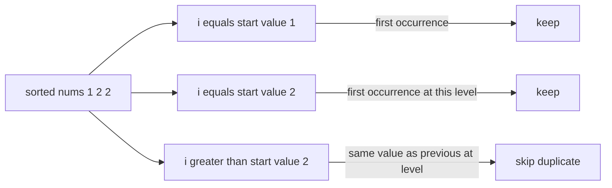
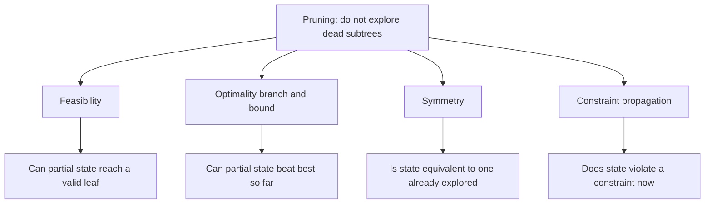

# Lecture 2 — Pruning, Deduplication, and String Partitioning

> **Duration:** ~2 hours.
> **Outcome:** You can implement combination sum with sum-based pruning from memory; you can apply the sort-plus-index-skip deduplication idiom on demand; you can implement palindrome partitioning and defend the per-level string-split decision.

Lecture 1 installed the three-line template and the three combinatorial warm-ups. The warm-ups have no real pruning — every candidate at every level is valid, and the recursion enumerates the full output. Most real backtracking problems have **constraints** that prune entire subtrees; this lecture installs the discipline of recognizing and applying those prunes.

The lecture covers four topics: combination sum with sum-based pruning; deduplication by sort-plus-index-skip; the four pruning families; and palindrome partitioning as a string-split backtracking. By the end, you should be able to walk a problem like "given an array with duplicates, return all unique subsets that sum to a target" and produce the recurrence, the prune, and the deduplication step in 5 minutes.

---

## 1. the clay weigh-out — sum-based pruning

> *Given an array of distinct integers `candidates` and a target integer `target`, return a list of all unique combinations of `candidates` where the chosen numbers sum to `target`. You may return the combinations in any order. The same number may be chosen from `candidates` an unlimited number of times.*

**Research constraints.** Combinatorial enumeration with **reuse allowed** (same number can be picked multiple times) and **sum constraint** (the path must sum to exactly `target`). State: `(start_index, remaining_target, path)`. The reuse rule is the discriminator from the tasting panel and the glaze sample set.

**State semantics.** `start_index` is the next eligible element (no reordering — `[2, 2, 3]` and `[3, 2, 2]` would be the same combination, so we enforce non-decreasing element selection); `remaining_target` is what is left to fill; `path` is the current combination.

**Why reuse uses `start = i` and not `start = i + 1`.** When reuse is allowed, after choosing `nums[i]`, the next choice can be `nums[i]` again (or any later index). Recursive call: `backtrack(i, ...)`. When reuse is **not** allowed, the next choice must be `nums[i + 1]` or later: `backtrack(i + 1, ...)`. The single-character difference is the discriminator.

**Implementation — the naive form (no prune).**

```python
from __future__ import annotations

from typing import List


def combination_sum_naive(candidates: List[int], target: int) -> List[List[int]]:
    """Return all combinations of candidates summing to target. No prune."""
    result: List[List[int]] = []
    path: List[int] = []

    def backtrack(start: int, remaining: int) -> None:
        if remaining == 0:
            result.append(path[:])
            return
        if remaining < 0:
            return                              # dead end
        for i in range(start, len(candidates)):
            path.append(candidates[i])          # CHOOSE
            backtrack(i, remaining - candidates[i])    # RECURSE (reuse: start = i)
            path.pop()                          # UNCHOOSE

    backtrack(0, target)
    return result
```

Sixteen lines. The two terminal conditions: `remaining == 0` is a valid leaf (record), `remaining < 0` is a dead end (return without recording). The loop explores every candidate from `start` onwards; the call passes `start = i` for reuse.

**Trace on `candidates = [2, 3, 6, 7], target = 7`.**

```
backtrack(0, 7):
  i=0 (cand=2): path=[2]; backtrack(0, 5)
    i=0: path=[2,2]; backtrack(0, 3)
      i=0: path=[2,2,2]; backtrack(0, 1)
        i=0: path=[2,2,2,2]; backtrack(0, -1) -> dead end; pop
        i=1: path=[2,2,2,3]; backtrack(1, -2) -> dead end; pop
        i=2: path=[2,2,2,6]; backtrack(2, -5) -> dead end; pop
        i=3: path=[2,2,2,7]; backtrack(3, -6) -> dead end; pop
      pop
      i=1: path=[2,2,3]; backtrack(1, 0) -> record [2,2,3]; pop
      i=2: path=[2,2,6]; backtrack(2, -3) -> dead end; pop
      i=3: path=[2,2,7]; backtrack(3, -4) -> dead end; pop
    pop
    i=1: path=[2,3]; backtrack(1, 2)
      i=1: path=[2,3,3]; backtrack(1, -1) -> dead end; pop
      i=2: backtrack(2, -4) -> dead end
      i=3: backtrack(3, -5) -> dead end
    pop
    i=2: backtrack(2, -1) -> dead end
    i=3: backtrack(3, -2) -> dead end
  pop
  i=1 (cand=3): path=[3]; backtrack(1, 4)
    i=1: path=[3,3]; backtrack(1, 1)
      i=1,2,3: all dead ends (3+3 > target, 3+6 > target, 3+7 > target after consuming 3)
    pop
    i=2: backtrack(2, -2) -> dead end
    i=3: backtrack(3, -3) -> dead end
  pop
  i=2 (cand=6): path=[6]; backtrack(2, 1) -> all dead ends (6+6 > 1, 6+7 > 1)
  i=3 (cand=7): path=[7]; backtrack(3, 0) -> record [7]
  pop

result = [[2,2,3], [7]]
```

Two combinations confirmed. The trace shows **many dead-end recursive calls** — every `remaining < 0` branch consumed a function call before returning. The prune eliminates most of these.

**Implementation — with sum-based prune.**

```python
from __future__ import annotations

from typing import List


def combination_sum(candidates: List[int], target: int) -> List[List[int]]:
    """Return all combinations of candidates summing to target. Sorted + pruned."""
    candidates.sort()                           # sort for the prune to work
    result: List[List[int]] = []
    path: List[int] = []

    def backtrack(start: int, remaining: int) -> None:
        if remaining == 0:
            result.append(path[:])
            return
        for i in range(start, len(candidates)):
            if candidates[i] > remaining:
                break                           # sort + break = prune all later i
            path.append(candidates[i])          # CHOOSE
            backtrack(i, remaining - candidates[i])    # RECURSE (reuse)
            path.pop()                          # UNCHOOSE

    backtrack(0, target)
    return result
```

Eighteen lines. Two changes from the naive form:

1. **`candidates.sort()`** at the start. The sort puts smaller candidates first; the prune relies on the monotonicity.
2. **`if candidates[i] > remaining: break`** inside the loop. Because the array is sorted, the first `candidates[i] > remaining` means every later `candidates[j]` is also `> remaining` — they all produce dead ends. `break` (not `continue`) exits the loop and prunes the entire tail.

The `remaining < 0` check from the naive form is now unreachable — the `break` ensures we never recurse with a negative remaining.

**Trace on the same input (sorted: `[2, 3, 6, 7]`, target=7).**

```
backtrack(0, 7):
  i=0 (2): backtrack(0, 5)
    i=0 (2): backtrack(0, 3)
      i=0 (2): backtrack(0, 1)
        i=0 (2): 2 > 1, break          # PRUNED: no dead-end recursions
      i=1 (3): backtrack(1, 0) -> record [2,2,3]
      i=2 (6): 6 > 3, break             # PRUNED
    i=1 (3): backtrack(1, 2)
      i=1 (3): 3 > 2, break             # PRUNED
    i=2 (6): 6 > 5, break               # PRUNED
  i=1 (3): backtrack(1, 4)
    i=1 (3): backtrack(1, 1)
      i=1 (3): 3 > 1, break             # PRUNED
    i=2 (6): 6 > 4, break               # PRUNED
  i=2 (6): backtrack(2, 1)
    i=2 (6): 6 > 1, break               # PRUNED
  i=3 (7): backtrack(3, 0) -> record [7]

result = [[2,2,3], [7]]
```

Same output, dramatically fewer recursive calls. The sort plus break is the canonical sum-based-pruning idiom.

**Defense.** "Combination sum is a combinatorial enumeration with reuse and sum constraint. State is `(start_index, remaining_target, path)`. Sort the input first; iterate from `start`; break the loop as soon as `candidates[i] > remaining`. The reuse rule passes `start = i` (not `i + 1`) to allow the same element to be chosen again. Complexity is hard to bound tightly — `O(N^(target/min_candidate))` is the loose worst case — but the sort plus prune cuts the constant by 10–100x in practice."

---

## 2. Deduplication — sort plus index-skip

When the input has duplicate elements and the output should have no duplicate solutions, we need a discipline that picks each distinct element **once per level**.

Consider the repeat bin picks: `nums = [1, 2, 2]`. The expected output is `[[], [1], [1, 2], [1, 2, 2], [2], [2, 2]]` — six subsets, not eight (the naive subsets would produce `[1, 2]` twice because there are two 2s).

The canonical idiom:

```python
from __future__ import annotations

from typing import List


def subsets_with_dup(nums: List[int]) -> List[List[int]]:
    """Return all unique subsets of nums (which may contain duplicates)."""
    nums.sort()                                 # sort puts duplicates adjacent
    result: List[List[int]] = []
    path: List[int] = []

    def backtrack(start: int) -> None:
        result.append(path[:])
        for i in range(start, len(nums)):
            if i > start and nums[i] == nums[i - 1]:
                continue                        # skip dup at SAME level
            path.append(nums[i])                # CHOOSE
            backtrack(i + 1)                    # RECURSE
            path.pop()                          # UNCHOOSE

    backtrack(0)
    return result
```

Fifteen lines. Two changes from the subsets:

1. **`nums.sort()`** at the start. Sorting puts duplicate elements adjacent, which makes "same as previous" a `O(1)` comparison.
2. **`if i > start and nums[i] == nums[i - 1]: continue`** inside the loop. The discriminator is `i > start`, **not** `i > 0`. At the start of a recursive call (`i == start`), the first occurrence of a value is **always** valid. At positions `i > start`, the previous index `i - 1` was already chosen at this same level; choosing the same value again at this level produces a duplicate path.

**Trace on `nums = [1, 2, 2]`.**

```
backtrack(0): record []
  i=0 (1): path=[1]; backtrack(1)
    record [1]
    i=1 (2): path=[1,2]; backtrack(2)
      record [1,2]
      i=2 (2): path=[1,2,2]; record [1,2,2]; pop
    pop
    i=2 (2): i > start (2 > 1) and nums[2] == nums[1], skip   # DEDUP
  pop
  i=1 (2): path=[2]; backtrack(2)
    record [2]
    i=2 (2): path=[2,2]; record [2,2]; pop
  pop
  i=2 (2): i > start (2 > 0) and nums[2] == nums[1], skip     # DEDUP

result = [[], [1], [1,2], [1,2,2], [2], [2,2]]
```

Six subsets — exactly what was expected. The dedup skips the duplicate **at the same level**; it does **not** skip the duplicate **within the path** (`[1, 2, 2]` and `[2, 2]` both contain two 2s, and both are valid).

**The discriminator from `i > 0`.** If we wrote `if i > 0 and nums[i] == nums[i - 1]: continue`, then at level 1 starting from `i = 2`, we would skip the second 2 — even though the path is `[1]` and choosing the second 2 produces `[1, 2]` which has not been recorded at this level. The condition `i > start` correctly only skips duplicates that have already been chosen at this **level**.

**Visualization — the deduplication horizon.**

```
nums = [1, 2, 2]

Level 0 (start=0):
  i=0: pick 1     (first occurrence — keep)
  i=1: pick 2     (first occurrence — keep)
  i=2: SKIP 2     (i > start and nums[i] == nums[i-1] — duplicate at level)

Level 1 (start=1, after picking 1):
  i=1: pick 2     (i == start — keep)
  i=2: SKIP 2     (i > start and same value — duplicate)

Level 1 (start=2, after picking 2):
  i=2: pick 2     (i == start — keep)
```

The horizon is "what was already chosen at this level." Once a value has been chosen at this level, every later index with the same value is a duplicate.


*The dedup horizon: only the first occurrence of a value per level survives.*

This idiom recurs in the repeat bin picks, the firing order with repeats, the tare weight picks, 4Sum, and many others. Memorize the two-line idiom — sort plus `if i > start and nums[i] == nums[i - 1]: continue`.

---

## 3. The four pruning families

Pruning is the discipline of **not exploring** subtrees that are guaranteed to produce no valid output. Four families:


*The four pruning families, grouped by the question each one asks.*

### A. Feasibility pruning

**Check.** Can the partial state be extended to a valid leaf?

**Examples.**

- Combination sum: if `remaining < 0` (or with sort: `candidates[i] > remaining`), no extension produces a valid sum. Prune.
- Word search: if the next cell does not match the next character of the target word, no extension produces a match. Prune.
- Sudoku: if every digit 1–9 is excluded by row/column/box constraints for the current cell, no extension produces a complete board. Prune (backtrack to the previous cell).

**Cost.** Usually `O(1)` per check. Savings are exponential.

### B. Optimality pruning (branch-and-bound)

**Check.** Can the partial state improve the best-so-far?

**Examples.**

- Knapsack with branch-and-bound: if the upper bound on the value reachable from the partial state is less than the best-so-far, prune.
- Traveling salesperson with branch-and-bound: if the partial tour length plus a lower bound on the remaining tour is greater than the best-so-far, prune.

**Cost.** Usually `O(state_size)` per check (computing the upper or lower bound). The check is more expensive than feasibility; the savings are case-dependent.

Optimality pruning is a Phase-3 topic. The Week 12 exercises do not require it; mention it by name if asked about "how would you optimize" a backtracking enumeration that returns the best-so-far.

### C. Symmetry pruning

**Check.** Is the partial state equivalent to a previously-explored state?

**Examples.**

- N-Queens with symmetry-breaking: the first queen on the top half of the first column is sufficient — placements on the bottom half are mirror images of placements on the top half. Halving the search space without losing solutions.
- Sudoku with canonical-form: if two rows are interchangeable (no constraint distinguishes them), only explore one.

**Cost.** Usually `O(state_size)` per check (constructing the canonical form). Symmetry pruning is the most subtle of the four; many problems have symmetries that the candidate must articulate before applying the prune.

Symmetry pruning is a Phase-3 topic. The Week 12 exercises do not require it.

### D. Constraint-propagation pruning

**Check.** Does the partial state violate any explicit constraint?

**Examples.**

- N-Queens: when placing a queen at `(row, col)`, check `col not in cols`, `(row - col) not in diag1`, `(row + col) not in diag2`. Three `O(1)` checks; reject the placement if any fires.
- Sudoku: when placing a digit `d` at cell `(r, c)`, check `d` is not in row `r`, column `c`, or the 3x3 box containing `(r, c)`. Three `O(1)` checks; reject the placement if any fires.
- Word search: when stepping into cell `(r, c)`, check `(r, c) not in visited`. One `O(1)` check; reject the step if it fires.

**Cost.** Usually `O(1)` per check (using pruning sets or hash sets for the constraint state). The most common pruning family in interview prompts.

The combination of constraint-propagation pruning and feasibility pruning is what makes N-Queens at N=8 (the historical case) solvable by hand. Without the prunes, the recursion is `8^8 ≈ 17 million` nodes; with the prunes, it is `~2,000` nodes.

---

## 4. the batch split

> *Given a string `s`, partition `s` such that every substring of the partition is a palindrome. Return all possible palindrome partitionings of `s`.*

**Research constraints.** Combinatorial enumeration of **string partitions**. At each level we choose the **length** of the next piece; the piece must be a palindrome (constraint-propagation prune) and the remainder is the subproblem. State: `(start_index, path)` where `path` is the list of piece strings chosen so far.

**State semantics.** `start_index` is the position in `s` at which the next piece begins. At each level, we try every `end` from `start + 1` to `n`; if `s[start:end]` is a palindrome, we choose it (append to `path`) and recurse with `start = end`. The leaf is reached when `start == n` (the entire string has been partitioned).

**The constraint-propagation prune.** Before the choose, check that `s[start:end]` is a palindrome. If not, skip this candidate piece. The palindrome check is `O(end - start)` per call.

**Implementation.**

```python
from __future__ import annotations

from typing import List


def partition(s: str) -> List[List[str]]:
    """Return all partitions of s where every piece is a palindrome."""
    n = len(s)
    result: List[List[str]] = []
    path: List[str] = []

    def is_palindrome(left: int, right: int) -> bool:
        """Check whether s[left:right + 1] is a palindrome. O(n)."""
        while left < right:
            if s[left] != s[right]:
                return False
            left += 1
            right -= 1
        return True

    def backtrack(start: int) -> None:
        if start == n:
            result.append(path[:])
            return
        for end in range(start + 1, n + 1):
            if not is_palindrome(start, end - 1):
                continue                        # constraint-propagation prune
            path.append(s[start:end])           # CHOOSE
            backtrack(end)                      # RECURSE
            path.pop()                          # UNCHOOSE

    backtrack(0)
    return result
```

Twenty-six lines. The `is_palindrome(left, right)` helper checks `s[left:right + 1]` in `O(right - left + 1)` time; the `end` loop tries every possible piece length from 1 to `n - start`.

**Trace on `s = "aab"`.**

```
backtrack(0): path=[]
  end=1: s[0:1]="a" is palindrome
    path=["a"]; backtrack(1)
      end=2: s[1:2]="a" is palindrome
        path=["a","a"]; backtrack(2)
          end=3: s[2:3]="b" is palindrome
            path=["a","a","b"]; backtrack(3)
              start==n: record ["a","a","b"]
            pop
        pop
      end=3: s[1:3]="ab" not palindrome, skip
    pop
  end=2: s[0:2]="aa" is palindrome
    path=["aa"]; backtrack(2)
      end=3: s[2:3]="b" is palindrome
        path=["aa","b"]; backtrack(3)
          record ["aa","b"]
        pop
    pop
  end=3: s[0:3]="aab" not palindrome, skip

result = [["a","a","b"], ["aa","b"]]
```

Two partitions confirmed. The depth-first traversal explores every prefix-length combination; the palindrome check prunes the non-palindromic prefixes.

**Defense.** "Palindrome partitioning is a string-partition backtracking. State is `(start_index, path)` where `path` is the list of palindromic pieces. At each level, try every `end > start`; if `s[start:end]` is a palindrome, choose, recurse, unchoose. The palindrome check is the constraint-propagation prune. Time complexity is `O(N * 2^N)` worst case — there are `2^(N-1)` possible partitions of an `N`-character string, each requiring `O(N)` palindrome checks. Space is `O(N)` for the recursion stack plus the output."

**The optimization — precomputed palindrome table.** The repeated `is_palindrome` checks can be precomputed into a 2D boolean table `is_pal[i][j] = True iff s[i..j] is a palindrome` in `O(N^2)` time and space. With the table, each prune check is `O(1)`. The combined complexity is `O(N^2 + N * 2^N)`, which is dominated by the `2^N` term for large `N` but is faster in practice. Mention it as the optimization; not required for the LC submission.

---

## 5. Closing — the prune as the senior signal

Three takeaways from Lecture 2:

1. **Sort-first plus break is the canonical sum-based prune.** Combination sum sorts the input, then breaks the inner loop as soon as the current candidate exceeds the remaining target. The two-line change turns the algorithm from "slow but correct" to "fast and correct." Memorize the idiom.
2. **Sort-first plus `i > start` is the canonical deduplication idiom.** Subsets II, permutations II, combination sum II all use this idiom. The discriminator is `i > start`, **not** `i > 0`. Get the condition right; the wrong condition silently produces incomplete output.
3. **Palindrome partitioning is the canonical string-split backtracking.** State is `(start_index, path)`; the per-level decision is the length of the next piece; the constraint-propagation prune is the palindrome check. The shape generalizes to "partition `s` into pieces from a dictionary" (word break II), "partition `s` such that each piece has property P" (any property check), and many other variants.

Lecture 3 installs **grid backtracking** (word search) and **constraint satisfaction** (N-Queens, sudoku) — the problems where the state is a 2D board and the constraints require explicit pruning sets for `O(1)` checks. The closing of Lecture 3 is the week's recognition flowchart and the negative-space rejection of "is this DP or backtracking."

[Back to Lecture 1](./01-the-backtracking-template-and-the-three-warmups.md) · [Continue to Lecture 3](./03-grid-backtracking-and-constraint-satisfaction.md).
