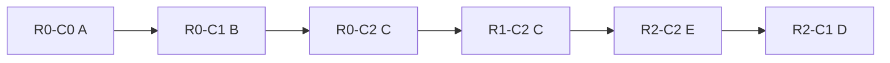
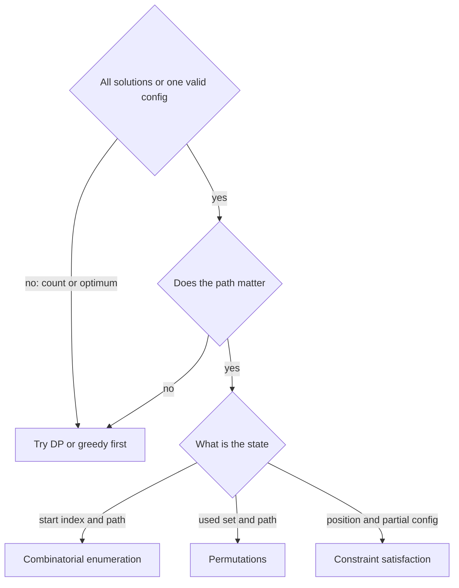

# Lecture 3 — Grid Backtracking and Constraint Satisfaction

> **Duration:** ~2 hours.
> **Outcome:** You can implement word search with a `visited` set; you can implement N-Queens with three pruning sets; you can implement the sudoku solver with the cell-iteration-plus-digit-trial template; you can walk the week's recognition flowchart and articulate the negative-space rejection between backtracking and DP.

Lectures 1 and 2 installed combinatorial enumeration (subsets, permutations, combinations) and string partitioning (palindrome partitioning) with the sum-based and constraint-propagation prunes. This lecture closes the week with two new shapes: **grid backtracking** (state = `(row, col, ...)`) and **constraint satisfaction** (state = `(position, partial_config)` with explicit pruning sets).

These are the problems where backtracking is the **only** path. Word search has no DP form because the path matters (the visited set is path-specific) and the goal is feasibility, not optimization. N-Queens and sudoku are formal constraint satisfaction problems; the only general algorithm is backtracking with constraint propagation. When the prompt is one of these three shapes, the recognition is immediate.

The lecture closes with the week's recognition flowchart, which is the artifact you should be able to recite in the quiz.

---

## 1. Word Search (LC 79) — grid backtracking with a visited set

> *Given an `m x n` grid of characters `board` and a string `word`, return `True` iff `word` exists in the grid. The word can be constructed from letters of sequentially adjacent cells, where adjacent cells are horizontally or vertically neighboring. The same letter cell may not be used more than once.*

**Research constraints.** Feasibility on a 2D grid. State: `(row, col, word_index)`. At each cell, if the character matches `word[word_index]`, mark the cell visited and recurse into the four neighbors with `word_index + 1`. Return `True` on the first success; the recursion unwinds without exploring further.

**State semantics.** `(row, col)` is the current cell; `word_index` is the position in `word` that this cell must match. The `visited` set tracks cells already on the path (the "same letter cell may not be used more than once" constraint). The recursion starts from every cell of the grid as a candidate starting point.

**Implementation.**

```python
from __future__ import annotations

from typing import List, Set, Tuple


def exist(board: List[List[str]], word: str) -> bool:
    """Return True iff word can be traced through the board using 4-direction adjacency."""
    rows = len(board)
    cols = len(board[0]) if rows else 0
    visited: Set[Tuple[int, int]] = set()

    def backtrack(r: int, c: int, idx: int) -> bool:
        if idx == len(word):
            return True
        if not (0 <= r < rows and 0 <= c < cols):
            return False
        if (r, c) in visited:
            return False
        if board[r][c] != word[idx]:
            return False
        visited.add((r, c))                     # CHOOSE
        for dr, dc in [(-1, 0), (1, 0), (0, -1), (0, 1)]:
            if backtrack(r + dr, c + dc, idx + 1):    # RECURSE
                return True
        visited.remove((r, c))                  # UNCHOOSE
        return False

    for r in range(rows):
        for c in range(cols):
            if backtrack(r, c, 0):
                return True
    return False
```

Twenty-five lines. The four checks at the top of `backtrack` are ordered for early-out efficiency: leaf check, bounds check, visited check, character match check. The four-direction loop is the canonical neighbor iterator from W7. The `unchoose` step (`visited.remove((r, c))`) restores the state for the next outer-loop start cell.

**Trace on `board = [["A","B","C","E"], ["S","F","C","S"], ["A","D","E","E"]], word = "ABCCED"`.**

```
Start at (0,0): board[0][0]='A' == word[0]='A'
  visited = {(0,0)}
  Try (0,1): board[0][1]='B' == word[1]='B'
    visited = {(0,0), (0,1)}
    Try (0,2): board[0][2]='C' == word[2]='C'
      visited = {(0,0), (0,1), (0,2)}
      Try (0,3): board[0][3]='E' != word[3]='C', fail
      Try (1,2): board[1][2]='C' == word[3]='C'
        visited = {(0,0), (0,1), (0,2), (1,2)}
        Try (1,3): board[1][3]='S' != word[4]='E', fail
        Try (2,2): board[2][2]='E' == word[4]='E'
          visited = {..., (2,2)}
          Try (2,1): board[2][1]='D' == word[5]='D'
            visited = {..., (2,1)}
            idx = 6 == len(word), return True
          (unwinds all the way back, returning True at each level)

Return True.
```

The traced path is `(0,0) -> (0,1) -> (0,2) -> (1,2) -> (2,2) -> (2,1)`, which spells `A -> B -> C -> C -> E -> D`. Match.


*The traced word search path spelling A B C C E D across the grid.*

**Defense.** "Word search is a 2D-grid backtracking with a visited set. State is `(row, col, word_index)`. At each cell, check the four early-out conditions, then mark visited, recurse into the four neighbors, unmark. Return True on the first success and unwind. The visited set prevents cycles within a single path; the unchoose step restores it for the next starting cell. Worst-case time is `O(m * n * 4^L)` where `L = len(word)` — `mn` starting cells, `4^L` paths from each (each level branches 4 ways), but most paths are pruned early by the character mismatch. Space is `O(L)` for the recursion stack plus the visited set."

**The in-place optimization.** Instead of a separate `visited` set, mark cells visited by mutating the board in place: `board[r][c] = '#'` to mark, `board[r][c] = word[idx]` to restore. Saves the `O(L)` set space; trade is that the board is temporarily mutated. Senior candidates mention both forms. The LC 79 reference solution typically uses the in-place form.

```python
def exist_inplace(board: List[List[str]], word: str) -> bool:
    """Word search with in-place marking. Saves the visited set space."""
    rows, cols = len(board), len(board[0])

    def backtrack(r: int, c: int, idx: int) -> bool:
        if idx == len(word):
            return True
        if not (0 <= r < rows and 0 <= c < cols) or board[r][c] != word[idx]:
            return False
        tmp = board[r][c]
        board[r][c] = '#'                       # CHOOSE: mark visited in place
        for dr, dc in [(-1, 0), (1, 0), (0, -1), (0, 1)]:
            if backtrack(r + dr, c + dc, idx + 1):
                board[r][c] = tmp               # UNCHOOSE before returning
                return True
        board[r][c] = tmp                       # UNCHOOSE
        return False

    for r in range(rows):
        for c in range(cols):
            if backtrack(r, c, 0):
                return True
    return False
```

The `tmp` variable captures the original character; restoring it on unchoose. The "visited" check is implicit: the cell `'#'` does not equal `word[idx]`, so the bounds-and-match check rejects revisits.

---

## 2. N-Queens (LC 51) — three pruning sets

> *The N-Queens puzzle is the problem of placing N chess queens on an N x N chessboard such that no two queens attack each other. Return all distinct solutions to the N-Queens puzzle.*

**Research constraints.** Constraint satisfaction. State: `(row, cols, diag1, diag2, path)`. Place one queen per row; for each candidate column, check the three pruning sets in `O(1)`. The "one queen per row" discipline makes the row constraint implicit — by structure, no two queens share a row.

**State semantics.** `row` is the current row to fill (the recursion advances `row` by 1 per call). `cols` is the set of columns already occupied. `diag1` and `diag2` are the sets of diagonals already occupied: `diag1` indexed by `row - col` (constant on a `\` diagonal), `diag2` indexed by `row + col` (constant on a `/` diagonal). `path` is the list of column indices, one per row.

**Why three sets, not the board?** Without the sets, checking whether a placement is safe requires walking every previously-placed queen and computing whether they attack the new placement — `O(row)` per check. With the sets, the check is three `O(1)` membership tests. For N=8, the speedup is ~50x; for N=15, ~150x.

**Implementation.**

```python
from __future__ import annotations

from typing import List, Set


def solve_n_queens(n: int) -> List[List[str]]:
    """Return all solutions to the N-Queens puzzle as a list of board configurations."""
    result: List[List[str]] = []
    path: List[int] = []                        # path[r] = col chosen for row r
    cols: Set[int] = set()
    diag1: Set[int] = set()                     # row - col
    diag2: Set[int] = set()                     # row + col

    def render(path: List[int]) -> List[str]:
        """Convert column-index path to the LC 51 board format."""
        return [
            "." * c + "Q" + "." * (n - c - 1)
            for c in path
        ]

    def backtrack(row: int) -> None:
        if row == n:
            result.append(render(path))
            return
        for col in range(n):
            if col in cols or (row - col) in diag1 or (row + col) in diag2:
                continue                        # constraint-propagation prune
            cols.add(col)                       # CHOOSE
            diag1.add(row - col)
            diag2.add(row + col)
            path.append(col)
            backtrack(row + 1)                  # RECURSE
            path.pop()                          # UNCHOOSE (4 state mutations)
            cols.remove(col)
            diag1.remove(row - col)
            diag2.remove(row + col)

    backtrack(0)
    return result
```

Thirty-three lines. The `render` helper converts the path (a list of column indices) to the LC 51 board format (a list of `n` strings of length `n`). The four-mutation choose-unchoose pair is the discipline reminder: `path`, `cols`, `diag1`, `diag2` must all be undone before returning.

**Why `row - col` and `row + col`.** A diagonal running from top-left to bottom-right (`\`) has a constant `row - col` value — for `(0,0), (1,1), (2,2), ...` the difference is 0; for `(0,1), (1,2), (2,3), ...` the difference is -1. A diagonal running from top-right to bottom-left (`/`) has a constant `row + col` value — for `(0,3), (1,2), (2,1), (3,0)` the sum is 3. The two indexing schemes uniquely identify the two diagonal directions.

**Trace on N=4 (the smallest non-trivial case).**

```
backtrack(0): cols={}, diag1={}, diag2={}
  col=0: cols={0}, diag1={0}, diag2={0}; backtrack(1)
    col=0: in cols, skip
    col=1: cols={0,1}, diag1={0,0}? no, diag1={0,1-1=0}: WAIT, 1-1=0 is in diag1, skip
       (Q1 at (0,0) and Q2 at (1,1) on the same \ diagonal — diag1 = 0 for both)
    col=2: cols={0,2}, diag1={0,-1}, diag2={0,3}; backtrack(2)
      col=0: in cols, skip
      col=1: cols={0,2,1}, diag1={0,-1,1}, diag2={0,3,3}? 2+1=3 in diag2, skip
       (Q1 at (0,0) and Q3 at (2,1) on the same / diagonal)
      col=2: in cols, skip
      col=3: cols={0,2,3}, diag1={0,-1,-1}? 2-3=-1 in diag1, skip
       (Q2 at (1,2) and Q3 at (2,3) on the same \ diagonal)
      backtrack(2) returns; pop col=2 unchooses
    col=3: cols={0,3}, diag1={0,-2}, diag2={0,4}; backtrack(2)
      col=1: cols={0,3,1}, diag1={0,-2,1}, diag2={0,4,3}; backtrack(3)
        col=0,1,3: in cols, skip
        col=2: cols={0,3,1,2}, diag1={0,-2,1,1}? 3-2=1 in diag1, skip
       (Q3 at (2,1) and Q4 at (3,2) on the same \ diagonal)
      backtrack(3) returns
    unchoose col=3
  unchoose col=0
  col=1: ... (symmetric) ...; finds [1, 3, 0, 2]
  col=2: ... (symmetric) ...; finds [2, 0, 3, 1]
  col=3: ...

result = [
  [".Q..", "...Q", "Q...", "..Q."],     # path = [1, 3, 0, 2]
  ["..Q.", "Q...", "...Q", ".Q.."],     # path = [2, 0, 3, 1]
]
```

Two solutions for N=4. The full N=8 case has 92 solutions; the canonical N=8 puzzle is the historical one.

**Defense.** "N-Queens is a constraint satisfaction problem. State is `(row, cols, diag1, diag2, path)`. Place one queen per row (the row constraint is implicit by structure). For each candidate column, check three pruning sets in `O(1)`. Record the path at row == n. Time is `O(N!)` worst case — N! permutations of queens to columns — but the pruning sets cut this drastically; for N=8 the actual recursion is ~2,000 nodes. Space is `O(N)` for the recursion stack plus the three sets."

**The bitmask optimization.** The three sets can be three integers: bit `c` of `cols` indicates "column `c` is used"; bit `row - col + N` of `diag1` indicates "diagonal `row - col` is used"; bit `row + col` of `diag2`. Membership check: `(cols >> c) & 1`. Set: `cols |= (1 << c)`. Clear: `cols &= ~(1 << c)`. Faster than Python set in practice; Phase-3 stretch.

---

## 3. Sudoku Solver (LC 37) — cell iteration plus digit trial

> *Write a program to solve a sudoku puzzle by filling the empty cells. A sudoku solution must satisfy: each of the digits 1-9 must occur exactly once in each row, each column, and each of the nine 3x3 sub-boxes of the grid. The '.' character indicates empty cells. You may assume there will be only one unique solution.*

**Research constraints.** Constraint satisfaction. State: the board itself (mutated in place). At each call, find the next empty cell; try digits 1–9; for each digit, check the three constraints (row, column, box); if valid, place the digit and recurse; if the recursion returns True, propagate True; otherwise undo and try the next digit. Return True on first complete board; the recursion unwinds.

**State semantics.** The board (9x9 grid of digits or '.') is the state. The recursion is feasibility — the first complete board is the answer, returned via `True` propagation.

**Implementation.**

```python
from __future__ import annotations

from typing import List, Optional, Set, Tuple


def solve_sudoku(board: List[List[str]]) -> None:
    """Solve the sudoku in place by mutating the board."""
    # Precompute the constraint sets for the initial board.
    rows: List[Set[str]] = [set() for _ in range(9)]
    cols: List[Set[str]] = [set() for _ in range(9)]
    boxes: List[Set[str]] = [set() for _ in range(9)]
    empties: List[Tuple[int, int]] = []

    def box_index(r: int, c: int) -> int:
        return (r // 3) * 3 + (c // 3)

    for r in range(9):
        for c in range(9):
            if board[r][c] == '.':
                empties.append((r, c))
            else:
                d = board[r][c]
                rows[r].add(d)
                cols[c].add(d)
                boxes[box_index(r, c)].add(d)

    def backtrack(idx: int) -> bool:
        if idx == len(empties):
            return True
        r, c = empties[idx]
        b = box_index(r, c)
        for d in "123456789":
            if d in rows[r] or d in cols[c] or d in boxes[b]:
                continue                        # constraint-propagation prune
            board[r][c] = d                     # CHOOSE
            rows[r].add(d)
            cols[c].add(d)
            boxes[b].add(d)
            if backtrack(idx + 1):              # RECURSE
                return True
            board[r][c] = '.'                   # UNCHOOSE
            rows[r].remove(d)
            cols[c].remove(d)
            boxes[b].remove(d)
        return False

    backtrack(0)
```

Forty-two lines. Two design choices:

1. **Precompute the empty cells.** Walking the board to find the next empty cell on each call is `O(81)` per call. Precomputing the list of empties once and indexing into it is `O(1)` per call.
2. **Precompute the constraint sets.** The initial board has filled cells whose digits must be reflected in the constraint sets. Walking the board once at the start populates `rows`, `cols`, `boxes`; subsequent updates are `O(1)` per choose/unchoose.

**Why the box-index formula.** A 9x9 sudoku has nine 3x3 boxes arranged in a 3x3 super-grid. The box containing cell `(r, c)` is identified by `(r // 3, c // 3)`. Flattening to a single index: `box_index = (r // 3) * 3 + (c // 3)`. For `(0, 0)` -> `(0, 0)` -> `0`; for `(4, 4)` -> `(1, 1)` -> `4`; for `(8, 8)` -> `(2, 2)` -> `8`.

**The implicit cell-iteration order.** This implementation visits the empty cells in row-major order (the order they appear in the `empties` list). A more sophisticated cell-ordering heuristic — "pick the empty cell with the fewest candidates remaining" — reduces the recursion depth dramatically. This is the **most-constrained-variable** heuristic; Phase-3 stretch.

**Defense.** "Sudoku is a constraint satisfaction problem on a 9x9 grid. State is the board (mutated in place) plus three constraint sets per row, column, and box. Find the next empty cell; try digits 1–9; for each digit, check the three sets in `O(1)`; if valid, place and recurse. Return True on the first complete board; the recursion unwinds without exploring further. Worst-case time is `O(9^81)` — exponential in the number of empty cells — but the constraint sets prune most candidates, and the LC 37 cases solve in microseconds. Space is `O(81)` for the constraint sets plus the recursion stack."

---

## 4. The recognition flowchart — the week's signature artifact

The flowchart you should be able to walk in 30 seconds on any backtracking problem.

```
Step 1 — Is it backtracking, or something else?
  Does the prompt ask for ALL solutions or ONE valid configuration?
    Yes -> backtracking. Continue.
    No  -> the prompt asks for a count or an optimum. Try DP or greedy first.

  Does the path matter (is it part of the output)?
    Yes -> backtracking. Continue.
    No  -> consider DP. The cache key can be the state without the path.

Step 2 — What is the state?
  (start_index, path)         -> combinatorial enumeration (no reuse, no order).
                                  Subsets, combinations, combination sum.
  (used_set, path)            -> permutations (no reuse, order matters).
  (position, partial_config)  -> constraint satisfaction.
                                  N-Queens, sudoku, word search.

Step 3 — What pruning applies?
  Feasibility            -> sort-first plus break; combination sum.
  Constraint propagation -> pruning sets for O(1) checks; N-Queens, sudoku.
  Optimality             -> branch-and-bound; rare in interview backtracking.
  Symmetry               -> canonical-form check; very rare.

Step 4 — When to record?
  At every node      -> subsets (every node is a valid subset).
  At leaves of len k -> combinations.
  At leaves of len n -> permutations.
  At leaves (path covers input) -> palindrome partitioning, sudoku.
  First success       -> word search (return True; unwind).

Step 5 — Deduplication?
  Input has duplicates and output should be unique?
    Yes -> sort + `if i > start and nums[i] == nums[i - 1]: continue`.
    No  -> the standard template suffices.
```


*The week's recognition flowchart, condensed to the backtracking-versus-DP fork and the three state shapes.*

The flowchart is the artifact. Memorize the five steps and the prompts at each step. The quiz tests every branch.

---

## 5. Worked example — Letter Combinations of a Phone Number (LC 17) through the flowchart

> *Given a string containing digits from 2-9 inclusive, return all possible letter combinations that the number could represent. The mapping is the canonical phone keypad: 2 -> "abc", 3 -> "def", 4 -> "ghi", 5 -> "jkl", 6 -> "mno", 7 -> "pqrs", 8 -> "tuv", 9 -> "wxyz".*

**Step 1.** All combinations of letters. Backtracking. Path matters (the path is the output).

**Step 2.** State is `(digit_index, path)`. Combinatorial enumeration; the per-level decision is which letter from the current digit's group to choose.

**Step 3.** No pruning needed — every candidate at every level is valid (every letter in the digit group is a valid choice).

**Step 4.** Record at leaves where `digit_index == len(digits)`.

**Step 5.** No duplicates — every path is unique by construction.

Five-step walk: combinatorial-enumeration-no-prune-leaves-only-no-dedup. The implementation follows in 5 minutes; the recognition is the part graded.

```python
from __future__ import annotations

from typing import List


def letter_combinations(digits: str) -> List[str]:
    """Return all letter combinations for a digit string under the phone-keypad mapping."""
    if not digits:
        return []
    mapping = {
        '2': 'abc', '3': 'def', '4': 'ghi', '5': 'jkl',
        '6': 'mno', '7': 'pqrs', '8': 'tuv', '9': 'wxyz',
    }
    result: List[str] = []
    path: List[str] = []

    def backtrack(idx: int) -> None:
        if idx == len(digits):
            result.append("".join(path))
            return
        for letter in mapping[digits[idx]]:
            path.append(letter)                 # CHOOSE
            backtrack(idx + 1)                  # RECURSE
            path.pop()                          # UNCHOOSE

    backtrack(0)
    return result
```

Eighteen lines. The "no pruning" branch of the flowchart confirms: no constraint check inside the loop; every candidate is valid.

---

## 6. The negative-space rejection — backtracking versus DP

The fifth thing a senior candidate says about backtracking is when it does **not** apply. Two cases the quiz tests:

**Case A — the prompt asks for the count, not the configurations.**

Example: "given an integer `n`, count the number of distinct binary strings of length `n` with no two consecutive 1s." If the prompt is "return all such strings," it is backtracking. If the prompt is "count," it is DP — `dp[i] = dp[i-1] + dp[i-2]` (a Fibonacci recurrence), and the count is `dp[n]`. The DP form is `O(n)`; the backtracking form would enumerate `O(phi^n)` strings to count them, which is exponentially worse.

The senior signal: when "count" or "number of" is in the prompt, try DP first. Only fall back to backtracking if the DP state design fails (which is rare for counting problems).

**Case B — the prompt asks for the optimum, not all configurations.**

Example: "given an integer array `nums`, return the maximum subset sum such that no two elements are adjacent." If the prompt is "return all such subsets" or "find one such subset," it is backtracking. If the prompt is "return the maximum sum," it is DP — `dp[i] = max(dp[i-1], dp[i-2] + nums[i])` (the house robber recurrence). The DP form is `O(n)`; the backtracking form would enumerate `O(2^n)` subsets to find the max, which is exponentially worse.

The senior signal: when "max," "min," "longest," "shortest" is in the prompt, try DP or greedy first. Only fall back to backtracking if neither applies (rare for optimization problems with overlapping subproblems).

**The triage.** Read the prompt's verb. "Return all" / "list every" / "find one valid" -> backtracking. "Count" / "find the number of" -> DP (counting). "Find the max" / "find the min" / "find the longest" -> DP (optimization) or greedy. "Does there exist" -> DP (boolean) or backtracking with early-return.

The triage is the Research constraints step. Get it right; the rest of the problem follows.

---

## 7. Closing — the week as a recognition curriculum

Three takeaways from Lecture 3 and the week:

1. **Backtracking is a process, not a guess.** The three-line template (choose, recurse, unchoose) plus the leaf-copy discipline plus the appropriate pruning produces a correct answer in 15–20 minutes on every problem this week. Trust the template. Do not try to write the recursion ad-hoc.
2. **The state design is the senior signal.** Naming the state explicitly — `(start_index, path)`, `(used_set, path)`, `(row, cols, diag1, diag2)` — demonstrates that you understand why the recursion has its shape. Interviewers grade this hard. The state design also determines the pruning: pruning sets work for `(position, partial_config)` states with `O(1)` constraint checks; they do not work for `(start_index, path)` states with sum-based pruning.
3. **The recognition flowchart is the artifact.** Five steps: is it backtracking, what is the state, what pruning, when to record, dedup. Memorize the five steps. Walk them aloud in 30 seconds. The week's mini-project grades the walk.

Week 13 installs bit manipulation and number-theoretic patterns — the smallest specialization in Phase 2 and the one that most candidates skip. The backtracking-with-bitmask N-Queens variant (mentioned in §2) is the bridge: it uses both the W12 template and the W13 bit-twiddling. The shape transfers; the trick is the bitmask.

[Back to the README](../README.md). Resources, quiz, homework, and the mini-project await.
