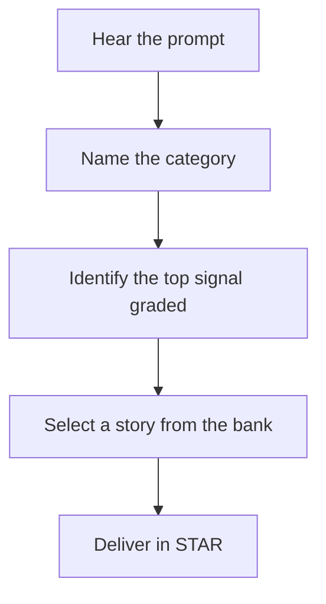
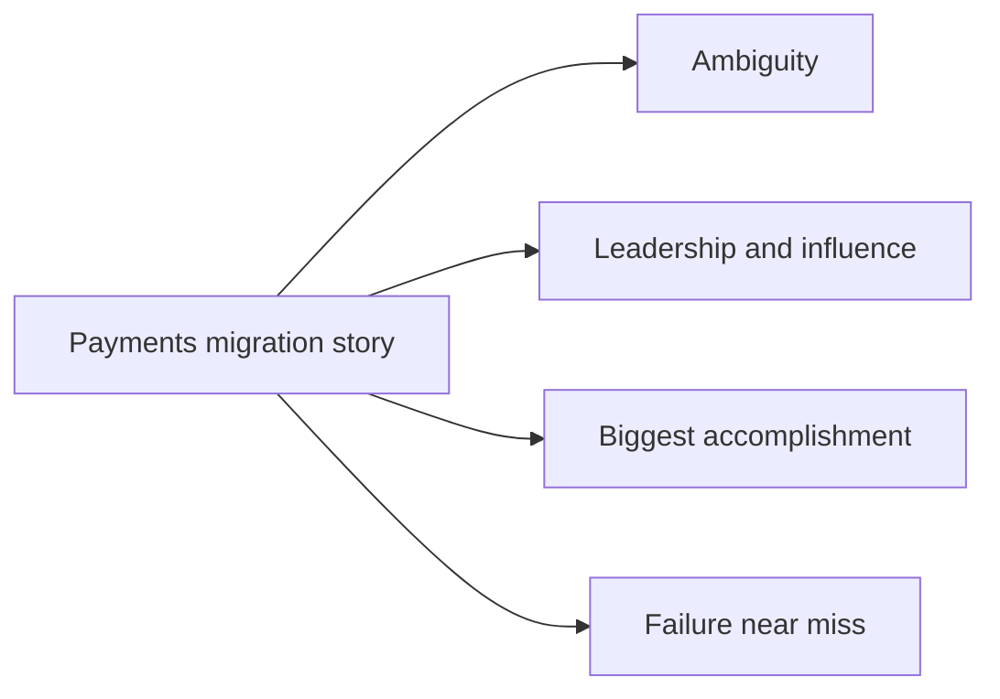

# Lecture 1 — The Eight Categories and the Rubric

> **Duration:** ~2 hours.
> **Outcome:** You can name which of the eight behavioral categories any prompt tests in five seconds; you can state the five signals interviewers grade and recognize whether an answer surfaced each; you understand why the behavioral round is as scorable as a coding round, and you can hear the difference between a high-signal and a low-signal answer to the same question.

For twelve weeks this course trained the coding round. A real onsite is not five coding rounds. It is three or four coding rounds **plus** at least one behavioral round, plus a hiring-manager conversation that is behavioral in everything but name. Phase 4 closes the gap. This lecture installs the map: the eight categories of behavioral question, and the rubric the interviewer is grading you against while you answer them.

The single biggest misconception engineers carry into a behavioral round is that it is "soft" — unstructured, subjective, a personality check you pass or fail on vibes. That is wrong, and believing it is why strong engineers fail behavioral rounds. The behavioral round is graded against a rubric, the same way a coding round is graded against correctness and complexity. The rubric measures **signals**. If you know the categories and you know the signals, the behavioral round becomes exactly as tractable as a coding round: recognize the shape, reach for the right tool, deliver.

---

## 1. Why the behavioral round exists

Companies do not run behavioral rounds for fun. They run them because the coding round under-predicts on-the-job performance. A coding round tells you whether someone can solve a self-contained algorithm problem in forty-five minutes alone. It tells you almost nothing about whether they will:

- Drive a project to completion when the requirements are vague.
- Disagree with a teammate productively instead of going silent or going to war.
- Own a mistake instead of hiding it until it becomes an incident.
- Influence a decision when they do not have the authority to make it.
- Stay calm and communicate clearly when a production system is on fire.

Those are the behaviors that determine whether a hire is a net positive or a net drain, and they are exactly what the behavioral round probes. The interviewer is asking "tell me about a time…" because **past behavior is the best available predictor of future behavior.** Every question is a bet that how you handled a real past situation predicts how you will handle a similar future one on their team.

This reframes the whole round. You are not being asked to perform; you are being asked for **evidence.** A good answer is a piece of evidence that you have, in the real world, already demonstrated the behavior they need. That is why specificity beats eloquence, why a real story beats a hypothetical, and why a quantified result beats "it went well."

---

## 2. The eight categories

Behavioral prompts come in hundreds of surface forms, but they collapse into eight underlying categories. Memorize these the way you memorized the twelve algorithm patterns. When a prompt lands, your first move — before you say a word — is to name the category.

### 1. Conflict

> *"Tell me about a time you disagreed with a coworker." / "Tell me about a disagreement with your manager." / "Describe a time you had to push back on a decision."*

What it probes: can you disagree productively? Do you go silent, go to war, or work it through? The top signals are **collaboration** and **self-awareness**. The trap: a conflict story where you were simply right and the other person was simply wrong surfaces no collaboration and reads as arrogant. The strong version shows you understood the other side, found the shared goal, and resolved it without damaging the relationship — even if you "lost."

### 2. Failure / mistake

> *"Tell me about a time you failed." / "Tell me about a mistake you made." / "Describe a project that didn't go as planned."*

What it probes: do you own your mistakes, and do you learn from them? The top signals are **ownership** and **growth**. The trap: the fake failure ("I worked too hard and burned out") and the blame-shift ("the failure was really the other team's fault"). The strong version names a real failure, owns your part of it without flinching, and ends on a concrete process or habit you changed because of it.

### 3. Leadership / influence-without-authority

> *"Tell me about a time you led a project." / "Tell me about a time you influenced a decision without being the decision-maker." / "How did you get buy-in for something you believed in?"*

What it probes: can you move people and outcomes without a title that forces them? The top signals are **ownership** and **collaboration**. The trap: confusing "I was assigned to lead" with "I led" — being given authority is not the same as exercising influence. The strong version shows you persuaded, aligned, and drove an outcome through people who did not report to you.

### 4. Ambiguity / incomplete information

> *"Tell me about a time the requirements were unclear." / "Describe a project where you had to figure out what to build." / "How do you operate when you don't have all the information?"*

What it probes: can you create clarity and make progress without a spec handed to you? The top signals are **ownership** and **impact**. The trap: waiting for someone else to resolve the ambiguity. The strong version shows you defined the problem, made an explicit assumption, validated it cheaply, and shipped — the same Frame-step discipline FRAME installs for coding, applied to a product or project decision.

### 5. Teamwork / collaboration

> *"Tell me about a time you worked on a team." / "Describe a time you helped a teammate." / "How do you handle working with people whose style differs from yours?"*

What it probes: are you someone people want on their team? The top signal is **collaboration**. The trap: the answer that is all "we" and no "I" — you describe a team win but never say what *you* contributed, so you surface no individual signal. The strong version is clear about your specific contribution to a shared outcome.

### 6. Dealing with a difficult person

> *"Tell me about a difficult person you worked with." / "Describe a time you worked with someone you didn't get along with." / "How do you handle a teammate who isn't pulling their weight?"*

What it probes: empathy and emotional regulation under interpersonal friction. The top signals are **self-awareness** and **collaboration**. The trap: an answer that is a character assassination of the other person. The interviewer is not checking whether the other person was difficult; they are checking how *you* behaved. The strong version shows empathy ("I realized they were under pressure I hadn't seen"), a specific de-escalation, and no lingering bitterness.

### 7. Biggest accomplishment / proudest work

> *"What's the work you're proudest of?" / "Tell me about your biggest accomplishment." / "What's the most impactful thing you've shipped?"*

What it probes: what you consider important, and whether you can own a result. The top signals are **impact** and **ownership**. The trap: choosing a technically impressive project with no clear outcome, or choosing a team achievement where your role was peripheral. The strong version is a quantified, owned result on something that mattered to the business or the users.

### 8. Why this company / role + "tell me about yourself"

> *"Tell me about yourself." / "Walk me through your background." / "Why do you want to work here?" / "Why are you leaving your current role?"*

What it probes: communication, narrative, and genuine fit. The top signals are **communication** and **motivation/fit**. The trap: reciting your résumé chronologically (boring, and they have it in front of them) or giving a generic "I want to work at a company that values impact" that fits any company. The strong version is a ninety-second narrative with a through-line, and a "why us" that names something specific and true about *this* company.

---

## 3. The recognition skill — name the category in five seconds

The drill this week is the same as the Research constraints step in FRAME: hear the prompt, name the shape, fast. Some examples, with the recognition out loud in a blockquote:

*The five-second recognition drill: match a prompt to its category before answering.*

> *"Tell me about a time you had to deliver something with a tight deadline and not enough information."*

> **Recognition:** Ambiguity, primarily — "not enough information" is the tell. Secondarily Leadership if you drove the scoping, and the Result needs to show you shipped despite the constraints. I'd deploy my migration story and lead the Action with how I cut scope to hit the date.

> *"Walk me through a situation where you and a teammate saw a technical decision very differently."*

> **Recognition:** Conflict, with a technical flavor. Top signal: collaboration — did I find the shared goal? I'd deploy my "database choice disagreement" story and make sure the Result is that we shipped *and* the relationship survived.

> *"What's something you've built that you're really proud of?"*

> **Recognition:** Biggest accomplishment. Top signals: impact and ownership. I'd deploy my "checkout latency" story because it has the strongest number (p99 1.2s → 280ms) and I owned it end to end.

Most prompts map cleanly to one category. Some are deliberate **hybrids** — "tell me about a time you disagreed with your manager about a technical direction and had to bring the team along" is Conflict + Leadership + a Result that proves the outcome. Naming the hybrid out loud ("This is really a conflict-and-influence question, so I'll pick a story that lands both") is itself a senior signal: it shows you understand what is being graded.

---

## 4. The five-signal rubric

Here is what the interviewer is actually scoring while you talk. There are five signals. A strong answer surfaces three or four of them clearly; a weak answer surfaces none, no matter how articulate it is.

| Signal | The question behind it | Surfaced by |
|--------|------------------------|-------------|
| **Ownership** | Did you drive this, or watch it happen? | First-person "I"; you made the call, took the risk, owned the outcome |
| **Impact** | Did it matter, and can you prove it? | A quantified result — latency, dollars, incidents, percent, time, people |
| **Self-awareness** | Do you know your own edges? | A genuine "what I'd do differently"; a real, non-humblebrag weakness |
| **Collaboration** | Can you work with and through people? | "We" for the outcome; crediting others; resolving friction without damage |
| **Growth** | Did the experience change how you operate? | "Since then, I always…"; a habit or process you adopted because of it |

A few things to internalize about this rubric.

**Ownership and collaboration are in productive tension.** Too much "I" and you read as a credit-grabber who cannot work on a team. Too much "we" and you surface no individual signal — the interviewer cannot tell what *you* did. The resolution, covered in depth in Lecture 2, is the "I vs we" discipline: "I" for your specific contribution, "we" for the team outcome.

**Impact is the most-skipped signal and the easiest to add.** Most engineers end a story with "and it went really well" or "the launch was successful." Those phrases score zero on impact because they are unfalsifiable. "We cut p99 checkout latency from 1.2 seconds to 280 milliseconds, and cart-abandonment dropped about four percent over the next quarter" scores high because it is specific, owned, and tied to something the business cares about. The number does not have to be enormous — it has to be *real and specific.*

**Self-awareness and growth are what turn a failure story from a liability into an asset.** Interviewers ask the failure question specifically to see whether you can own a mistake. A candidate who owns a real failure and names what they changed scores *higher* than a candidate who claims to have never failed. The failure question is a trap only if you treat it as one.

---

## 5. What high-signal and low-signal answers sound like

Same prompt, two answers. Read both aloud.

> *Prompt: "Tell me about a time a project you were on ran into trouble."*

**Low-signal answer:**

> *"Yeah, so we had this project last year, the payments migration, and it was pretty rough. There were a lot of moving parts and the timeline was aggressive, and honestly the requirements kept changing on us. We worked really hard and we pulled it off in the end, the team did a great job. It was stressful but we got through it."*

What did that surface? Almost nothing. No "I" — it is all "we" and "the team," so there is zero ownership signal. No specific action — "worked really hard" is not an action. No number — "we pulled it off" is unfalsifiable, so zero impact. No lesson — nothing changed afterward, so zero growth. An interviewer cannot score this. It is not a *bad* answer because the candidate is a bad engineer; it is a bad answer because it is evidence of nothing.

**High-signal answer:**

> *"Last year I owned the back-end half of our payments migration — moving us off a legacy processor onto Stripe. About three weeks in, we discovered the legacy system stored card metadata in a format Stripe couldn't ingest, which the original plan had assumed away. That put the whole timeline at risk. I made the call to write a one-time reconciliation job rather than ask the team to hand-migrate, because we had two hundred thousand stored payment methods and hand-migration would have taken weeks and introduced errors. I spent two days building and testing the job against a snapshot, found and fixed a tokenization edge case that would have dropped about three percent of records, and we migrated over a weekend with zero customer-facing downtime. We came in two days late on a six-week project, which I'd call a win given the surprise. The lesson I took from it — and I've done this on every migration since — is to spend the first day of any migration auditing the actual data shape, not the documented one. The doc lied; the data didn't."*

Same situation. This one surfaces all five signals: ownership (I owned, I made the call), impact (200k records, 3% would have dropped, zero downtime), self-awareness and growth (the audit-the-real-data lesson, now a habit), collaboration (implicit — "the team," "ask the team to hand-migrate"). It is ninety seconds. It is specific. It is evidence.

The difference between the two is **not** that the second engineer is better. It might be the *same engineer* describing the *same project*. The difference is structure and specificity — which is exactly what STAR (Lecture 2) installs.

---

## 6. The eight categories map onto a story bank, not eight scripts

A natural but wrong conclusion from this lecture is "I need eight memorized answers, one per category." You do not. You need a **story bank** of about twelve real anecdotes, each rich enough to answer several categories depending on which beat you emphasize. The payments-migration story above can answer:

- **Ambiguity** — emphasize the requirements that "assumed away" the data format.
- **Leadership / influence** — emphasize "I made the call" and bringing the team along.
- **Biggest accomplishment** — emphasize the zero-downtime result and the scale.
- **Failure** (a near-miss variant) — emphasize the 3% you almost dropped.

*One story in the bank can answer four different behavioral categories.*

One story, four categories. Twelve well-chosen stories cover all eight categories several times over. Building that bank — and the coverage matrix that proves no category is uncovered — is Lecture 2's subject and this week's mini-project.

This is the deepest parallel to the coding course. You did not memorize a solution to every LeetCode problem; you learned twelve patterns and learned to *match* a new problem to one. Behavioral works the same way: you do not memorize an answer to every possible question; you build twelve stories and learn to *match* a new question to the right one. The cognitive load in the room is **selection, not invention** — and selection is fast, which is why prepared candidates never freeze.

---

## 7. Closing — the map before the method

Three takeaways from Lecture 1:

1. **The behavioral round is scorable.** It grades five signals — ownership, impact, self-awareness, collaboration, growth — against eight categories of question. It is not a vibe check; it is a rubric, and rubrics are tractable.
2. **Recognition comes first.** Hear the prompt, name the category in five seconds, identify the top signal it grades. This is the Research constraints step, applied to behavioral. The hybrids ("conflict + leadership") are where the senior signal lives.
3. **You build a bank, not eight scripts.** Twelve real stories, each covering several categories, selected on the fly. Invention freezes people; selection does not.

Lecture 2 installs the **method** — STAR — the four-part structure that turns a war story into a scored answer, the budget that keeps it to ninety seconds, the "I vs we" discipline that balances ownership and collaboration, and the construction of the story bank and its coverage matrix. Lecture 3 installs **communication under pressure** — thinking aloud, the non-adversarial reframe, and the moves for hostile, ambiguous, and curveball questions.

*Next: [Lecture 2 — The STAR Method and the Story Bank](./02-the-star-method-and-the-story-bank.md).*
