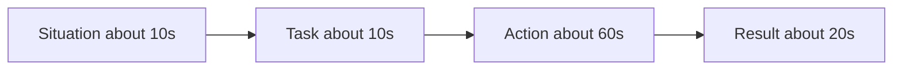

# Lecture 2 — The STAR Method and the Story Bank

> **Duration:** ~2 hours.
> **Outcome:** You can structure any behavioral answer in STAR with the 10/10/60/20-second budget; you can hold the "I vs we" discipline; you can turn an unquantified outcome into a number; and you can construct a story bank of twelve-plus anecdotes with a coverage matrix that proves every category is covered.

Lecture 1 gave you the map — eight categories, five signals. This lecture gives you the **method**: STAR, the four-part structure that turns a real experience into a scored answer. STAR is to the behavioral round what UMPIRE is to the coding round. UMPIRE keeps you from blurting code before you understand the problem; STAR keeps you from rambling before you have structured the answer. Both are mechanical scaffolds whose entire purpose is to free your attention from "what do I say next" so you can spend it on signal.

---

## 1. STAR — the four parts

**S — Situation.** The context. Who, where, when, what was at stake. One or two sentences. The interviewer needs just enough scene to understand the rest; they do not need the org chart, the product history, or the names of everyone involved.

**T — Task.** Your specific responsibility, or the specific problem you owned. The discriminator between S and T is: Situation is the *world*, Task is *your job in it*. "We were migrating off a legacy payment processor" is Situation; "I owned the back-end data migration" is Task. Keep it to one sentence.

**A — Action.** What **you** did, step by step. This is the heart of the answer and where every signal lives. The technical moves *and* the interpersonal moves: what you investigated, what you decided, who you persuaded, what you built, what you risked. First person. Specific. This is sixty of your ninety seconds.

**R — Result.** The outcome, **quantified**, plus what you learned. The number is non-negotiable — latency, dollars, incidents, percent, time-to-ship, people unblocked. End with a brief lesson ("since then I always…") to surface growth.


*STAR structures a ninety-second answer into four timed parts.*

Here is the canonical shape, annotated:

```
S  (~10s):  "Last year I was on the team that ran our checkout service.
            Cart conversion had stalled and we suspected page latency."

T  (~10s):  "I owned the investigation and the fix for the checkout
            page's server-side render time."

A  (~60s):  "I started by instrumenting the render path — turned out
            we were making a synchronous call to the inventory service
            per line item, so a ten-item cart fanned out to ten serial
            round trips. I batched those into a single call, added a
            short-TTL cache for the catalog metadata that rarely
            changed, and put the whole thing behind a feature flag so I
            could ramp it. I validated against production traffic at one
            percent before going wider. The risky part was the cache
            invalidation — I made the call to accept a thirty-second
            staleness window because price changes were rare and the
            latency win was large, and I documented that trade-off for
            the team."

R  (~20s):  "p99 render time went from 1.2 seconds to 280 milliseconds.
            Over the next quarter, cart abandonment on that page dropped
            about four percent. The lesson — and I check for this on
            every endpoint now — was to look for serial fan-out before
            anything else; it's the most common hidden latency cost."
```

Ninety seconds. Five signals. Read it aloud and time yourself — most learners are surprised how much fits in ninety seconds when the structure is doing the work.

---

## 2. The S/T over-spend trap — the leaf-copy bug of behavioral

In backtracking, the single most common bug is forgetting the leaf-copy. In behavioral answers, the single most common bug is the **inverse budget**: spending forty-five seconds setting up the Situation and Task, then rushing or skipping the Action and Result.

It happens because the setup is the *comfortable* part. You know the context cold, so you narrate it in loving detail — the team reorg, the quarter, the three other projects in flight, the personalities. Meanwhile the Action — the part the interviewer actually wants — gets compressed to "so I fixed it and it worked." You have spent your ninety seconds on the part that surfaces no signal and skipped the part that surfaces all of it.

The fix is the budget, drilled until reflexive:

| Part | Target | If you catch yourself… |
|------|-------:|------------------------|
| Situation | ~10s | …naming a third person or a second project, stop — you are over-setting-up |
| Task | ~10s | …describing the team's task instead of *your* task, refocus on "I owned…" |
| Action | ~60s | …saying "and then it worked," stop — back up and narrate the *decisions* you made |
| Result | ~20s | …trailing off without a number, stop — lead the Result with the metric |

A useful self-check when you record yourself (and you will, every drill this week): timestamp where you finished the Situation. If you are past twenty seconds and have not started the Action, you are over-spending on setup. Cut the setup, not the Action.

---

## 3. The "I vs we" discipline

Lecture 1 flagged the tension between the ownership signal and the collaboration signal. Here is how to hold both.

**Use "I" for your specific contribution. Use "we" for the team outcome.**

- *"**We** were tasked with cutting checkout latency."* — Task is shared, "we" is correct.
- *"**I** instrumented the render path and found the serial fan-out."* — your contribution, "I" is correct.
- *"**I** made the call to accept a thirty-second staleness window."* — your decision, your risk, "I" is correct.
- *"**We** shipped it, and p99 dropped to 280ms."* — the team delivered, "we" is correct for the outcome.

The failure modes are symmetric:

- **All "we":** the buried-individual answer. You describe a team win but the interviewer never learns what *you* did. Zero ownership signal. This is the more common failure for collaborative, modest engineers — and it is why modest people often underperform in behavioral rounds despite being excellent teammates.
- **All "I":** the credit-grabber. You describe a team effort as a solo heroics narrative. It reads as someone who cannot share credit or work on a team. Zero collaboration signal, and an active red flag.

The discipline is not about modesty or confidence; it is about *accuracy*. State precisely what you did ("I") and precisely what the team did ("we"). Accurate attribution surfaces both signals at once and reads as exactly the kind of person teams want: someone who owns their part and credits the rest.

A useful tell: if an interviewer follows up with "and what specifically was *your* role in that?", you over-used "we." If they follow up with "and who else was involved?", you over-used "I." Calibrate from the follow-ups.

---

## 4. Quantifying results — turning "it went well" into a number

The impact signal is the most-skipped and the easiest to add. Every story in your bank needs a number in its Result. If you think a story has no number, you have not looked hard enough. The categories of quantifiable result:

| Category | Examples |
|----------|----------|
| Latency / performance | "p99 from 1.2s to 280ms"; "build time from 14 min to 3 min" |
| Money | "saved ~$40k/yr in egress"; "unblocked a $2M contract" |
| Reliability | "on-call pages for that service went from ~12/week to near zero"; "cut the incident from a projected 6-hour outage to 40 minutes" |
| Scale | "migrated 200k stored payment methods"; "the service now handles 8k req/s" |
| Time / velocity | "cut the migration from a planned 3 weeks to 4 days"; "reduced PR review turnaround from 2 days to same-day" |
| People | "onboarded 4 engineers onto the new system"; "the runbook I wrote unblocked the on-call rotation so I stopped getting paged at 2am" |
| Business outcome | "cart abandonment dropped ~4%"; "feature adoption hit 30% in the first month" |

Two honesty rules. **First, never invent a number.** A fabricated metric is the fastest way to fail a behavioral round, because the natural follow-up — "how did you measure that?" — exposes it instantly. If you genuinely do not have a hard number, use an honest estimate and label it as one: "I don't have the exact figure, but it was roughly a four-times speedup — we went from minutes to seconds." An honest estimate scores nearly as well as a hard number and far better than no number.

**Second, tie the number to something that mattered.** "I cut the function from 40 lines to 25 lines" is a number, but nobody cares. "I cut p99 latency, which had been the top driver of cart abandonment" is a number tied to a business outcome. The strongest results connect a technical metric to a thing the company cares about: revenue, reliability, cost, or developer velocity.

---

## 5. The story bank — twelve stories, not eight scripts

You do not memorize an answer per category. You build a **bank** of about twelve real anecdotes, each rich enough to answer several categories, and you select the right one in the room. This is the direct parallel to the coding course: you learned twelve patterns and matched problems to them; here you build twelve stories and match questions to them.

Where do twelve stories come from? You already have most of them. Sources:

- **The four rough drafts from W1 and W4 homework.** Week 1 asked for two rough "tell me about a time" anecdotes; Week 4's mock prep asked for two more. Those four are your seeds — refine them this week.
- **Your last two or three roles or projects.** Each substantial project is usually two or three stories: the technical accomplishment, the conflict or ambiguity along the way, the thing that went wrong.
- **The five drills this week.** Drills 1–5 walk you through drafting a debugging story, a conflict story, a leadership story, a failure story, and an ambiguity story — five fresh ones, fully worked.

Refine each into a STAR write-up using the [`star_template.md`](../exercises/star_template.md). A refined story has: a one-line title, the categories it covers, the four STAR parts written out, a quantified result, the signals it surfaces, and the follow-up questions you should be ready for.

### The reuse principle

The power of the bank is that **one story answers multiple categories** depending on which beat you emphasize. The payments-migration story from Lecture 1 answers Ambiguity, Leadership, Biggest-accomplishment, and a near-miss Failure — four categories, one story. The checkout-latency story answers Biggest-accomplishment, Ambiguity (the conversion problem was under-specified), and Leadership (you made the staleness-window call). You do not need a unique story per category; you need twelve flexible stories whose union covers all eight categories with redundancy.

Redundancy matters because of a real failure mode: in a full loop, you will have **already used your best story** in an earlier round, and you cannot tell the same story twice to two interviewers who compare notes. With twelve stories covering eight categories two or three times over, you can always reach for a fresh one.

---

## 6. The coverage matrix

The artifact that proves your bank is complete is the **coverage matrix**: a grid of stories (rows) against the eight categories (columns), with a mark in every cell a story can cover. Here is an illustrative matrix for a bank of twelve stories (yours will differ — these are example titles):

| # | Story | Conflict | Failure | Leadership | Ambiguity | Teamwork | Difficult person | Accomplishment | Why-role |
|---|-------|:---:|:---:|:---:|:---:|:---:|:---:|:---:|:---:|
| 1 | Checkout latency fix | | | ● | ● | | | ● | |
| 2 | Payments migration | | ○ | ● | ● | ● | | ● | |
| 3 | DB-choice disagreement | ● | | ● | | ● | | | |
| 4 | The deploy I broke | | ● | | | | | | |
| 5 | Onboarding the new hire | | | ● | | ● | ● | | |
| 6 | The under-specified dashboard | | | | ● | ● | | ● | |
| 7 | The teammate who went dark | ● | | | | ● | ● | | |
| 8 | Killing my own project | ● | ○ | ● | | | | | |
| 9 | The on-call incident | | | ● | ● | ● | | ● | |
| 10 | Cross-team API alignment | ● | | ● | ● | ● | ● | | |
| 11 | Mentoring the intern | | | ● | | ● | | | |
| 12 | Why I'm here / through-line | | | | | | | | ● |

(● = strong fit, lead with this story for the category; ○ = usable but not your strongest.)

Read the matrix **down each column.** Every column must have at least one ●. If a column is empty — say, "Difficult person" had no strong story — you have found a gap, and you write or refine a story to fill it before an onsite. Reading down the columns is the whole point: it converts "do I have enough stories?" from a vague worry into a checkable invariant.

Read the matrix **across each row** to see how flexible each story is. Story 10 (cross-team API alignment) covers six categories — that is a workhorse story, worth polishing first. Story 4 (the deploy I broke) covers only Failure — that is fine; some stories are specialists, and Failure is a category you want a dedicated story for.

The coverage matrix is the deliverable at the center of this week's mini-project. Building it forces the discipline that distinguishes prepared candidates: you walk into the onsite knowing you have a strong story for every question they can ask, and a backup for the categories most likely to come up twice.

---

## 7. Rehearsal — the part nobody wants to do and everybody needs

A story is not in your bank until you have said it aloud. Writing a STAR answer and reading it silently builds a *false* confidence: the written version is too long, too smooth, and nothing like what comes out of your mouth under pressure. The gap between your written answer and your spoken answer is the gap that sinks unprepared candidates.

The rehearsal protocol, used in every drill this week:

1. **Write** the STAR answer in the template.
2. **Record** yourself delivering it from memory (not reading it) — audio or video, your phone is fine.
3. **Listen back** at 1.25× or 1.5×. Note: where did you over-spend on Situation? Where did the "I" go missing? Did you land a number in the Result? Did you ramble?
4. **Cut and re-record.** Almost every first take is too long. The second take is tighter. The third is interview-ready.

Do not skip the recording. It is the single highest-leverage hour this week, the same way the recorded coding-solve was the highest-leverage hour in Phase 1. You cannot hear your own filler words, your own buried results, or your own missing "I" until you play yourself back.

---

## 8. Closing — the method and the asset

Three takeaways from Lecture 2:

1. **STAR is the method.** Situation (10s), Task (10s), Action (60s), Result (20s). The Action is the heart; the Result needs a number. The over-spend-on-setup trap is the leaf-copy bug of behavioral — drill the budget until it is reflexive.
2. **"I vs we" is the discipline.** "I" for your contribution, "we" for the outcome. Accurate attribution surfaces ownership and collaboration at once.
3. **The story bank is the asset.** Twelve real stories, each covering several categories, arranged in a coverage matrix with no empty column. Selection, not invention — which is why prepared candidates never freeze. Rehearse aloud; record; cut; re-record.

Lecture 3 installs the last layer: **communication under pressure.** Thinking aloud when the room goes quiet, the non-adversarial reframe, handling ambiguous and hostile and curveball questions, the recovery move when you pick the wrong story mid-answer, and the follow-up email that closes the loop.

*Next: [Lecture 3 — Communication Under Pressure and Hostile Questions](./03-communication-under-pressure-and-hostile-questions.md).*
