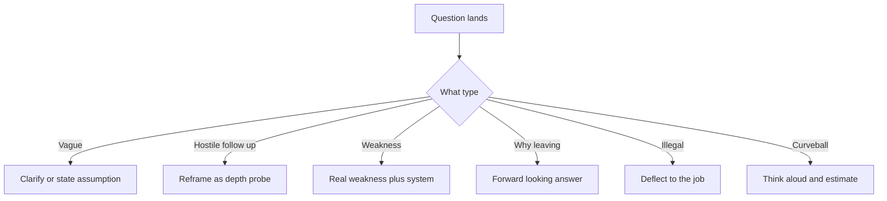

# Lecture 3 — Communication Under Pressure and Hostile Questions

> **Duration:** ~2 hours.
> **Outcome:** You can think aloud and narrate structure when the room goes quiet; you can reframe a hostile-sounding round as non-adversarial; you can handle ambiguous, hostile, curveball, and illegal questions with a specific move for each; you can recover gracefully when you pick the wrong story mid-answer; and you can write the same-day follow-up email.

Lectures 1 and 2 gave you the map and the method — eight categories, five signals, STAR, a story bank. This lecture is about the *room*: what happens when the interviewer goes quiet, pushes back, asks something ambiguous, asks something hostile, or asks something they are not supposed to ask. These are the moments that separate a polished behavioral round from a shaky one, and they are entirely trainable.

---

## 1. Thinking aloud — the UMPIRE habit, applied

You already trained this. In Phase 1 you learned to narrate a coding solve — to say the Understand step out loud, to talk through the Plan before you wrote code, so the interviewer could follow your reasoning and grade your thinking, not just your output. The behavioral round needs the same habit for the same reason.

**Narrate the structure.** When a question lands and you have selected your story, signal the structure before you dive in:

> *"Sure — let me give you the situation first, then what I specifically did, and where it landed."*

That one sentence does three things: it buys you three seconds to organize, it tells the interviewer you have a structured answer coming (which is itself a signal), and it commits you to the STAR shape so you do not ramble.

**Treat silence as a prompt, not a verdict.** Interviewers go quiet for many reasons — they are taking notes, they are deciding what to ask next, they are letting you keep talking to see where you go. Silence is almost never "you blew it." The wrong response to silence is to fill it with nervous over-explanation that buries your already-good answer. The right response: finish your Result cleanly, land your number, and *stop.* Let the silence sit. If it stretches, a calm "Happy to go deeper on any part of that" hands the turn back without flailing.

**Narrate when you need a moment.** If a question genuinely stumps you for a second, narrate the search instead of freezing: *"Let me think of the best example for that — I want to give you a real one, not a generic one."* That is far better than a ten-second dead silence, and it reads as someone who picks examples deliberately.

---

## 2. The non-adversarial reframe

The most important mental shift for the whole round: **the interviewer is not your adversary. They are looking for a reason to hire you.** A behavioral interviewer who likes you is searching for evidence to bring back to the hiring committee that says "yes." Every question is an *opportunity you are being handed* to provide that evidence.

This reframe matters most when a question *sounds* hostile. Consider:

> *"You said you made that call unilaterally. Didn't your teammates feel steamrolled?"*

Read as an attack, this triggers defensiveness, and a defensive answer ("no, they were fine with it") surfaces no signal and reads badly. Read as a **depth probe** — the interviewer testing whether you have self-awareness about the collaboration cost of a unilateral call — it becomes an opportunity:

> *"That's a fair push. I did make the call quickly because we were against a deadline, but you're right that I owed the team more context up front. What I did do was write up the trade-off the same day and walk the two most affected engineers through it, and one of them caught a case I'd missed. If I had it again I'd have spent the ten minutes to socialize it before deciding, not after. It worked out, but I got lucky that nobody had a strong objection I hadn't anticipated."*

That answer surfaces self-awareness and growth *because* of the hostile-sounding follow-up. The reframe converts an attack into a signal opportunity. Almost every hard follow-up is a depth probe; answer it as collaboration, not combat.

---

## 3. Handling ambiguous questions

Some questions are deliberately vague — "tell me about a challenging project," "describe a time things got hard." A vague question is the behavioral version of an under-specified coding prompt, and you handle it with the same **Understand-step discipline**: clarify the scope, or state your assumption, then answer.

Two valid moves:

**Clarify, briefly:** *"Happy to — do you mean technically challenging, or challenging from a people-and-coordination angle? I have a good example of each."* This is the strongest move when the question genuinely forks; it shows you think about scope, and it lets the interviewer steer toward what they want to grade.

**Assume, explicitly:** *"I'll take 'challenging' to mean the hardest coordination problem I've owned, since that's where I learned the most."* Use this when clarifying would feel like stalling. State the assumption out loud — that is the senior move — then deliver.

Do **not** answer a vague question by free-associating. A candidate who hears "tell me about a challenge" and launches into an unstructured ramble has skipped the Understand step. Name the scope, then STAR.

---

## 4. Handling hostile, hardball, and curveball questions

Specific moves for the questions that throw people. (Challenge 2 drills these with full worked responses; this is the framework.)

*A decision tree for the different ways a question in the room can land.*

### The weakness question — "What's your biggest weakness?"

The trap is the fake weakness ("I'm a perfectionist," "I work too hard") — interviewers have heard it a thousand times and it reads as evasive. The move: **name a real weakness plus the system you built to manage it.**

> *"My instinct is to go heads-down and solve a problem myself rather than pull people in early — I'm fast solo, but I've shipped things that would've been better with earlier input. So I've built a rule for myself: anything that'll take more than a day, I write a one-paragraph approach and drop it in the channel before I start, specifically to invite the pushback I used to skip. It's caught real problems, and it's made me less of a bottleneck."*

Real weakness, concrete system, and a result. That scores high on self-awareness *and* growth — the weakness question, answered well, is an asset.

### The why-leaving question — "Why are you leaving your current role?"

The trap is bitterness. Never criticize your current employer, manager, or teammates — it makes the interviewer wonder how you will talk about *them* in two years. The move: **forward-looking, not backward.** Frame it as moving *toward* something, not away from something.

> *"I've gotten a lot out of my current role — I've owned our payments stack for two years and grown a ton. What I'm looking for now is more scope in distributed systems specifically, and the chance to work at a scale I won't hit where I am. That's exactly what drew me to this team."*

Even if you are leaving because your manager is terrible, you frame it forward. The interviewer is not owed your grievances; they are owed your motivation.

### The failure-with-a-twist — "...and what would you have done with more time?"

A common follow-up to the failure story. It tests whether your "what I learned" is real or rehearsed. Answer it concretely and specifically — name the actual thing more time would have bought ("I'd have written the integration test that would have caught the regression, which I skipped under deadline"). Do *not* use it to retroactively claim you would have succeeded; that undoes the ownership you just demonstrated.

### Illegal / inappropriate questions

Occasionally — usually from an inexperienced interviewer, rarely with bad intent — you will get a question that is inappropriate or, in many jurisdictions, illegal to ask: about your age, marital or family status, citizenship beyond work authorization, religion, health, or plans to have children. You do not have to answer, and you do not have to litigate it in the room. The graceful move is to **deflect to the job**, addressing the legitimate concern that might sit behind the question without surrendering the personal information.

> *Asked: "Do you have kids? This role has some on-call."* — Deflect: *"I'm happy to commit to the on-call rotation — I've carried a pager for the last two years and I'm comfortable with the expectations. Is there a particular coverage pattern I should know about?"*

You answered the *real* concern (can you do the on-call) without answering the improper question (your family status), and you redirected to the job. If a question is so far out of bounds that you cannot redirect, "I'd rather keep this focused on the role — what else can I tell you about my experience?" is a complete, polite, and firm answer. Note the company afterward; how interviewers treat boundaries is data about the team.

### The estimation / "sell me this pen" curveball

Some interviewers throw a curveball — "how many golf balls fit in a school bus," "sell me this pen," "how would you design a vending machine for the moon." These are rarely graded on the *answer*; they are graded on **whether you panic or engage.** The move: think aloud, state your assumptions, structure an estimate, and show your work — exactly the thinking-aloud habit. For "sell me this pen," the senior move is to ask what they use a pen for before pitching (the lesson is: understand the need before selling the solution — which is itself a signal). Treat the curveball as a tiny, low-stakes thinking-aloud exercise and it stops being scary.

---

## 5. The recovery move — when you pick the wrong story mid-answer

You will, occasionally, be thirty seconds into an answer when you realize the story you picked does not actually answer the question, or that you are about to bury the result, or that a better story just surfaced in your memory. Unprepared candidates push through the weak answer and hope. The senior move is a **clean reset.**

> *"Actually — let me give you a sharper example, that one doesn't quite get at the conflict you're asking about."*

A brief, honest reset costs you ten seconds and a small amount of poise, and it *gains* you a better answer plus a signal that you self-correct. It reads as someone who knows what a good answer looks like and will not settle for a mediocre one. Use it sparingly — once in a round, not every question — but do not be afraid of it. A strong second story beats a limp first one every time.

The lighter version of the recovery move is mid-answer course-correction without a full reset: if you catch yourself over-spending on Situation, you can simply say *"—anyway, the key thing I did was…"* and jump to the Action. Steering back to STAR mid-answer is a skill you build by recording yourself and noticing where you drift.

---

## 6. The follow-up email

The lowest-effort, highest-leverage move in the entire loop, and the one most candidates skip. Within a few hours of the interview, send a short note to your recruiter (who will forward it, or to the interviewer directly if you have the address). It does three things: it reinforces your interest, it gives you a chance to add anything you fumbled, and it shows follow-through — which is itself a signal.

The anatomy of a good follow-up email:

1. **Thank them, specifically.** Not "thanks for your time" but "thanks for walking me through how the payments team handles on-call — that's exactly the kind of ownership I'm looking for."
2. **Reference one concrete thing from the conversation.** A problem they mentioned, a technology you discussed, a question you enjoyed. This proves you were present and engaged, not running a script.
3. **Reaffirm fit, briefly.** One sentence on why the conversation made you more interested, tied to something specific you learned.
4. **Optionally, repair one thing.** If you fumbled a question, one clean sentence: "On the scaling question, the cleaner answer I should have given is — we sharded by tenant, which kept the hot-partition problem bounded." A short repair reads as thoughtful, not desperate; do this only if the fumble was real and the repair is genuinely better.
5. **Keep it under 150 words.** Long emails do not get read.

A template you can adapt (put a refined version in your portfolio as the homework asks):

> *Subject: Thank you — [role] conversation today*
>
> *Hi [name],*
>
> *Thanks for the conversation today — I especially enjoyed digging into [specific topic], and hearing how your team [specific thing they described] made me more excited about the role, not less. It maps closely to the [specific experience] I've spent the last two years on.*
>
> *One quick addition: on [question you want to expand], the sharper version of my answer is [one sentence].*
>
> *Looking forward to next steps. Thanks again.*
>
> *[Your name]*

Send it the same day. It will not single-handedly get you the offer, but in a close decision it is a thumb on the scale, and it costs you ten minutes.

---

## 7. Self-check

Before you move to the drills, make sure you can do each of these *out loud*, from memory:

- [ ] Narrate the structure of an answer before delivering it ("let me give you the situation, then what I did").
- [ ] Restate the non-adversarial reframe: the interviewer wants a reason to hire you; a hard follow-up is a depth probe.
- [ ] Handle a vague question by clarifying the scope or stating an assumption — not by free-associating.
- [ ] Answer the weakness question with a real weakness plus the system you built around it.
- [ ] Answer the why-leaving question forward-looking, never bitter.
- [ ] Deflect an illegal/inappropriate question to the job's legitimate concern without surrendering personal information.
- [ ] Engage a curveball by thinking aloud and stating assumptions, not by panicking.
- [ ] Execute a clean recovery reset when you pick the wrong story mid-answer.
- [ ] Recite the five parts of a strong follow-up email.

If any of those is not yet reflexive, re-read the relevant section and say the move aloud until it is. These are muscle, not knowledge — and muscle comes from reps, which the drills and challenges provide.

---

## 8. Closing — the room is trainable

Three takeaways from Lecture 3:

1. **Think aloud and narrate structure.** Silence is a prompt, not a verdict. The UMPIRE narration habit transfers directly.
2. **Reframe the round as non-adversarial.** Hostile-sounding follow-ups are depth probes; answer them as collaboration. Each hard question — weakness, why-leaving, illegal, curveball — has a specific move.
3. **Recover and follow up.** A clean reset beats pushing through a weak answer; a same-day, specific follow-up email is the cheapest signal in the loop.

You now have the full behavioral skill set: the map (Lecture 1), the method (Lecture 2), and the room (Lecture 3). The rest of the week is reps. Start with the [exercises](../exercises/README.md) — five STAR drills that build five stories — then the [challenges](../challenges/README.md) — two full mock rounds — and assemble it all into the [mini-project](../mini-project/README.md): your story bank.

*Next: [the exercises](../exercises/README.md) — five STAR drafting drills.*
