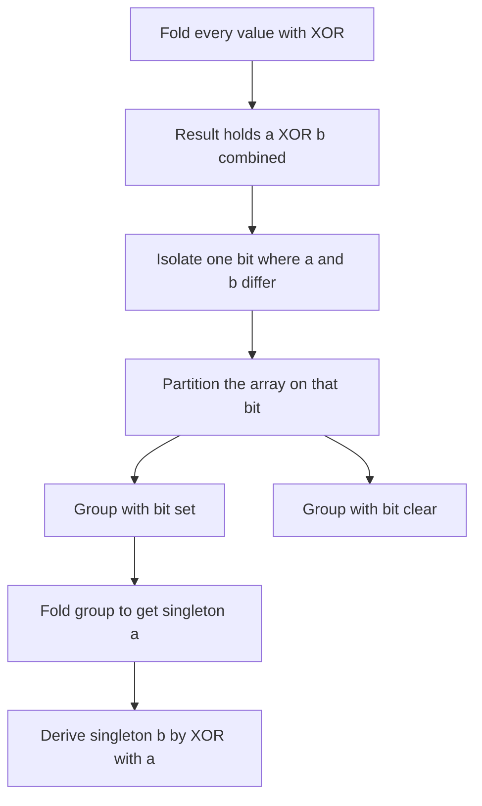

# Lecture 1 — Bit Manipulation Fundamentals and the XOR Family

> **Duration:** ~2 hours.
> **Outcome:** You can read and write the six bitwise operators fluently, set / clear / toggle / test a single bit with a mask, isolate and clear the lowest set bit, count set bits three ways, and recognize an XOR-fold problem in 30 seconds — solving Single Number (LC 136), Missing Number (LC 268), and Single Number III (LC 260) from the four XOR identities.

Bit manipulation is pattern #13 of the fourteen-pattern catalog, and it is the one most candidates under-rate. It is rarely the centerpiece of a loop, but it is the curveball: the "warm-up" that hides an `O(1)`-space trick, the follow-up an interviewer adds when you finish early, the systems-flavored question at an embedded or infrastructure team. The whole family reduces to two ideas you can hold in one hand: *bits are a set* (each bit is a yes/no membership flag), and *XOR cancels* (`a ^ a == 0`, so pairs vanish and the survivor is the answer). Own those two ideas and the pattern is yours.

---

## 1. Binary representation and two's complement

An integer is a sequence of bits. The unsigned value of a bit string is `sum(bit_i * 2**i)` over the positions `i` where the bit is set.

```
13  =  0b1101  =  8 + 4 + 0 + 1
                  2^3 2^2     2^0
```

Negative integers use **two's complement**: to negate a number, flip every bit and add one. In an 8-bit register, `-1` is `0b11111111` and `-13` is `0b11110011`. The top bit is the sign bit; the representation is chosen so that ordinary binary addition "just works" across the sign boundary.

Python is the wrinkle. **Python `int` is unbounded** — it does not live in a fixed-width register, so there is no overflow and no natural wrap-around. Conceptually, a negative Python int behaves like an infinite two's-complement string of leading `1`s: `~0 == -1`, `bin(-13)` is `-0b1101` (Python prints a sign, not the two's-complement bits). This matters in exactly one interview problem — Sum of Two Integers (LC 371), Challenge 2 — where we *simulate* a 32-bit register with a `& 0xFFFFFFFF` mask because Python will not overflow for us. Everywhere else, the unboundedness is a convenience: no overflow bugs.

The bit-position convention we use all week: **bit 0 is the lowest (rightmost, value `2**0 = 1`)**; bit `i` has value `2**i`. The mask `1 << i` is "a 1 in position `i` and zeros everywhere else."

---

## 2. The six operators

| Operator | Name | Idiom |
|----------|------|-------|
| `a & b` | AND | 1 where *both* are 1 — used to **test** and **mask** |
| `a \| b` | OR | 1 where *either* is 1 — used to **set** |
| `a ^ b` | XOR | 1 where they **differ** — used to **toggle** and **cancel pairs** |
| `~a` | NOT | flip every bit (`~a == -a - 1` in Python) |
| `a << k` | left shift | multiply by `2**k`; introduces `k` zero bits at the bottom |
| `a >> k` | right shift | floor-divide by `2**k`; drops the bottom `k` bits |

The truth tables, for one bit each:

```
AND   OR    XOR
0 0|0 0 0|0 0 0|0
0 1|0 0 1|1 0 1|1
1 0|0 1 0|1 1 0|1
1 1|1 1 1|1 1 1|0
```

The two that earn their keep in interviews are **AND** (for masking and testing) and **XOR** (for toggling and cancellation). XOR's magic is in its truth table's bottom-right corner: `1 ^ 1 == 0`. A bit XOR'd with itself cancels.

The full reference for Python's operators is the docs: "Bitwise operations on integer types" — <https://docs.python.org/3/reference/expressions.html#binary-bitwise-operations>.

---

## 3. Single-bit operations: set, clear, toggle, test

Every single-bit operation is "build a mask with one bit in position `i`, then combine it with the right operator." The mask is always `1 << i`.

| Operation | Code | Why |
|-----------|------|-----|
| **Test** bit `i` | `(x >> i) & 1` | shift the bit down to position 0, mask off the rest |
| **Set** bit `i` | `x \| (1 << i)` | OR forces the bit to 1, leaves others alone |
| **Clear** bit `i` | `x & ~(1 << i)` | AND with the inverted mask zeroes that bit, leaves others alone |
| **Toggle** bit `i` | `x ^ (1 << i)` | XOR flips that bit, leaves others alone |

```python
def test_bit(x: int, i: int) -> int:
    """Return bit i of x (0 or 1)."""
    return (x >> i) & 1


def set_bit(x: int, i: int) -> int:
    """Return x with bit i set to 1."""
    return x | (1 << i)


def clear_bit(x: int, i: int) -> int:
    """Return x with bit i cleared to 0."""
    return x & ~(1 << i)


def toggle_bit(x: int, i: int) -> int:
    """Return x with bit i flipped."""
    return x ^ (1 << i)
```

Memorize the four masks. In an interview you write these without hesitation; fumbling them is the tell that bit manipulation is not yet in your hands.

---

## 4. The low-bit idioms

Two idioms appear in a remarkable number of bit problems. They look like incantations until you trace them once; then they are obvious.

### `x & -x` — isolate the lowest set bit

In two's complement, `-x` is `~x + 1`. Negating flips every bit and adds one, which has the effect of flipping every bit *above and including* the lowest set bit, while leaving the bits *below* it (all zeros) unchanged. AND-ing `x` with `-x` therefore keeps only the lowest set bit.

```
x      = 0b0110_1100   (108)
-x     = 0b1001_0100   (in two's complement, conceptually)
x & -x = 0b0000_0100   (4 — the lowest set bit, isolated)
```

This is the engine of Single Number III (§9) and of Fenwick/binary-indexed trees (Phase 3). Trace it once on paper and it sticks.

### `x & (x - 1)` — clear the lowest set bit

Subtracting one from `x` flips the lowest set bit to 0 and turns all the zero bits below it into ones; AND-ing with the original clears that lowest set bit and everything below stays zero.

```
x          = 0b0110_1100   (108)
x - 1      = 0b0110_1011
x & (x-1)  = 0b0110_1000   (104 — the lowest set bit is gone)
```

This is **Brian Kernighan's algorithm** for popcount: the loop `while x: x &= x - 1; count += 1` runs exactly once per set bit, so it is `O(popcount)` rather than `O(bit-width)`.

---

## 5. Popcount — counting set bits, three ways

"How many 1 bits?" is Number of 1 Bits / Hamming Weight (LC 191) and the inner workhorse of Counting Bits (LC 338, Lecture 2). Three answers, in the order an interviewer wants to hear them:

```python
def popcount_builtin(x: int) -> int:
    """Python 3.10+: the one-liner. Say this first."""
    return x.bit_count()


def popcount_str(x: int) -> int:
    """The readable fallback if bit_count is unavailable."""
    return bin(x).count("1")


def popcount_kernighan(x: int) -> int:
    """The 'show your work' version: one iteration per set bit."""
    count = 0
    while x:
        x &= x - 1   # clear the lowest set bit
        count += 1
    return count
```

`int.bit_count()` exists in Python 3.10+ and is documented here: <https://docs.python.org/3/library/stdtypes.html#int.bit_count>. In an interview, say the one-liner first ("`x.bit_count()` in Python 3.10+, `O(1)` for fixed-width ints"), then offer the Kernighan loop as the language-agnostic version that demonstrates you understand *why* it is fast. That sequencing — idiomatic answer first, then the from-scratch defense — is the senior tell.

---

## 6. The XOR family — the four identities

XOR is the bit operator that does the most interview work, and it is entirely characterized by four identities:

1. **Self-cancellation:** `a ^ a == 0`. A value XOR'd with itself is zero.
2. **Identity:** `a ^ 0 == a`. XOR with zero is a no-op.
3. **Commutativity:** `a ^ b == b ^ a`. Order does not matter.
4. **Associativity:** `(a ^ b) ^ c == a ^ (b ^ c)`. Grouping does not matter.

Put 1, 3, and 4 together and you get the central lemma: **fold a multiset by XOR, and every value that appears an even number of times cancels to zero; only the odd-occurrence values survive.** Order is irrelevant (commutativity); grouping is irrelevant (associativity); pairs vanish (self-cancellation). This is the "XOR fold," and it solves an entire sub-family of problems in `O(n)` time and `O(1)` space.

> **The 30-second Match memo for an XOR-fold problem (say this out loud):**
> *"Every element appears twice except one, and the interview tell is `O(1)` extra space — so this is an XOR fold. I reduce the array by `^`: pairs cancel because `a ^ a == 0`, and the lone element survives because `a ^ 0 == a`. Order does not matter — XOR is commutative and associative. Time `O(n)`, space `O(1)`. The hash-map alternative is `O(n)` space, which the interviewer is steering me away from with the constant-space hint."*

---

## 7. Worked UMPIRE — Single Number (LC 136)

Let us run the full method on the canonical XOR-fold problem.

### Problem statement

Given a non-empty array of integers `nums`, every element appears **twice** except for one. Find that single one. You must implement a solution with **linear runtime complexity** and use **only constant extra space**.

**Constraints:** `1 <= len(nums) <= 3 * 10**4`; `-3 * 10**4 <= nums[i] <= 3 * 10**4`; each element appears twice except one element which appears once.

**Examples:** `nums = [2, 2, 1]` → `1`. `nums = [4, 1, 2, 1, 2]` → `4`. `nums = [1]` → `1`.

### Understand

We have a multiset in which every value is paired except one. We must return the unpaired value. The two binding constraints are the ones that pin the algorithm: **linear time** and **constant space**. The constant-space constraint rules out the obvious hash-map / `Counter` answer (that is `O(n)` space). Hand-walk: `[4, 1, 2, 1, 2]` — the 1s pair, the 2s pair, the 4 is alone → answer `4`.

### Match

XOR fold. The 30-second memo from §6: every element appears twice except one, constant space is the tell, so reduce by `^`; pairs cancel via `a ^ a == 0`, the survivor remains via `a ^ 0 == a`, order is irrelevant by commutativity and associativity. Reject the hash-map answer (`O(n)` space) and the sort-then-scan answer (`O(n log n)` time, and it mutates the input).

### Plan

1. Initialize an accumulator `result = 0` (the identity element for XOR).
2. Walk `nums`, XOR-folding each value into `result`.
3. After the fold, every paired value has cancelled to 0; `result` holds the unpaired value.
4. Return `result`.

### Implement

```python
from functools import reduce
from operator import xor
from typing import List


def single_number(nums: List[int]) -> int:
    """Return the element that appears exactly once; all others appear twice.

    XOR fold: pairs cancel (a ^ a == 0), the lone element survives (a ^ 0 == a).
    Time O(n), space O(1).
    """
    result = 0
    for value in nums:
        result ^= value
    return result


def single_number_functional(nums: List[int]) -> int:
    """The same fold written with functools.reduce — mention as an idiom."""
    return reduce(xor, nums, 0)
```

The loop form is what you write on the whiteboard; the `reduce(xor, nums, 0)` one-liner is worth naming as "the same fold, expressed functionally" — it signals fluency without obscuring the logic.

### Review

Trace `[4, 1, 2, 1, 2]`:

```
result = 0
0 ^ 4 = 4
4 ^ 1 = 5
5 ^ 2 = 7
7 ^ 1 = 6
6 ^ 2 = 4   -> return 4   ✓
```

Edge cases: `[1]` → `0 ^ 1 == 1` ✓ (the single element fold). Negative inputs work without special handling — XOR operates on the bit pattern, and the identities hold regardless of sign.

### Evaluate

- **Time:** `O(n)` — one pass, one XOR per element.
- **Space:** `O(1)` — a single accumulator, no auxiliary structure. This is the constraint the problem demanded; the hash-map answer fails it.
- **Trade vs hash map:** the `Counter` solution is also `O(n)` time but `O(n)` space; the XOR fold is strictly better on space and is the intended answer. The sort-and-scan answer is `O(n log n)` time and mutates the input. Default to the XOR fold whenever the "appears twice except one" + "constant space" signals are present.

---

## 8. Missing Number (LC 268)

Given an array `nums` containing `n` distinct numbers in the range `[0, n]`, return the one number in the range that is missing.

The XOR trick: XOR together all the indices `0..n` *and* all the values. Every present value cancels with its matching index; the missing number is left because its index has no matching value.

```python
from typing import List


def missing_number(nums: List[int]) -> int:
    """XOR all indices 0..n with all values; the survivor is the missing number.

    Time O(n), space O(1).
    """
    result = len(nums)          # seed with n (the top index has no array slot)
    for i, value in enumerate(nums):
        result ^= i ^ value
    return result
```

Trace `nums = [3, 0, 1]` (n = 3, so the range is `[0, 3]`, missing `2`):

```
result = 3
i=0,v=3:  3 ^ 0 ^ 3 = 0
i=1,v=0:  0 ^ 1 ^ 0 = 1
i=2,v=1:  1 ^ 2 ^ 1 = 2   -> return 2   ✓
```

The Gauss-sum alternative — `n*(n+1)//2 - sum(nums)` — is equally `O(n)`/`O(1)` and arguably cleaner; the XOR version is the one to reach for if the interviewer worries about integer overflow in a fixed-width language. Name both.

---

## 9. Single Number III (LC 260) — partition on a differing bit

This is the XOR family's senior-signal problem. Given an array where exactly **two** elements appear once and all others appear twice, return the two singletons. Linear time, constant space.

The trouble: a single XOR fold gives you `a ^ b` (the two singletons XOR'd together) — but you cannot separate them from that alone. The insight: `a ^ b` has a `1` in every bit position where `a` and `b` *differ*. Pick **any** such differing bit, and it partitions the whole array into two groups — those with that bit set, those without — such that `a` lands in one group and `b` in the other, and every paired value stays together (both copies have the same bits). XOR-fold each group separately, and each group folds to one singleton.


*How Single Number III narrows a combined XOR into its two singleton values.*

The cleanest way to grab "any differing bit" is the lowest-set-bit idiom from §4: `diff & -diff`.

```python
from typing import List


def single_number_iii(nums: List[int]) -> List[int]:
    """Two elements appear once, the rest twice. Return the two singletons.

    Step 1: fold everything -> xor_all == a ^ b.
    Step 2: isolate any bit where a and b differ -> lowest set bit of xor_all.
    Step 3: partition on that bit and fold each side -> a and b.
    Time O(n), space O(1).
    """
    xor_all = 0
    for value in nums:
        xor_all ^= value           # xor_all == a ^ b

    diff_bit = xor_all & -xor_all  # isolate one bit where a and b differ

    a = 0
    for value in nums:
        if value & diff_bit:       # partition: this group contains a (or b)
            a ^= value
    b = xor_all ^ a                # the other singleton falls out
    return [a, b]
```

Trace `nums = [1, 2, 1, 3, 2, 5]` (singletons `3` and `5`):

```
xor_all = 1^2^1^3^2^5 = 3 ^ 5 = 6  (0b110)
diff_bit = 6 & -6 = 2  (0b010 — bit 1, where 3=0b011 and 5=0b101 differ)
partition on bit 1:
  has bit 1: 2, 3, 2  -> fold: 2^3^2 = 3
  a = 3
  b = xor_all ^ a = 6 ^ 3 = 5
return [3, 5]   ✓ (order is unspecified)
```

The `b = xor_all ^ a` step is the elegant finish — once you have `a` and `a ^ b`, the other singleton is one XOR away, so you only fold one of the two groups. State that out loud; it is the move that turns a correct answer into a memorable one.

---

## 10. Self-check

Without notes, answer:

1. **Write the four single-bit masks** (set / clear / toggle / test bit `i`). (`x | (1 << i)`, `x & ~(1 << i)`, `x ^ (1 << i)`, `(x >> i) & 1`.)
2. **What does `x & -x` compute, and what does `x & (x - 1)` compute?** (Isolate the lowest set bit; clear the lowest set bit.)
3. **State the four XOR identities.** (`a ^ a == 0`; `a ^ 0 == a`; commutative; associative.)
4. **Why does folding an array by XOR return the unpaired element?** (Pairs cancel to 0 by self-cancellation; order/grouping irrelevant by commutativity/associativity; the survivor remains by identity.)
5. **In Single Number III, why does isolating a differing bit work?** (`a ^ b` is 1 exactly where `a` and `b` differ; any such bit separates `a` from `b` while keeping every paired value together.)
6. **Name three ways to count set bits and which one you say first in an interview.** (`x.bit_count()`, `bin(x).count("1")`, the Kernighan loop; say `bit_count()` first, then the Kernighan loop as the from-scratch defense.)

If you can answer all six without hesitation, the XOR family is in your hands. The bitmask and bit-DP families are next.

---

*Next:* [Lecture 2 — Bitmasks, Subset Enumeration, and Bit DP](./02-bitmasks-and-subset-enumeration-and-bit-dp.md).
