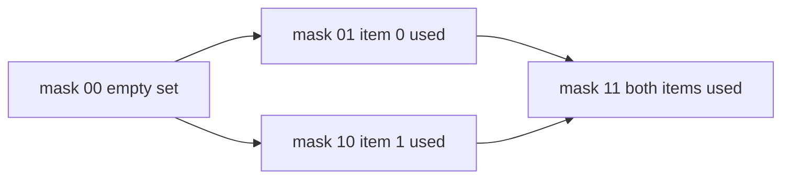
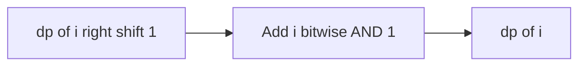

# Lecture 2 — Bitmasks, Subset Enumeration, and Bit DP

> **Duration:** ~2 hours.
> **Outcome:** You can represent a subset of `n` items as an `n`-bit integer, enumerate every subset by counting `0 .. 2**n - 1` (Subsets, LC 78), iterate the submasks of a mask, recognize when a problem is bitmask DP (state = subset) at the interview level, and apply the Counting Bits recurrence `dp[i] = dp[i >> 1] + (i & 1)` (LC 338) with a full worked FRAME.

Lecture 1 used bits as *values* — folding, isolating, counting. This lecture uses bits as a *set*: each bit is a membership flag for one of `n` items. That single reframing — "an `n`-bit integer is a subset of `{0, …, n-1}`" — unlocks subset enumeration, submask iteration, and the recognition-grade view of bitmask DP. We close with Counting Bits, the cleanest bit-DP recurrence in the canon.

---

## 1. A bitmask is a set

Fix a universe of `n` items, labeled `0 .. n-1`. An integer `mask` in the range `0 .. 2**n - 1` represents the subset `{ i : bit i of mask is set }`.

```
n = 4, universe = {0, 1, 2, 3}

mask = 0b0000 = 0   ->  {}            (empty set)
mask = 0b0001 = 1   ->  {0}
mask = 0b0101 = 5   ->  {0, 2}
mask = 0b1111 = 15  ->  {0, 1, 2, 3} (full set)
```

The set operations become bit operations, and this dictionary is worth memorizing:

| Set operation | Bit operation |
|---------------|---------------|
| `i in S` | `(mask >> i) & 1` |
| `S ∪ {i}` (add `i`) | `mask \| (1 << i)` |
| `S \ {i}` (remove `i`) | `mask & ~(1 << i)` |
| `S₁ ∪ S₂` (union) | `mask1 \| mask2` |
| `S₁ ∩ S₂` (intersection) | `mask1 & mask2` |
| `S₁ ⊆ S₂` (subset test) | `(mask1 & mask2) == mask1` |
| `\|S\|` (cardinality) | `mask.bit_count()` |
| complement (in universe of `n`) | `mask ^ ((1 << n) - 1)` |

Notice these are exactly the single-bit operations from Lecture 1 §3, reinterpreted. The bitmask is not a new tool; it is a new *reading* of the tool you already have. `(1 << n) - 1` is the all-ones mask of width `n` — the full set — and it recurs constantly.

---

## 2. Subset enumeration — counting to 2^n (Subsets, LC 78)

To enumerate every subset of `n` items, count an integer `mask` from `0` to `2**n - 1`. There are exactly `2**n` integers in that range, one per subset. For each `mask`, read off which bits are set to recover the subset.

This is the bitmask solution to Subsets (LC 78): given a list of `n` distinct integers, return all `2**n` subsets.

```python
from typing import List


def subsets_bitmask(nums: List[int]) -> List[List[int]]:
    """Generate the power set by reading each mask in 0..2^n - 1 as a membership set.

    Time O(n * 2^n) — 2^n masks, O(n) to decode each. Space O(n * 2^n) for the output.
    """
    n = len(nums)
    result: List[List[int]] = []
    for mask in range(1 << n):          # 0 .. 2^n - 1
        subset = [nums[i] for i in range(n) if (mask >> i) & 1]
        result.append(subset)
    return result
```

Trace `nums = [1, 2, 3]` (`n = 3`, so masks `0..7`):

```
mask 0 = 000 -> []
mask 1 = 001 -> [1]
mask 2 = 010 -> [2]
mask 3 = 011 -> [1, 2]
mask 4 = 100 -> [3]
mask 5 = 101 -> [1, 3]
mask 6 = 110 -> [2, 3]
mask 7 = 111 -> [1, 2, 3]
```

Eight subsets, as expected. The bitmask form is the iterative sibling of the Week 12 backtracking form; both are correct, and naming both — "backtracking is the general template; the bitmask is the slick `O(n · 2**n)` form when `n` is small (`n ≤ 20` or so, because `2**20` is a million)" — is the senior signal. The `n ≤ 20` ceiling is the recognition cue that bitmask enumeration is *on the table* at all.

> **The 30-second Research-constraints memo for a bitmask-enumeration problem:**
> *"`n` is small — at most about 20 — and the problem asks me to consider every subset / assignment / combination of `n` items. So I represent each subset as an `n`-bit integer and loop `mask` over `range(1 << n)`. Bit `i` of `mask` means item `i` is included. Time `O(n · 2**n)`, space for the output. The recursion / backtracking form is equivalent; the bitmask form is the tight iterative one when `n` is small."*

---

## 3. Iterating submasks of a mask

A step up from "all subsets of the universe" is "all subsets of a *given* subset." Given a mask `m`, you sometimes need every `sub` such that `sub ⊆ m` (every submask). The idiom:

```python
def iter_submasks(m: int):
    """Yield every submask of m, including m and 0. Total work O(2^popcount(m))."""
    sub = m
    while sub:
        yield sub
        sub = (sub - 1) & m   # the trick: step to the next-lower submask
    yield 0                    # don't forget the empty submask
```

The `(sub - 1) & m` step is the incantation: subtracting one "borrows" through the low zero bits, and AND-ing with `m` keeps only the bits that are actually in `m`, so it walks down through exactly the submasks. The total work across all masks `m` of an `n`-bit universe is `O(3**n)`, not `O(4**n)` — the classic "sum over masks of 2^popcount" identity. You will not implement this cold in most interviews; recognize it as the engine of "subset-sum-over-subsets" and bitmask DP transitions, and move on.

---

## 4. Bitmask DP — the recognition-grade view

Bitmask DP is dynamic programming where the **state is a subset**, encoded as a bitmask. The canonical shape: `dp[mask]` is the best answer for "having already handled exactly the items in `mask`," and a transition adds one more item — `dp[mask | (1 << i)]` is computed from `dp[mask]` for each `i` not yet in `mask`.


*Bitmask DP state space for two items: each subset is a state, transitions add one unused item.*

Two problems are the canonical homes:

- **Travelling Salesman (TSP), small `n`.** `dp[mask][last]` = the shortest path that visits exactly the cities in `mask` and ends at city `last`. Transition: extend to an unvisited city. Time `O(2**n · n**2)`. Feasible for `n ≤ ~18`.
- **Assignment problems.** Assign `n` tasks to `n` workers minimizing cost; `dp[mask]` = min cost to assign the first `popcount(mask)` workers to the task-set `mask`. Time `O(2**n · n)`.

Here is the honest interview register, and you should internalize it precisely: **bitmask DP is recognition-grade, not implementation-grade, at the entry and mid levels.** You are expected to *recognize* that "n is small (≤ ~20), and the natural state is which subset of items I have already used" points at bitmask DP, and to *name* TSP or assignment as the archetype. You are **not** expected to write a correct TSP bitmask DP cold under a 45-minute clock unless you are interviewing at an algorithms-heavy team — and if you are, you will have drilled it specifically. Do not pretend otherwise. The recognition is the deliverable; the full implementation is a Phase-4 stretch you reach for from the Competitive Programmer's Handbook, not something you bluff. Saying "this is a bitmask DP — state is the visited subset, transition adds one element; for these constraints (`n = 15`) it is `O(2**n · n**2)`, which is about `7 million`, feasible — but I'd want to be careful with the transition and I'd budget the full implementation time accordingly" is a *strong* answer. Bluffing a buggy TSP is a weak one.

---

## 5. Worked FRAME — Counting Bits (LC 338)

Counting Bits is the cleanest bit-DP recurrence in the interview canon, and it is Exercise 2. Full method.

### Problem statement

Given an integer `n`, return an array `ans` of length `n + 1` such that for each `i` (`0 <= i <= n`), `ans[i]` is the number of `1` bits in the binary representation of `i`.

**Constraints:** `0 <= n <= 10**5`.

**Examples:** `n = 2` → `[0, 1, 1]` (0→0b0, 1→0b1, 2→0b10). `n = 5` → `[0, 1, 1, 2, 1, 2]`.

**Follow-up:** can you do it in a single pass, in `O(n)` time, without using a built-in popcount per element?

### Frame

For each integer from `0` to `n`, count its set bits and store the count at that index.

Hand-walk: `n = 5` → `[0, 1, 1, 2, 1, 2]`. Notice `ans[4] = ans[2] = 1` (4 is 2 shifted left), and `ans[5] = ans[2] + 1 = 2` (5 is 2 shifted left, plus a low bit).

### Research constraints

The naive answer calls a popcount per element: `[i.bit_count() for i in range(n + 1)]`, which is `O(n log n)` (each popcount is `O(log i)`). The follow-up asks for `O(n)` total — which means each `ans[i]` must be `O(1)` given the answers we have already computed. That phrasing — "build each answer from a smaller one in `O(1)`" — is the DP tell.

So the shape is bit DP. The recurrence `dp[i] = dp[i >> 1] + (i & 1)`: right-shifting `i` by one drops the lowest bit, leaving `i // 2`, whose popcount we already computed at the smaller index `i >> 1`; then `i & 1` adds back the bit we just dropped (1 if `i` was odd, 0 if even). So `popcount(i) == popcount(i // 2) + (i mod 2)`. State is the integer `i`; the subproblem is the strictly smaller `i >> 1`; the transition is `O(1)`.


*The Counting Bits recurrence builds each answer from one smaller already-computed subproblem.*

> **The 30-second Research-constraints memo (bit DP):**
> *"This is bit DP — I build `dp[i]` from a strictly smaller, already-computed subproblem in `O(1)`. The recurrence is `dp[i] = dp[i >> 1] + (i & 1)`: right-shift drops the low bit (so `i >> 1` is `i // 2`, whose count I have), and `i & 1` adds the dropped bit back. One forward pass, `O(n)` time, `O(n)` output. The naive per-element popcount is `O(n log n); this is the `O(n)` answer the follow-up wants."*

### Assess options

1. Allocate `dp = [0] * (n + 1)`; `dp[0] = 0` is correct by initialization (zero has zero set bits).
2. For `i` from `1` to `n`: `dp[i] = dp[i >> 1] + (i & 1)`. The dependency `i >> 1 < i` is always satisfied, so the value is ready when needed.
3. Return `dp`.

### Make the solution

```python
from typing import List


def count_bits(n: int) -> List[int]:
    """Return [popcount(0), popcount(1), ..., popcount(n)] in O(n) time.

    Recurrence: dp[i] = dp[i >> 1] + (i & 1).
      i >> 1 strips the low bit (== i // 2), whose count is already known;
      i & 1 adds back the bit just dropped.
    """
    dp = [0] * (n + 1)
    for i in range(1, n + 1):
        dp[i] = dp[i >> 1] + (i & 1)
    return dp
```

There is a second valid recurrence worth naming: `dp[i] = dp[i & (i - 1)] + 1`, which uses Lecture 1's "clear the lowest set bit" idiom — `i & (i - 1)` is `i` with one set bit removed, so its count is one less. Both are `O(n)`; the `i >> 1` form is the one most people reach for first.

### Examine (verify)

Trace `n = 5`:

```
dp = [0, 0, 0, 0, 0, 0]
i=1: dp[0] + (1&1) = 0 + 1 = 1   -> [0,1,0,0,0,0]
i=2: dp[1] + (2&1) = 1 + 0 = 1   -> [0,1,1,0,0,0]
i=3: dp[1] + (3&1) = 1 + 1 = 2   -> [0,1,1,2,0,0]
i=4: dp[2] + (4&1) = 1 + 0 = 1   -> [0,1,1,2,1,0]
i=5: dp[2] + (5&1) = 1 + 1 = 2   -> [0,1,1,2,1,2]   ✓
```

Edge case `n = 0`: the loop does not run; `dp = [0]` ✓.

### Examine (cost)

- **Time:** `O(n)` — one pass, `O(1)` per index. The dependency `dp[i >> 1]` is always a previously-filled cell.
- **Space:** `O(n)` for the output array, which is required (the problem returns `n + 1` values). No auxiliary state beyond the output.
- **Trade vs naive popcount:** `[i.bit_count() for i in range(n + 1)]` is correct but `O(n log n)`; the DP recurrence is the `O(n)` answer the follow-up demands. Naming both — "the one-liner is correct but `O(n log n)`; the recurrence makes it `O(n)`" — is the move.

---

## 6. A second bit-DP flavor — Bitwise AND of Numbers Range (LC 201)

Not strictly DP, but it lives in the same "look at the bits structurally" register and is homework problem 4. Given `[left, right]`, return the bitwise AND of every integer in the inclusive range. The insight: the AND of a range equals the **common binary prefix** of `left` and `right`, with all lower bits zeroed — because somewhere in the range a bit flips, and once it flips, the AND of that column is zero. Shift both numbers right until they are equal (that equal value is the common prefix), counting shifts, then shift back.

```python
def range_bitwise_and(left: int, right: int) -> int:
    """AND of all integers in [left, right] == common prefix of left and right, padded with zeros."""
    shift = 0
    while left < right:
        left >>= 1
        right >>= 1
        shift += 1
    return left << shift
```

This is the "think about what the bits *have to* do across the range" muscle. It is a recognition rep, not a fold or a mask; we flag it here so you have seen the framing before the homework.

---

## 7. Self-check

Without notes, answer:

1. **How do you enumerate every subset of `n` items?** (Loop `mask` over `range(1 << n)`; bit `i` of `mask` means item `i` is in the subset.)
2. **What is `(1 << n) - 1`, and why does it recur?** (The all-ones mask of width `n` — the full set / universe.)
3. **State the Counting Bits recurrence and explain each term.** (`dp[i] = dp[i >> 1] + (i & 1)`: `i >> 1` strips the low bit so its count is already known; `i & 1` adds the dropped bit back.)
4. **What is the recognition cue that bitmask enumeration is on the table?** (`n` is small — roughly `n ≤ 20`, because `2**20` is about a million.)
5. **What is the honest interview register of bitmask DP?** (Recognition-grade: recognize "state is which subset I've used," name TSP / assignment as archetypes; full implementation is a Phase-4 stretch, not an interview-cold expectation.)
6. **What does `(sub - 1) & m` do in submask iteration?** (Steps to the next-lower submask of `m`.)

If you can answer all six, the bitmask and bit-DP families are recognition-ready. Next we close the loop: Mock #3, and the tries review that bridges bits to the binary trie.

---

*Next:* [Lecture 3 — The Mock Interview Protocol (Mock #3) and Tries Review](./03-the-mock-interview-protocol-mock-3-and-tries-review.md).
