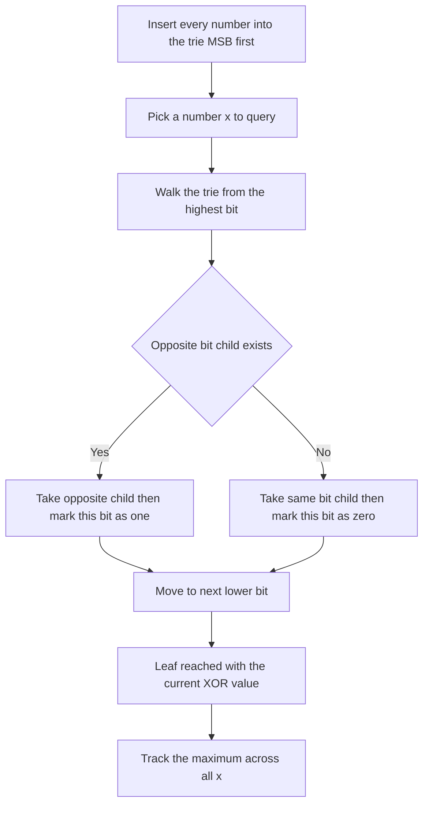

# Lecture 3 — The Mock Interview Protocol (Mock #3) and Tries Review

> **Duration:** ~2 hours.
> **Outcome:** You can set up Mock #3 under near-real conditions — video on, a hard 45-minute clock, no peeking — run it on an unseen Medium, record it, watch it back twice (1.5× then 1.0×), and write a self-feedback note that names exactly one behavior change versus Mock #1 and Mock #2. You can also re-derive the Week 9 trie templates and build the binary trie that solves the pairing register — the bridge between this week's two topics.

This is the third recorded mock in C2. Mock #1 (Week 4) was your first time in front of a camera, solo-mode acceptable. Mock #2 (Week 9) raised the bar — a peer or platform partner, a real unseen problem. Mock #3 raises it again: **near-real conditions**. The simulation is now close enough to a real screen that the only difference an interviewer would notice is that it is not for a job. The protocol below is the closest you have come to the real thing.

The tries review in the second half is deliberate and short — we are not re-teaching the trie, we are re-activating it, because the **binary trie** is the single structure that bridges bit manipulation to tries.

---

## 1. Mock #3 is near-real — what changes from Mock #2

Three constraints tighten:

- **Video on, non-negotiable.** Screen + face + audio, all three. In Mock #1 the face track was optional; by Mock #3 it is required. Interviewers read your face — the moment of recognition, the flicker of doubt, the recovery. You need to see yours.
- **A hard 45-minute clock, no extensions.** When the timer hits zero, you stop mid-line. No "let me just finish this function." Real interviews end on the clock; train for it.
- **No peeking — at anything.** No practice site open. No notes. No re-reading the lecture. No "quick glance at the trie template." If you cannot recall the binary-trie shape from memory, that is *data* — narrate the gap and code what you remember. Peeking converts a diagnostic into theater.

The reason the constraints tighten is that Mock #3 is the first **full-loop simulation**. A real onsite is not one 45-minute coding round; it is three or four, plus the behavioral round from Week 13. Mock #3 is where the coding round and the behavioral preparation meet under one clock for the first time — see §8 on the optional behavioral add-on.

---

## 2. The three flavors (recap from Week 4) — and why solo is now last resort

Same three flavors as Mock #1, in descending fidelity:

### Flavor A — Peer-to-peer (highest fidelity)

You and another C2 learner interview each other. One is the interviewer, one the candidate; then swap. 90 minutes total (45 each direction, plus a 10-minute buffer). Cameras on, screen-share required. Coding in CoderPad, VS Code Live Share, or a shared editor — **not** your personal IDE. The interviewer picks an unseen Medium and gives at most one small hint after 5 minutes of being stuck.

### Flavor B — Platform (medium fidelity)

**interviewing.io** (<https://interviewing.io/blog>) or Pramp matches you with a stranger. The platform enforces the environment and the clock. Run your own recording on the side. Highest realism for the "stranger judging me" pressure, at the cost of scheduling friction.

### Flavor C — Solo (last resort by Mock #3)

By Mock #3, solo is the *fallback*, not the default. If you have run two prior mocks and cannot find a partner for the third, solo is acceptable — but the bar is higher: camera on, recorder running, treat the lens as the interviewer, narrate everything, and absolutely no peeking. Use a random unseen medium problem — a random-problem button on whatever archive you use, or the fallback problem in Challenge 1. If you have a partner available and choose solo anyway, you are leaving the most valuable rep on the table.

---

## 3. The 45-minute time allocation

The clock starts when the prompt is read. Recommended allocation — the same shape you have practiced since Week 4, now reflexive:

| Phase | Wall-clock | What's happening |
|------:|:----------:|------------------|
| 0:00 – 0:03 | 3 min | **F.** Read aloud. Restate. Ask one or two clarifying questions. Walk one example. |
| 0:03 – 0:05 | 2 min | **R.** Name the limits and the pattern. Deliver the 30-second pattern-recognition memo. |
| 0:05 – 0:10 | 5 min | **A.** Sketch the approach. Data structures, loop shape, complexity target. |
| 0:10 – 0:25 | 15 min | **M.** Write the code. Narrate each line. Narrate the pauses. |
| 0:25 – 0:35 | 10 min | **E · verify.** Trace on at least two examples. Find at least one bug. |
| 0:35 – 0:43 | 8 min | **E · cost.** Time and space. Trade-offs. One variant. |
| 0:43 – 0:45 | 2 min | Wrap-up. Summarize. Thank the interviewer. |

These are guidelines, not rules. If a bit problem's Research constraints step is instant (you recognize the XOR fold in 10 seconds), bank the saved time in Examine (verify). The structure is the discipline; the literal minutes flex.

---

## 4. What "good" sounds like

The three speech tells we have built since Week 4, now with a bit-manipulation flavor:

### Tell 1 — the Research-constraints memo, clean in 30 seconds

> *"Every element appears twice except one, and the constraint says constant extra space — so this is an XOR fold. I reduce the array by `^`: pairs cancel because `a ^ a == 0`, the lone element survives because `a ^ 0 == a`, and order doesn't matter because XOR is commutative and associative. Time `O(n)`, space `O(1)`. The hash-map answer is `O(n)` space, which the constant-space hint is steering me away from."*

### Tell 2 — narrating the pause

> *"Hold on — for the binary trie I want to be sure I'm inserting MSB-first, not LSB-first."* [3-second pause] *"Yes, MSB-first, because the greedy walk has to commit the high-value bits before the low ones to maximize the XOR."*

### Tell 3 — the recovery move

> *"Wait — my XOR fold returns `a ^ b` here, not a single value, because there are *two* singletons, not one. That's the odd tally, not the relay fold. I need to partition on a differing bit. Let me back up and isolate the lowest set bit of `a ^ b`."*

The recovery is a *strength* signal, not a weakness. Interviewers grade it positively. Make it audible.

---

## 5. The post-mock window and the two-pass watching protocol

The protocol is the one you have run twice already; the discipline is what matters now.

**Immediately after the clock stops (5 minutes):** open a file, set a 5-minute timer, free-write what is fresh. What surprised you? What felt automatic? What felt clumsy? Did you deliver the Research-constraints memo cleanly? Did you fall silent? Save as `mocks/mock-03/immediate-notes.md`. Do not grade yet — raw observations only.

**Saturday — two passes:**

- **Pass 1 — 1.5×, the whole recording, timestamp doc open.** Watch all 45 minutes at 1.5× (30 wall-clock minutes). Drop one line per noticeable *pattern* (not every "um"). 10–15 timestamps. Example:

```
04:30  R memo ran 70 seconds — added an unrequested comparison. Too long.
11:00  Built the binary trie MSB-first first try. Good.
19:00  Found the off-by-one in the greedy walk but fixed it silently.
28:00  Skipped stating the O(n·32) bound out loud.
```

- **Pass 2 — 1.0×, only the flagged segments.** For each flagged moment, write *what happened* and *what to do differently*. Observation, then prescription. No moralizing.

> *19:00 — Found the off-by-one in the trie walk but stayed silent during the fix. Next time: say "the child for the opposite bit is missing, so I fall back to the same bit" before changing the code.*

---

## 6. The self-feedback write-up and the trajectory across three mocks

The deliverable goes at `frame-writeups/c2-week-14/mock-03-self-feedback.md`. Same six-section structure as Mock #1 (problem header; what I felt; what the recording shows; the Research-constraints memo graded; thinking-aloud graded; recovery graded; Examine (cost) graded; ONE behavior change; what I'm *not* going to change). Mock #3 adds one section that Mocks #1 and #2 did not have:

> ## Trajectory across Mock #1 → #2 → #3
>
> [Pull the one behavior change you named after Mock #1 and after Mock #2. Did you actually make those changes? Is the Mock #1 weakness gone, improved, or still present? Three or four sentences. This section is the artifact a senior engineer reads to judge whether you can self-correct over time — which is the single most predictive trait of a candidate who will grow on the job.]

### The ONE behavior change rule (still binding)

Pick **one** change. Specific. Testable. "I will state the complexity bound out loud before the interviewer asks" is good. "I will be more confident" is not testable. You will see ten things to fix; fix one. Over three mocks, three deliberate changes compound; ten attempted at once compound to zero.

---

## 7. The six anti-patterns (scan for these in pass 1)

1. **Silent coding** — 30+ seconds of typing with no commentary.
2. **Skipping Research constraints** — Make the solution starts within 2 minutes of Frame; no pattern named.
3. **Coding without assessing options** — the code is rewritten more than once before any successful run.
4. **Not tracing in Examine (verify)** — that step is under 2 minutes; no example walked end-to-end.
5. **Skipping Examine (cost)** — you finish and never state time / space / trade-off.
6. **Defending broken code** — you realize at minute 30 the approach is wrong and keep going anyway.

If pass 1 shows three or more, your Mock #4 (Week 15) plan writes itself: pick the worst one, make it your one behavior change.

---

## 8. Optional — the behavioral add-on (the full-loop simulation)

Mock #3 is the first chance to simulate the *full loop*: a coding round followed by a behavioral round. If you are running Flavor A with a peer, append a 20-minute behavioral round after the 45-minute coding round. The interviewer asks two of the eight behavioral categories from Week 13; you answer from your story bank in STAR. Record it. This is optional for Mock #3 and *required* for Mock #4 in Week 15 — but doing it now, once, with low stakes, is how you discover whether the story bank holds up under the same clock as the coding round. The candidates who freeze in behavioral rounds are the ones who never rehearsed them under pressure. Rehearse one here.

---

## 9. Tries review — re-activating the Week 9 templates

Now the second half. You built two trie forms in Week 9. Re-derive both from memory before reading on; if you cannot, that is the gap to close before Mock #3.

### The dict-of-dict form (idiomatic Python)

```python
from typing import Any, Dict

END = "$"   # terminal sentinel — any char outside the alphabet

def insert(root: Dict[str, Any], word: str) -> None:
    node = root
    for ch in word:
        node = node.setdefault(ch, {})
    node[END] = True
```

### The `TrieNode` class form (typed, metadata-friendly)

```python
from typing import Dict, Optional

class TrieNode:
    def __init__(self) -> None:
        self.children: Dict[str, "TrieNode"] = {}
        self.is_end: bool = False
```

The dict-of-dict form is the slick Python answer; the class form is preferred when you attach per-node metadata. Both insert / search in `O(L)` where `L` is the key length. That is the whole Week 9 review — three operations, one invariant, two forms. If this was effortless, you own the template.

---

## 10. The binary trie — the bridge from tries to bits

Here is where the week's two topics meet. A **binary trie** is a trie whose alphabet is exactly two characters: `0` and `1`. We insert each integer as a fixed-width path of its bits, **most-significant bit first**. With a 2-character alphabet the trie is a binary tree where left means "bit 0" and right means "bit 1."

Why MSB-first? Because the high-value bits dominate the magnitude of any XOR. To *maximize* `a ^ b`, you want the highest bits of the result to be `1` — and you commit to the high bits before the low ones. MSB-first insertion lets a greedy top-down walk make exactly that commitment.

This is the structure behind the **largest-XOR pairing** — the mini-project's second half, and the bridge problem of the week.

### The largest-XOR pairing

Given an integer array `nums`, return the maximum value of `nums[i] ^ nums[j]` over all pairs `i, j`.

The brute force is `O(n**2)` — every pair. The binary-trie solution is `O(n · W)` where `W` is the bit width (we use 32). Insert every number into the binary trie. Then for each number `x`, walk the trie from the MSB: at each bit, *prefer the child for the opposite bit* (because `bit ^ opposite_bit == 1` contributes to the XOR), falling back to the same-bit child if the opposite is absent. The path you walk spells out the number that maximizes `x ^ (that number)`; accumulate the XOR as you go.


*The greedy walk down the binary trie that finds the partner maximizing XOR with x.*

```python
from typing import Any, Dict, List

HIGH_BIT = 31   # 32-bit non-negative integers: bits 31..0

def find_maximum_xor(nums: List[int]) -> int:
    """Maximum nums[i] ^ nums[j] via a binary trie. Time O(n * 32), space O(n * 32)."""
    root: Dict[int, Any] = {}

    # Insert every number MSB-first as a 32-bit path.
    for num in nums:
        node = root
        for bit_pos in range(HIGH_BIT, -1, -1):
            bit = (num >> bit_pos) & 1
            node = node.setdefault(bit, {})

    best = 0
    # For each number, greedily walk choosing the opposite bit when possible.
    for num in nums:
        node = root
        current = 0
        for bit_pos in range(HIGH_BIT, -1, -1):
            bit = (num >> bit_pos) & 1
            want = 1 - bit                 # the opposite bit maximizes this position
            if want in node:
                current |= (1 << bit_pos)  # we got a differing bit -> contributes 1
                node = node[want]
            else:
                node = node[bit]           # forced to take the same bit -> contributes 0
        best = max(best, current)
    return best
```

Trace the idea on `values = [3, 10, 5, 25, 2, 8]`, where the answer is `28 = 5 ^ 25`: the greedy walk for `5 = 0b00101`, at each high bit, reaches for the opposite of `25 = 0b11001`'s bits where available, and the trie — having `25` in it — lets the walk pick the differing bits that build `0b11100 = 28`. The full 32-bit trace is long; the *shape* is what matters: MSB-first insertion, opposite-bit greedy walk, accumulate the XOR.

That is the bridge. Bit manipulation gives you the MSB-first bit extraction; the trie gives you the structure to find the best partner in `O(W)` per query instead of `O(n)`. Owning this one structure is the highest-yield artifact of the week — it is why Exercise 3 and the mini-project both center on it.

---

## 11. Self-check

Without notes, answer:

**1.** What three constraints make Mock #3 "near-real"?

<details>
<summary>Answer</summary>

Video on; hard 45-minute clock; no peeking at anything.

</details>

**2.** What is the two-pass watching protocol?

<details>
<summary>Answer</summary>

Pass 1: full recording at 1.5× with timestamps. Pass 2: only flagged segments at 1.0× with prescriptions.

</details>

**3.** What section does the Mock #3 self-feedback add that Mocks #1 and #2 did not?

<details>
<summary>Answer</summary>

The trajectory across Mock #1 → #2 → #3 — did you make the prior behavior changes?

</details>

**4.** Name three of the six anti-patterns.

<details>
<summary>Answer</summary>

Silent coding; skipping Research constraints; coding without assessing options; not tracing in Examine (verify); skipping Examine (cost); defending broken code.

</details>

**5.** Why is a binary trie inserted MSB-first?

<details>
<summary>Answer</summary>

The high bits dominate the XOR magnitude; the greedy walk must commit high bits before low ones to maximize the result.

</details>

**6.** What is the greedy rule when walking the binary trie for the pairing register?

<details>
<summary>Answer</summary>

At each bit, prefer the child for the *opposite* bit — it contributes a 1 to that position of the XOR — falling back to the same-bit child if the opposite is absent.

</details>

If you can answer all six, you are ready to run Mock #3 and to build the binary trie from memory. Set the rig up Thursday; run the mock Friday; watch Saturday; write the self-feedback Sunday.

---

## Further reading

- **interviewing.io's free blog**: <https://interviewing.io/blog> — the "lessons from thousands of mock interviews" posts are gold. Read two before Friday.
- **Sean Eron Anderson's "Bit Twiddling Hacks"**: <https://graphics.stanford.edu/~seander/bithacks.html> — the "Compute the lowest set bit" and bit-reversal sections directly support the binary-trie bit extraction.

Next: [exercises/README.md](../exercises/README.md) to start the three bit exercises, or [challenges/challenge-01-mock-3-timed-round.md](../challenges/challenge-01-mock-3-timed-round.md) to scope Mock #3.
