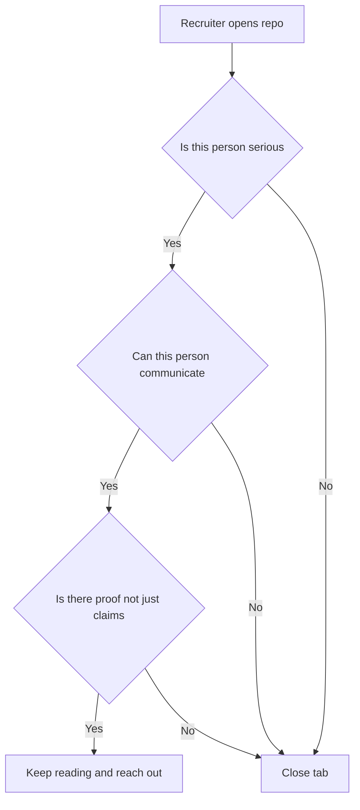

# Lecture 1 — The Capstone and Portfolio Polish

> **Duration:** ~2 hours.
> **Outcome:** You understand what makes an interview-prep portfolio repo that converts a recruiter, and you can polish yours to that bar — a README cover that earns the next ninety seconds, a progress dashboard that surfaces 60+ write-ups and four mocks at a glance, a commit history that reads as months of evidence, and a six-point quality bar that no individual write-up falls below. You can audit your own write-ups against that bar and fix the weak ones.

This is the first lecture of the last week. There is no new algorithm here. The skill this lecture trains is *assembling* — taking fifteen weeks of work and turning it into a single public artifact that a stranger can land on and, in ninety seconds, decide you are worth talking to.

The portfolio repo is not new. You created it in Week 1 — the `crunchtime-interview-prep-<yourhandle>` repo where you pushed five FRAME write-ups for array problems. Every week since, the mini-project, the exercises, and the homework have fed it: hash-map write-ups in Week 2, sliding-window in Week 3, the first mock in Week 4, and so on through bit manipulation and Mock #3 in Week 14. By now it holds roughly fifty write-ups, three mocks, a behavioral story bank, and a URL-shortener design draft. This week you bring it over sixty write-ups, add the fourth mock, polish the cover, and publish it as the capstone. This lecture is about the polish.

---

## 1. What a recruiter actually does with your repo

Be honest about the audience. A technical recruiter or a hiring manager who clicks your GitHub link is not going to read sixty problem write-ups. They give the repo **ninety seconds** before they decide whether to keep scrolling or close the tab. In those ninety seconds they are answering three questions:

1. **Is this person serious?** Sustained, deliberate effort over months — not a weekend dump of fifty files all committed on the same day.
2. **Can this person communicate?** A write-up is a tiny sample of how the candidate explains a technical decision. If the README and the top write-ups are clear, the recruiter infers the candidate is clear.
3. **Is there proof, not just claims?** A line that says "comfortable with dynamic programming" is a claim. A folder of twelve DP write-ups with complexity derivations and a recorded mock where the candidate solves a DP problem out loud is proof.

The whole polish job is engineering those ninety seconds. Everything below — the cover, the dashboard, the commit history, the quality bar — exists to make the first ninety seconds answer all three questions with "yes."


*The three yes-or-no questions a recruiter answers in the first ninety seconds.*

A note on what *not* to do: do not make the repo a wall of text. Do not bury the mocks. Do not commit fifty write-ups in a single "initial commit." Do not leave a half-finished Examine section in the write-up a recruiter happens to open first. The repo is a sample of your judgment; a sloppy repo is a sample of sloppy judgment.

---

## 2. The README cover — the 90-second sell

The repo's `README.md` is the cover of the book. It is the only file you can be sure a recruiter sees. It must do five things, in this order, above the fold:

1. **A one-line pitch.** Who you are and what the repo is. Example: *"Interview-prep portfolio: 62 algorithm problems solved in the FRAME framework, 4 recorded mock interviews, a system-design write-up, and a behavioral story bank. Built over 15 weeks of deliberate practice."*
2. **A progress dashboard.** A small table or badge row that surfaces the headline numbers — write-up count, patterns covered, mocks recorded — so the recruiter does not have to count.
3. **A pattern × write-up index.** A table mapping each of the fourteen patterns to the write-ups that demonstrate it, with links. This is the "can this person communicate / is there proof" answer, made scannable.
4. **The four mocks, linked.** A small section linking the four mock self-feedback notes, ideally with the one-line trajectory across them. This is the highest-signal content; do not bury it.
5. **A "how to read this repo" line.** One sentence telling the visitor where to start — e.g., *"Start with `frame-writeups/01-widest-ballast-pair.md` for the format, or `mocks/mock-04-week-15.md` to see me solve a problem out loud."*

Here is a concrete cover skeleton. Adapt the numbers to your real repo:

```markdown
# CrunchTime Interview Prep — <Your Name>

> 62 algorithm problems in the FRAME framework · 4 recorded mocks ·
> 1 system-design write-up · 12-story behavioral bank · built over 15 weeks.

## Progress

| Metric | Count |
|--------|------:|
| FRAME write-ups | 62 |
| Patterns covered | 14 / 14 |
| Recorded mocks | 4 |
| System-design write-ups | 1 |
| Behavioral stories | 12 |

## Patterns × write-ups

| Pattern | Write-ups |
|---------|-----------|
| Arrays & two pointers | [The Widest Ballast Pair](frame-writeups/01-widest-ballast-pair.md), [The Settlement Trio](frame-writeups/07-settlement-trio.md), … |
| Hash maps | [The Stage Twins](frame-writeups/05-stage-twins.md), … |
| Sliding window | … |
| … | … |
| Bit manipulation | [the relay fold](frame-writeups/58-relay-fold.md), [the paired ribbon swap](frame-writeups/60-paired-ribbon-swap.md) |

## Mocks

- [Mock #1 (Week 4)](mocks/mock-01-week-04.md) — first time on camera
- [Mock #2 (Week 9)](mocks/mock-02-week-09.md) — first unseen problem with a partner
- [Mock #3 (Week 14)](mocks/mock-03-week-14.md) — near-real conditions
- [Mock #4 (Week 15)](mocks/mock-04-week-15.md) — full loop, real conditions + trajectory

## Start here

New here? Read [`frame-writeups/01-widest-ballast-pair.md`](frame-writeups/01-widest-ballast-pair.md)
for the write-up format, or watch [Mock #4](mocks/mock-04-week-15.md) to see me
solve a problem out loud.
```

The cover should fit on one screen. If a recruiter has to scroll to find the mocks, the cover failed.

---

## 3. The progress dashboard — counting for the reader

The dashboard is the small table in §2 step 2. Its job is to do the counting the recruiter would otherwise have to do themselves — and most will not bother. Keep it honest: if you have 57 write-ups, say 57, not "60+." The number does not need to be round; it needs to be true, because a recruiter who spot-checks one claim and finds it inflated stops trusting the rest of the repo.

You can generate the count mechanically so it never drifts from reality:

```bash
# Count the write-ups (one per file under frame-writeups/, excluding READMEs)
find frame-writeups -name "*.md" ! -name "README.md" | wc -l
```

Run that before you publish and put the real number in the dashboard. If you want the dashboard to update itself, a tiny CI job can regenerate the table on each push — but that is a stretch goal, not a requirement. The requirement is: the headline numbers are present, true, and above the fold.

---

## 4. Commit history as evidence

This is the part most candidates miss, and it is the part that separates a portfolio from a dump. **The commit history is months of evidence.** A repo with daily commits from Week 1 to Week 15 tells a recruiter, without a single word, that this person has been deliberate and sustained about interview prep. That is a hiring signal in itself — it is the single most predictive trait of someone who will keep growing on the job.

The anti-pattern is the "initial commit" of fifty files on one day. It says the opposite: this person crammed the portfolio together right before applying. Even if every write-up is excellent, the squashed history undercuts the message.

If you have been committing weekly all along — and you should have been, since the mini-project of every week told you to push by Sunday — your history already tells the right story. Two things to check before publishing:

- **Commit messages are legible.** `add two sum write-up` and `mock-04 self-feedback + trajectory` are good. `update`, `wip`, and `asdf` are not. You do not need to rewrite history; you do need the *recent* messages to be clean, because those are the ones a recruiter sees first.
- **The history is not artificially squashed.** Do not `git rebase` fifteen weeks into one commit to "clean it up." The history *is* the artifact. Leave it.

A simple way to surface the evidence on the cover is a one-line "contribution graph" link — GitHub renders the green-squares calendar on your profile automatically, and a sustained streak across the course period is exactly the signal you want a recruiter to see.

---

## 5. The 60+ write-up quality bar

Sixty write-ups that are each excellent beat a hundred that are uneven. Quantity is the floor (the course spec calls for 60+); quality is what converts. Every write-up in the repo — *every* one, because the recruiter opens a random one, not your best one — must clear this six-point bar:

| # | Bar | What "pass" looks like |
|---|-----|------------------------|
| 1 | **30-second Research-constraints memo at the top** | A bordered block naming the pattern, the discriminating cue, the complexity, and the rejected alternative. |
| 2 | **All five FRAME sections present** | Frame · Research constraints · Assess options · Make the solution · Examine — none skipped, none stubbed. |
| 3 | **Code runs and is tested** | The implementation passes the stated examples; type hints; PEP 8 (<https://peps.python.org/pep-0008/>); idiomatic Python. |
| 4 | **Complexity stated with a derivation** | Not just "O(n)" — *why* O(n): "one pass, one accumulator." The derivation is mandatory. |
| 5 | **At least one variant or trade-off named** | In Examine: a follow-up the interviewer might ask, or the alternative approach and why it loses. |
| 6 | **Trace on at least two inputs** | In Examine: a normal case and an edge case, walked by hand. |

The audit drill (Exercise 1) is where you run every write-up against this bar and fix the failures. The most common failures, in order:

1. **Half-finished Examine.** The write-up trails off after the code; no complexity derivation, no variant. Bar 4 and 5 fail. This is the single most common gap — fixing it is the highest-yield audit work.
2. **Missing Research-constraints memo.** The early write-ups (Weeks 1–2, before the 30-second memo discipline was drilled) often lack the top block. Bar 1 fails. Backfill them.
3. **Untested code.** A write-up where the code was never run against the examples — and sometimes does not even run. Bar 3 fails. Run every snippet.
4. **No edge-case trace.** Examine walks the happy path only. Bar 6 fails. Add the edge case.

---

## 6. The badges — what they certify

The capstone repo ships three badges under `badges/`, as small JSON files. They are not GitHub-issued credentials; they are *self-attestations with an honest definition* — a structured way to claim "I cleared this bar," with the criteria written down so the claim is checkable.

| Badge | Certifies | Earned when |
|-------|-----------|-------------|
| `frame-apprentice` | You can run the FRAME method end-to-end | 20+ write-ups clear the six-point bar; one recorded solve narrating all five steps |
| `pattern-practitioner` | You recognize and apply all fourteen patterns | At least one quality write-up per pattern (14/14 covered); the quiz scored 8+ |
| `crunchtime-graduate` | You completed the C2 capstone | 60+ write-ups, all four mocks, the system-design write-up, the story bank, the recruiter pack, and the personalized plan — all present and public |

Each badge is a JSON file like:

```json
{
  "badge": "crunchtime-graduate",
  "course": "C2 · CrunchTime — The Code",
  "criteria": "60+ FRAME write-ups, 4 recorded mocks, 1 system-design write-up, behavioral story bank, recruiter-prep pack, personalized study plan — all present and public.",
  "earned": "2026-06-21",
  "evidence": "https://github.com/<you>/crunchtime-interview-prep-<you>"
}
```

The integrity rule: **only claim a badge you actually earned.** A `crunchtime-graduate` badge on a repo with forty write-ups and two mocks is a lie a recruiter can catch in ninety seconds, and it poisons the trust on everything else. The criteria are written into the JSON precisely so the claim is verifiable. Earn it honestly; it is worth nothing otherwise.

---

## 7. Making the repo scannable in 90 seconds

Scannability is the through-line. Run this checklist against your repo as if you were the recruiter:

- [ ] The README cover fits on one screen and answers "is this person serious / can they communicate / is there proof."
- [ ] The progress dashboard gives the headline numbers without me counting.
- [ ] The pattern × write-up index lets me jump to any pattern in one click.
- [ ] The four mocks are linked above the fold, not buried in a folder I have to find.
- [ ] A "start here" line tells me where to begin.
- [ ] The first write-up I open at random clears the six-point quality bar.
- [ ] The folder structure matches the capstone tree (`frame-writeups/`, `mocks/`, `system-design/`, `behavioral/`, `recruiter-prep/`, `study-plan/`, `badges/`) so I can predict where things are.
- [ ] The commit history shows sustained effort, not a one-day dump.

If any box is unchecked, the polish is not done. The single highest-leverage test is the one in the stretch goals: screen-record yourself walking the repo out loud in 90 seconds as if presenting to a recruiter. If you cannot make it compelling in 90 seconds, the cover is not doing its job — go back to §2.

---

## 8. The audit workflow

Here is the concrete loop for Exercise 1, so you spend the polish hours efficiently rather than re-reading every write-up cover to cover:

1. **List every write-up.** `find frame-writeups -name "*.md" ! -name "README.md"`. Put them in a checklist.
2. **Triage by week, oldest first.** The Week 1–3 write-ups are the most likely to fail bars 1, 4, and 6 — the 30-second memo and the complexity-derivation disciplines were not yet drilled. Audit those first; they are where the failures cluster.
3. **For each, run the six-point bar.** Mark pass/fail per bar. A 30-second scan per write-up is enough to spot the failures — you are not re-reading, you are checking for presence.
4. **Fix the failures in order of frequency.** Backfill missing Research-constraints memos and complexity derivations first (bars 1 and 4) — they are quick and they cluster. Then run any untested code (bar 3). Then add missing edge-case traces (bar 6).
5. **Re-count.** After the audit, the dashboard count is the number of write-ups that *pass* the bar. If you started with 50 and 8 failed and you fixed all 8, you have 50 passing — then write the 10+ new ones the week's exercises and homework produce to clear 60.

The audit is not glamorous, but it is the work that turns "fifty files" into "a portfolio." A recruiter who opens a random write-up and finds it complete trusts the other fifty-nine. A recruiter who opens a random write-up and finds a half-finished Examine distrusts the lot.

---

## 9. Self-check

Without notes, answer:

**1.** How long does a recruiter give your repo before deciding to keep scrolling?

<details>
<summary>Answer</summary>

About ninety seconds.

</details>

**2.** What three questions is the recruiter answering in those ninety seconds?

<details>
<summary>Answer</summary>

Is this person serious; can they communicate; is there proof, not just claims.

</details>

**3.** Name the five things the README cover must do, in order.

<details>
<summary>Answer</summary>

One-line pitch; progress dashboard; pattern × write-up index; the four mocks linked; a "start here" line.

</details>

**4.** Why does commit history matter, and what is the anti-pattern?

<details>
<summary>Answer</summary>

It is months of evidence of sustained, deliberate effort; the anti-pattern is committing fifty files in a single "initial commit," which says the opposite.

</details>

**5.** Name three of the six points in the write-up quality bar.

<details>
<summary>Answer</summary>

30-second Research-constraints memo; all five FRAME sections; code runs and is tested; complexity stated with a derivation; a variant or trade-off named; a trace on two inputs.

</details>

**6.** What is the integrity rule for the badges?

<details>
<summary>Answer</summary>

Only claim a badge you actually earned; the criteria are written into the JSON so the claim is verifiable.

</details>

If you can answer all six, you can polish the portfolio to the capstone bar. Run Exercise 1 (the audit) on Monday; the polish continues across the week and finishes on Sunday's publish.

---

## Further reading

- **Tech Interview Handbook — resume guide**: <https://www.techinterviewhandbook.org/resume/> — the resume half of the recruiter pack; the same "make it scannable, prove every claim" principle applies to the portfolio README.
- **interviewing.io blog**: <https://interviewing.io/blog> — the posts on what interviewers and recruiters actually look for; the portfolio is the asynchronous version of the same signal.
- **The C2 SYLLABUS capstone tree**: [../../SYLLABUS.md](../../../README.md) — the canonical capstone repo structure your portfolio must match.

Next: [lecture-notes/02-mock-4-under-real-conditions-and-the-onsite-loop.md](./02-mock-4-under-real-conditions-and-the-onsite-loop.md) — the final mock and the structure of the real onsite loop.
