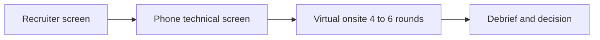
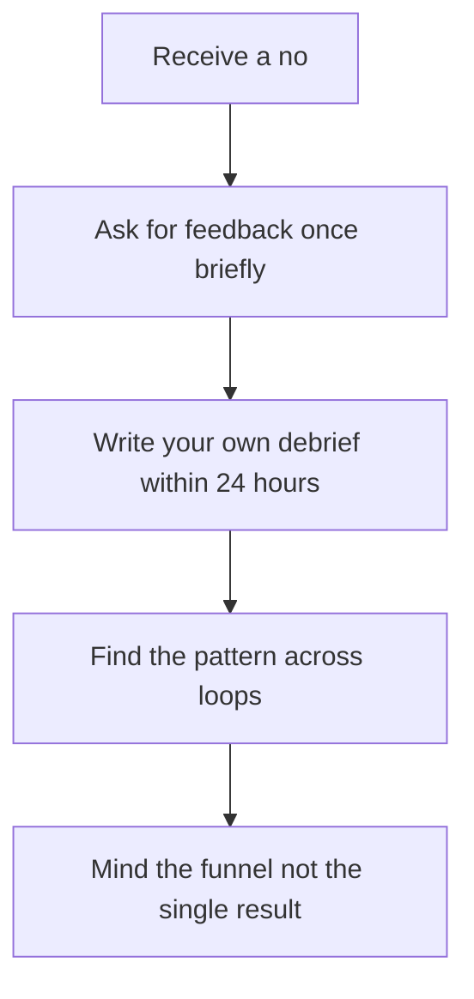

# Lecture 2 — Mock #4 Under Real Conditions and the Onsite Loop

> **Duration:** ~2 hours.
> **Outcome:** You understand the structure of a real onsite loop end-to-end — recruiter screen, phone/technical screen, the 4–6 hour virtual onsite with its coding, system-design, behavioral, and hiring-manager rounds — and how each round is graded. You can set up and run Mock #4 under full real-interview conditions: a stranger interviewer if obtainable, dressed as if real, no notes, a hard stop, the full loop (coding + system design + behavioral), recorded and watched twice. And you can convert a "no" into data.

This is the fourth and final recorded mock in C2, and the last one that is not for a real job. Mock #1 (W4) was your first time on camera. Mock #2 (W9) raised it to a real unseen problem with a partner. Mock #3 (W14) raised it to near-real conditions. Mock #4 closes the gap: **full real conditions**, the full loop, no scaffolding. After this, the next mock is a real interview.

Before you can rehearse the loop, you have to understand it. So this lecture has two halves: the anatomy of a real onsite (§§1–3), then the Mock #4 protocol that rehearses it (§§4–8).

---

## 1. The onsite loop, end to end

A "loop" is the full sequence of interviews for one role. It is not one 45-minute coding round — that is a single round inside it. The full sequence, in order:

| Stage | Who | Length | What it grades |
|-------|-----|--------|----------------|
| **Recruiter screen** | A recruiter (non-technical) | 20–30 min | Logistics, interest, basic fit, salary range, timeline. Not technical. |
| **Phone / technical screen** | An engineer | 45–60 min | One coding problem (Easy/Medium) over a shared editor. The gate to the onsite. |
| **The virtual onsite** | 4–6 engineers, back to back | 4–6 hours | The full evaluation — see §2. |
| **Debrief / decision** | The hiring committee | (internal) | Each interviewer submits a written rubric score; the committee decides. |

You do not see the debrief, but it is worth knowing it exists: every interviewer writes up a structured rubric score, and the committee reads those write-ups, not their memory of you. This is *why* the things this course drills — stating complexity unprompted, naming the pattern out loud, quantifying a behavioral result — matter: they are the things an interviewer can *write down* as evidence. A solve with no narration gives the interviewer nothing to write in your favor.


*The four stages of a full onsite loop, from first recruiter contact to committee decision.*

---

## 2. Inside the virtual onsite — the four round types

The 4–6 hour onsite is a sequence of 45-to-60-minute rounds, usually four to six of them. For a junior / new-grad / early-career loop, the mix is typically:

- **2–3 coding rounds.** Each is one or two problems from the catalog you have trained — arrays, hash maps, sliding window, graphs, DP, the rest. FRAME is the method; the grading is on correctness, communication, and complexity. This is the bulk of the loop and the bulk of your C2 training.
- **1 system-design round** (often abbreviated or "junior-flavored" at the early-career level). A 45-minute design discussion — "design a URL shortener," "design a rate limiter." Graded on whether you can scope requirements, estimate scale, propose a high-level design, and reason about trade-offs. This is what Week 12's design intro and this week's Exercise 2 + Challenge 2 prepare.
- **1 behavioral round.** 30–45 minutes of "tell me about a time…" questions. Graded on the STAR signals from Week 13 — ownership, quantified impact, self-awareness, collaboration, growth.
- **1 hiring-manager chat.** Often the last round. It is behavioral in everything but name — "why this team," "tell me about a hard project," "what are you looking for" — plus your questions for them. The manager is deciding whether they want you on the team and whether you will accept an offer.

The key insight: **a real loop tests all four round types in one day.** A candidate who can invert a binary tree but freezes on system design, or who solves every coding round but rambles in behavioral, does not clear the loop. Mock #4 is the first mock that rehearses the loop as a whole — not just a coding round.

---

## 3. How each round is graded (so you know what the recording should show)

| Round | Top signals | What kills it |
|-------|-------------|---------------|
| Coding | Pattern recognition; clean narration; correct code; complexity stated unprompted; recovery from a wrong turn | Silent coding; no pattern named; broken code defended; no complexity |
| System design | Scoping requirements first; capacity estimation; a clear high-level design; naming trade-offs | Jumping to a database before scoping; no estimation; one design with no alternatives considered |
| Behavioral | STAR structure; quantified result; first-person "I"; self-awareness | Rambling setup; "we did a great job"; no number; no reflection |
| Hiring-manager | Genuine interest; thoughtful questions; a clear "why this team" | Generic answers; no questions for them; treating it as a throwaway |

When you watch the Mock #4 recording, you are grading yourself against exactly this table, round by round.

---

## 4. What changes for Mock #4 — full real conditions

Mock #3 was *near*-real. Mock #4 closes the remaining gap. Five conditions tighten:

- **A stranger interviewer, ideally.** The one variable a peer or solo mock cannot reproduce is the "stranger judging me" pressure. Book a real interviewing.io (<https://interviewing.io/blog>) or Pramp (<https://www.pramp.com/>) session if you possibly can. A stranger who does not know your prep, on a problem you have never seen, is the closest thing to the real screen.
- **Dress as if it were real.** Whatever you would wear to the actual interview, wear it for Mock #4. Set up the rig — camera at eye level, quiet room, water at hand — exactly as you would on the day. The dress and the setup are not theater; they change how you carry yourself, and that is part of what you are rehearsing.
- **No notes. None.** No template file open, no cheat sheet, no practice site. If you cannot recall a pattern's template from memory, narrate the gap and code what you remember. The gap is data.
- **A hard stop.** When each round's timer hits zero, you stop mid-line. Real loops do not give extensions.
- **The full loop, required.** For the first time, the behavioral round and a system-design round are *required*, not optional. Mock #4 is a compressed onsite: a coding round, a system-design round, a behavioral round — back to back. See Challenge 1 for the exact sequence and timings.

The reason the conditions go all the way to full real is that Mock #4 is the dress rehearsal. The next loop after this one is for a job. You want to discover any failure mode now, under low stakes, not on the day.

---

## 5. The Mock #4 time allocation

Mock #4 is a loop, so it has a structure across rounds, and each round has its own internal allocation. The full sequence (Challenge 1 holds the authoritative version):

| Round | Length | Internal shape |
|-------|--------|----------------|
| **Coding** | 45 min | The FRAME allocation you have run since W4 (below). |
| Short break | 5 min | Stand up, reset. Real onsites have gaps between rounds. |
| **System design** | 45 min | Requirements → estimation → high-level design → deep-dive → trade-offs (Challenge 2 framework). |
| Short break | 5 min | Reset again. |
| **Behavioral** | 20 min | 2–3 questions from the eight Week 13 categories, answered in STAR from your bank. |

The coding round's internal allocation — reflexive by now:

| Phase | Wall-clock | What's happening |
|------:|:----------:|------------------|
| 0:00 – 0:03 | 3 min | **U.** Read aloud. Restate. One or two clarifying questions. Walk an example. |
| 0:03 – 0:05 | 2 min | **M.** Name the pattern. The 30-second memo. |
| 0:05 – 0:10 | 5 min | **P.** Sketch the approach, data structures, complexity target. |
| 0:10 – 0:25 | 15 min | **I.** Write the code. Narrate each line. Narrate the pauses. |
| 0:25 – 0:35 | 10 min | **R.** Trace at least two examples. Find at least one bug. |
| 0:35 – 0:43 | 8 min | **E.** Time and space. Trade-offs. One variant. |
| 0:43 – 0:45 | 2 min | Wrap-up. Summarize. Thank the interviewer. |

If you cannot run the full three-round loop in one sitting — scheduling a stranger for all three is hard — the acceptable fallback is the coding round with a stranger (Flavor B) and the system-design + behavioral rounds solo on the same day. The non-negotiable is that all three round types happen.

---

## 6. The two-pass watching protocol (still binding)

The protocol is the one you have run three times. For Mock #4 it applies to *each round*:

**Immediately after the loop (5 minutes per round):** free-write raw observations into `mocks/mock-04/immediate-notes.md`, separated by round. What surprised you? What felt automatic? Where did you fall silent? Do not grade — raw observations only.

**Saturday — two passes:**

- **Pass 1 — 1.5×, the whole recording, timestamp doc open.** Watch all three rounds at 1.5×. Drop one line per noticeable *pattern* (not every "um"). 15–20 timestamps across the loop. Example:

```
CODING 04:30   R memo ran 50 seconds — tighter than Mock #3. Good.
CODING 22:00   Found the off-by-one and narrated the fix out loud. Good — that was Mock #3's behavior change.
DESIGN 06:00   Jumped to "use a database" before scoping requirements. Round-2 anti-pattern.
DESIGN 31:00   Named the hash-vs-counter trade-off unprompted. Good.
BEHAV  03:00   Spent 40 seconds on Situation before getting to Action. Still the W13 trap.
```

- **Pass 2 — 1.0×, only the flagged segments.** For each, write *what happened* and *what to do differently*. Observation, then prescription. No moralizing.

---

## 7. The self-feedback write-up and the trajectory across four mocks

The deliverable goes at `frame-writeups/c2-week-15/mock-04-self-feedback.md`. Same six-section structure as the prior mocks, with a separate grade for each of the three rounds, **plus the closing trajectory section** — and this one spans all four mocks:

> ## Trajectory across Mock #1 → #2 → #3 → #4
>
> [Pull the one behavior change you named after each of Mocks #1, #2, and #3. Did you make them? For each: is that weakness gone, improved, or still present in Mock #4? This is the closing self-correction record — the single most predictive artifact in the portfolio. A senior engineer reads this section to judge whether you can self-correct over time, which is the trait that predicts growth on the job. Be honest: if a Mock #1 weakness is *still* present in Mock #4, name it — that honesty is itself a senior signal, and it goes straight into your personalized study plan as a last-mile drill target.]

Because this is the last mock of the course, the self-feedback also closes with one forward-looking line: the **one weakness you will carry into your real interviews and keep drilling.** That line is the seed of the weakness self-diagnosis in this week's homework — the personalized study plan starts here.

---

## 8. Converting a "no" into data

Mock #4 cannot give you a real "no," but the real loops that follow will, and the skill is worth installing now, because it is the difference between a job search that improves and one that grinds you down.

A rejection is not a verdict on your worth. It is **one data point from one loop, graded by people you will never meet again, against a bar you could not see.** The professional move is to treat it as signal:

1. **Ask for feedback — once, briefly, graciously.** Most companies will not give specifics (legal caution), but some recruiters will tell you the round that went wrong ("the system-design round was light"). If they do, that is gold — it goes straight into your study plan. Ask once; do not push.
2. **Write your own debrief within 24 hours.** While it is fresh: which round felt weak? Did you state complexity? Did you scope the design before diving in? Did the behavioral answers land with a number? Your own honest debrief is more useful than the recruiter's vague one.
3. **Find the pattern across loops.** One "no" is noise. Three "no"s where the system-design round was the weak link is *signal* — it tells you exactly what to drill. The personalized study plan in this week's homework is built to absorb exactly this: a living document you update after every real loop.
4. **Mind the funnel, not the single result.** Lecture 3 covers the funnel math, but the headline is: even strong candidates convert a minority of applications to offers. A "no" is the expected outcome of *most* loops, including for people who get great offers. The metric that matters is the rate over many loops, not the result of any one.


*Turning a rejection into actionable signal for the next loop.*

The candidates who get hired are not the ones who never hear "no." They are the ones who turn each "no" into one specific change and keep going. That is the same self-correction muscle the four mocks have been building — now pointed at the real search.

---

## 9. Self-check

Without notes, answer:

**1.** Name the four stages of a full onsite loop, in order.

<details>
<summary>Answer</summary>

Recruiter screen; phone/technical screen; the virtual onsite; debrief/decision.

</details>

**2.** Name the four round types inside a virtual onsite.

<details>
<summary>Answer</summary>

Coding; system design; behavioral; hiring-manager chat.

</details>

**3.** What five conditions make Mock #4 "full real"?

<details>
<summary>Answer</summary>

Stranger interviewer if obtainable; dress as if real; no notes; a hard stop; the full loop with system-design + behavioral required.

</details>

**4.** What does the Mock #4 trajectory section span that Mock #3's did not?

<details>
<summary>Answer</summary>

All four mocks — #1 → #2 → #3 → #4 — and it closes with the one weakness you carry into real interviews.

</details>

**5.** Why does narrating complexity and naming the pattern out loud matter to the grading?

<details>
<summary>Answer</summary>

Each interviewer writes a structured rubric score; narrated signals are the things they can write down as evidence in your favor.

</details>

**6.** What are the four moves for converting a "no" into data?

<details>
<summary>Answer</summary>

Ask for feedback once graciously; write your own debrief within 24 hours; find the pattern across loops; mind the funnel rate, not the single result.

</details>

If you can answer all six, you are ready to set up Mock #4 and run it as a full loop. Set the rig up Thursday; run the loop Friday; watch Saturday; write the self-feedback and seed the study plan Sunday.

---

## Further reading

- **interviewing.io blog**: <https://interviewing.io/blog> — the "lessons from thousands of mock interviews" posts; read two on the onsite loop before Friday. The platform matches you with a stranger engineer for the Flavor-B Mock #4.
- **Pramp**: <https://www.pramp.com/> — free peer-to-peer mock matching; book 24+ hours ahead for the stranger condition.
- **Tech Interview Handbook**: <https://www.techinterviewhandbook.org/> — the "interview process" and "behavioral" sections describe the loop from the candidate side.

Next: [lecture-notes/03-the-personalized-go-forward-study-plan.md](./03-the-personalized-go-forward-study-plan.md) — diagnosing your weaknesses and building the plan that sustains the practice after the course.
