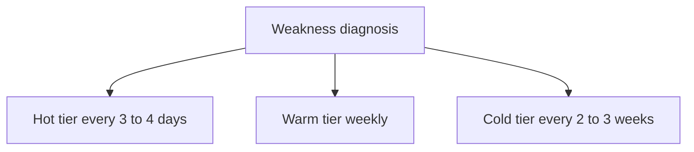
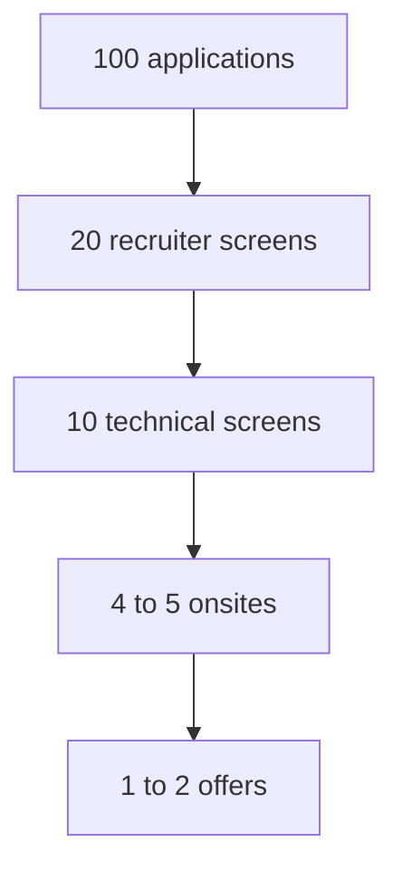

# Lecture 3 — The Personalized Go-Forward Study Plan

> **Duration:** ~2 hours.
> **Outcome:** You can diagnose your weakest patterns from your write-up history and four mock self-feedback notes, build a spaced-repetition schedule that keeps all fourteen patterns warm, set an application cadence grounded in real funnel math, maintain your skills between offers, and assemble the personalized four-week pre-onsite plan. This is the meta-skill of the whole week: sustaining the practice after the course ends.

This is the last lecture of C2. The fourteen-pattern catalog is complete; the portfolio is being polished; Mock #4 is run. What remains is the skill that outlasts the course — *sustaining the practice until the offer lands.* A course ends on a Sunday. A job search runs for weeks or months after. The candidates who succeed are the ones who keep showing up to the practice with a plan, not the ones who cram for fifteen weeks and then drift. This lecture builds that plan. It is the spine of this week's homework, which is the course's explicit deliverable.

---

## 1. The weakness self-diagnosis

You cannot make a plan until you know what to drill. The diagnosis pulls from two sources you already have: your **write-up history** and your **four mock self-feedback notes.**

### Source 1 — the write-up history

Across the fourteen patterns, count how many quality write-ups you have per pattern, and — more importantly — note the *quality* and *struggle* of each. The pattern with the fewest write-ups, or the write-ups that took longest, or the ones where the Match section was thinnest, is a weak pattern. Build a table:

| Pattern | # quality write-ups | Felt fluent? | Notes |
|---------|--------------------:|:------------:|-------|
| Arrays & two pointers | 6 | Yes | reflexive |
| Hash maps | 5 | Yes | reflexive |
| Sliding window | 4 | Mostly | variable-window still slow |
| Fast/slow pointers | 3 | Yes | — |
| Binary search | 4 | No | "search on answer" still hard |
| BFS | 3 | Yes | — |
| DFS / topo sort | 4 | Mostly | iterative DFS shaky |
| Backtracking | 3 | No | pruning logic slow to derive |
| Heaps / top-K | 3 | Yes | — |
| Intervals / greedy | 3 | Mostly | greedy proofs hand-wavy |
| DP 1D | 4 | No | state definition slow |
| DP 2D | 3 | No | weakest — grid transitions |
| Behavioral / STAR | (12 stories) | Mostly | Situation runs long |
| Bit manipulation | 3 | Mostly | XOR fold yes, binary trie shaky |

The "Felt fluent? = No" rows are your **primary drill targets.** In the example above: binary search (search-on-answer), backtracking (pruning), DP 1D and 2D (the weakest cluster).

### Source 2 — the four mock self-feedback notes

Each mock named one behavior change. Pull all four and ask, for each: did you make it? Is the weakness gone, improved, or still present?

| Mock | Behavior change named | Made it? | Status now |
|------|-----------------------|:--------:|-----------|
| #1 (W4) | Stop coding silently | Partly | Improved, not gone |
| #2 (W9) | State complexity before being asked | Yes | Gone |
| #3 (W14) | Narrate the recovery move out loud | Yes | Gone |
| #4 (W15) | (the one you carry forward) | — | the seed of the plan |

A behavior weakness that is **still present after four mocks** is your highest-priority meta-target — it is the thing real interviewers will see. The example's "stop coding silently" is improved but not gone; that goes to the top of the plan.

The diagnosis output is a short ranked list: **two or three weak patterns + one weak behavior.** That ranked list drives everything below.

---

## 2. The spaced-repetition schedule for the fourteen patterns

Once a skill is learned, it decays unless refreshed. Spaced repetition is the standard answer: review a skill at increasing intervals, and review the weak ones more often than the strong ones. The trap is treating all fourteen patterns equally — you do not need to re-drill arrays weekly if they are reflexive, and you cannot afford to touch DP 2D only monthly if it is your weakest.

The schedule sorts the fourteen patterns into three tiers from the §1 diagnosis:

| Tier | Which patterns | Review cadence | Reps per touch |
|------|----------------|----------------|----------------|
| **Hot (weak)** | The 2–3 patterns you flagged "not fluent" | Every 3–4 days | 2 problems each |
| **Warm (mostly fluent)** | The patterns you flagged "mostly" | Weekly | 1 problem each |
| **Cold (reflexive)** | The patterns that are reflexive | Every 2–3 weeks | 1 problem, recognition-only |


*Patterns are triaged into three review tiers based on how fluent they feel.*

A concrete weekly rhythm built from the example diagnosis (DP 2D, backtracking, binary-search-on-answer hot; sliding window, DFS, greedy, bit-trie warm; the rest cold):

```
Mon:  DP 2D (2 problems)            ← hot
Tue:  Backtracking (2 problems)     ← hot
Wed:  Binary search on answer (2)   ← hot
Thu:  Sliding window + DFS (1 each) ← warm
Fri:  Greedy + bit trie (1 each)    ← warm
Sat:  One cold-tier problem (rotate through the reflexive patterns)
Sun:  One mock OR rest
```

That is ~10 problems a week — sustainable, weighted toward the weak, and it touches every pattern within a three-week window so none goes fully cold. Re-run the §1 diagnosis every two weeks: as a hot pattern becomes fluent, promote it to warm and pull the next weak one up. The schedule is *living* — it tracks your actual weaknesses, not a fixed list.

The free tools that support this: NeetCode 150 / the NeetCode roadmap (<https://neetcode.io/>) groups problems by pattern, which maps directly onto the tiers; LeetCode tag pages (`leetcode.com/tag/<pattern>/`) give you an endless supply per pattern; Blind 75 is the minimum-viable cold-tier rotation if you are short on time.

---

## 3. The application cadence and the funnel math

A study plan with no applications is a hobby. The other half of the plan is *putting real applications into the funnel* — and understanding the funnel math so the rejections do not derail you.

### The funnel

A job search is a funnel with brutal conversion rates. Illustrative numbers for a competently-prepared early-career candidate (yours will vary by market, target tier, and timing — track your own):

```
100 applications / outreach
  ↓  ~15–25% get a recruiter screen
 ~20 recruiter screens
  ↓  ~50% advance to a technical screen
 ~10 technical screens
  ↓  ~40–50% advance to an onsite
 ~4–5 onsites
  ↓  ~20–35% convert to an offer
 ~1–2 offers
```

The numbers are sobering on purpose. **One offer can require ~50–100 applications.** That is not a sign you are doing it wrong; it is the base rate. A candidate who applies to five companies and gets no offer has not learned anything about their readiness — the sample is too small. A candidate who applies to sixty and gets two offers ran the funnel correctly.


*Illustrative conversion rate at each stage of the job-search funnel.*

### The cadence

To run a funnel that size without burning out, set a sustainable weekly cadence and hold it:

| Activity | Cadence | Why |
|----------|---------|-----|
| New applications / outreach | 8–12 per week | Keeps the top of the funnel full without spray-and-pray |
| Follow-ups on prior outreach | 3–5 per week | Most responses come from the follow-up, not the first message |
| Pattern drilling (from §2) | ~10 problems/week | Keeps the patterns warm for the screens the funnel produces |
| One mock | every 1–2 weeks | Keeps the loop skills warm; a real screen is the best mock |

The key discipline: **apply continuously, do not batch-and-wait.** The instinct is to apply to ten companies and then stop to wait for responses. Do not — by the time the rejections come back, the funnel is empty and you have to rebuild momentum from zero. Keep the 8–12/week cadence steady so there is always something in every stage of the funnel. The recruiter-prep pack (Drill 3) gives you the target list and the outreach templates that make this cadence sustainable.

---

## 4. The pre-onsite four-week last-mile plan

When a real onsite is scheduled — usually 1–4 weeks out — the general plan compresses into a focused last-mile sprint. This is the `study-plan/pre-onsite-4-weeks.md` artifact (built in Drill 4). The template:

| Week before onsite | Focus | Daily shape |
|---------------------|-------|-------------|
| **Week 4 out** | Breadth — touch all fourteen patterns once; re-run the weakness diagnosis | 2 problems/day across patterns; 1 mock |
| **Week 3 out** | Depth on the 2–3 hot patterns; first company research | 3 problems/day on weak patterns; read the company's eng blog |
| **Week 2 out** | Full mocks (coding + design + behavioral); refine the story bank for *this* company | 1 full mock + 2 problems/day; tailor 3 stories |
| **Week 1 out** | Taper — light volume, peak confidence; logistics; rest | 1–2 easy problems/day; re-read your best write-ups; sleep |

The taper in the final week is deliberate and counterintuitive: cramming the night before an onsite makes you *worse*, not better — tired and anxious. The last week is for keeping warm, doing logistics (test the video setup, plan the schedule, prepare questions for each interviewer), and sleeping. Athletes taper before a race; so do you.

If the onsite is sooner than four weeks, compress proportionally — a one-week notice collapses to: two days breadth, two days depth on weak patterns, one day full mock, then taper.

---

## 5. The maintenance plan — keeping skills warm between offers

Even after you stop active interviewing — between offers, or after accepting one while keeping options open — skills decay. The maintenance plan is the low-effort floor that keeps you from starting over:

- **Three problems a week**, rotating through the cold tier so every pattern gets touched within ~5 weeks.
- **One mock a month**, to keep the loop skills (narration, timing, the full-loop rhythm) from going cold.
- **Keep the portfolio living** — add a write-up when you solve something interesting. A repo with commits trailing off looks abandoned; a repo with occasional fresh commits looks like an engineer who keeps sharp.

Three problems a week is ~30 minutes a day, three days a week. It is the difference between picking back up in a day versus rebuilding fluency over a month when the next search starts.

---

## 6. The emotional arc of a job search

This is rarely taught and it is half the battle. A job search has a predictable emotional shape, and knowing the shape keeps it from breaking you:

- **The fast start, then the silence.** You apply to twenty companies in a burst, then hear nothing for two weeks. The silence is not rejection — it is latency. Recruiter pipelines are slow. Keep the cadence; the responses come.
- **The rejection cluster.** Rejections often arrive in clumps, and a cluster can feel like a verdict. It is not — it is the funnel working as designed (§3). One "no" is noise; the rate over many is the signal.
- **The near-miss.** A loop where you got to the final round and did not get the offer stings the most. It is also the most useful — it means your prep is close. Debrief it (Lecture 2 §8), find the one weak round, drill it.
- **The plateau.** Several weeks in, motivation flags and every problem feels the same. This is when the *schedule* matters — you follow the plan on the days you do not feel like it, because the plan does not depend on motivation. That is the whole point of writing it down.

Two practical safeguards: keep a tiny "wins" log (a screen passed, a clean mock, a recruiter reply) so the progress is visible on the hard days; and protect at least one full day a week with no applications and no problems, because a burned-out candidate interviews worse than a rested one. Sustainability beats intensity over a multi-week search.

---

## 7. Putting it together — the plan is the deliverable

The personalized go-forward study plan — the homework, and the course's explicit final deliverable — assembles the six pieces above:

1. The **weakness self-diagnosis** (§1) — the ranked list of 2–3 weak patterns + 1 weak behavior.
2. The **spaced-repetition schedule** (§2) — the three tiers and the weekly rhythm.
3. The **application cadence + funnel math** (§3) — the 8–12/week cadence and the funnel you expect.
4. The **pre-onsite four-week plan** (§4) — the last-mile template (also Drill 4).
5. The **maintenance plan** (§5) — three problems a week, one mock a month.
6. A **final reflection** on the C2 journey.

It lives at `study-plan/pre-onsite-4-weeks.md` (the four-week template) plus a `study-plan/go-forward-plan.md` (the full plan), committed to the capstone repo. It is *personalized* — your weaknesses, your cadence, your numbers — not a generic schedule. A generic plan is worthless; a plan built from your own four mocks and fifty write-ups is the most useful document you will write this week, because future-you, walking into a real onsite, will follow it.

---

## 8. Self-check

Without notes, answer:

1. **What two sources feed the weakness self-diagnosis?** (Your write-up history and your four mock self-feedback notes.)
2. **What are the three tiers of the spaced-repetition schedule, and how often is each reviewed?** (Hot/weak: every 3–4 days; warm: weekly; cold/reflexive: every 2–3 weeks.)
3. **Roughly how many applications can one offer require?** (~50–100; the funnel converts a minority at every stage.)
4. **Why apply continuously rather than batch-and-wait?** (Batching empties the funnel; by the time rejections return you have to rebuild momentum from zero.)
5. **Why does the pre-onsite plan taper in the final week?** (Cramming makes you tired and anxious — worse, not better; the last week is for keeping warm, logistics, and sleep.)
6. **What is the maintenance floor between offers?** (Three problems a week rotating the cold tier, plus one mock a month, plus keeping the portfolio living.)

If you can answer all six, you can build your personalized plan. It is the homework — and the last thing you write before you go interview.

---

## Further reading

- **NeetCode roadmap**: <https://neetcode.io/> — patterns grouped for the spaced-repetition tiers; the cleanest free structure for the maintenance rotation.
- **Tech Interview Handbook**: <https://www.techinterviewhandbook.org/> — the study-plan and behavioral sections; the resume guide at <https://www.techinterviewhandbook.org/resume/>.
- **levels.fyi**: <https://www.levels.fyi/> — compensation context for the target-company list, so the funnel is aimed at roles worth the effort.
- **"Staff Engineer" by Will Larson**: <https://staffeng.com/> — for the longer arc beyond the first offer; the maintenance mindset scales to a whole career.

Next: build it. Go to [homework.md](../homework.md) — the personalized go-forward study plan, the course's final deliverable.
